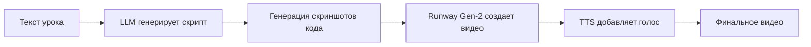
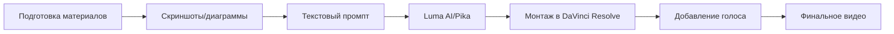

# 🎥 Генерация видео-туториалов через LLM

## 📋 Обзор

Этот документ описывает современные подходы к автоматической генерации видео-туториалов для образовательных курсов с использованием LLM и AI-инструментов.

## 🤖 LLM модели для генерации видео

### 1. **Runway Gen-2** ⭐ Рекомендуется

**Описание**: Продвинутая модель для генерации и редактирования видео через текстовые команды.

**Возможности**:
- Генерация видео из текстовых описаний
- Редактирование существующих видео через текстовые команды
- Изменение фона, удаление объектов, добавление эффектов
- Высокое качество выходного видео

**Использование для туториалов**:
```python
# Пример workflow:
1. Создать скриншоты кода или диаграммы
2. Описать сценарий в текстовом виде
3. Runway Gen-2 генерирует видео с анимацией
4. Добавить голосовое сопровождение (TTS)
```

**Ссылки**:
- [Runway Gen-2](https://runwayml.com/)
- [Документация](https://docs.runwayml.com/)

**Плюсы**:
- ✅ Высокое качество видео
- ✅ Интуитивный интерфейс
- ✅ Поддержка текстовых команд

**Минусы**:
- ⚠️ Требует подписку
- ⚠️ Может быть дорого для больших объемов

---

### 2. **Luma AI Dream Machine**

**Описание**: AI-модель для генерации реалистичных видео из текста или изображений.

**Возможности**:
- Генерация видео из текстовых промптов
- Генерация из статических изображений
- Высокое качество и реалистичность
- Быстрая генерация

**Использование для туториалов**:
```
Промпт: "Анимированная диаграмма SOLID принципов, 
показывающая как код разделяется на модули"
```

**Ссылки**:
- [Luma AI](https://lumalabs.ai/)
- [Dream Machine](https://lumalabs.ai/dream-machine)

**Плюсы**:
- ✅ Бесплатный доступ (с ограничениями)
- ✅ Быстрая генерация
- ✅ Хорошее качество

**Минусы**:
- ⚠️ Ограничения на длину видео
- ⚠️ Может требовать несколько попыток для идеального результата

---

### 3. **Pika Labs**

**Описание**: Специализируется на создании анимационных клипов по текстовым запросам.

**Возможности**:
- Генерация анимации из текста
- Создание коротких клипов (до 4 секунд)
- Стилизация под различные жанры
- Хорошо подходит для объяснения концепций

**Использование для туториалов**:
```
Промпт: "Анимация показывающая как класс User 
разделяется на UserValidator, UserRepository, EmailService"
```

**Ссылки**:
- [Pika Labs](https://pika.art/)
- [Discord бот](https://discord.gg/pika)

**Плюсы**:
- ✅ Бесплатный доступ через Discord
- ✅ Хорошо для коротких анимаций
- ✅ Различные стили

**Минусы**:
- ⚠️ Ограниченная длина (4 секунды)
- ⚠️ Требует Discord для доступа

---

### 4. **Stable Video Diffusion**

**Описание**: Open-source модель от Stability AI для генерации видео.

**Возможности**:
- Генерация видео из изображений
- Open-source (можно запустить локально)
- Настраиваемые параметры
- Поддержка различных форматов

**Использование для туториалов**:
```python
# Workflow:
1. Создать скриншоты кода/диаграммы
2. Загрузить в Stable Video Diffusion
3. Настроить параметры анимации
4. Сгенерировать видео
```

**Ссылки**:
- [Stable Video Diffusion](https://stability.ai/stable-video)
- [GitHub](https://github.com/Stability-AI/generative-models)

**Плюсы**:
- ✅ Open-source
- ✅ Можно запустить локально
- ✅ Полный контроль над процессом

**Минусы**:
- ⚠️ Требует мощное железо (GPU)
- ⚠️ Более сложная настройка

---

### 5. **Kling AI**

**Описание**: Китайская AI-модель для генерации видео высокого качества.

**Возможности**:
- Генерация видео из текста
- Длинные видео (до 10 секунд)
- Высокое качество
- Поддержка различных стилей

**Ссылки**:
- [Kling AI](https://www.klingai.com/)

**Плюсы**:
- ✅ Длинные видео
- ✅ Хорошее качество
- ✅ Бесплатный доступ

**Минусы**:
- ⚠️ Интерфейс на китайском (частично)
- ⚠️ Может быть медленнее других

---

## 🛠️ Рекомендуемый Workflow для создания туториалов

### Вариант 1: Полностью автоматизированный



**Инструменты**:
1. **ChatGPT/Claude** - генерация скрипта из Markdown
2. **Playwright/Selenium** - автоматические скриншоты кода
3. **Runway Gen-2** - генерация видео
4. **ElevenLabs/Murf** - синтез голоса

### Вариант 2: Полуавтоматический (рекомендуется)



**Шаги**:
1. Подготовить скриншоты кода, диаграммы, схемы
2. Создать текстовый промпт для каждого сегмента
3. Сгенерировать анимации через Luma AI или Pika
4. Смонтировать в DaVinci Resolve (бесплатно) или Premiere
5. Добавить голос через TTS (ElevenLabs, Murf, или Google TTS)
6. Экспортировать финальное видео

---

## 💡 Практические советы

### Для объяснения кода:

**Промпт для Luma AI**:
```
"Анимированная диаграмма показывающая как класс User 
с множественными ответственностями разделяется на 
UserValidator, UserRepository и EmailService. 
Показывать стрелки и переходы между компонентами."
```

### Для объяснения концепций:

**Промпт для Pika Labs**:
```
"Короткая анимация: один большой блок кода 
трансформируется в три маленьких связанных блока, 
демонстрируя принцип единственной ответственности"
```

### Для визуализации процессов:

**Промпт для Runway Gen-2**:
```
"Анимация архитектуры: показать как модули высокого уровня 
зависят от абстракций, а не от конкретных реализаций. 
Использовать схему с слоями и стрелками."
```

---

## 🎬 Интеграция с MkDocs

### Вариант 1: Встраивание через iframe

```markdown
<iframe 
    width="560" 
    height="315" 
    src="https://www.youtube.com/embed/VIDEO_ID" 
    frameborder="0" 
    allow="accelerometer; autoplay; clipboard-write; encrypted-media; gyroscope; picture-in-picture" 
    allowfullscreen>
</iframe>
```

### Вариант 2: Прямая вставка видео

```markdown
<video width="100%" controls>
    <source src="/assets/videos/solid-srp-explanation.mp4" type="video/mp4">
    Ваш браузер не поддерживает видео.
</video>
```

### Вариант 3: Использование макроса

```python
# В main.py
def define_env(env):
    """Регистрация макросов для MkDocs"""
    
    @env.macro
    def video_tutorial(video_id: str, title: str = "") -> str:
        """Вставляет видео-туториал"""
        return f"""
<div class="video-tutorial">
    <h4>{title}</h4>
    <iframe 
        width="100%" 
        height="400" 
        src="https://www.youtube.com/embed/{video_id}" 
        frameborder="0" 
        allowfullscreen>
    </iframe>
</div>
    """
```

Использование в Markdown:
```markdown
{{ video_tutorial("dQw4w9WgXcQ", "SOLID принципы - объяснение") }}
```

---

## 📊 Сравнение инструментов

| Инструмент | Качество | Скорость | Стоимость | Сложность |
|-----------|----------|----------|-----------|-----------|
| **Runway Gen-2** | ⭐⭐⭐⭐⭐ | ⭐⭐⭐ | 💰💰💰 | ⭐⭐ |
| **Luma AI** | ⭐⭐⭐⭐ | ⭐⭐⭐⭐ | 💰 | ⭐⭐ |
| **Pika Labs** | ⭐⭐⭐ | ⭐⭐⭐⭐⭐ | 🆓 | ⭐ |
| **Stable Video** | ⭐⭐⭐⭐ | ⭐⭐ | 🆓* | ⭐⭐⭐⭐ |
| **Kling AI** | ⭐⭐⭐⭐ | ⭐⭐⭐ | 🆓 | ⭐⭐ |

*Требует мощное железо

---

## 🚀 Рекомендации для курса SOLID

### Для каждого принципа создать:

1. **Вводное видео** (30-60 сек)
   - Аналогия из реальной жизни
   - Визуализация проблемы
   - Использовать: Luma AI или Pika Labs

2. **Объяснение кода** (2-3 мин)
   - Показ проблемного кода
   - Анимация рефакторинга
   - Использовать: Runway Gen-2 или ручная запись экрана

3. **Практический пример** (1-2 мин)
   - Пример из реальной библиотеки
   - Визуализация архитектуры
   - Использовать: Pika Labs для анимации

### Workflow для одного урока:

```
1. Подготовить материалы (скриншоты, диаграммы)
2. Создать текстовые промпты для каждого сегмента
3. Сгенерировать видео через Luma AI (бесплатно)
4. Смонтировать в DaVinci Resolve
5. Добавить голос через ElevenLabs (или записать самому)
6. Экспортировать и загрузить в /assets/videos/
7. Встроить в Markdown через макрос
```

---

## 📚 Дополнительные ресурсы

### TTS (Text-to-Speech) для голоса:

- **ElevenLabs** - лучшее качество, платно
- **Murf** - хорошее качество, есть бесплатный план
- **Google Cloud TTS** - дешево, хорошее качество
- **Azure TTS** - бесплатный план доступен

### Редактирование видео:

- **DaVinci Resolve** - профессиональный, бесплатный
- **Shotcut** - простой, бесплатный
- **Premiere Pro** - профессиональный, платно

### Хостинг видео:

- **YouTube** - бесплатно, хорошая интеграция
- **Vimeo** - платно, больше контроля
- **Локально** - в `/assets/videos/` для MkDocs

---

## ✅ Чеклист для создания туториала

- [ ] Подготовить скрипт (текст объяснения)
- [ ] Создать визуальные материалы (скриншоты, диаграммы)
- [ ] Сгенерировать промпты для AI
- [ ] Создать видео через выбранный инструмент
- [ ] Смонтировать видео (если нужно)
- [ ] Добавить голосовое сопровождение
- [ ] Экспортировать в нужном формате (MP4, WebM)
- [ ] Загрузить в проект или на YouTube
- [ ] Встроить в документацию через макрос или iframe
- [ ] Протестировать на разных устройствах

---

!!! tip "Практический совет"
    Начните с простых коротких видео (30-60 секунд) для каждого принципа SOLID. Используйте бесплатные инструменты (Luma AI, Pika Labs) для тестирования подхода. Если результат понравится, можно инвестировать в более продвинутые инструменты.

!!! warning "Важно"
    AI-генерация видео все еще находится в ранней стадии. Для сложных технических объяснений может потребоваться ручная запись экрана с кодом. Комбинируйте AI-генерацию для визуализации концепций и ручную запись для демонстрации кода.

