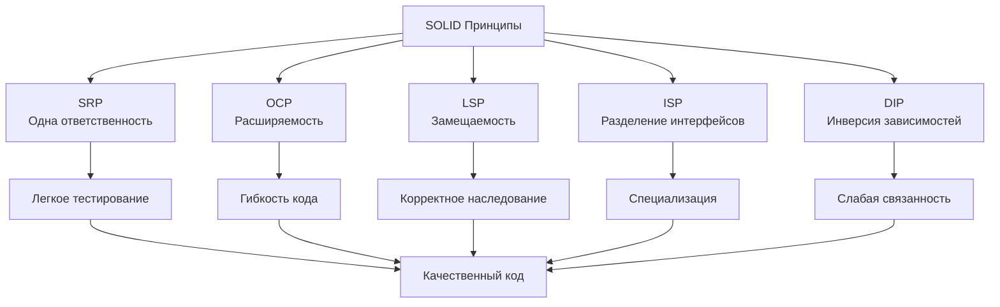

# 📋 Модуль 1: Принципы SOLID

## 🎯 Обзор модуля

Этот модуль посвящен изучению пяти фундаментальных принципов объектно-ориентированного программирования, известных как SOLID. Эти принципы помогают создавать гибкий, поддерживаемый и расширяемый код.

### 📚 Что вы изучите

- **S** - Single Responsibility Principle (Принцип единственной ответственности)
- **O** - Open/Closed Principle (Принцип открытости/закрытости)
- **L** - Liskov Substitution Principle (Принцип подстановки Лисков)
- **I** - Interface Segregation Principle (Принцип разделения интерфейса)
- **D** - Dependency Inversion Principle (Принцип инверсии зависимостей)

### ⏱ Продолжительность: 4 недели

| Неделя | Тема | Материалы |
|--------|------|-----------|
| 1 | Введение в SOLID + SRP | Теория, примеры, упражнения |
| 2 | OCP + LSP | Практика, рефакторинг |
| 3 | ISP + DIP | Продвинутые концепции |
| 4 | Интеграция SOLID + Проект | Комплексное применение |

### 📖 Структура модуля

#### 📚 Теоретическая часть
1. **[Введение в SOLID](01-introduction.md)** - обзор принципов и их важность
2. **[Single Responsibility Principle](02-single-responsibility.md)** - один класс = одна ответственность
3. **[Open/Closed Principle](03-open-closed.md)** - открыты для расширения, закрыты для изменений
4. **[Liskov Substitution Principle](04-liskov-substitution.md)** - корректная наследственность
5. **[Interface Segregation Principle](05-interface-segregation.md)** - разделение интерфейсов
6. **[Dependency Inversion Principle](06-dependency-inversion.md)** - зависимости на абстракциях

#### 🎮 Практическая часть
7. **[SOLID на практике](07-solid-in-practice.md)** - комплексное применение всех принципов в разных типах проектов
8. **Анализ с SOLID Checker** - используйте профессиональный инструмент для проверки ваших проектов

### 🎮 Практические задания

#### Упражнения по принципам:
- **SRP Упражнение**: Рефакторинг класса с множественными ответственностями
- **OCP Упражнение**: Расширение системы без изменения существующего кода
- **LSP Упражнение**: Создание правильной иерархии наследования
- **ISP Упражнение**: Разделение толстого интерфейса на специализированные
- **DIP Упражнение**: Инверсия зависимостей в существующем коде
- **SOLID Практика**: Выбор архитектуры для разных типов приложений

### 🧪 Система тестирования знаний

#### Интерактивные квизы (встроены в уроки):
- **Квиз по основам SOLID** - в уроке 1 (Введение)
- **Квиз по SRP** - в уроке 2 (Single Responsibility Principle)
- **Квиз по OCP** - в уроке 3 (Open/Closed Principle)
- **Квиз по LSP** - в уроке 4 (Liskov Substitution Principle)
- **Квиз по ISP** - в уроке 5 (Interface Segregation Principle)
- **Квиз по DIP** - в уроке 6 (Dependency Inversion Principle)
- **Квиз "SOLID на практике"** - в уроке 7 (Комплексное применение)

#### Практические задания с интерактивным кодом:
- **Рефакторинг с SRP** - в уроке 2
- **Реализация системы платежей с OCP** - в уроке 3
- **Создание корректной иерархии транспорта** - в уроке 4
- **Разделение интерфейсов репозитория** - в уроке 5
- **Dependency Injection система** - в уроке 6
- **Выбор архитектуры для типов приложений** - в уроке 7
- **🔍 Анализ вашего кода** - используйте профессиональный инструмент для проверки соблюдения SOLID принципов

#### Интерактивные элементы:
- **Пошаговые упражнения** с подсказками и проверками
- **Интерактивный код** с возможностью редактирования
- **Мгновенная обратная связь** на решения
- **Прогресс-трекинг** выполнения заданий

### 📈 Система прогресса

#### Трекинг обучения:
- ✅ Прочитано уроков: 0/8
- ✅ Выполнено упражнений: 0/8  
- ✅ Пройдено квизов: 0/7
- 📊 Общий прогресс: 0%

#### Достижения:
- 🏆 **SOLID Новичок** - прочел все уроки
- 🏆 **SOLID Практик** - выполнил все упражнения
- 🏆 **SOLID Мастер** - прошел все квизы на 100%
- 🏆 **SOLID Архитектор** - успешно сдал финальный проект

### 🏆 Цели обучения

После завершения этого модуля вы сможете:

1. **Распознавать нарушения SOLID** принципов в существующем коде
2. **Применять рефакторинг** для улучшения архитектуры кода
3. **Проектировать новые системы** с учетом SOLID принципов с самого начала
4. **Обосновывать архитектурные решения** ссылками на конкретные принципы
5. **Проводить код-ревью** с точки зрения SOLID compliance
6. **Оценивать качество кода** с помощью метрик SOLID
7. **Использовать профессиональные инструменты** для автоматического анализа соблюдения SOLID принципов

---

## 🎯 Что такое SOLID принципы?

**SOLID** — это акроним из пяти принципов объектно-ориентированного проектирования:

- **S** - Single Responsibility Principle (SRP) - Принцип единственной ответственности
- **O** - Open/Closed Principle (OCP) - Принцип открытости/закрытости
- **L** - Liskov Substitution Principle (LSP) - Принцип подстановки Лисков
- **I** - Interface Segregation Principle (ISP) - Принцип разделения интерфейсов
- **D** - Dependency Inversion Principle (DIP) - Принцип инверсии зависимостей

### 💡 Простыми словами

Представьте, что вы строите дом. SOLID принципы — это правила, которые помогают построить дом так, чтобы:
- **Каждая комната** имела одну функцию (SRP)
- **Можно было добавить этаж** без перестройки фундамента (OCP)
- **Окна можно было заменить** на другие, не ломая стены (LSP)
- **В каждой комнате** были только нужные розетки (ISP)
- **Коммуникации** не зависели от конкретного материала (DIP)

В программировании это означает создание кода, который легко понимать, изменять и расширять.

### 📊 Визуализация SOLID принципов



## 🏗️ Автор принципов

Принципы были сформулированы **Робертом Мартином** (Uncle Bob) в начале 2000-х годов.

## ✅ Преимущества SOLID

### Почему это важно?

**Без SOLID:**
```python
# ❌ Плохой код - все в одном месте
class UserManager:
    def create_user(self, name, email):
        # Валидация
        if not email or "@" not in email:
            raise ValueError("Invalid email")
        # Сохранение в БД
        db.execute(f"INSERT INTO users VALUES ('{name}', '{email}')")
        # Отправка email
        smtp.send(email, "Welcome!")
        # Логирование
        log.write(f"User {name} created")
```

**С SOLID:**
```python
# ✅ Хороший код - разделение ответственностей
class UserService:
    def __init__(self, validator, repository, notifier, logger):
        self.validator = validator      # SRP: только валидация
        self.repository = repository   # SRP: только сохранение
        self.notifier = notifier        # SRP: только уведомления
        self.logger = logger            # SRP: только логирование
    
    def create_user(self, name, email):
        self.validator.validate(email)  # DIP: зависимость от абстракции
        user = self.repository.save(name, email)
        self.notifier.send_welcome(email)
        self.logger.log(f"User {name} created")
```

### Преимущества:

| Преимущество | Что это значит | Пример |
|-------------|----------------|--------|
| **Поддерживаемость** | Код легче понимать и изменять | Изменение логики email не затрагивает БД |
| **Тестируемость** | Компоненты легко тестировать изолированно | Можно тестировать валидацию без БД |
| **Гибкость** | Легко добавлять новый функционал | Новый способ уведомлений без изменения кода |
| **Переиспользуемость** | Компоненты можно использовать повторно | Валидатор используется в разных местах |

## 📚 Рекомендуемые ресурсы

### Книги:
- **"Clean Code: A Handbook of Agile Software Craftsmanship"** - Robert C. Martin
- **"Clean Architecture: A Craftsman's Guide to Software Structure"** - Robert C. Martin
- **"Agile Software Development, Principles, Patterns, and Practices"** - Robert C. Martin

### Онлайн-ресурсы:
- [Refactoring.Guru: SOLID Principles](https://refactoring.guru/ru/solid-principles)
- [SOLID Principles на DigitalOcean](https://www.digitalocean.com/community/conceptual_articles/s-o-l-i-d-the-first-five-principles-of-object-oriented-design)
- [Uncle Bob's блог](https://blog.cleancoder.com/uncle-bob/2020/10/18/Solid-Relevance.html)

### Видео:
- [SOLID Principles Explained](https://www.youtube.com/watch?v=_jDNAf3CzeM)
- [Clean Architecture and SOLID](https://www.youtube.com/watch?v=NnZZMkwI6KI)

## 🔧 Практические инструменты

### 🔍 SOLID Checker - Умный анализатор кода
**[SOLID Checker](https://github.com/DaymaNKinG990/solid-checker)** - профессиональный Python инструмент для анализа соблюдения SOLID принципов с адаптивной контекстной оценкой.

#### ✨ Ключевые возможности:
- 🧠 **Smart Contextual Analysis** - автоматически определяет тип проекта (скрипт/библиотека/приложение)
- ⚖️ **Адаптивное оценивание** - настраивает критерии в зависимости от сложности проекта
- 🎯 **Предотвращение over-engineering** - не требует сложной архитектуры от простых скриптов
- 📊 **Строгие стандарты** - повышенные требования для библиотек и фреймворков
- 💡 **Умные рекомендации** - контекстные советы по улучшению кода
- 🚀 **CI/CD готовность** - JSON выход для автоматизации и интеграции

#### 📦 Установка и использование:
```bash
# Установка из PyPI
pip install solid-checker

# Анализ вашего кода
python -m solid-checker my_code.py

# JSON выход для автоматизации
python -m solid-checker my_code.py --json

# Подробный анализ с контекстом
python -m solid-checker my_code.py --verbose
```

#### 🎓 Образовательная ценность:
- **Практическое применение теории** - увидьте SOLID принципы в действии на вашем коде
- **Контекстное понимание** - поймите, как требования меняются в зависимости от типа проекта
- **Прогрессивное обучение** - отслеживайте улучшения кода с течением времени
- **Реальный feedback** - получите практические советы от профессионального инструмента

#### 💼 Интеграция в обучение:
После изучения каждого принципа в уроках, используйте SOLID Checker для проверки своих решений упражнений. Инструмент поможет закрепить теоретические знания практическим анализом.

## 🔄 Следующие шаги

После завершения этого модуля переходите к **[Модулю 2: Паттерны проектирования](../module-02-patterns/)** для изучения готовых решений типичных архитектурных задач.

## 📞 Поддержка

Если у вас возникли вопросы:
- 📧 **Email**: xellaopromaster@yandex.ru

## 🎮 Квиз

<div class="quiz-container">
<script type="application/json">
{
  "title": "Введение в SOLID принципы",
  "description": "Проверьте базовое понимание SOLID принципов",
  "questions": [
    {
      "question": "Что означает акроним SOLID?",
      "type": "single",
      "points": 1,
      "options": [
        {"text": "Пять принципов объектно-ориентированного проектирования", "correct": true},
        {"text": "Стандарт качества кода", "correct": false},
        {"text": "Методология разработки", "correct": false}
      ],
      "explanation": "SOLID — это акроним из пяти принципов ОО проектирования"
    },
    {
      "question": "Кто является автором SOLID принципов?",
      "type": "single", 
      "points": 1,
      "options": [
        {"text": "Robert C. Martin (Uncle Bob)", "correct": true},
        {"text": "Gang of Four", "correct": false},
        {"text": "Kent Beck", "correct": false}
      ],
      "explanation": "Роберт Мартин систематизировал SOLID принципы"
    }
  ]
}
</script>
</div>

---

## 🎯 Готовы начать путь к мастерству архитектуры?

**🚀 [Переходите к Уроку 2: Single Responsibility Principle →](02-single-responsibility.md)!**

*Мастерство приходит с практикой. Каждый рефакторинг делает вас лучше! 🔧*