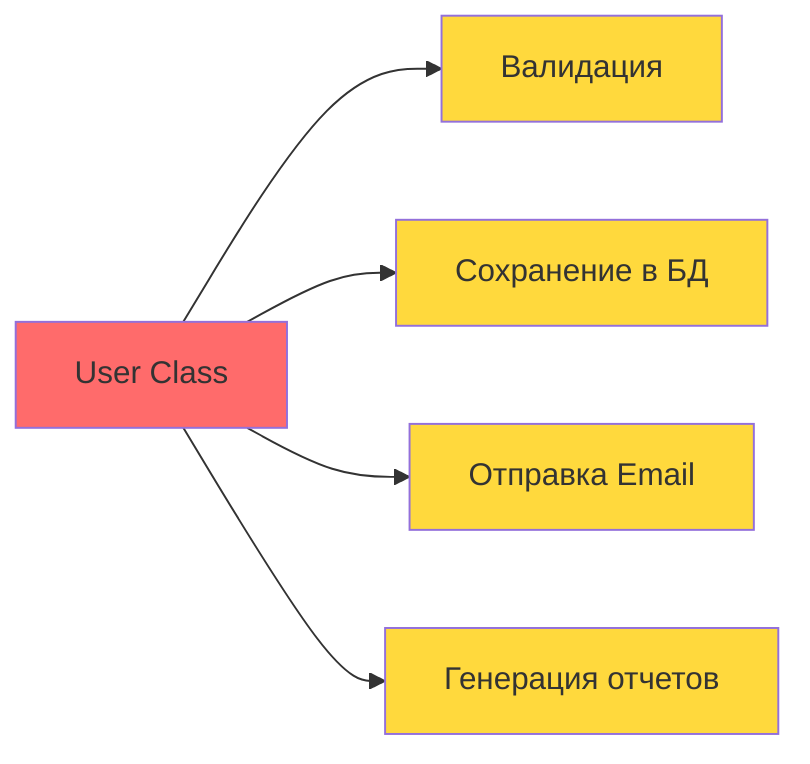
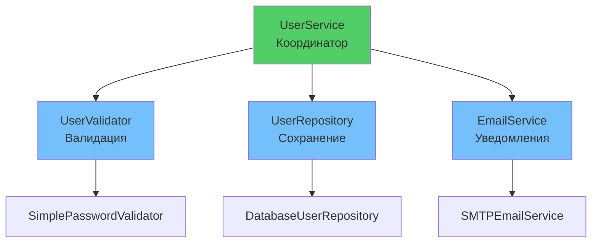

# 📋 Урок 2: Single Responsibility Principle (SRP)

## 🎯 Цели урока

После изучения этого урока вы сможете:
- ✅ Определять нарушения принципа единственной ответственности
- ✅ Разделять классы на компоненты с единственной ответственностью
- ✅ Создавать слабо связанные и высоко связные модули
- ✅ Применять SRP в реальных проектах

## 🚀 Мотивация: проблема "божественного" класса

### 📊 Визуализация проблемы



**Проблема**: Один класс делает слишком много! 💥

Представьте класс, который делает ВСЁ:

```python
class User:
    """❌ Класс-монстр, который нарушает SRP"""
    
    def __init__(self, name: str, email: str, password: str):
        self.name = name
        self.email = email
        self.password = password

    def save_to_database(self):
        """Сохраняет в БД"""
        print(f"SQL: INSERT INTO users...")

    def send_email(self, subject: str, message: str):
        """Отправляет email"""
        print(f"SMTP: Sending to {self.email}")

    def validate_password(self):
        """Валидирует пароль"""
        return len(self.password) >= 8

    def generate_report(self):
        """Генерирует отчет"""
        return f"Report for {self.name}"
```

**Проблемы:**
- 🔧 **4 разные ответственности** в одном классе
- 🐛 **Изменение БД** ломает email логику
- 🧪 **Невозможно тестировать** отдельные части
- 🔄 **Нельзя переиспользовать** валидацию в других местах

---

## 📖 Определение SRP

!!! quote "Принцип единственной ответственности"
    **Класс должен иметь только одну причину для изменения.**

### 💡 Простыми словами:

Представьте повара в ресторане:
- ❌ **Плохо**: Один повар готовит, моет посуду, принимает заказы и считает деньги
- ✅ **Хорошо**: Повар только готовит, официант принимает заказы, мойщик моет посуду

В программировании:
- **Одна ответственность = одна причина изменения**
- **Класс должен заниматься только одним делом**
- **Если класс делает A И B, разделите на два класса**

### 🎯 Как понять, что класс делает слишком много?

**Вопросы для самопроверки:**
1. Можете ли вы описать класс одним предложением? ("Этот класс...")
2. Если изменится БД, нужно ли менять логику email? (Если да - нарушение SRP)
3. Можно ли использовать часть класса отдельно? (Если нет - возможно нарушение)

### 🔍 Как определить ответственность?

**Правильные вопросы:**
1. **Что делает этот класс?** (главная функция)
2. **Почему он может измениться?** (причины для модификации) 
3. **Можно ли разделить логику?** (независимые части)

**Признаки нарушения SRP:**
- Класс имеет методы с разными префиксами (`save_`, `send_`, `validate_`), и т.д.
- Трудно дать классу короткое понятное имя
- Класс зависит от многих внешних систем (БД, email, API)

---

!!! note "Python Version"
    Примеры кода в этом разделе используют синтаксис PEP 604 (`Type | None`) и требуют **Python 3.10+**. 
    Если вы используете Python 3.9 или более раннюю версию, замените `Type | None` на `Optional[Type]` 
    и добавьте импорт: `from typing import Optional`.

## ✅ Правильное решение: разделение ответственностей

### Шаг 1: Выделяем данные

```python
from dataclasses import dataclass

@dataclass
class User:
    """✅ Только данные пользователя"""
    name: str
    email: str
    password: str
```

### Шаг 2: Создаем специализированные сервисы

```python
from typing import Protocol

class UserRepository(Protocol):
    """Протокол для работы с БД"""
    def save(self, user: User) -> None: ...
    def find_by_email(self, email: str) -> User | None: ...

class EmailService(Protocol):
    """Протокол для отправки email"""
    def send(self, to_email: str, subject: str, message: str) -> None: ...

class PasswordValidator(Protocol):
    """Протокол для валидации паролей"""
    def validate(self, password: str) -> bool: ...
```

### Шаг 3: Простые реализации

```python
class DatabaseUserRepository:
    """✅ Только работа с БД"""
    def save(self, user: User) -> None:
        print(f"Saving {user.name} to database")
    
    def find_by_email(self, email: str) -> User | None:
        # Логика поиска в БД
        return None

class SMTPEmailService:
    """✅ Только отправка email"""
    def send(self, to_email: str, subject: str, message: str) -> None:
        print(f"Sending email to {to_email}: {subject}")

class SimplePasswordValidator:
    """✅ Только валидация паролей"""
    def validate(self, password: str) -> bool:
        return len(password) >= 8 and any(c.isdigit() for c in password)
```

### Шаг 4: Композиция сервисов

```python
class UserService:
    """✅ Бизнес-логика пользователей"""
    
    def __init__(
        self, 
        repository: UserRepository,
        email_service: EmailService, 
        password_validator: PasswordValidator
    ):
        self.repository = repository
        self.email_service = email_service
        self.password_validator = password_validator

    def create_user(self, name: str, email: str, password: str) -> User:
        """Создает пользователя с валидацией"""
        if not self.password_validator.validate(password):
            raise ValueError("Password too weak")
        
        user = User(name=name, email=email, password=password)
        self.repository.save(user)
        self.email_service.send(email, "Welcome!", f"Hello, {name}!")
        
        return user

# Использование
user_service = UserService(
    repository=DatabaseUserRepository(),
    email_service=SMTPEmailService(),
    password_validator=SimplePasswordValidator()
)

user = user_service.create_user("Alice", "alice@example.com", "secure123")
```

### 📊 Архитектура после рефакторинга



---

## 📊 Преимущества SRP

### ✅ **1. Легкое тестирование**
```python
def test_password_validator():
    validator = SimplePasswordValidator()
    assert validator.validate("weak") == False
    assert validator.validate("strong123") == True
```

### ✅ **2. Повторное использование**
```python
# Валидатор можно использовать в других местах
admin_service = AdminService(password_validator=SimplePasswordValidator())
api_service = APIService(email_service=SMTPEmailService())
```

### ✅ **3. Легкая замена реализаций**
```python
# Легко поменять на другой email сервис
user_service = UserService(
    repository=DatabaseUserRepository(),
    email_service=SlackNotificationService(),  # Вместо SMTP
    password_validator=StrongPasswordValidator()  # Усиленная валидация
)
```

---

## 🎯 Когда применять SRP?

### ✅ **Применяйте SRP когда:**
- Класс имеет **более 5-7 методов**
- Методы работают с **разными данными**
- **Трудно дать имя** классу
- Класс **зависит от многих** внешних систем

### ⚠️ **SRP может быть избыточным:**
- **Простые DTO** (Data Transfer Objects)
- **Утилитарные классы** с 1-2 методами
- **Конфигурационные классы**
- **Прототипы** и MVP проекты

---

## 🎮 Практические упражнения

### Упражнение 1: Анализ класса

Проанализируйте этот класс:

```python
class OrderProcessor:
    def process_order(self, order_data):
        # Валидация заказа
        # Сохранение в БД  
        # Обработка платежа
        # Отправка email
        # Обновление склада
        pass
```

**Вопросы:**
1. **Сколько ответственностей у класса?**
   > 💡 *Подсказка: посчитайте комментарии - каждый может быть отдельной ответственностью*

2. **Как бы вы разделили его?**
   > 💡 *Подсказка: каждая ответственность = отдельный класс, OrderProcessor остается координатором*

### Упражнение 2: Рефакторинг

```python
class FileManager:
    def read_file(self, filename): pass
    def write_file(self, filename, content): pass  
    def compress_file(self, filename): pass
    def encrypt_file(self, filename, key): pass
    def upload_to_cloud(self, filename): pass
```

**Задача:** Разделите на классы с единственной ответственностью:
- `FileReader` / `FileWriter` 
- `FileCompressor`
- `FileEncryptor`
- `CloudUploader`

**💡 Подсказки для рефакторинга:**
> **Нужно создать:** 
> - 📋 **4 Protocol** (интерфейса) для различных операций
> - 🔧 **4 реализации** конкретных классов  
> - 🎯 **1 координатор** FileManager для оркестрации

### Упражнение 3: Создание сервисов

**Создайте систему для интернет-магазина:**
- `ProductService` - управление товарами
- `OrderService` - обработка заказов  
- `PaymentService` - обработка платежей
- `NotificationService` - уведомления

**💡 Подсказки для реализации:**
> **Архитектура:** Система должна состоять из **4 бизнес-доменов**
> 
> **Нужно создать:** 
> - 📋 **4 Protocol** (интерфейса) для каждого сервиса
> - 🔧 **4+ реализации** конкретных классов
> - 🎯 **1 координатор** ECommerceSystem для оркестрации сервисов
>
> **Пример структуры:**
> - `PaymentProcessor(Protocol)` → `StripePaymentProcessor`, `PayPalProcessor`
> - `NotificationSender(Protocol)` → `SMTPEmailService`, `SlackNotifier`

---

## 🎯 Ключевые выводы

1. **SRP = одна причина для изменения**
2. **Разделение ответственностей улучшает архитектуру**
3. **Маленькие классы легче тестировать и переиспользовать**
4. **Протоколы помогают создавать гибкие системы**
5. **Применяйте разумно - не создавайте класс для каждого метода**

## 🚀 Следующие шаги

!!! success "Что вы узнали"
    - ✅ Класс должен иметь только одну причину для изменения
    - ✅ Разделение ответственностей улучшает тестируемость и поддерживаемость
    - ✅ Использование протоколов делает код гибким

!!! tip "Практика"
    Найдите в своем проекте класс, который делает больше одной вещи. Попробуйте разделить его на несколько классов с единственной ответственностью.

Теперь вы готовы изучить **[Принцип открытости/закрытости](03-open-closed.md)** - как создавать расширяемый код без изменения существующего!

---

!!! tip "Практический совет"
    Начните с анализа одного "проблемного" класса в вашем проекте. Задайте себе вопрос: "За что отвечает этот класс?" Если ответов больше одного - пора рефакторить!

## 🧪 Проверьте свои знания: SRP

<div class="quiz-container" id="srp-quiz">
<script type="application/json">
{
  "title": "Single Responsibility Principle",
  "description": "Проверьте понимание принципа единственной ответственности",
  "icon": "📋",
  "questions": [
    {
      "question": "Что означает принцип единственной ответственности (SRP)?",
      "type": "single",
      "points": 1,
      "options": [
        {"text": "Класс должен иметь только один метод", "correct": false},
        {"text": "Класс должен иметь только одну причину для изменения", "correct": true},
        {"text": "Класс должен наследоваться только от одного класса", "correct": false},
        {"text": "Класс должен работать только с одним типом данных", "correct": false}
      ],
      "explanation": "SRP означает, что класс должен иметь только одну причину для изменения"
    },
    {
      "question": "Какой код нарушает SRP?",
      "type": "single",
      "points": 1,
      "code": "class UserManager:\n    def create_user(self): pass\n    def save_to_db(self): pass\n    def send_email(self): pass\n    def validate_password(self): pass",
      "options": [
        {"text": "Класс имеет слишком много ответственностей", "correct": true},
        {"text": "Класс использует неправильные имена методов", "correct": false},
        {"text": "Класс слишком маленький", "correct": false},
        {"text": "Класс не использует типизацию", "correct": false}
      ],
      "explanation": "UserManager отвечает за создание, сохранение, email и валидацию - это 4 разные ответственности"
    },
    {
      "question": "Какие преимущества дает соблюдение SRP?",
      "type": "multiple",
      "points": 2,
      "options": [
        {"text": "Улучшенная тестируемость", "correct": true},
        {"text": "Повторное использование кода", "correct": true},
        {"text": "Увеличение производительности", "correct": false},
        {"text": "Легкость изменений", "correct": true},
        {"text": "Уменьшение количества файлов", "correct": false}
      ],
      "explanation": "SRP улучшает тестируемость, переиспользование и упрощает внесение изменений"
    },
    {
      "question": "Как определить, что класс нарушает SRP?",
      "type": "single", 
      "points": 1,
      "options": [
        {"text": "У класса больше 10 методов", "correct": false},
        {"text": "Трудно дать классу короткое понятное имя", "correct": true},
        {"text": "Класс не использует наследование", "correct": false},
        {"text": "Класс имеет приватные методы", "correct": false}
      ],
      "explanation": "Если трудно кратко назвать класс, он скорее всего делает слишком много"
    },
    {
      "question": "Когда SRP может быть избыточным?",
      "type": "single",
      "points": 1,
      "options": [
        {"text": "В больших проектах", "correct": false},
        {"text": "При работе с базами данных", "correct": false}, 
        {"text": "Для простых DTO классов", "correct": true},
        {"text": "При использовании фреймворков", "correct": false}
      ],
      "explanation": "Для простых DTO (Data Transfer Objects) разделение может быть избыточным"
    }
  ]
}
</script>
</div>

## 💻 Практическое задание: SRP Рефакторинг

Рефакторьте этот класс согласно SRP:

```python
# ЗАДАНИЕ: Разделите этот класс на несколько с единственной ответственностью
class UserService:
    def create_user(self, user_data):
        # 1. Валидация данных
        if not self._validate_data(user_data):
            raise ValueError("Invalid data")
        
        # 2. Создание пользователя
        user = User(**user_data)
        
        # 3. Сохранение в БД
        self._save_to_db(user)
        
        # 4. Отправка email
        self._send_welcome_email(user)
        
        return user
    
    def _validate_data(self, data): pass
    def _save_to_db(self, user): pass  
    def _send_welcome_email(self, user): pass

# TODO: Создайте отдельные классы:
# - UserValidator (валидация)
# - UserRepository (сохранение) 
# - EmailService (уведомления)
# - UserService (только бизнес-логика)
```

**Результат:** 4 класса с четкими ответственностями вместо одного "божественного" класса!

---

## 🎮 Интерактивное упражнение

Попробуйте решить задачу прямо здесь:

{{ code_input_form(
    exercise_id="srp_refactoring_01",
    initial_code="from typing import Protocol\nfrom dataclasses import dataclass\n\n@dataclass\nclass User:\n    name: str\n    email: str\n    password: str\n\n# TODO: Создайте классы согласно SRP:\n# 1. UserValidator - для валидации\n# 2. UserRepository - для сохранения\n# 3. EmailService - для отправки email\n# 4. UserService - координатор\n\n# Ваш код здесь:\n",
    placeholder="Создайте классы с единственной ответственностью...",
    use_pyodide=True,
    test_cases=[
        {
            "code": """
# Test 1: Проверка что UserValidator существует
assert 'UserValidator' in globals(), "Создайте класс UserValidator"
            """,
            "description": "Класс UserValidator должен существовать"
        },
        {
            "code": """
# Test 2: Проверка что UserRepository существует
assert 'UserRepository' in globals(), "Создайте класс UserRepository"
            """,
            "description": "Класс UserRepository должен существовать"
        },
        {
            "code": """
# Test 3: Проверка что EmailService существует
assert 'EmailService' in globals(), "Создайте класс EmailService"
            """,
            "description": "Класс EmailService должен существовать"
        }
    ]
) }}

!!! tip "Подсказка"
    Используйте Protocol для создания интерфейсов, а затем реализуйте конкретные классы. UserService должен принимать эти зависимости через конструктор (Dependency Injection).