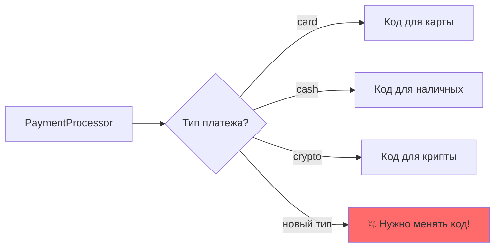
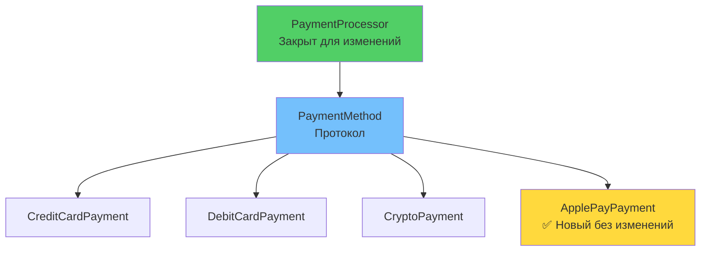

# 🔓 Урок 3: Open/Closed Principle (OCP)

## 🎯 Цели урока

После изучения этого урока вы сможете:
- ✅ Понимать концепцию "открыт для расширения, закрыт для модификации"
- ✅ Применять абстракции для создания расширяемых систем
- ✅ Создавать код, устойчивый к изменениям требований
- ✅ Использовать OCP в реальных проектах

## 🚀 Мотивация: проблема изменяющихся требований

### 📊 Проблема: цепочка if-elif



Представьте: вы создали систему платежей, и вдруг появляются новые способы оплаты...

```python
class PaymentProcessor:
    def process_payment(self, amount: float, payment_type: str) -> bool:
        if payment_type == "credit_card":
            print(f"Credit card payment: ${amount}")
            return True
        elif payment_type == "debit_card":
            print(f"Debit card payment: ${amount}")
            return True
        # 💥 Новый способ = изменение существующего кода!
        elif payment_type == "crypto":  # Приходится модифицировать метод
            print(f"Crypto payment: ${amount}")
            return True
        else:
            raise ValueError(f"Unknown payment type: {payment_type}")
```

**Проблемы:**
- 🔧 **Каждый новый тип платежа** требует изменения метода
- 🐛 **Риск поломать** существующую логику
- 🧪 **Нужно перетестировать** весь метод
- 📈 **Метод растет** и становится сложнее

---

## 📖 Определение OCP

!!! quote "Принцип открытости/закрытости"
    **Программные сущности должны быть открыты для расширения, но закрыты для модификации.**

### 💡 Простыми словами:

Представьте электрическую розетку:
- ✅ **Открыта для расширения**: можно подключить любой прибор (чайник, телефон, ноутбук)
- ✅ **Закрыта для модификации**: не нужно переделывать розетку для каждого нового прибора

В программировании:
- **Открыты для расширения** - можно добавлять новую функциональность через новые классы
- **Закрыты для модификации** - существующий код не должен изменяться
- **Новые требования = новые классы, НЕ изменения в старых**

### 🎯 Почему это важно?

**Без OCP:**
```python
# Каждый новый тип = изменение существующего кода
def process_payment(payment_type):
    if payment_type == "card":
        # код для карты
    elif payment_type == "cash":
        # код для наличных
    # 💥 Новый тип? Нужно менять этот метод!
```

**С OCP:**
```python
# Новый тип = новый класс, старый код не трогаем
class PaymentMethod(Protocol):
    def process(self, amount): ...

class CardPayment: ...
class CashPayment: ...
class CryptoPayment: ...  # ✅ Добавили без изменения существующего кода!
```

### 🎯 Как распознать нарушение OCP?

**Признаки проблем:**
- Длинные `if-elif` цепочки для типов
- Изменения существующих методов при добавлении функций
- Необходимость помнить "где еще нужно добавить новый тип"

---

## ✅ Правильное решение: абстракции

### Шаг 1: Создаем абстракцию

```python
from typing import Protocol

class PaymentMethod(Protocol):
    """Протокол для методов платежа"""
    def process(self, amount: float) -> bool:
        """Обрабатывает платеж"""
        ...
```

### Шаг 2: Создаем реализации

```python
class CreditCardPayment:
    """Обработчик платежей кредитной картой"""
    def process(self, amount: float) -> bool:
        print(f"Credit card payment: ${amount}")
        return True

class DebitCardPayment:
    """Обработчик дебетовых карт"""
    def process(self, amount: float) -> bool:
        print(f"Debit card payment: ${amount}")
        return True

class CryptoPayment:
    """Обработчик криптоплатежей"""
    def process(self, amount: float) -> bool:
        print(f"Crypto payment: ${amount}")
        return True
```

### Шаг 3: Универсальный процессор

```python
class PaymentProcessor:
    """✅ Процессор платежей - соответствует OCP"""
    
    def process_payment(self, payment_method: PaymentMethod, amount: float) -> bool:
        """Обрабатывает платеж любым способом"""
        return payment_method.process(amount)
```

### Шаг 4: Использование

```python
# Создаем процессор
processor = PaymentProcessor()

# Используем существующие способы
processor.process_payment(CreditCardPayment(), 100.0)
processor.process_payment(CryptoPayment(), 200.0)

# ✅ Добавляем НОВЫЙ способ БЕЗ изменения существующего кода!
class ApplePayPayment:
    def process(self, amount: float) -> bool:
        print(f"Apple Pay payment: ${amount}")
        return True

processor.process_payment(ApplePayPayment(), 300.0)  # Работает!
```

**Результат:** `PaymentProcessor` никогда не изменяется, только расширяется новыми способами!

### 📊 Архитектура с OCP



---

## 🎯 Стратегия как пример OCP

> 💡 **Связь OCP и паттернов**
>
> Соблюдение OCP естественно приводит к архитектурным решениям, которые позже были формализованы как паттерны. **Strategy паттерн** - идеальный пример применения OCP!

### Strategy Pattern для OCP

```python
from typing import Protocol

class DiscountStrategy(Protocol):
    """Стратегия применения скидок"""
    def calculate(self, price: float) -> float:
        """Вычисляет цену со скидкой"""
        ...

class NoDiscount:
    """Без скидки"""
    def calculate(self, price: float) -> float:
        return price

class PercentDiscount:
    """Процентная скидка"""
    def __init__(self, percent: float):
        self.percent = percent
    
    def calculate(self, price: float) -> float:
        return price * (1 - self.percent / 100)

class FixedDiscount:
    """Фиксированная скидка"""
    def __init__(self, amount: float):
        self.amount = amount
    
    def calculate(self, price: float) -> float:
        return max(0, price - self.amount)

class PriceCalculator:
    """✅ Калькулятор цен - закрыт для модификации, открыт для расширения"""
    
    def __init__(self, discount_strategy: DiscountStrategy):
        self.discount_strategy = discount_strategy
    
    def calculate_final_price(self, base_price: float) -> float:
        return self.discount_strategy.calculate(base_price)

# Использование
calculator = PriceCalculator(PercentDiscount(20))  # 20% скидка
final_price = calculator.calculate_final_price(100.0)  # 80.0

# ✅ Легко добавить новую стратегию скидок
class StudentDiscount:
    def calculate(self, price: float) -> float:
        return price * 0.5  # 50% скидка для студентов

student_calculator = PriceCalculator(StudentDiscount())
student_price = student_calculator.calculate_final_price(100.0)  # 50.0
```

---

## 🎮 Практические упражнения

### Упражнение 1: Рефакторинг уведомлений

**Проблемный код:**
```python
class NotificationService:
    def send_notification(self, user, message, method="email"):
        if method == "email":
            print(f"Email to {user.email}: {message}")
        elif method == "sms":
            print(f"SMS to {user.phone}: {message}")
        elif method == "push":
            print(f"Push to {user.device}: {message}")
```

**Задание:**
1. Создайте протокол `BaseNotification`
2. Реализуйте классы для каждого канала
3. Модифицируйте `NotificationService` для соответствия OCP
4. Добавьте новый канал (например, Telegram) без изменения кода

**💡 Подсказки для решения:**
> **Анализ:** У `NotificationService` **3 способа уведомлений** в if-elif цепочке
>
> **Нужно создать:**
> - 📋 **1 Protocol** `BaseNotification` с методом `send(user, message)`
> - 🔧 **3 реализации** существующих каналов: `EmailNotification`, `SMSNotification`, `PushNotification`
> - 🎯 **1 рефакторенный** `NotificationService` принимающий список каналов
> - ✨ **1 новый канал** (например, `TelegramNotification`) для демонстрации расширяемости

### Упражнение 2: Система логирования

**Создайте расширяемую систему логирования:**
- Разные уровни логов (INFO, WARNING, ERROR)
- Разные способы вывода (консоль, файл, сеть)
- Легкое добавление новых способов вывода

**💡 Подсказки для архитектуры:**
> **Система логирования:** **2 независимые оси расширения**
>
> **Нужно создать:**
> - 📋 **1 Protocol** `BaseLogger` с методом `write(level, message)`
> - 🔧 **3+ реализации**: `ConsoleLogger`, `FileLogger`, `NetworkLogger`
> - 🎯 **1 класс** `LogManager` использующий любой `BaseLogger`
> - 🔍 **Enum** для уровней логирования

### Упражнение 3: Анализ отчетов

```python
class ReportGenerator:
    def generate_report(self, data, format_type):
        if format_type == "pdf":
            return self._generate_pdf(data)
        elif format_type == "excel":
            return self._generate_excel(data)
        elif format_type == "html":
            return self._generate_html(data)
```

**Вопросы для анализа:**
1. **Какие проблемы OCP вы видите?**
   > 💡 *Подсказка: что произойдет при добавлении JSON и CSV форматов?*

2. **Как бы вы реорганизовали код?**
   > 💡 *Подсказка: нужен Protocol `ReportFormatter` и отдельные классы для каждого формата*

3. **Какие преимущества даст рефакторинг?**
   > 💡 *Подсказка: новые форматы без изменений + легкое тестирование*

---

## 🎯 Ключевые выводы

1. **OCP = расширение через новые классы, а не изменение старых**
2. **Абстракции (Protocol) создают точки расширения**
3. **Strategy паттерн - идеальный пример OCP**
4. **Планируйте точки расширения заранее**
5. **OCP делает код устойчивым к изменениям требований**

## 🚀 Следующие шаги

!!! success "Что вы узнали"
    - ✅ Код должен быть открыт для расширения, но закрыт для модификации
    - ✅ Абстракции (Protocol) создают точки расширения
    - ✅ Новые требования = новые классы, не изменения в старых

!!! tip "Практика"
    Найдите в своем коде длинные цепочки if-elif. Попробуйте заменить их на протоколы и отдельные классы.

Теперь вы готовы изучить **[Принцип подстановки Лисков](04-liskov-substitution.md)** - как создавать корректные иерархии наследования!

---

!!! tip "Практический совет"
    Не пытайтесь предусмотреть ВСЕ возможные расширения. Начните с очевидных точек изменений в вашем коде и создайте абстракции для них.

## 🧪 Проверьте свои знания: OCP

<div class="quiz-container" id="ocp-quiz">
<script type="application/json">
{
  "title": "Open/Closed Principle",
  "description": "Проверьте понимание принципа открытости/закрытости",
  "icon": "🔓",
  "questions": [
    {
      "question": "Что означает принцип Открытости/Закрытости (OCP)?",
      "type": "single",
      "points": 1,
      "options": [
        {"text": "Классы должны быть открыты для наследования", "correct": false},
        {"text": "Программные сущности должны быть открыты для расширения, но закрыты для модификации", "correct": true},
        {"text": "Все методы должны быть публичными", "correct": false},
        {"text": "Классы должны быть закрыты от изменений", "correct": false}
      ],
      "explanation": "OCP позволяет добавлять новую функциональность без изменения существующего кода"
    },
    {
      "question": "Какой код нарушает OCP?",
      "type": "single",
      "points": 1,
      "options": [
        {"text": "Класс с одним методом", "correct": false},
        {"text": "Длинные if-elif цепочки для разных типов", "correct": true},
        {"text": "Использование протоколов", "correct": false},
        {"text": "Создание новых классов", "correct": false}
      ],
      "explanation": "if-elif цепочки требуют модификации при добавлении новых типов"
    },
    {
      "question": "Как лучше всего соблюдать OCP при добавлении новых способов оплаты?",
      "type": "single",
      "points": 1,
      "options": [
        {"text": "Добавить новое условие в существующий метод", "correct": false},
        {"text": "Создать протокол PaymentMethod и отдельные классы", "correct": true},
        {"text": "Использовать глобальные переменные", "correct": false},
        {"text": "Создать один большой класс для всех типов", "correct": false}
      ],
      "explanation": "Протокол и отдельные классы позволяют добавлять способы без изменения кода"
    },
    {
      "question": "Какие преимущества дает соблюдение OCP?",
      "type": "multiple",
      "points": 2,
      "options": [
        {"text": "Код становится устойчивым к изменениям", "correct": true},
        {"text": "Уменьшается количество классов", "correct": false},
        {"text": "Снижается риск регрессионных ошибок", "correct": true},
        {"text": "Улучшается тестируемость", "correct": true},
        {"text": "Увеличивается скорость работы", "correct": false}
      ],
      "explanation": "OCP делает код устойчивым, снижает риски и улучшает тестируемость"
    }
  ]
}
</script>
</div>

## 💻 Практическое задание: OCP в действии

**Задание:** Создайте систему обработки документов, следующую OCP

```python
# ИСХОДНЫЙ КОД (нарушает OCP):
class DocumentProcessor:
    def process(self, document, doc_type):
        if doc_type == "pdf":
            return f"Processing PDF: {document}"
        elif doc_type == "word":
            return f"Processing Word: {document}"
        elif doc_type == "excel":
            return f"Processing Excel: {document}"

# ЗАДАНИЕ: Рефакторинг с соблюдением OCP
# TODO: Создайте протокол DocumentHandler
# TODO: Реализуйте отдельные классы для каждого типа
# TODO: Создайте DocumentProcessor работающий с абстракцией
# TODO: Добавьте новый тип документа без изменения существующего кода

from typing import Protocol

class DocumentHandler(Protocol):
    def process(self, document: str) -> str: ...

# TODO: Ваша реализация здесь
```

**Результат:** Система, которая легко расширяется новыми типами документов!