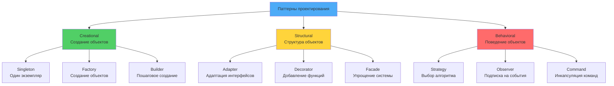
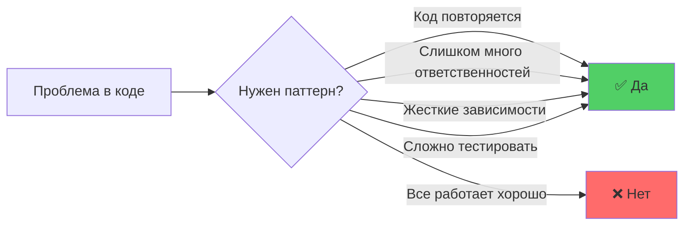

# 📋 Модуль 2: Паттерны проектирования (Design Patterns)

## 🎯 Обзор модуля

Этот модуль посвящен изучению паттернов проектирования - проверенных решений для типичных архитектурных задач в объектно-ориентированном программировании. Вы научитесь применять паттерны Gang of Four для создания гибких и поддерживаемых систем.

### 📚 Что вы изучите

- **Creational Patterns** - паттерны создания объектов
- **Structural Patterns** - паттерны структуры объектов
- **Behavioral Patterns** - паттерны поведения объектов

### ⏱ Продолжительность: 6 недель

| Неделя | Тема | Материалы |
|--------|------|-----------|
| 1 | Введение в паттерны + Creational | Теория, примеры, практика |
| 2 | Structural Patterns | Адаптеры, декораторы, фасады |
| 3 | Behavioral Patterns (Part 1) | Стратегия, наблюдатель, команда |
| 4 | Behavioral Patterns (Part 2) | Состояние, итератор, посредник |
| 5 | Применение паттернов + Реальный мир | Best practices, анализ библиотек |
| 6 | Практические проекты | Рефакторинг, комплексные задания |

### 📖 Структура модуля

#### 📚 Теоретическая часть
1. **Введение в паттерны проектирования** - что такое паттерны и зачем они нужны (этот файл)
2. **[Creational Patterns](02-creational-patterns.md)** - Singleton, Factory, Builder, Prototype
3. **[Structural Patterns](03-structural-patterns.md)** - Adapter, Decorator, Facade, Composite, Bridge
4. **[Behavioral Patterns Part 1](04-behavioral-patterns-1.md)** - Strategy, Observer, Command, Template Method
5. **[Behavioral Patterns Part 2](05-behavioral-patterns-2.md)** - State, Iterator, Mediator, Chain of Responsibility
6. **[Применение паттернов](06-patterns-application.md)** - выбор паттернов и best practices

#### 🎮 Практическая часть
7. **[Паттерны в реальном мире](07-real-world-patterns.md)** - анализ популярных Python библиотек
8. **[Практика паттернов](08-patterns-practice.md)** - реализация паттернов в проекте
9. **[Рефакторинг с паттернами](09-patterns-refactoring.md)** - улучшение существующего кода

### 🎯 Цели обучения

#### К концу модуля вы сможете:
1. **Распознавать** паттерны в существующем коде
2. **Применять** паттерны для решения архитектурных задач
3. **Выбирать** подходящий паттерн для конкретной ситуации
4. **Реализовывать** паттерны на Python с использованием лучших практик
5. **Рефакторить** код с применением паттернов проектирования
6. **Объяснять** преимущества и недостатки различных паттернов

### 🛠 Необходимые инструменты

- **Python 3.12+** с поддержкой типизации
- **IDE** с поддержкой рефакторинга (PyCharm, VS Code)
- **Git** для управления версиями
- **pytest** для тестирования

### 📚 Рекомендуемая литература

#### Основная:
- **"Design Patterns: Elements of Reusable Object-Oriented Software"** - Erich Gamma et al. (Gang of Four)
- **"Head First Design Patterns"** - Eric Freeman & Elisabeth Robson

#### Python-специфичная:
- **"Python Design Patterns"** - Brandon Rhodes
- **"Learning Python Design Patterns"** - Chetan Giridhar

#### Практические руководства:
- **"Clean Architecture"** - Robert C. Martin (паттерны в контексте архитектуры)
- **Refactoring.Guru** - онлайн-ресурс с примерами

---

# 🎨 Урок 1: Введение в паттерны проектирования

## 🎯 Цели урока

После изучения этого урока вы сможете:
- ✅ Понимать, что такое паттерны проектирования и зачем они нужны
- ✅ Различать три категории паттернов (Creational, Structural, Behavioral)
- ✅ Применять паттерны для решения типичных архитектурных задач
- ✅ Выбирать подходящий паттерн для конкретной ситуации

## 📖 Что такое паттерны проектирования?

!!! quote "Определение паттерна"
    **Паттерн проектирования** (Design Pattern) - это повторяемое решение часто встречающейся проблемы в проектировании программного обеспечения. Паттерны описывают проверенные временем решения и лучшие практики объектно-ориентированного дизайна.

### 💡 Простыми словами

Представьте, что вы строите дом:
- **Паттерн** = готовый чертеж для типовой задачи (например, "как сделать лестницу")
- **Не нужно изобретать велосипед** - используйте проверенные решения
- **Общий язык** - архитектор говорит "используем фасад", и все понимают

В программировании:
- **Паттерн** = готовое решение для типичной задачи
- **23 паттерна Gang of Four** - как "строительные блоки" для архитектуры
- **Не догма, а инструмент** - используйте когда нужно, не везде

### 📊 Визуализация категорий паттернов



### Почему паттерны важны?

**Без паттернов:**
```python
# ❌ Плохо: код без паттернов
class OrderProcessor:
    def __init__(self):
        self.db = DatabaseConnection()
        self.email = EmailService()
        self.payment = PaymentGateway()

    def process_order(self, order_data):
        # Смешивание всех ответственностей
        user = self.db.get_user(order_data['user_id'])
        self.payment.charge(user, order_data['amount'])
        self.email.send_receipt(user.email, order_data)
        self.db.save_order(order_data)
```

**С паттернами:**
```python
# ✅ Хорошо: использование паттернов
class OrderProcessor:
    def __init__(self, payment_service, notification_service, repository):
        self.payment = payment_service
        self.notifier = notification_service
        self.repository = repository

    def process_order(self, order_data):
        # Четкое разделение ответственностей
        order = Order.from_data(order_data)
        self.payment.process(order)
        self.notifier.notify(order)
        self.repository.save(order)
```

## 🏗 Классификация паттернов

### 1. **Creational Patterns** (Порождающие)
Паттерны создания объектов, которые делают систему независимой от способа создания объектов.

**Основные паттерны:**
- **Singleton** - единственный экземпляр класса
- **Factory Method** - фабрика для создания объектов
- **Abstract Factory** - фабрика фабрик
- **Builder** - пошаговое создание сложных объектов
- **Prototype** - клонирование объектов

### 2. **Structural Patterns** (Структурные)
Паттерны структуры объектов, которые упрощают создание связей между объектами.

**Основные паттерны:**
- **Adapter** - адаптация интерфейсов
- **Decorator** - динамическое добавление функциональности
- **Facade** - упрощенный интерфейс к сложной системе
- **Composite** - древовидная структура объектов
- **Bridge** - разделение абстракции и реализации

### 3. **Behavioral Patterns** (Поведенческие)
Паттерны поведения объектов, которые определяют алгоритмы и распределение ответственности.

**Основные паттерны:**
- **Strategy** - выбор алгоритма во время выполнения
- **Observer** - подписка на события
- **Command** - инкапсуляция команд
- **State** - изменение поведения в зависимости от состояния
- **Iterator** - последовательный доступ к элементам

## 🔍 Когда использовать паттерны?

### 💡 Простыми словами

**Паттерны - это не всегда хорошо!**

- ✅ **Используйте**, когда есть реальная проблема
- ❌ **Не используйте**, "потому что так модно"
- ✅ **Начните просто**, усложняйте по необходимости

### 🚨 Признаки необходимости паттернов:



1. **Код повторяется** в разных частях системы
2. **Классы имеют слишком много ответственностей**
3. **Изменения в одном месте ломаются в другом**
4. **Код сложно тестировать** из-за жестких зависимостей
5. **Интерфейсы классов часто меняются**

### ✅ Преимущества паттернов:

| Преимущество | Что это значит | Пример |
|-------------|----------------|--------|
| **Стандартизация** | Общий язык для команды | "Используем Factory" - все понимают |
| **Поддерживаемость** | Предсказуемые решения | Легко найти и изменить код |
| **Расширяемость** | Легкое добавление функциональности | Новый тип через Factory |
| **Тестируемость** | Изоляция компонентов | Легко мокировать зависимости |

### ⚠️ Когда НЕ использовать паттерны:

- **Простой код** - не усложняйте без необходимости
- **Прототипы** - скорость важнее архитектуры
- **Маленькие проекты** - over-engineering вреден
- **Нет проблемы** - не решайте проблемы, которых нет
- **Документированность** - паттерны описаны и изучены

## 📊 Примеры из реальной жизни

### 🔧 Пример: Фабрика для создания подключений

```python
from abc import ABC, abstractmethod
from typing import Protocol

class DatabaseConnection(ABC):
    @abstractmethod
    def connect(self) -> None: ...

    @abstractmethod
    def execute(self, query: str) -> list: ...

class PostgreSQLConnection(DatabaseConnection):
    def connect(self) -> None:
        print("Подключение к PostgreSQL")

    def execute(self, query: str) -> list:
        return ["Результаты из PostgreSQL"]

class MySQLConnection(DatabaseConnection):
    def connect(self) -> None:
        print("Подключение к MySQL")

    def execute(self, query: str) -> list:
        return ["Результаты из MySQL"]

# Factory Pattern
class DatabaseFactory:
    @staticmethod
    def create_connection(db_type: str) -> DatabaseConnection:
        if db_type == "postgres":
            return PostgreSQLConnection()
        elif db_type == "mysql":
            return MySQLConnection()
        else:
            raise ValueError(f"Неизвестный тип БД: {db_type}")

# Использование
factory = DatabaseFactory()
db = factory.create_connection("postgres")
db.connect()
results = db.execute("SELECT * FROM users")
```

### 🎯 Пример: Стратегия для обработки платежей

```python
from abc import ABC, abstractmethod

class PaymentStrategy(ABC):
    @abstractmethod
    def pay(self, amount: float) -> bool: ...

class CreditCardPayment(PaymentStrategy):
    def pay(self, amount: float) -> bool:
        print(f"Оплата кредитной картой: ${amount}")
        return True

class PayPalPayment(PaymentStrategy):
    def pay(self, amount: float) -> bool:
        print(f"Оплата через PayPal: ${amount}")
        return True

class PaymentProcessor:
    def __init__(self, strategy: PaymentStrategy):
        self.strategy = strategy

    def process_payment(self, amount: float) -> bool:
        return self.strategy.pay(amount)

# Использование
processor = PaymentProcessor(CreditCardPayment())
processor.process_payment(100.0)

# Смена стратегии
processor.strategy = PayPalPayment()
processor.process_payment(50.0)
```

## 🎨 Паттерны в Python

### Python-специфичные особенности:

1. **Duck Typing** - паттерны часто проще реализовать
2. **First-class functions** - функции как объекты
3. **Decorators** - встроенная поддержка декораторов
4. **Context managers** - паттерн Resource Acquisition is Initialization
5. **Generators** - паттерн Iterator реализован

### Пример: Python-way Iterator

```python
# Вместо сложного класса Iterator:
class MyIterator:
    def __init__(self, data):
        self.data = data
        self.index = 0

    def __iter__(self):
        return self

    def __next__(self):
        if self.index >= len(self.data):
            raise StopIteration
        value = self.data[self.index]
        self.index += 1
        return value

# Python предлагает генераторы:
def my_generator(data):
    for item in data:
        yield item

# Использование
for item in my_generator([1, 2, 3, 4, 5]):
    print(item)
```

## 🎯 Принципы выбора паттернов

### 1. **Проблема важнее паттерна**
- Сначала определите проблему
- Затем подберите подходящий паттерн
- Не пытайтесь "втиснуть" паттерн в код

### 2. **Паттерны не догма**
- Паттерны - это рекомендации, не правила
- Иногда простое решение лучше паттерна
- Python позволяет упростить многие паттерны

### 3. **Комбинация паттернов**
- Часто паттерны используются вместе
- Factory может создавать Strategy объекты
- Observer может использовать Command для уведомлений

### 4. **Рефакторинг к паттернам**
- Не применяйте паттерны преждевременно
- Лучше сначала написать простой код
- Затем рефакторить к паттернам при необходимости

## 🛠 Антипаттерны

### ❌ Что НЕ делать:

1. **Golden Hammer** - применение одного паттерна везде
2. **Pattern Fever** - применение паттернов без необходимости
3. **Over-engineering** - усложнение простых решений

```python
# ❌ Anti-pattern: Over-engineering
class SimpleCalculator:
    def __init__(self):
        # Не нужно Singleton для простого калькулятора!
        self.strategy = AdditionStrategy()

    def calculate(self, a, b):
        return self.strategy.execute(a, b)

# ✅ Правильно: Keep It Simple
class SimpleCalculator:
    def calculate(self, a, b, operation):
        if operation == "add":
            return a + b
        elif operation == "subtract":
            return a - b
```

## 🎮 Практические упражнения

### Упражнение 1: Анализ кода на паттерны

**Задание:** Проанализируйте следующий код и определите, какие паттерны здесь можно применить:

```python
class NotificationService:
    def __init__(self):
        self.email_service = EmailService()
        self.sms_service = SMSService()
        self.push_service = PushService()

    def notify_user(self, user, message, channels):
        if 'email' in channels:
            self.email_service.send(user.email, message)
        if 'sms' in channels:
            self.sms_service.send(user.phone, message)
        if 'push' in channels:
            self.push_service.send(user.device_token, message)
```

**Вопросы для анализа:**
1. Какие проблемы вы видите в этом коде?
2. Какие паттерны можно применить?
3. Как бы вы реорганизовали этот код?

### Упражнение 2: Выбор паттерна

**Задание:** Для каждой ситуации выберите подходящий паттерн:

1. **Система должна поддерживать разные способы оплаты**
2. **Нужно создать сложный объект с множеством параметров**
3. **Объекты должны взаимодействовать без жестких зависимостей**
4. **Интерфейс сложной системы нужно упростить**

## 🎯 Ключевые выводы

1. **Паттерны - это опыт** других разработчиков
2. **Паттерны решают типичные проблемы** архитектуры
3. **Python упрощает многие паттерны** благодаря своей гибкости
4. **Паттерны нужно применять разумно** - не все проблемы требуют паттернов
5. **Комбинация паттернов** часто дает лучшие решения

## 🎮 Практические задания модуля

### Упражнения по паттернам:
- **Creational Patterns**: Реализация фабрик для создания объектов
- **Structural Patterns**: Создание адаптеров и декораторов  
- **Behavioral Patterns**: Реализация стратегий и наблюдателей
- **Complex Systems**: Комбинация нескольких паттернов

### Комплексные задания:
- **Game Engine**: Создание игровой архитектуры с паттернами
- **Web Framework**: Реализация веб-фреймворка с паттернами
- **Legacy Code Refactoring**: Рефакторинг существующего кода с применением паттернов

## 🧪 Система тестирования знаний

### Интерактивные квизы (встроены в уроки):
- **Квиз по введению в паттерны** - базовые концепции
- **Квиз по Creational Patterns** - паттерны создания
- **Квиз по Structural Patterns** - структурные паттерны
- **Квиз по Behavioral Patterns** - поведенческие паттерны
- **Финальный квиз по паттернам** - комплексная проверка

### Практические задания с интерактивным кодом:
- **Реализация Singleton и Factory** - в уроке 2
- **Создание Adapter и Decorator** - в уроке 3
- **Реализация Strategy и Observer** - в уроке 4
- **Комплексное применение паттернов** - в уроке 6

### Интерактивные элементы:
- **Пошаговые упражнения** с подсказками и проверками
- **Интерактивный код** с возможностью редактирования
- **Мгновенная обратная связь** на решения
- **Прогресс-трекинг** выполнения заданий

## 📈 Система прогресса

### Трекинг обучения:
- ✅ Прочитано уроков: 0/9 (все уроки доступны)
- ✅ Выполнено заданий: 0/12
- ✅ Пройдено квизов: 0/5

### Навыки после модуля:
- [ ] Понимание 23 классических паттернов GoF
- [ ] Умение выбирать подходящий паттерн для задачи
- [ ] Навыки реализации паттернов на Python
- [ ] Опыт рефакторинга кода с применением паттернов
- [ ] Понимание trade-offs при выборе паттернов

## 🚀 Следующие шаги

Теперь вы готовы изучить **[Creational Patterns](02-creational-patterns.md)** - паттерны создания объектов, которые помогут вам управлять процессом создания объектов в вашей системе!

---

!!! tip "Практический совет"
    Начните с изучения паттернов, которые вы уже интуитивно используете в коде. Осознание паттернов в существующем коде поможет лучше понять их применение.

!!! info "Дополнительные ресурсы"
    - [Refactoring.Guru](https://refactoring.guru/design-patterns) - отличный ресурс с примерами
    - [Design Patterns in Python](https://python-patterns.guide/) - Python-специфичные паттерны
    - [SourceMaking](https://sourcemaking.com/design_patterns) - классические примеры

## 🧪 Проверьте свои знания: Введение в паттерны

<div class="quiz-container" id="patterns-intro-quiz">
<script type="application/json">
{
  "title": "Введение в паттерны проектирования",
  "description": "Проверьте понимание основных концепций паттернов проектирования",
  "icon": "🎨",
  "questions": [
    {
      "question": "Что такое паттерн проектирования?",
      "type": "single",
      "points": 1,
      "options": [
        {"text": "Конкретный алгоритм решения задачи", "correct": false},
        {"text": "Повторяемое решение типичной проблемы", "correct": true},
        {"text": "Фреймворк для разработки", "correct": false},
        {"text": "Библиотека готовых решений", "correct": false}
      ],
      "explanation": "Паттерн - это шаблон решения, который можно применять повторно"
    },
    {
      "question": "Какие категории паттернов выделяют в книге Gang of Four?",
      "type": "multiple",
      "points": 2,
      "options": [
        {"text": "Creational (Порождающие)", "correct": true},
        {"text": "Structural (Структурные)", "correct": true},
        {"text": "Behavioral (Поведенческие)", "correct": true},
        {"text": "Functional (Функциональные)", "correct": false}
      ],
      "explanation": "Классификация GoF включает три категории паттернов"
    },
    {
      "question": "Когда НЕ стоит применять паттерны проектирования?",
      "type": "single",
      "points": 1,
      "options": [
        {"text": "Когда задача очень простая", "correct": true},
        {"text": "Когда нужно решить сложную задачу", "correct": false},
        {"text": "Когда код нужно оптимизировать", "correct": false},
        {"text": "Когда нужно повысить поддерживаемость", "correct": false}
      ],
      "explanation": "Паттерны могут усложнить простые решения - KISS principle"
    },
    {
      "question": "Какой паттерн лучше всего подходит для создания объектов разных типов?",
      "type": "single",
      "points": 1,
      "options": [
        {"text": "Singleton", "correct": false},
        {"text": "Factory Method", "correct": true},
        {"text": "Decorator", "correct": false},
        {"text": "Observer", "correct": false}
      ],
      "explanation": "Factory Method предназначен для создания объектов разных типов"
    },
    {
      "question": "Что такое 'антипаттерн'?",
      "type": "single",
      "points": 1,
      "options": [
        {"text": "Новый паттерн проектирования", "correct": false},
        {"text": "Распространенная ошибка в дизайне", "correct": true},
        {"text": "Паттерн для тестирования", "correct": false},
        {"text": "Паттерн для оптимизации", "correct": false}
      ],
      "explanation": "Антипаттерн - это распространенная ошибка, которую следует избегать"
    },
    {
      "question": "Преимущества применения паттернов проектирования:",
      "type": "multiple",
      "points": 2,
      "options": [
        {"text": "Улучшают читаемость кода", "correct": true},
        {"text": "Увеличивают производительность", "correct": false},
        {"text": "Стандартизируют решения в команде", "correct": true},
        {"text": "Упрощают отладку", "correct": true},
        {"text": "Автоматически оптимизируют код", "correct": false}
      ],
      "explanation": "Паттерны улучшают архитектуру, но не производительность напрямую"
    },
    {
      "question": "Что такое 'GoF' в контексте паттернов?",
      "type": "single",
      "points": 1,
      "options": [
        {"text": "Gang of Four - четыре автора книги", "correct": true},
        {"text": "Graphics Object Framework", "correct": false},
        {"text": "General Object Factory", "correct": false},
        {"text": "Good Old Fashioned patterns", "correct": false}
      ],
      "explanation": "GoF - это Erich Gamma, Richard Helm, Ralph Johnson, John Vlissides"
    },
    {
      "question": "Какой подход лучше при выборе паттерна?",
      "type": "single",
      "points": 1,
      "options": [
        {"text": "Применять все известные паттерны сразу", "correct": false},
        {"text": "Сначала решить проблему просто, затем рефакторить", "correct": true},
        {"text": "Выбрать самый сложный паттерн", "correct": false},
        {"text": "Копировать паттерны из других проектов", "correct": false}
      ],
      "explanation": "Лучше начать с простого решения и рефакторить при необходимости"
    }
  ]
}
</script>
</div>

## 💻 Практическое задание: Анализ и выбор паттернов

{{ create_exercise_form(
    "patterns_analysis",
    "Анализ кода и выбор подходящих паттернов",
    "Проанализируйте предоставленный код, определите проблемы и предложите подходящие паттерны проектирования для их решения.",
    """# Задание: Проанализируйте систему управления заказами
# Найдите проблемы и предложите паттерны для их решения

from typing import List, Dict, Any
from datetime import datetime

class OrderManager:
    def __init__(self):
        self.orders = []
        self.email_service = EmailService()
        self.payment_processor = PaymentProcessor()
        self.inventory_manager = InventoryManager()

    def create_order(self, customer_id: int, items: List[Dict]) -> Dict:
        '''Создание заказа - слишком много ответственностей'''
        # 1. Валидация данных
        if not self._validate_items(items):
            raise ValueError("Invalid items")

        # 2. Проверка наличия товаров
        if not self.inventory_manager.check_availability(items):
            raise ValueError("Items not available")

        # 3. Расчет стоимости
        total = self._calculate_total(items)

        # 4. Создание заказа
        order = {
            'id': len(self.orders) + 1,
            'customer_id': customer_id,
            'items': items,
            'total': total,
            'status': 'created',
            'created_at': datetime.now()
        }

        # 5. Сохранение заказа
        self.orders.append(order)

        # 6. Обработка платежа
        if not self.payment_processor.process_payment(total):
            raise ValueError("Payment failed")

        # 7. Отправка уведомления
        self.email_service.send_order_confirmation(customer_id, order)

        return order

    def _validate_items(self, items: List[Dict]) -> bool:
        '''Валидация товаров'''
        for item in items:
            if 'product_id' not in item or 'quantity' not in item:
                return False
            if item['quantity'] <= 0:
                return False
        return True

    def _calculate_total(self, items: List[Dict]) -> float:
        '''Расчет общей стоимости'''
        # Здесь должна быть логика расчета с учетом скидок, налогов и т.д.
        return sum(item.get('price', 0) * item['quantity'] for item in items)

    def update_order_status(self, order_id: int, new_status: str) -> None:
        '''Обновление статуса заказа'''
        for order in self.orders:
            if order['id'] == order_id:
                order['status'] = new_status

                # Уведомление в зависимости от статуса
                if new_status == 'shipped':
                    self.email_service.send_shipping_notification(order['customer_id'])
                elif new_status == 'delivered':
                    self.email_service.send_delivery_notification(order['customer_id'])
                break

# Вспомогательные классы (заглушки)
class EmailService:
    def send_order_confirmation(self, customer_id: int, order: Dict) -> None:
        print(f"Отправка подтверждения заказа {order['id']} клиенту {customer_id}")

    def send_shipping_notification(self, customer_id: int) -> None:
        print(f"Отправка уведомления об отправке клиенту {customer_id}")

    def send_delivery_notification(self, customer_id: int) -> None:
        print(f"Отправка уведомления о доставке клиенту {customer_id}")

class PaymentProcessor:
    def process_payment(self, amount: float) -> bool:
        print(f"Обработка платежа на сумму ${amount}")
        return True

class InventoryManager:
    def check_availability(self, items: List[Dict]) -> bool:
        print(f"Проверка наличия товаров: {items}")
        return True

# TODO: Проанализируйте код и примените подходящие паттерны
# 1. Какие проблемы вы видите в классе OrderManager?
# 2. Какие паттерны можно применить для решения этих проблем?
# 3. Рефакторите код с использованием паттернов:
#    - Strategy для разных способов оплаты
#    - Observer для уведомлений
#    - Factory для создания заказов
#    - Command для операций с заказами
#    - Decorator для дополнительных функций (скидки, налоги)

# Пример структуры рефакторинга:

# 1. Strategy Pattern для платежей
class PaymentStrategy:
    def process_payment(self, amount: float) -> bool:
        pass

class CreditCardPayment(PaymentStrategy):
    def process_payment(self, amount: float) -> bool:
        print(f"Оплата кредитной картой: ${amount}")
        return True

# 2. Observer Pattern для уведомлений
class OrderObserver:
    def on_order_created(self, order: Dict) -> None:
        pass

    def on_order_shipped(self, order: Dict) -> None:
        pass

class EmailNotifier(OrderObserver):
    def on_order_created(self, order: Dict) -> None:
        print(f"Email: Заказ {order['id']} создан")

    def on_order_shipped(self, order: Dict) -> None:
        print(f"Email: Заказ {order['id']} отправлен")

# 3. Factory Pattern для создания заказов
class OrderFactory:
    @staticmethod
    def create_order(customer_id: int, items: List[Dict]) -> Dict:
        # Логика создания заказа
        pass

# TODO: Продолжите рефакторинг...
""",
    [
        "Проанализируйте проблемы в классе OrderManager (SRP нарушения)",
        "Примените Strategy паттерн для разных способов оплаты",
        "Реализуйте Observer паттерн для системы уведомлений",
        "Создайте Factory для создания заказов",
        "Добавьте Command паттерн для операций с заказами",
        "Примените Decorator для дополнительных функций (скидки, налоги)",
        "Протестируйте рефакторенный код"
    ]
) }}

---

## 🎉 Заключение урока

!!! success "Что вы узнали"
    - ✅ Паттерны проектирования - это готовые решения для типичных задач
    - ✅ Три категории: Creational, Structural, Behavioral
    - ✅ Паттерны - это инструменты, а не самоцель
    - ✅ Используйте паттерны когда есть реальная проблема

!!! tip "Практика"
    Найдите в своем проекте место, где код повторяется или сложно расширяется. Попробуйте применить подходящий паттерн.

**Что вас ждет дальше:**
- ✅ **Creational Patterns**: Singleton, Factory, Builder, Prototype (как создавать объекты)
- ✅ **Structural Patterns**: Adapter, Decorator, Facade, Composite, Bridge (как соединять объекты)
- ✅ **Behavioral Patterns**: Strategy, Observer, Command, State, Iterator (как объекты взаимодействуют)
- ✅ **Комбинирование паттернов** для комплексных решений
- ✅ **Паттерны в реальных библиотеках** - анализ популярных проектов

**Следующий шаг:** Переходите к **[Creational Patterns](02-creational-patterns.md)** - начнем с паттернов создания объектов!

!!! tip "Продолжайте практику"
    Регулярно применяйте паттерны в своих проектах. Начните с простых случаев, постепенно переходя к более сложным комбинациям. Помните: паттерны - это не догма, а инструменты для решения проблем.

