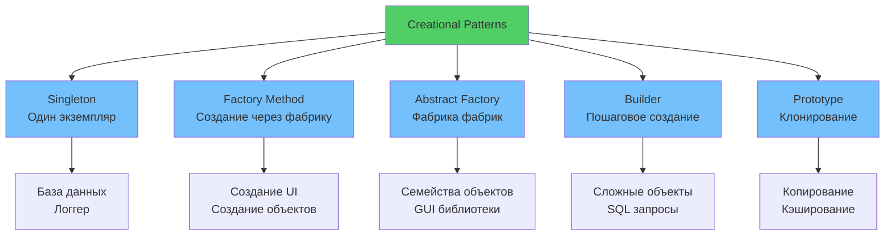
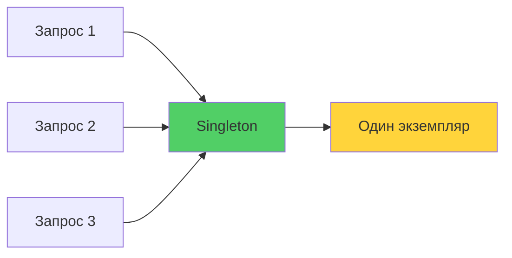
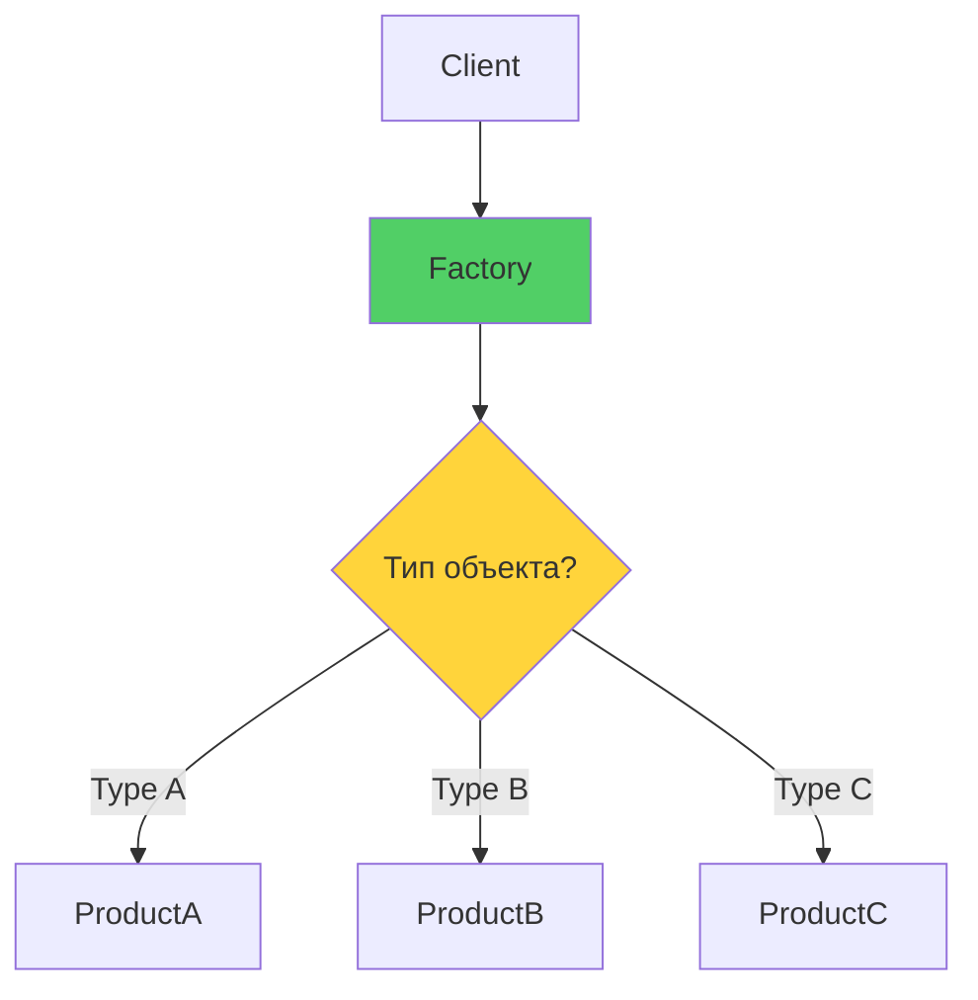

# 🏭 Урок 2: Creational Patterns (Порождающие паттерны)

## 🎯 Цели урока

После изучения этого урока вы сможете:
- ✅ Применять паттерны создания объектов для управления процессом инстанцирования
- ✅ Использовать Singleton для контроля единственного экземпляра
- ✅ Реализовывать Factory Method для создания семейств объектов
- ✅ Применять Builder для пошагового создания сложных объектов
- ✅ Использовать Prototype для эффективного клонирования

## 📖 Creational Patterns

Порождающие паттерны решают проблему создания объектов, делая систему независимой от способа создания, композиции и представления объектов.

### 💡 Простыми словами

**Аналогия**: Как создавать объекты? Как фабрика производит товары.

- **Singleton** = единственный директор компании (всегда один)
- **Factory** = конвейер на заводе (создает разные товары)
- **Builder** = сборка конструктора LEGO (пошагово)
- **Prototype** = ксерокопия документа (клонирование)

### 📊 Визуализация Creational Patterns



### 🎯 Когда использовать Creational Patterns?

1. **Система должна быть независимой** от способа создания объектов
2. **Нужно создавать семейства связанных объектов**
3. **Процесс создания объекта сложный** и требует многих шагов
4. **Нужно оптимизировать создание** большого количества похожих объектов

## 🔧 Singleton Pattern

### 💡 Простыми словами

**Аналогия**: Единственный директор компании
- В компании может быть только один директор
- Все обращаются к одному и тому же директору
- Директор создается один раз при первом обращении

### 📊 Визуализация Singleton



### Проблема
Нужно гарантировать, что у класса есть только один экземпляр, и к нему есть глобальная точка доступа.

### Решение
```python
from typing import Optional

class Singleton:
    _instance: Optional['Singleton'] = None

    def __new__(cls) -> 'Singleton':
        if cls._instance is None:
            cls._instance = super().__new__(cls)
        return cls._instance

    def __init__(self):
        # Инициализация происходит каждый раз
        if not hasattr(self, '_initialized'):
            self._initialized = True
            self.data = {}

# Использование
s1 = Singleton()
s2 = Singleton()
print(s1 is s2)  # True - один и тот же объект
```

### Python-специфичная реализация
```python
import threading

class DatabaseConnection:
    _instance = None
    _lock = threading.Lock()  # Для потокобезопасности

    def __new__(cls):
        if cls._instance is None:
            with cls._lock:  # Double-checked locking
                if cls._instance is None:
                    cls._instance = super().__new__(cls)
        return cls._instance

    def __init__(self):
        if not hasattr(self, '_initialized'):
            self._initialized = True
            self.connection = self._connect_to_db()

    def _connect_to_db(self):
        # Реальная логика подключения
        return "Connected to database"
```

### Когда использовать Singleton?

✅ **Плюсы:**
- Гарантированный единственный экземпляр
- Глобальная точка доступа
- Ленивая инициализация

❌ **Минусы:**
- **Нарушает SRP** (класс отвечает за создание экземпляра И за бизнес-логику)
- **Затрудняет тестирование** (глобальное состояние, сложности с mock)
- **Создает скрытые зависимости** между компонентами
- **Проблемы с многопоточностью** (race conditions)
- **Усложняет unit-тесты** (состояние переносится между тестами)
- **Может стать узким местом** при высокой нагрузке

## 🏭 Factory Method Pattern

### 💡 Простыми словами

**Аналогия**: Конвейер на заводе
- Завод производит разные товары (объекты)
- Не нужно знать, как именно создается каждый товар
- Просто говорите "создай автомобиль" - завод знает как

### 📊 Визуализация Factory



### Проблема
Нужно создавать объекты разных типов, но не хочется жестко кодировать конкретные классы.

### 🎯 Почему это важно?

**Без Factory:**
```python
# ❌ Плохо: жестко закодированные классы
if db_type == "postgres":
    db = PostgreSQLConnection()
elif db_type == "mysql":
    db = MySQLConnection()
# 💥 Новый тип? Нужно менять код!
```

**С Factory:**
```python
# ✅ Хорошо: создание через фабрику
db = DatabaseFactory.create(db_type)  # Легко добавить новый тип!
```

### Решение
```python
from abc import ABC, abstractmethod

class Product(ABC):
    @abstractmethod
    def operation(self) -> str:
        pass

class ConcreteProductA(Product):
    def operation(self) -> str:
        return "Результат продукта A"

class ConcreteProductB(Product):
    def operation(self) -> str:
        return "Результат продукта B"

class Creator(ABC):
    @abstractmethod
    def factory_method(self) -> Product:
        pass

    def some_operation(self) -> str:
        product = self.factory_method()
        return f"Creator: {product.operation()}"

class ConcreteCreatorA(Creator):
    def factory_method(self) -> Product:
        return ConcreteProductA()

class ConcreteCreatorB(Creator):
    def factory_method(self) -> Product:
        return ConcreteProductB()
```

### Пример: Фабрика подключений к БД
```python
from abc import ABC, abstractmethod

class DatabaseConnection(ABC):
    @abstractmethod
    def connect(self) -> None:
        pass

    @abstractmethod
    def execute_query(self, query: str) -> list:
        pass

class PostgreSQLConnection(DatabaseConnection):
    def connect(self) -> None:
        print("Подключение к PostgreSQL")

    def execute_query(self, query: str) -> list:
        return ["Результаты из PostgreSQL"]

class MySQLConnection(DatabaseConnection):
    def connect(self) -> None:
        print("Подключение к MySQL")

    def execute_query(self, query: str) -> list:
        return ["Результаты из MySQL"]

class DatabaseFactory:
    @staticmethod
    def create_connection(db_type: str) -> DatabaseConnection:
        if db_type == "postgres":
            return PostgreSQLConnection()
        elif db_type == "mysql":
            return MySQLConnection()
        else:
            raise ValueError(f"Неизвестный тип БД: {db_type}")

# Использование
factory = DatabaseFactory()
db = factory.create_connection("postgres")
db.connect()
results = db.execute_query("SELECT * FROM users")
```

## 🏗 Builder Pattern

### Проблема
Нужно создавать сложные объекты с множеством параметров, где некоторые параметры опциональны.

### Решение
```python
from typing import Optional, Self

class Car:
    def __init__(self):
        self.seats: Optional[int] = None
        self.engine: Optional[str] = None
        self.gps: Optional[bool] = None
        self.trip_computer: Optional[bool] = None

    def __str__(self) -> str:
        return f"Car(seats={self.seats}, engine={self.engine}, gps={self.gps}, trip_computer={self.trip_computer})"

class CarBuilder:
    def __init__(self):
        self.car = Car()

    def set_seats(self, seats: int) -> Self:
        self.car.seats = seats
        return self

    def set_engine(self, engine: str) -> Self:
        self.car.engine = engine
        return self

    def set_gps(self, gps: bool) -> Self:
        self.car.gps = gps
        return self

    def set_trip_computer(self, trip_computer: bool) -> Self:
        self.car.trip_computer = trip_computer
        return self

    def build(self) -> Car:
        return self.car

# Использование
builder = CarBuilder()
car = (builder
       .set_seats(4)
       .set_engine("V8")
       .set_gps(True)
       .build())

print(car)  # Car(seats=4, engine=V8, gps=True, trip_computer=None)
```

### Fluent Interface
```python
# Python позволяет создавать fluent interface
class QueryBuilder:
    def __init__(self):
        self._query = []

    def select(self, *columns) -> Self:
        self._query.append(f"SELECT {', '.join(columns)}")
        return self

    def from_table(self, table: str) -> Self:
        self._query.append(f"FROM {table}")
        return self

    def where(self, condition: str) -> Self:
        self._query.append(f"WHERE {condition}")
        return self

    def build(self) -> str:
        return ' '.join(self._query)

# Использование
query = (QueryBuilder()
         .select("name", "email")
         .from_table("users")
         .where("active = 1")
         .build())

print(query)  # SELECT name, email FROM users WHERE active = 1
```

## 📋 Prototype Pattern

### Проблема
Нужно создавать множество похожих объектов, копируя существующие.

### Решение
```python
from abc import ABC, abstractmethod
import copy

class Prototype(ABC):
    @abstractmethod
    def clone(self):
        pass

class Document(Prototype):
    def __init__(self, title: str, content: str, author: str):
        self.title = title
        self.content = content
        self.author = author
        self.metadata = {}

    def clone(self):
        # Поверхностное копирование
        return copy.copy(self)

    def deep_clone(self):
        # Глубокое копирование
        return copy.deepcopy(self)

    def __str__(self):
        return f"Document(title='{self.title}', author='{self.author}')"

# Использование
original = Document("Шаблон документа", "Содержимое", "Автор")
original.metadata = {"version": "1.0", "tags": ["important"]}

# Создание копий
copy1 = original.clone()
copy2 = original.deep_clone()

copy1.title = "Копия 1"
copy2.title = "Копия 2"

print(original)  # Document(title='Шаблон документа', author='Автор')
print(copy1)     # Document(title='Копия 1', author='Автор')
print(copy2)     # Document(title='Копия 2', author='Автор')
```

### Registry для прототипов
```python
class PrototypeRegistry:
    def __init__(self):
        self._prototypes = {}

    def register(self, name: str, prototype: Prototype) -> None:
        self._prototypes[name] = prototype

    def get(self, name: str) -> Prototype:
        prototype = self._prototypes.get(name)
        if prototype:
            return prototype.clone()
        raise ValueError(f"Прототип '{name}' не найден")

# Использование
registry = PrototypeRegistry()

# Регистрация шаблонов
report_template = Document("Отчет", "Шаблон отчета", "System")
registry.register("report", report_template)

invoice_template = Document("Счет", "Шаблон счета", "System")
registry.register("invoice", invoice_template)

# Создание документов из шаблонов
monthly_report = registry.get("report")
monthly_report.title = "Месячный отчет за январь"

invoice = registry.get("invoice")
invoice.title = "Счет №123"
```

## 🎨 Abstract Factory Pattern

### Проблема
Нужно создавать семейства связанных объектов без указания конкретных классов.

### Решение
```python
from abc import ABC, abstractmethod

class Button(ABC):
    @abstractmethod
    def render(self) -> str:
        pass

class WindowsButton(Button):
    def render(self) -> str:
        return "Windows Button"

class MacOSButton(Button):
    def render(self) -> str:
        return "macOS Button"

class Checkbox(ABC):
    @abstractmethod
    def render(self) -> str:
        pass

class WindowsCheckbox(Checkbox):
    def render(self) -> str:
        return "Windows Checkbox"

class MacOSCheckbox(Checkbox):
    def render(self) -> str:
        return "macOS Checkbox"

class GUIFactory(ABC):
    @abstractmethod
    def create_button(self) -> Button:
        pass

    @abstractmethod
    def create_checkbox(self) -> Checkbox:
        pass

class WindowsFactory(GUIFactory):
    def create_button(self) -> Button:
        return WindowsButton()

    def create_checkbox(self) -> Checkbox:
        return WindowsCheckbox()

class MacOSFactory(GUIFactory):
    def create_button(self) -> Button:
        return MacOSButton()

    def create_checkbox(self) -> Checkbox:
        return MacOSCheckbox()

# Использование
def create_ui(factory: GUIFactory):
    button = factory.create_button()
    checkbox = factory.create_checkbox()
    return button, checkbox

# Для Windows
windows_ui = create_ui(WindowsFactory())
print(windows_ui[0].render())  # Windows Button

# Для macOS
mac_ui = create_ui(MacOSFactory())
print(mac_ui[0].render())  # macOS Button
```

## 🛠 Сравнение Creational Patterns

| Паттерн | Назначение | Когда использовать |
|---------|------------|-------------------|
| **Singleton** | Единственный экземпляр | Логгеры, кэши, конфигурация |
| **Factory Method** | Семейства объектов | Разные типы объектов |
| **Abstract Factory** | Семейства связанных объектов | Темы, платформы |
| **Builder** | Сложные объекты пошагово | Конструкторы с множеством параметров |
| **Prototype** | Клонирование объектов | Шаблоны, копирование состояния |

## 🎮 Практические упражнения

### Упражнение 1: Реализация паттернов

**Задание:** Реализуйте каждый из изученных паттернов для системы управления задачами.

### Упражнение 2: Выбор подходящего паттерна

**Задание:** Для каждой ситуации выберите наиболее подходящий Creational паттерн:

1. **Логгер должен быть единственным** в приложении
2. **Разные типы отчетов** (PDF, HTML, JSON) должны создаваться через фабрику
3. **HTTP запросы** с множеством опций (headers, timeout, retries)
4. **Кэширование объектов** с предварительной настройкой

## 🎯 Ключевые выводы

1. **Creational паттерны** отделяют создание объектов от их использования
2. **Singleton** гарантирует единственный экземпляр, но имеет минусы
3. **Factory Method** позволяет создавать объекты разных типов
4. **Builder** упрощает создание сложных объектов
5. **Prototype** эффективен для копирования существующих объектов
6. **Abstract Factory** создает семейства связанных объектов

## 🚀 Следующие шаги

!!! success "Что вы узнали"
    - ✅ Singleton - один экземпляр класса (как единственный директор)
    - ✅ Factory Method - создание объектов через фабрику (как конвейер)
    - ✅ Builder - пошаговое создание сложных объектов (как LEGO)
    - ✅ Prototype - клонирование объектов (как ксерокопия)

!!! tip "Практика"
    Найдите в своем проекте места, где создаются объекты. Попробуйте применить Factory или Builder для улучшения кода.

Теперь вы готовы изучить **[Structural Patterns](03-structural-patterns.md)** - паттерны, которые помогают организовать связи между объектами!

---

!!! tip "Практический совет"
    В Python многие Creational паттерны можно упростить благодаря динамической типизации и first-class функциям. Не усложняйте решение, если простое тоже работает.

!!! info "Дополнительные ресурсы"
    - [Creational Patterns Overview](https://refactoring.guru/design-patterns/creational-patterns)
    - [Python Design Patterns](https://python-patterns.guide/creational/)

## 🧪 Проверьте свои знания: Creational Patterns

<div class="quiz-container" id="creational-patterns-quiz">
<script type="application/json">
{
  "title": "Creational Patterns",
  "description": "Проверьте понимание порождающих паттернов",
  "icon": "🏭",
  "questions": [
    {
      "question": "Какой паттерн гарантирует единственный экземпляр класса?",
      "type": "single",
      "points": 1,
      "options": [
        {"text": "Factory Method", "correct": false},
        {"text": "Singleton", "correct": true},
        {"text": "Builder", "correct": false},
        {"text": "Prototype", "correct": false}
      ],
      "explanation": "Singleton гарантирует, что у класса есть только один экземпляр"
    },
    {
      "question": "Когда лучше использовать Builder паттерн?",
      "type": "single",
      "points": 1,
      "options": [
        {"text": "Когда нужен единственный экземпляр", "correct": false},
        {"text": "Когда объект создается в один шаг", "correct": false},
        {"text": "Когда конструктор имеет много параметров", "correct": true},
        {"text": "Когда нужно клонировать объекты", "correct": false}
      ],
      "explanation": "Builder упрощает создание объектов с множеством опциональных параметров"
    },
    {
      "question": "Что такое Abstract Factory?",
      "type": "single",
      "points": 1,
      "options": [
        {"text": "Фабрика для создания абстрактных классов", "correct": false},
        {"text": "Фабрика для создания семейств связанных объектов", "correct": true},
        {"text": "Фабрика для создания прототипов", "correct": false},
        {"text": "Фабрика для создания синглтонов", "correct": false}
      ],
      "explanation": "Abstract Factory создает семейства связанных объектов без указания конкретных классов"
    },
    {
      "question": "Какой паттерн лучше использовать для клонирования объектов?",
      "type": "single",
      "points": 1,
      "options": [
        {"text": "Singleton", "correct": false},
        {"text": "Factory Method", "correct": false},
        {"text": "Builder", "correct": false},
        {"text": "Prototype", "correct": true}
      ],
      "explanation": "Prototype предназначен для создания копий существующих объектов"
    },
    {
      "question": "Какие проблемы решают Creational паттерны?",
      "type": "multiple",
      "points": 2,
      "options": [
        {"text": "Управление процессом создания объектов", "correct": true},
        {"text": "Оптимизация производительности", "correct": false},
        {"text": "Организация связей между объектами", "correct": false},
        {"text": "Независимость от конкретных классов", "correct": true},
        {"text": "Упрощение тестирования", "correct": true}
      ],
      "explanation": "Creational паттерны решают проблемы создания объектов и делают систему гибкой"
    },
    {
      "question": "Что является недостатком Singleton паттерна?",
      "type": "multiple",
      "points": 2,
      "options": [
        {"text": "Гарантирует единственный экземпляр", "correct": false},
        {"text": "Создает глобальное состояние", "correct": true},
        {"text": "Затрудняет тестирование", "correct": true},
        {"text": "Упрощает доступ к объекту", "correct": false},
        {"text": "Создает скрытые зависимости", "correct": true}
      ],
      "explanation": "Singleton создает проблемы с тестированием и зависимостями, несмотря на удобство"
    },
    {
      "question": "Какой паттерн позволяет создавать объекты разных типов через единый интерфейс?",
      "type": "single",
      "points": 1,
      "options": [
        {"text": "Singleton", "correct": false},
        {"text": "Factory Method", "correct": true},
        {"text": "Builder", "correct": false},
        {"text": "Prototype", "correct": false}
      ],
      "explanation": "Factory Method позволяет создавать объекты разных типов через общий интерфейс"
    },
    {
      "question": "Что позволяет Builder паттерн?",
      "type": "multiple",
      "points": 2,
      "options": [
        {"text": "Создавать объект за один шаг", "correct": false},
        {"text": "Строить объект пошагово", "correct": true},
        {"text": "Гарантировать единственный экземпляр", "correct": false},
        {"text": "Клонировать существующие объекты", "correct": false},
        {"text": "Создавать читаемый код создания объектов", "correct": true}
      ],
      "explanation": "Builder позволяет пошагово создавать сложные объекты с понятным API"
    }
  ]
}
</script>
</div>

## 💻 Практическое задание: Реализация Creational паттернов

### 🎮 Интерактивное упражнение: Factory Pattern

Попробуйте реализовать Factory для создания разных типов уведомлений:

{{ code_input_form(
    exercise_id="factory_pattern_01",
    initial_code="""from abc import ABC, abstractmethod

# TODO: Создайте абстрактный класс Notification
class Notification(ABC):
    @abstractmethod
    def send(self, message: str) -> None:
        pass

# TODO: Реализуйте EmailNotification, SMSNotification, PushNotification

# TODO: Создайте NotificationFactory с методом create(type: str) -> Notification

# Ваш код здесь:
""",
    placeholder="Реализуйте Factory Pattern для уведомлений...",
    use_pyodide=True,
    test_cases=[
        {
            "code": """
# Test 1: Factory создает EmailNotification
factory = NotificationFactory()
email = factory.create("email")
assert isinstance(email, EmailNotification), "Factory должен создавать EmailNotification"
            """,
            "description": "Factory создает EmailNotification"
        },
        {
            "code": """
# Test 2: Factory создает SMSNotification
factory = NotificationFactory()
sms = factory.create("sms")
assert isinstance(sms, SMSNotification), "Factory должен создавать SMSNotification"
            """,
            "description": "Factory создает SMSNotification"
        },
        {
            "code": """
# Test 3: Все уведомления имеют метод send
factory = NotificationFactory()
for notif_type in ["email", "sms", "push"]:
    notification = factory.create(notif_type)
    assert hasattr(notification, 'send'), f"{notif_type} должен иметь метод send"
            """,
            "description": "Все уведомления имеют метод send"
        }
    ]
) }}

!!! tip "Подсказка"
    Создайте абстрактный класс `Notification`, затем конкретные реализации. Factory должен возвращать правильный тип в зависимости от параметра.

---

## 💻 Практическое задание: Реализация Creational паттернов

{{ create_exercise_form(
    "creational_patterns_implementation",
    "Реализация всех Creational паттернов в системе управления контентом",
    "Создайте систему управления контентом (CMS), применив все изученные Creational паттерны для создания различных типов контента, пользователей и настроек.",
    """from abc import ABC, abstractmethod
from typing import List, Dict, Optional, Self, Any
import copy
import threading
from datetime import datetime

# Задание: Реализовать систему управления контентом с использованием всех Creational паттернов

# 1. SINGLETON PATTERN
# TODO: Создайте класс ConfigurationManager как Singleton
class ConfigurationManager:
    '''Менеджер конфигурации - единственный экземпляр в системе'''
    # TODO: Реализуйте Singleton паттерн
    # - Гарантируйте единственный экземпляр
    # - Храните настройки приложения
    # - Предоставьте методы для получения настроек
    
    _instance = None
    _lock = threading.Lock()
    
    def __new__(cls):
        if cls._instance is None:
            with cls._lock:
                if cls._instance is None:
                    cls._instance = super(ConfigurationManager, cls).__new__(cls)
        return cls._instance

    def __init__(self):
        if not hasattr(self, '_initialized'):
            self._initialized = True
            self._config = {
                'db_host': 'localhost',
                'db_port': 5432,
                'cache_enabled': True,
                'max_file_size': 10 * 1024 * 1024  # 10MB
            }

    def get(self, key: str) -> Any:
        return self._config.get(key)

    def set(self, key: str, value: Any) -> None:
        self._config[key] = value

# 2. FACTORY METHOD PATTERN
# TODO: Создайте иерархию контента с Factory Method
class Content(ABC):
    def __init__(self, title: str, author: str):
        self.title = title
        self.author = author
        self.created_at = datetime.now()

    @abstractmethod
    def render(self) -> str:
        pass

class Article(Content):
    def __init__(self, title: str, author: str, content: str):
        super().__init__(title, author)
        self.content = content

    def render(self) -> str:
        return f"Article: {self.title} by {self.author}\n{self.content}"

class Video(Content):
    def __init__(self, title: str, author: str, url: str, duration: int):
        super().__init__(title, author)
        self.url = url
        self.duration = duration

    def render(self) -> str:
        return f"Video: {self.title} by {self.author} ({self.duration}min) - {self.url}"

class Image(Content):
    def __init__(self, title: str, author: str, url: str, alt_text: str):
        super().__init__(title, author)
        self.url = url
        self.alt_text = alt_text

    def render(self) -> str:
        return f"Image: {self.title} by {self.author} - {self.url}"

# TODO: Создайте ContentFactory с Factory Method паттерном
class ContentFactory:
    @staticmethod
    def create_content(content_type: str, **kwargs) -> Content:
        if content_type == 'article':
            return Article(**kwargs)
        elif content_type == 'video':
            return Video(**kwargs)
        elif content_type == 'image':
            return Image(**kwargs)
        else:
            raise ValueError(f"Неизвестный тип контента: {content_type}")

# 3. BUILDER PATTERN
# TODO: Создайте UserBuilder для сложного создания пользователей
class User:
    def __init__(self):
        self.username: Optional[str] = None
        self.email: Optional[str] = None
        self.first_name: Optional[str] = None
        self.last_name: Optional[str] = None
        self.roles: List[str] = []
        self.is_active: bool = True
        self.created_at: datetime = datetime.now()

    def __str__(self) -> str:
        return f"User({self.username}, {self.email}, active={self.is_active})"

# TODO: Реализуйте UserBuilder с fluent interface
class UserBuilder:
    def __init__(self):
        self.user = User()

    def with_username(self, username: str) -> Self:
        self.user.username = username
        return self

    def with_email(self, email: str) -> Self:
        self.user.email = email
        return self

    def with_name(self, first_name: str, last_name: str) -> Self:
        self.user.first_name = first_name
        self.user.last_name = last_name
        return self

    def with_roles(self, *roles: str) -> Self:
        self.user.roles.extend(roles)
        return self

    def inactive(self) -> Self:
        self.user.is_active = False
        return self

    def build(self) -> User:
        return self.user

# 4. PROTOTYPE PATTERN
# TODO: Создайте систему шаблонов для быстрого создания контента
class ContentTemplate(Content):
    def __init__(self, title: str, author: str, template_type: str):
        super().__init__(title, author)
        self.template_type = template_type

    def clone(self) -> 'ContentTemplate':
        return copy.deepcopy(self)

    def render(self) -> str:
        return f"Template {self.template_type}: {self.title}"

# TODO: Создайте TemplateRegistry для управления шаблонами
class TemplateRegistry:
    def __init__(self):
        self._templates: Dict[str, ContentTemplate] = {}

    def register_template(self, name: str, template: ContentTemplate) -> None:
        self._templates[name] = template

    def get_template(self, name: str) -> ContentTemplate:
        template = self._templates.get(name)
        if template:
            return template.clone()
        raise ValueError(f"Шаблон '{name}' не найден")

# 5. ABSTRACT FACTORY PATTERN (опционально)
# TODO: Создайте фабрику для создания UI компонентов для разных платформ

class UIComponent(ABC):
    @abstractmethod
    def render(self) -> str:
        pass

class Button(UIComponent):
    def render(self) -> str:
        return "Button"

class TextField(UIComponent):
    def render(self) -> str:
        return "TextField"

class UIComponentFactory(ABC):
    @abstractmethod
    def create_button(self, label: str) -> Button:
        pass

    @abstractmethod
    def create_text_field(self, placeholder: str) -> TextField:
        pass

# Демонстрация работы системы
if __name__ == "__main__":
    print("=== Creational Patterns Demo ===\n")

    # Singleton
    config1 = ConfigurationManager()
    config2 = ConfigurationManager()
    print(f"Singleton работает: {config1 is config2}")
    config1.set('theme', 'dark')
    print(f"Настройка из config2: {config2.get('theme')}\n")

    # Factory Method
    article = ContentFactory.create_content(
        'article',
        title='Мой первый пост',
        author='Автор',
        content='Содержимое статьи...'
    )
    print(f"Factory Method: {article.render()}\n")

    # Builder
    user = (UserBuilder()
            .with_username('john_doe')
            .with_email('john@example.com')
            .with_name('John', 'Doe')
            .with_roles('admin', 'editor')
            .build())
    print(f"Builder: {user}\n")

    # Prototype
    registry = TemplateRegistry()
    template = ContentTemplate("Шаблон новости", "System", "news")
    registry.register_template("news", template)

    cloned_template = registry.get_template("news")
    cloned_template.title = "Новости дня"
    print(f"Prototype: {cloned_template.render()}")
    print(f"Оригинал не изменился: {template.render()}")

# TODO: Расширьте систему:
# - Добавьте валидацию в Builder
# - Создайте Abstract Factory для UI компонентов
# - Добавьте сериализацию для шаблонов
# - Создайте менеджер пользователей с кэшированием""",
    [
        "Реализуйте Singleton для ConfigurationManager с правильной потокобезопасностью",
        "Создайте ContentFactory с поддержкой всех типов контента (Article, Video, Image)",
        "Реализуйте UserBuilder с fluent interface и валидацией данных",
        "Создайте TemplateRegistry для управления шаблонами контента",
        "Добавьте Abstract Factory для создания UI компонентов разных платформ",
        "Напишите тесты для проверки корректности всех паттернов",
        "Продемонстрируйте работу системы с примерами использования"
    ]
) }}

