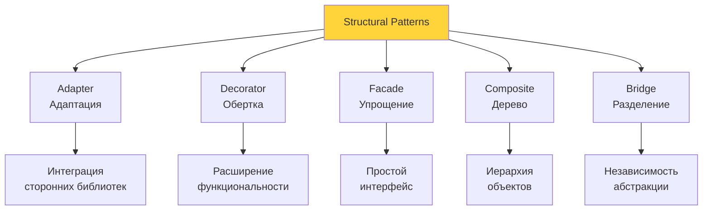
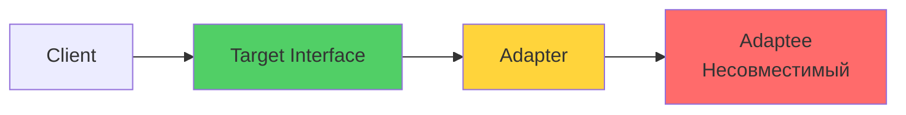
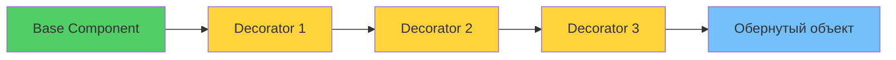
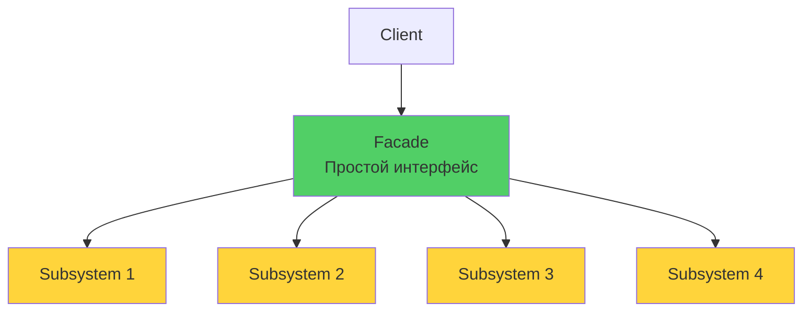

# 🔗 Урок 3: Structural Patterns (Структурные паттерны)

## 🎯 Цели урока

После изучения этого урока вы сможете:
- ✅ Применять Adapter для адаптации интерфейсов
- ✅ Использовать Decorator для динамического добавления функциональности
- ✅ Создавать Facade для упрощения сложных систем
- ✅ Реализовывать Composite для древовидных структур
- ✅ Применять Bridge для разделения абстракции и реализации

## 📖 Structural Patterns

Структурные паттерны объясняют, как собирать объекты и классы в более крупные структуры, сохраняя гибкость и эффективность этих структур.

### 💡 Простыми словами

**Аналогия**: Как соединять детали конструктора?

- **Adapter** = переходник для розетки (адаптация интерфейсов)
- **Decorator** = слои одежды (добавление функций)
- **Facade** = пульт от всего (упрощение системы)
- **Composite** = папки в файловой системе (древовидная структура)
- **Bridge** = мост между берегами (разделение абстракции и реализации)

### 📊 Визуализация Structural Patterns



### 🎯 Когда использовать Structural Patterns?

1. **Нужно адаптировать интерфейсы** разных классов
2. **Требуется добавить функциональность** без изменения кода
3. **Сложная система нуждается** в упрощенном интерфейсе
4. **Объекты должны образовывать** древовидные структуры
5. **Нужно разделить абстракцию** от реализации

## 🔌 Adapter Pattern

### 💡 Простыми словами

**Аналогия**: Переходник для розетки
- У вас вилка европейского типа (один интерфейс)
- Розетка российского типа (другой интерфейс)
- Переходник (Adapter) позволяет использовать вилку в розетке

### 📊 Визуализация Adapter



### Проблема
Нужно использовать класс с несовместимым интерфейсом, но нельзя изменить его код.

### Решение
```python
from abc import ABC, abstractmethod

# Целевой интерфейс
class PaymentProcessor(ABC):
    @abstractmethod
    def process_payment(self, amount: float, currency: str) -> bool:
        pass

# Адаптируемый класс (сторонняя библиотека)
class StripePaymentService:
    def charge(self, amount_in_cents: int, currency_code: str) -> dict:
        # Имитация вызова Stripe API
        return {"status": "success", "transaction_id": "txn_123"}

# Adapter
class StripePaymentAdapter(PaymentProcessor):
    def __init__(self, stripe_service: StripePaymentService):
        self.stripe_service = stripe_service

    def process_payment(self, amount: float, currency: str) -> bool:
        # Адаптация интерфейса
        amount_in_cents = int(amount * 100)  # Конвертация в центы
        result = self.stripe_service.charge(amount_in_cents, currency)
        return result["status"] == "success"

# Использование
stripe_service = StripePaymentService()
payment_processor = StripePaymentAdapter(stripe_service)

# Теперь можем использовать Stripe через стандартный интерфейс
success = payment_processor.process_payment(99.99, "USD")
print(f"Payment successful: {success}")
```

### Object Adapter vs Class Adapter

```python
# Object Adapter (композиция)
class ObjectAdapter(TargetInterface):
    def __init__(self, adaptee: Adaptee):
        self.adaptee = adaptee

    def target_method(self):
        return self.adaptee.adaptee_method()

# Class Adapter (множественное наследование)
class ClassAdapter(TargetInterface, Adaptee):
    def target_method(self):
        return self.adaptee_method()  # Наследуется от Adaptee
```

### Пример: Адаптер для работы с файлами

```python
from abc import ABC, abstractmethod
from typing import List

# Общий интерфейс для работы с данными
class DataProcessor(ABC):
    @abstractmethod
    def load_data(self, source: str) -> List[dict]:
        pass

    @abstractmethod
    def save_data(self, data: List[dict], destination: str) -> None:
        pass

# Сторонняя библиотека для работы с CSV
class CSVLibrary:
    def read_csv(self, filename: str) -> str:
        # Имитация чтения CSV
        return "name,age\nJohn,25\nJane,30"

    def write_csv(self, data: str, filename: str) -> None:
        # Имитация записи CSV
        print(f"Writing CSV to {filename}")

# Adapter для CSV
class CSVDataAdapter(DataProcessor):
    def __init__(self, csv_lib: CSVLibrary):
        self.csv_lib = csv_lib

    def load_data(self, source: str) -> List[dict]:
        csv_content = self.csv_lib.read_csv(source)
        # Преобразование CSV строки в список словарей
        lines = csv_content.strip().split('\n')
        headers = lines[0].split(',')
        data = []
        for line in lines[1:]:
            values = line.split(',')
            data.append(dict(zip(headers, values)))
        return data

    def save_data(self, data: List[dict], destination: str) -> None:
        if not data:
            return
        headers = list(data[0].keys())
        csv_lines = [','.join(headers)]
        for item in data:
            csv_lines.append(','.join(str(item[header]) for header in headers))
        csv_content = '\n'.join(csv_lines)
        self.csv_lib.write_csv(csv_content, destination)

# Использование
csv_lib = CSVLibrary()
processor = CSVDataAdapter(csv_lib)

data = processor.load_data("users.csv")
print(data)  # [{'name': 'John', 'age': '25'}, {'name': 'Jane', 'age': '30'}]

new_data = [{'name': 'Bob', 'age': '35'}]
processor.save_data(new_data, "new_users.csv")
```

## 🎨 Decorator Pattern

### 💡 Простыми словами

**Аналогия**: Слои одежды
- Базовая футболка (базовый объект)
- Добавляете свитер (декоратор 1)
- Добавляете куртку (декоратор 2)
- Каждый слой добавляет функциональность, не меняя предыдущие

### 📊 Визуализация Decorator



### Проблема
Нужно динамически добавлять функциональность объектам без изменения их классов.

### Решение
```python
from abc import ABC, abstractmethod

# Базовый компонент
class Coffee(ABC):
    @abstractmethod
    def cost(self) -> float:
        pass

    @abstractmethod
    def description(self) -> str:
        pass

# Конкретный компонент
class SimpleCoffee(Coffee):
    def cost(self) -> float:
        return 2.0

    def description(self) -> str:
        return "Simple coffee"

# Базовый декоратор
class CoffeeDecorator(Coffee):
    def __init__(self, coffee: Coffee):
        self._coffee = coffee

    def cost(self) -> float:
        return self._coffee.cost()

    def description(self) -> str:
        return self._coffee.description()

# Конкретные декораторы
class MilkDecorator(CoffeeDecorator):
    def cost(self) -> float:
        return self._coffee.cost() + 0.5

    def description(self) -> str:
        return f"{self._coffee.description()} with milk"

class SugarDecorator(CoffeeDecorator):
    def cost(self) -> float:
        return self._coffee.cost() + 0.2

    def description(self) -> str:
        return f"{self._coffee.description()} with sugar"

class WhippedCreamDecorator(CoffeeDecorator):
    def cost(self) -> float:
        return self._coffee.cost() + 1.0

    def description(self) -> str:
        return f"{self._coffee.description()} with whipped cream"

# Использование
coffee = SimpleCoffee()
print(f"{coffee.description()}: ${coffee.cost()}")

# Добавляем декораторы
coffee = MilkDecorator(coffee)
coffee = SugarDecorator(coffee)
coffee = WhippedCreamDecorator(coffee)

print(f"{coffee.description()}: ${coffee.cost()}")
```

### Python-специфичные декораторы

```python
import functools

# Функциональные декораторы
def logging_decorator(func):
    def wrapper(*args, **kwargs):
        print(f"Calling {func.__name__}")
        result = func(*args, **kwargs)
        print(f"Finished {func.__name__}")
        return result
    return wrapper

@logging_decorator
def greet(name):
    return f"Hello, {name}!"

# Классовые декораторы
class CacheDecorator:
    def __init__(self, func):
        self.func = func
        functools.update_wrapper(self, func)
        self.cache = {}

    def __call__(self, *args):
        if args not in self.cache:
            self.cache[args] = self.func(*args)
        return self.cache[args]

@CacheDecorator
def fibonacci(n):
    # After decoration, 'fibonacci' refers to the CacheDecorator instance.
    # Recursive calls (fibonacci(n-1), fibonacci(n-2)) go through the
    # decorator's __call__ method, enabling memoization for all recursive calls.
    if n < 2:
        return n
    return fibonacci(n-1) + fibonacci(n-2)
```

### Пример: Декоратор для кэширования

```python
import functools
import time
from typing import Any, Callable

def cached(max_age: int = 300):
    """Декоратор для кэширования результатов с временем жизни"""
    def decorator(func: Callable) -> Callable:
        cache = {}

        @functools.wraps(func)
        def wrapper(*args, **kwargs):
            # Создаем ключ для кэша
            key = str(args) + str(sorted(kwargs.items()))

            # Проверяем кэш
            if key in cache:
                result, timestamp = cache[key]
                if time.time() - timestamp < max_age:
                    return result

            # Выполняем функцию и кэшируем результат
            result = func(*args, **kwargs)
            cache[key] = (result, time.time())
            return result

        return wrapper
    return decorator

# Использование
@cached(max_age=60)  # Кэш на 1 минуту
def expensive_api_call(user_id: int) -> dict:
    # Имитация долгого API вызова
    time.sleep(2)
    return {"user_id": user_id, "name": f"User {user_id}"}
```

## 🏢 Facade Pattern

### 💡 Простыми словами

**Аналогия**: Пульт от всего
- У вас много устройств: TV, кондиционер, музыка (сложная система)
- Пульт (Facade) - одна кнопка "Домой" включает все
- Не нужно знать, как работает каждое устройство

### 📊 Визуализация Facade



### Проблема
Сложная система имеет много подсистем, и клиентам сложно с ней работать.

### Решение
```python
# Сложная система (подсистемы)
class CPU:
    def execute(self) -> None:
        print("CPU: Executing instructions")

class Memory:
    def load(self, position: int, data: str) -> None:
        print(f"Memory: Loading data '{data}' at position {position}")

class HardDrive:
    def read(self, lba: int, size: int) -> str:
        return f"Data from sector {lba}"

# Facade - упрощенный интерфейс
class ComputerFacade:
    def __init__(self):
        self.cpu = CPU()
        self.memory = Memory()
        self.hard_drive = HardDrive()

    def start_computer(self) -> None:
        print("Starting computer...")
        self.cpu.execute()
        boot_data = self.hard_drive.read(0, 1024)
        self.memory.load(0, boot_data)
        print("Computer started successfully!")

# Клиент работает только с Facade
computer = ComputerFacade()
computer.start_computer()
```

### Пример: Фасад для работы с базой данных

```python
from typing import List, Dict, Any

# Подсистемы
class DatabaseConnection:
    def connect(self) -> None:
        print("Connecting to database...")

    def disconnect(self) -> None:
        print("Disconnecting from database...")

class QueryBuilder:
    def build_select(self, table: str, conditions: Dict[str, Any]) -> str:
        where_clause = " AND ".join(f"{k} = '{v}'" for k, v in conditions.items())
        return f"SELECT * FROM {table} WHERE {where_clause}"

class ResultFormatter:
    def format_results(self, raw_data: List[Dict]) -> str:
        return "\n".join(str(row) for row in raw_data)

# Facade
class DatabaseFacade:
    def __init__(self, connection_string: str):
        self.connection = DatabaseConnection()
        self.query_builder = QueryBuilder()
        self.formatter = ResultFormatter()
        self.connection_string = connection_string

    def execute_query(self, table: str, conditions: Dict[str, Any] = None) -> str:
        """Простой интерфейс для выполнения запросов"""
        conditions = conditions or {}

        try:
            self.connection.connect()

            # Строим запрос
            query = self.query_builder.build_select(table, conditions)
            print(f"Executing: {query}")

            # Имитируем выполнение запроса
            raw_results = [
                {"id": 1, "name": "John", "age": 25},
                {"id": 2, "name": "Jane", "age": 30}
            ]

            # Форматируем результаты
            return self.formatter.format_results(raw_results)

        finally:
            self.connection.disconnect()

# Использование
db = DatabaseFacade("postgresql://localhost/mydb")
results = db.execute_query("users", {"age": 25})
print(results)
```

## 🌳 Composite Pattern

### Проблема
Нужно представить древовидную структуру объектов, где листья и узлы обрабатываются одинаково.

### Решение
```python
from abc import ABC, abstractmethod
from typing import List

# Базовый компонент
class FileSystemComponent(ABC):
    def __init__(self, name: str):
        self.name = name

    @abstractmethod
    def get_size(self) -> int:
        pass

    @abstractmethod
    def display(self, indent: str = "") -> None:
        pass

# Лист (файл)
class File(FileSystemComponent):
    def __init__(self, name: str, size: int):
        super().__init__(name)
        self.size = size

    def get_size(self) -> int:
        return self.size

    def display(self, indent: str = "") -> None:
        print(f"{indent}📄 {self.name} ({self.size} bytes)")

# Составной объект (папка)
class Folder(FileSystemComponent):
    def __init__(self, name: str):
        super().__init__(name)
        self.children: List[FileSystemComponent] = []

    def add(self, component: FileSystemComponent) -> None:
        self.children.append(component)

    def remove(self, component: FileSystemComponent) -> None:
        self.children.remove(component)

    def get_size(self) -> int:
        return sum(child.get_size() for child in self.children)

    def display(self, indent: str = "") -> None:
        print(f"{indent}📁 {self.name}")
        for child in self.children:
            child.display(indent + "  ")

# Использование
root = Folder("Root")
documents = Folder("Documents")
pictures = Folder("Pictures")

root.add(documents)
root.add(pictures)

documents.add(File("resume.pdf", 1024))
documents.add(File("letter.docx", 2048))

pictures.add(File("vacation.jpg", 5120))
pictures.add(File("birthday.png", 3072))

root.display()
print(f"\nTotal size: {root.get_size()} bytes")
```

### Пример: Меню ресторана

```python
# Компонент меню
class MenuComponent(ABC):
    @abstractmethod
    def get_price(self) -> float:
        pass

    @abstractmethod
    def display(self, indent: str = "") -> None:
        pass

# Блюдо (лист)
class MenuItem(MenuComponent):
    def __init__(self, name: str, description: str, price: float):
        self.name = name
        self.description = description
        self.price = price

    def get_price(self) -> float:
        return self.price

    def display(self, indent: str = "") -> None:
        print(f"{indent}🍽️  {self.name}: {self.description} - ${self.price}")

# Категория меню (композит)
class MenuCategory(MenuComponent):
    def __init__(self, name: str):
        self.name = name
        self.children: List[MenuComponent] = []

    def add(self, component: MenuComponent) -> None:
        self.children.append(component)

    def get_price(self) -> float:
        return sum(child.get_price() for child in self.children)

    def display(self, indent: str = "") -> None:
        print(f"{indent}📋 {self.name}")
        for child in self.children:
            child.display(indent + "  ")

# Создание меню
menu = MenuCategory("Main Menu")

appetizers = MenuCategory("Appetizers")
mains = MenuCategory("Main Courses")
desserts = MenuCategory("Desserts")

menu.add(appetizers)
menu.add(mains)
menu.add(desserts)

appetizers.add(MenuItem("Caesar Salad", "Romaine lettuce with caesar dressing", 8.99))
appetizers.add(MenuItem("Soup of the Day", "Fresh seasonal soup", 6.99))

mains.add(MenuItem("Grilled Salmon", "Fresh atlantic salmon with vegetables", 24.99))
mains.add(MenuItem("Ribeye Steak", "Prime ribeye with mashed potatoes", 32.99))

desserts.add(MenuItem("Chocolate Cake", "Rich chocolate layer cake", 7.99))

menu.display()
print(f"\nTotal menu price: ${menu.get_price():.2f}")
```

## 🌉 Bridge Pattern

### Проблема
Нужно разделить абстракцию от реализации, чтобы они могли изменяться независимо.

### Решение
```python
from abc import ABC, abstractmethod

# Реализация (платформа)
class DrawingAPI(ABC):
    @abstractmethod
    def draw_circle(self, x: float, y: float, radius: float) -> None:
        pass

class WindowsDrawingAPI(DrawingAPI):
    def draw_circle(self, x: float, y: float, radius: float) -> None:
        print(f"Windows: Drawing circle at ({x}, {y}) with radius {radius}")

class LinuxDrawingAPI(DrawingAPI):
    def draw_circle(self, x: float, y: float, radius: float) -> None:
        print(f"Linux: Drawing circle at ({x}, {y}) with radius {radius}")

# Абстракция (фигура)
class Shape(ABC):
    def __init__(self, drawing_api: DrawingAPI):
        self.drawing_api = drawing_api

    @abstractmethod
    def draw(self) -> None:
        pass

    @abstractmethod
    def resize(self, factor: float) -> None:
        pass

# Конкретные абстракции
class Circle(Shape):
    def __init__(self, x: float, y: float, radius: float, drawing_api: DrawingAPI):
        super().__init__(drawing_api)
        self.x = x
        self.y = y
        self.radius = radius

    def draw(self) -> None:
        self.drawing_api.draw_circle(self.x, self.y, self.radius)

    def resize(self, factor: float) -> None:
        self.radius *= factor

# Использование
windows_api = WindowsDrawingAPI()
linux_api = LinuxDrawingAPI()

circle1 = Circle(10, 20, 5, windows_api)
circle2 = Circle(15, 25, 7, linux_api)

circle1.draw()  # Windows: Drawing circle...
circle2.draw()  # Linux: Drawing circle...

# Можно изменить реализацию без изменения абстракции
circle1.drawing_api = linux_api
circle1.draw()  # Linux: Drawing circle...
```

### Пример: Система уведомлений

```python
# Реализации способов отправки
class NotificationSender(ABC):
    @abstractmethod
    def send(self, message: str, recipient: str) -> None:
        pass

class EmailSender(NotificationSender):
    def send(self, message: str, recipient: str) -> None:
        print(f"📧 Email to {recipient}: {message}")

class SMSSender(NotificationSender):
    def send(self, message: str, recipient: str) -> None:
        print(f"📱 SMS to {recipient}: {message}")

class PushSender(NotificationSender):
    def send(self, message: str, recipient: str) -> None:
        print(f"🔔 Push to {recipient}: {message}")

# Абстракции типов уведомлений
class Notification(ABC):
    def __init__(self, sender: NotificationSender):
        self.sender = sender

    @abstractmethod
    def notify(self, recipient: str) -> None:
        pass

class OrderNotification(Notification):
    def __init__(self, order_id: str, sender: NotificationSender):
        super().__init__(sender)
        self.order_id = order_id

    def notify(self, recipient: str) -> None:
        message = f"Your order #{self.order_id} has been processed"
        self.sender.send(message, recipient)

class PaymentNotification(Notification):
    def __init__(self, amount: float, sender: NotificationSender):
        super().__init__(sender)
        self.amount = amount

    def notify(self, recipient: str) -> None:
        message = f"Payment of ${self.amount} received"
        self.sender.send(message, recipient)

# Использование
email_sender = EmailSender()
sms_sender = SMSSender()

order_notification = OrderNotification("12345", email_sender)
payment_notification = PaymentNotification(99.99, sms_sender)

order_notification.notify("user@example.com")
payment_notification.notify("+1234567890")

# Можно легко менять способы отправки
order_notification.sender = sms_sender
order_notification.notify("+1234567890")
```

## 🛠 Сравнение Structural Patterns

| Паттерн | Назначение | Когда использовать |
|---------|------------|-------------------|
| **Adapter** | Адаптация интерфейсов | Несовместимые интерфейсы |
| **Decorator** | Динамическое добавление функций | Расширение без наследования |
| **Facade** | Упрощение сложных систем | Много подсистем |
| **Composite** | Древовидные структуры | Иерархические объекты |
| **Bridge** | Разделение абстракции и реализации | Независимое развитие |

## 🎮 Практические упражнения

### Упражнение 1: Реализация паттернов

**Задание:** Создайте систему обработки изображений с использованием Structural паттернов.

### Упражнение 2: Выбор подходящего паттерна

**Задание:** Для каждой ситуации выберите наиболее подходящий Structural паттерн:

1. **Интеграция с legacy API** с другим интерфейсом
2. **Добавление эффектов к изображениям** во время выполнения
3. **Упрощение работы с комплексной графической библиотекой**
4. **Создание иерархии файлов и папок**
5. **Поддержка разных платформ рендеринга**

## 🎯 Ключевые выводы

1. **Structural паттерны** организуют связи между объектами
2. **Adapter** адаптирует несовместимые интерфейсы
3. **Decorator** добавляет функциональность динамически
4. **Facade** упрощает работу со сложными системами
5. **Composite** работает с древовидными структурами
6. **Bridge** разделяет абстракцию от реализации

## 🚀 Следующие шаги

!!! success "Что вы узнали"
    - ✅ Adapter - адаптация несовместимых интерфейсов (как переходник)
    - ✅ Decorator - динамическое добавление функциональности (как слои одежды)
    - ✅ Facade - упрощение сложных систем (как пульт от всего)
    - ✅ Composite - древовидные структуры объектов (как папки)

!!! tip "Практика"
    Найдите в своем коде места, где используются сторонние библиотеки. Попробуйте применить Adapter для унификации интерфейсов.

Теперь вы готовы изучить **[Behavioral Patterns](04-behavioral-patterns-1.md)** - паттерны, определяющие алгоритмы и распределение ответственности между объектами!

---

!!! tip "Практический совет"
    Structural паттерны особенно полезны при интеграции с внешними библиотеками и создании гибких архитектур.

!!! info "Дополнительные ресурсы"
    - [Structural Patterns Overview](https://refactoring.guru/design-patterns/structural-patterns)
    - [Python Structural Patterns](https://python-patterns.guide/structural/)

## 🧪 Проверьте свои знания: Structural Patterns

<div class="quiz-container" id="structural-patterns-quiz">
<script type="application/json">
{
  "title": "Structural Patterns",
  "description": "Проверьте понимание структурных паттернов",
  "icon": "🔗",
  "questions": [
    {
      "question": "Какой паттерн используется для адаптации несовместимых интерфейсов?",
      "type": "single",
      "points": 1,
      "options": [
        {"text": "Adapter", "correct": true},
        {"text": "Decorator", "correct": false},
        {"text": "Facade", "correct": false},
        {"text": "Composite", "correct": false}
      ],
      "explanation": "Adapter паттерн предназначен для адаптации несовместимых интерфейсов"
    },
    {
      "question": "Что позволяет Decorator паттерн?",
      "type": "multiple",
      "points": 2,
      "options": [
        {"text": "Динамически добавлять функциональность", "correct": true},
        {"text": "Изменять существующие классы", "correct": false},
        {"text": "Создавать новые подклассы", "correct": false},
        {"text": "Работать с древовидными структурами", "correct": false},
        {"text": "Не нарушать принцип открытости/закрытости", "correct": true}
      ],
      "explanation": "Decorator позволяет добавлять функциональность без изменения существующего кода"
    },
    {
      "question": "Когда использовать Facade паттерн?",
      "type": "single",
      "points": 1,
      "options": [
        {"text": "Когда нужно упростить работу со сложной системой", "correct": true},
        {"text": "Когда интерфейсы несовместимы", "correct": false},
        {"text": "Когда нужна древовидная структура", "correct": false},
        {"text": "Когда нужно разделить абстракцию от реализации", "correct": false}
      ],
      "explanation": "Facade упрощает интерфейс к сложной системе подсистем"
    },
    {
      "question": "Что такое Composite паттерн?",
      "type": "single",
      "points": 1,
      "options": [
        {"text": "Паттерн для создания единственного экземпляра", "correct": false},
        {"text": "Паттерн для древовидных структур объектов", "correct": true},
        {"text": "Паттерн для адаптации интерфейсов", "correct": false},
        {"text": "Паттерн для динамического добавления функций", "correct": false}
      ],
      "explanation": "Composite позволяет работать с древовидными структурами, где листья и узлы обрабатываются одинаково"
    },
    {
      "question": "Какой паттерн разделяет абстракцию от реализации?",
      "type": "single",
      "points": 1,
      "options": [
        {"text": "Adapter", "correct": false},
        {"text": "Bridge", "correct": true},
        {"text": "Facade", "correct": false},
        {"text": "Decorator", "correct": false}
      ],
      "explanation": "Bridge позволяет абстракции и реализации изменяться независимо"
    },
    {
      "question": "Преимущества Structural паттернов:",
      "type": "multiple",
      "points": 2,
      "options": [
        {"text": "Упрощают интеграцию с внешними системами", "correct": true},
        {"text": "Повышают гибкость архитектуры", "correct": true},
        {"text": "Улучшают читаемость кода", "correct": true},
        {"text": "Автоматически оптимизируют производительность", "correct": false},
        {"text": "Снижают связность между компонентами", "correct": true}
      ],
      "explanation": "Structural паттерны улучшают архитектуру и интеграцию, но не производительность напрямую"
    },
    {
      "question": "Какой паттерн лучше использовать для работы с файловой системой?",
      "type": "single",
      "points": 1,
      "options": [
        {"text": "Adapter", "correct": false},
        {"text": "Composite", "correct": true},
        {"text": "Bridge", "correct": false},
        {"text": "Decorator", "correct": false}
      ],
      "explanation": "Composite идеален для древовидных структур как файловая система"
    },
    {
      "question": "Что позволяет Bridge паттерн?",
      "type": "multiple",
      "points": 2,
      "options": [
        {"text": "Разделять абстракцию от реализации", "correct": true},
        {"text": "Изменять реализацию без изменения абстракции", "correct": true},
        {"text": "Создавать единственный экземпляр", "correct": false},
        {"text": "Добавлять функциональность динамически", "correct": false},
        {"text": "Упрощать сложные системы", "correct": false}
      ],
      "explanation": "Bridge позволяет абстракции и реализации развиваться независимо"
    },
    {
      "question": "Когда НЕ стоит использовать Decorator?",
      "type": "single",
      "points": 1,
      "options": [
        {"text": "Когда нужно добавить функциональность", "correct": false},
        {"text": "Когда объект создается один раз", "correct": false},
        {"text": "Когда порядок применения декораторов важен", "correct": false},
        {"text": "Когда есть много разных комбинаций декораторов", "correct": false}
      ],
      "explanation": "Decorator можно использовать всегда, когда нужно динамически добавлять функциональность"
    },
    {
      "question": "Какой паттерн лучше для интеграции с legacy кодом?",
      "type": "single",
      "points": 1,
      "options": [
        {"text": "Facade", "correct": false},
        {"text": "Adapter", "correct": true},
        {"text": "Decorator", "correct": false},
        {"text": "Composite", "correct": false}
      ],
      "explanation": "Adapter идеален для работы с несовместимыми интерфейсами legacy кода"
    }
  ]
}
</script>
</div>

## 💻 Практическое задание: Реализация Structural паттернов

### 🎮 Интерактивное упражнение: Adapter Pattern

Попробуйте создать Adapter для интеграции сторонней библиотеки:

{{ code_input_form(
    exercise_id="adapter_pattern_01",
    initial_code="""from abc import ABC, abstractmethod

# Целевой интерфейс (наш стандарт)
class PaymentProcessor(ABC):
    @abstractmethod
    def pay(self, amount: float, currency: str) -> bool:
        pass

# Сторонняя библиотека (несовместимый интерфейс)
class PayPalAPI:
    def make_payment(self, amount_in_cents: int, currency_code: str) -> dict:
        # Имитация PayPal API
        return {"status": "success", "transaction_id": "paypal_123"}

# TODO: Создайте PayPalAdapter, который адаптирует PayPalAPI к PaymentProcessor
# Ваш код здесь:
""",
    placeholder="Реализуйте Adapter Pattern для PayPal...",
    use_pyodide=True,
    test_cases=[
        {
            "code": """
# Test 1: Adapter существует
assert 'PayPalAdapter' in globals(), "Создайте класс PayPalAdapter"
            """,
            "description": "Класс PayPalAdapter должен существовать"
        },
        {
            "code": """
# Test 2: Adapter реализует PaymentProcessor
paypal_api = PayPalAPI()
adapter = PayPalAdapter(paypal_api)
assert isinstance(adapter, PaymentProcessor), "Adapter должен реализовывать PaymentProcessor"
            """,
            "description": "Adapter реализует PaymentProcessor"
        },
        {
            "code": """
# Test 3: Adapter корректно конвертирует amount
paypal_api = PayPalAPI()
adapter = PayPalAdapter(paypal_api)
result = adapter.pay(99.99, "USD")
assert result == True, "Adapter должен возвращать True при успешной оплате"
            """,
            "description": "Adapter корректно обрабатывает платежи"
        }
    ]
) }}

!!! tip "Подсказка"
    Adapter должен принимать PayPalAPI в конструкторе, конвертировать amount из float в int (центы), и вызывать make_payment с правильными параметрами.

---

## 💻 Практическое задание: Реализация Structural паттернов

{{ create_exercise_form(
    "structural_patterns_implementation",
    "Реализация системы обработки изображений с Structural паттернами",
    "Создайте систему обработки изображений, применив все изученные Structural паттерны для создания гибкой и расширяемой архитектуры.",
    """from abc import ABC, abstractmethod
from typing import List, Dict, Any, Optional
import copy

# Задание: Реализовать систему обработки изображений с использованием всех Structural паттернов

# 1. ADAPTER PATTERN
# TODO: Создайте адаптеры для разных библиотек обработки изображений
class ImageProcessor(ABC):
    @abstractmethod
    def load_image(self, path: str) -> 'Image':
        pass

    @abstractmethod
    def save_image(self, image: 'Image', path: str) -> None:
        pass

    @abstractmethod
    def resize_image(self, image: 'Image', width: int, height: int) -> 'Image':
        pass

# TODO: Создайте адаптер для Pillow (PIL)
class PillowImageProcessor:
    def open_image(self, filepath: str) -> dict:
        # Имитация работы с PIL
        return {"data": f"PIL image from {filepath}", "format": "PIL"}

    def save(self, image_data: dict, filepath: str) -> None:
        print(f"Pillow: Saving image to {filepath}")

    def resize(self, image_data: dict, new_width: int, new_height: int) -> dict:
        return {
            "data": f"Resized {image_data['data']} to {new_width}x{new_height}",
            "format": "PIL",
            "width": new_width,
            "height": new_height
        }

# TODO: Создайте адаптер для OpenCV
class OpenCVImageProcessor:
    def imread(self, filename: str) -> dict:
        return {"data": f"OpenCV image from {filename}", "format": "OpenCV"}

    def imwrite(self, filename: str, image_data: dict) -> bool:
        print(f"OpenCV: Saving image to {filename}")
        return True

    def resize(self, image_data: dict, dsize: tuple) -> dict:
        width, height = dsize
        return {
            "data": f"Resized {image_data['data']} to {width}x{height}",
            "format": "OpenCV",
            "width": width,
            "height": height
        }

# TODO: Реализуйте адаптеры
class PillowAdapter(ImageProcessor):
    def __init__(self, pillow_processor: PillowImageProcessor):
        self.pillow = pillow_processor

    def load_image(self, path: str) -> 'Image':
        # TODO: Адаптировать интерфейс
        pass

    def save_image(self, image: 'Image', path: str) -> None:
        # TODO: Адаптировать интерфейс
        pass

    def resize_image(self, image: 'Image', width: int, height: int) -> 'Image':
        # TODO: Адаптировать интерфейс
        pass

class OpenCVAdapter(ImageProcessor):
    # TODO: Реализовать аналогично PillowAdapter
    pass

# 2. DECORATOR PATTERN
# TODO: Создайте декораторы для добавления эффектов к изображениям
class Image:
    def __init__(self, data: str, width: int = 100, height: int = 100):
        self.data = data
        self.width = width
        self.height = height

    def get_info(self) -> str:
        return f"Image({self.width}x{self.height}): {self.data}"

# TODO: Создайте базовый декоратор
class ImageDecorator(ABC):
    def __init__(self, image: Image):
        self.image = image

    @abstractmethod
    def apply_effect(self) -> Image:
        pass

# TODO: Реализуйте конкретные декораторы
class WatermarkDecorator(ImageDecorator):
    def __init__(self, image: Image, text: str):
        super().__init__(image)
        self.text = text

    def apply_effect(self) -> Image:
        # TODO: Добавить водяной знак
        pass

class FilterDecorator(ImageDecorator):
    def __init__(self, image: Image, filter_type: str):
        super().__init__(image)
        self.filter_type = filter_type

    def apply_effect(self) -> Image:
        # TODO: Применить фильтр
        pass

class ResizeDecorator(ImageDecorator):
    def __init__(self, image: Image, width: int, height: int):
        super().__init__(image)
        self.new_width = width
        self.new_height = height

    def apply_effect(self) -> Image:
        # TODO: Изменить размер
        pass

# 3. FACADE PATTERN
# TODO: Создайте фасад для упрощения работы с системой обработки изображений
class ImageProcessingFacade:
    def __init__(self):
        self.processors = {
            'pillow': PillowAdapter(PillowImageProcessor()),
            'opencv': OpenCVAdapter(OpenCVImageProcessor())
        }
        self.current_processor = 'pillow'

    def load_and_process_image(self, path: str, effects: List[Dict[str, Any]]) -> Image:
        '''Упрощенный интерфейс для полной обработки изображения'''
        # TODO: Загрузить изображение
        # TODO: Применить эффекты
        # TODO: Вернуть обработанное изображение
        pass

    def save_processed_image(self, image: Image, path: str) -> None:
        '''Сохранить обработанное изображение'''
        # TODO: Сохранить изображение
        pass

# 4. COMPOSITE PATTERN
# TODO: Создайте композитную структуру для эффектов
class EffectComponent(ABC):
    @abstractmethod
    def apply(self, image: Image) -> Image:
        pass

# TODO: Создайте листовые компоненты (простые эффекты)
class SimpleEffect(EffectComponent):
    def __init__(self, effect_type: str, **params):
        self.effect_type = effect_type
        self.params = params

    def apply(self, image: Image) -> Image:
        # TODO: Применить простой эффект
        pass

# TODO: Создайте композитные компоненты (группы эффектов)
class EffectGroup(EffectComponent):
    def __init__(self, name: str):
        self.name = name
        self.effects: List[EffectComponent] = []

    def add_effect(self, effect: EffectComponent) -> None:
        self.effects.append(effect)

    def apply(self, image: Image) -> Image:
        # TODO: Применить все эффекты группы
        pass

# 5. BRIDGE PATTERN
# TODO: Создайте мост между форматами изображений и операциями
class ImageFormat(ABC):
    @abstractmethod
    def load(self, path: str) -> dict:
        pass

    @abstractmethod
    def save(self, image_data: dict, path: str) -> None:
        pass

# TODO: Конкретные реализации форматов
class JPEGFormat(ImageFormat):
    def load(self, path: str) -> dict:
        return {"data": f"JPEG from {path}", "format": "JPEG"}

    def save(self, image_data: dict, path: str) -> None:
        print(f"Saving JPEG to {path}")

class PNGFormat(ImageFormat):
    def load(self, path: str) -> dict:
        return {"data": f"PNG from {path}", "format": "PNG"}

    def save(self, image_data: dict, path: str) -> None:
        print(f"Saving PNG to {path}")

# TODO: Абстракция операций
class ImageOperation(ABC):
    def __init__(self, image_format: ImageFormat):
        self.image_format = image_format

    @abstractmethod
    def execute(self, input_path: str, output_path: str) -> None:
        pass

# TODO: Конкретные операции
class ConvertOperation(ImageOperation):
    def execute(self, input_path: str, output_path: str) -> None:
        # TODO: Конвертировать изображение
        pass

class ResizeOperation(ImageOperation):
    def execute(self, input_path: str, output_path: str) -> None:
        # TODO: Изменить размер изображения
        pass

# Демонстрация работы системы
if __name__ == "__main__":
    print("=== Structural Patterns Demo ===\n")

    # Adapter
    print("1. Adapter Pattern:")
    pillow_adapter = PillowAdapter(PillowImageProcessor())
    # TODO: Продемонстрировать работу адаптера

    # Decorator
    print("\n2. Decorator Pattern:")
    base_image = Image("Base image")
    # TODO: Продемонстрировать декораторы

    # Facade
    print("\n3. Facade Pattern:")
    facade = ImageProcessingFacade()
    # TODO: Продемонстрировать фасад

    # Composite
    print("\n4. Composite Pattern:")
    effect_group = EffectGroup("Photo Effects")
    # TODO: Продемонстрировать композит

    # Bridge
    print("\n5. Bridge Pattern:")
    jpeg_format = JPEGFormat()
    convert_op = ConvertOperation(jpeg_format)
    # TODO: Продемонстрировать мост

    print("\n🎉 Все Structural паттерны успешно реализованы!")

# TODO: Добавьте:
# - Валидацию входных данных
# - Обработку ошибок
# - Тестирование всех паттернов
# - Документацию и примеры использования
""",
    [
        "Реализовать Adapter паттерн для интеграции с Pillow и OpenCV",
        "Создать Decorator паттерн для эффектов изображений (Watermark, Filter, Resize)",
        "Реализовать Facade паттерн для упрощения работы с системой",
        "Создать Composite паттерн для группировки эффектов",
        "Применить Bridge паттерн для разделения форматов и операций",
        "Продемонстрировать работу всех паттернов вместе",
        "Написать тесты для проверки корректности реализации"
    ]
) }}

