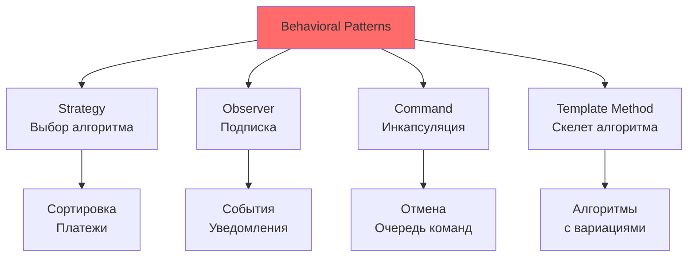
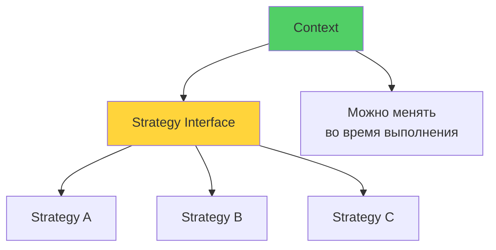

# 🎭 Урок 4: Behavioral Patterns Part 1 (Поведенческие паттерны)

## 🎯 Цели урока

После изучения этого урока вы сможете:
- ✅ Применять Strategy для выбора алгоритмов во время выполнения
- ✅ Использовать Observer для реализации системы уведомлений
- ✅ Реализовывать Command для инкапсуляции операций
- ✅ Создавать Template Method для определения скелета алгоритма

## 📖 Behavioral Patterns Part 1

Поведенческие паттерны определяют алгоритмы и распределение ответственностей между объектами. Они помогают организовать сложные взаимодействия и сделать систему более гибкой.

### 💡 Простыми словами

**Аналогия**: Как актеры взаимодействуют в театре?

- **Strategy** = выбор маршрута в навигаторе (разные алгоритмы)
- **Observer** = подписка на новости (уведомления)
- **Command** = кнопка на пульте (инкапсуляция команд)
- **Template Method** = рецепт с вариациями (общий алгоритм)

### 📊 Визуализация Behavioral Patterns



### 🎯 Когда использовать Behavioral Patterns?

1. **Нужно выбирать алгоритм** во время выполнения программы
2. **Объекты должны уведомлять** другие объекты об изменениях
3. **Операции нужно инкапсулировать** в объекты
4. **Есть общий алгоритм** с вариативными деталями реализации

## 🎯 Strategy Pattern

### 💡 Простыми словами

**Аналогия**: Выбор маршрута в навигаторе
- Нужно доехать из точки A в точку B
- Навигатор предлагает: быстрый, короткий, экономный (разные стратегии)
- Выбираете стратегию во время поездки, не при создании навигатора

### 📊 Визуализация Strategy



### Проблема
Нужно использовать разные алгоритмы для выполнения задачи, но выбор алгоритма должен происходить во время выполнения.

### Решение
```python
from abc import ABC, abstractmethod
from typing import List

# Стратегия
class SortStrategy(ABC):
    @abstractmethod
    def sort(self, data: List[int]) -> List[int]:
        pass

# Конкретные стратегии
class BubbleSortStrategy(SortStrategy):
    def sort(self, data: List[int]) -> List[int]:
        """Сортировка пузырьком - O(n²)"""
        data = data.copy()
        n = len(data)
        for i in range(n):
            for j in range(0, n - i - 1):
                if data[j] > data[j + 1]:
                    data[j], data[j + 1] = data[j + 1], data[j]
        return data

class QuickSortStrategy(SortStrategy):
    def sort(self, data: List[int]) -> List[int]:
        """Быстрая сортировка - O(n log n)"""
        if len(data) <= 1:
            return data.copy()
        
        pivot = data[len(data) // 2]
        left = [x for x in data if x < pivot]
        middle = [x for x in data if x == pivot]
        right = [x for x in data if x > pivot]
        
        return (self.sort(left) + middle + self.sort(right))

class MergeSortStrategy(SortStrategy):
    def sort(self, data: List[int]) -> List[int]:
        """Сортировка слиянием - O(n log n)"""
        if len(data) <= 1:
            return data.copy()
        
        mid = len(data) // 2
        left = self.sort(data[:mid])
        right = self.sort(data[mid:])
        
        return self._merge(left, right)
    
    def _merge(self, left: List[int], right: List[int]) -> List[int]:
        result = []
        i = j = 0
        
        while i < len(left) and j < len(right):
            if left[i] <= right[j]:
                result.append(left[i])
                i += 1
            else:
                result.append(right[j])
                j += 1
        
        result.extend(left[i:])
        result.extend(right[j:])
        return result

# Контекст
class SortContext:
    def __init__(self, strategy: SortStrategy):
        self._strategy = strategy
    
    def set_strategy(self, strategy: SortStrategy):
        self._strategy = strategy
    
    def sort_data(self, data: List[int]) -> List[int]:
        print(f"Используется стратегия: {self._strategy.__class__.__name__}")
        return self._strategy.sort(data)

# Использование
data = [64, 34, 25, 12, 22, 11, 90]

# Выбор стратегии в зависимости от размера данных
def choose_strategy(data_size: int) -> SortStrategy:
    if data_size < 10:
        return BubbleSortStrategy()  # Простая для малых данных
    elif data_size < 1000:
        return QuickSortStrategy()   # Быстрая для средних данных
    else:
        return MergeSortStrategy()   # Стабильная для больших данных

context = SortContext(choose_strategy(len(data)))
sorted_data = context.sort_data(data)
print(f"Исходные данные: {data}")
print(f"Отсортированные: {sorted_data}")
```

### Пример: Система оплаты
```python
class PaymentStrategy(ABC):
    @abstractmethod
    def pay(self, amount: float) -> bool:
        pass

class CreditCardPayment(PaymentStrategy):
    def __init__(self, card_number: str, cvv: str):
        self.card_number = card_number
        self.cvv = cvv
    
    def pay(self, amount: float) -> bool:
        print(f"💳 Оплата {amount}₽ кредитной картой *{self.card_number[-4:]}")
        # Имитация обработки платежа
        return True

class PayPalPayment(PaymentStrategy):
    def __init__(self, email: str):
        self.email = email
    
    def pay(self, amount: float) -> bool:
        print(f"🅿️ PayPal оплата {amount}₽ с аккаунта {self.email}")
        return True

class CryptoPayment(PaymentStrategy):
    def __init__(self, wallet_address: str, currency: str):
        self.wallet_address = wallet_address
        self.currency = currency
    
    def pay(self, amount: float) -> bool:
        print(f"₿ Крипто оплата {amount}₽ в {self.currency}")
        return True

class ShoppingCart:
    def __init__(self):
        self.items = []
        self.payment_strategy = None
    
    def add_item(self, item: str, price: float):
        self.items.append((item, price))
    
    def set_payment_method(self, strategy: PaymentStrategy):
        self.payment_strategy = strategy
    
    def checkout(self) -> bool:
        if not self.payment_strategy:
            print("❌ Не выбран способ оплаты")
            return False
        
        total = sum(price for _, price in self.items)
        print(f"🛒 Общая сумма заказа: {total}₽")
        
        return self.payment_strategy.pay(total)

# Использование
cart = ShoppingCart()
cart.add_item("Книга по паттернам", 1500)
cart.add_item("Python курс", 5000)

# Клиент выбирает способ оплаты
cart.set_payment_method(CreditCardPayment("4532123456789012", "123"))
cart.checkout()
```

### Когда использовать Strategy?

✅ **Плюсы:**
- **Гибкость** - алгоритмы можно менять во время выполнения
- **Расширяемость** - легко добавить новые стратегии
- **Тестируемость** - каждую стратегию можно тестировать отдельно
- **SRP** - каждая стратегия отвечает за один алгоритм

❌ **Минусы:**
- **Увеличение количества классов**
- **Клиент должен знать** о различиях между стратегиями

## 👁 Observer Pattern

### Проблема
Когда изменяется состояние одного объекта, нужно автоматически уведомить множество других объектов.

### Решение
```python
from abc import ABC, abstractmethod
from typing import List

# Наблюдатель
class Observer(ABC):
    @abstractmethod
    def update(self, subject: 'Subject') -> None:
        pass

# Субъект (наблюдаемый)
class Subject(ABC):
    def __init__(self):
        self._observers: List[Observer] = []
    
    def attach(self, observer: Observer) -> None:
        print(f"📝 Подписка: {observer.__class__.__name__}")
        self._observers.append(observer)
    
    def detach(self, observer: Observer) -> None:
        print(f"🗑️ Отписка: {observer.__class__.__name__}")
        self._observers.remove(observer)
    
    def notify(self) -> None:
        print("🔔 Уведомление всех наблюдателей...")
        for observer in self._observers:
            observer.update(self)

# Конкретный субъект
class WeatherStation(Subject):
    def __init__(self):
        super().__init__()
        self._temperature = 0
        self._humidity = 0
        self._pressure = 0
    
    @property
    def temperature(self):
        return self._temperature
    
    @property
    def humidity(self):
        return self._humidity
    
    @property
    def pressure(self):
        return self._pressure
    
    def set_measurements(self, temperature: float, humidity: float, pressure: float):
        print(f"🌡️ Новые показания: T={temperature}°C, H={humidity}%, P={pressure} мм рт.ст.")
        self._temperature = temperature
        self._humidity = humidity
        self._pressure = pressure
        self.notify()

# Конкретные наблюдатели
class CurrentConditionsDisplay(Observer):
    def update(self, weather_station: WeatherStation) -> None:
        print(f"📺 Текущие условия: {weather_station.temperature}°C, "
              f"влажность {weather_station.humidity}%")

class StatisticsDisplay(Observer):
    def __init__(self):
        self.temperatures = []
    
    def update(self, weather_station: WeatherStation) -> None:
        self.temperatures.append(weather_station.temperature)
        avg_temp = sum(self.temperatures) / len(self.temperatures)
        print(f"📊 Статистика: средняя температура {avg_temp:.1f}°C "
              f"(измерений: {len(self.temperatures)})")

class ForecastDisplay(Observer):
    def update(self, weather_station: WeatherStation) -> None:
        # Простой алгоритм прогноза
        if weather_station.pressure > 760:
            forecast = "☀️ Солнечно"
        elif weather_station.pressure > 750:
            forecast = "⛅ Переменная облачность"
        else:
            forecast = "🌧️ Дождь"
        
        print(f"🔮 Прогноз: {forecast}")

class MobileApp(Observer):
    def __init__(self, user_name: str):
        self.user_name = user_name
    
    def update(self, weather_station: WeatherStation) -> None:
        print(f"📱 Push-уведомление для {self.user_name}: "
              f"Температура {weather_station.temperature}°C")

# Использование
weather_station = WeatherStation()

# Создание наблюдателей
current_display = CurrentConditionsDisplay()
statistics_display = StatisticsDisplay()
forecast_display = ForecastDisplay()
mobile_app = MobileApp("Александр")

# Подписка на уведомления
weather_station.attach(current_display)
weather_station.attach(statistics_display)
weather_station.attach(forecast_display)
weather_station.attach(mobile_app)

# Изменение данных автоматически уведомляет всех наблюдателей
print("\n=== Первое измерение ===")
weather_station.set_measurements(25.0, 65, 755)

print("\n=== Второе измерение ===")
weather_station.set_measurements(27.0, 70, 765)

print("\n=== Отписка прогноза ===")
weather_station.detach(forecast_display)

print("\n=== Третье измерение ===")
weather_station.set_measurements(23.0, 90, 740)
```

### Python-специфичная реализация Observer
```python
import weakref
from typing import Set, Callable

class EventManager:
    """Простая реализация Observer через события"""
    
    def __init__(self):
        self._events: dict[str, Set[Callable]] = {}
    
    def subscribe(self, event_name: str, callback: Callable):
        """Подписка на событие"""
        if event_name not in self._events:
            self._events[event_name] = set()
        self._events[event_name].add(callback)
    
    def unsubscribe(self, event_name: str, callback: Callable):
        """Отписка от события"""
        if event_name in self._events:
            self._events[event_name].discard(callback)
    
    def emit(self, event_name: str, *args, **kwargs):
        """Отправка события"""
        if event_name in self._events:
            for callback in self._events[event_name].copy():  # Copy для безопасности
                try:
                    callback(*args, **kwargs)
                except Exception as e:
                    print(f"Ошибка в обработчике события {event_name}: {e}")

# Использование событий
def on_user_login(username: str):
    print(f"👤 Пользователь {username} вошел в систему")

def on_user_login_log(username: str):
    print(f"📝 [LOG] Login: {username}")

def on_user_login_analytics(username: str):
    print(f"📈 [ANALYTICS] User login event: {username}")

# Создание менеджера событий
events = EventManager()

# Подписка на событие
events.subscribe('user_login', on_user_login)
events.subscribe('user_login', on_user_login_log)
events.subscribe('user_login', on_user_login_analytics)

# Генерация события
events.emit('user_login', 'john_doe')
```

### Когда использовать Observer?

✅ **Плюсы:**
- **Слабая связанность** между субъектом и наблюдателями
- **Динамическая подписка** - можно добавлять/удалять наблюдателей во время выполнения
- **Broadcast коммуникация** - одно изменение уведомляет многих

❌ **Минусы:**
- **Утечки памяти** - наблюдатели могут не освобождаться
- **Неопределенный порядок** уведомлений
- **Сложность отладки** цепочек уведомлений

## ⚡ Command Pattern

### Проблема
Нужно инкапсулировать запрос как объект, что позволяет параметризовать клиентов с различными запросами, ставить запросы в очередь, логировать и поддерживать отмену операций.

### Решение
```python
from abc import ABC, abstractmethod
from typing import List, Optional
import time

# Команда
class Command(ABC):
    @abstractmethod
    def execute(self) -> None:
        pass
    
    @abstractmethod
    def undo(self) -> None:
        pass

# Получатель команды
class TextEditor:
    def __init__(self):
        self._content = ""
        self._cursor = 0
    
    @property
    def content(self) -> str:
        return self._content
    
    @property
    def cursor(self) -> int:
        return self._cursor
    
    def insert_text(self, text: str, position: Optional[int] = None) -> None:
        if position is None:
            position = self._cursor
        
        self._content = (self._content[:position] + 
                        text + 
                        self._content[position:])
        self._cursor = position + len(text)
        print(f"✏️ Вставлен текст: '{text}' в позицию {position}")
    
    def delete_text(self, position: int, length: int) -> str:
        deleted = self._content[position:position + length]
        self._content = (self._content[:position] + 
                        self._content[position + length:])
        self._cursor = position
        print(f"🗑️ Удален текст: '{deleted}' из позиции {position}")
        return deleted
    
    def set_cursor(self, position: int) -> None:
        self._cursor = max(0, min(position, len(self._content)))
        print(f"📍 Курсор перемещен в позицию {self._cursor}")
    
    def __str__(self) -> str:
        cursor_marker = '|'
        content_with_cursor = (self._content[:self._cursor] + 
                             cursor_marker + 
                             self._content[self._cursor:])
        return f"'{content_with_cursor}'"

# Конкретные команды
class InsertTextCommand(Command):
    def __init__(self, editor: TextEditor, text: str, position: Optional[int] = None):
        self._editor = editor
        self._text = text
        self._position = position if position is not None else editor.cursor
        self._executed = False
    
    def execute(self) -> None:
        if not self._executed:
            self._editor.insert_text(self._text, self._position)
            self._executed = True
    
    def undo(self) -> None:
        if self._executed:
            self._editor.delete_text(self._position, len(self._text))
            self._executed = False

class DeleteTextCommand(Command):
    def __init__(self, editor: TextEditor, position: int, length: int):
        self._editor = editor
        self._position = position
        self._length = length
        self._deleted_text = ""
        self._executed = False
    
    def execute(self) -> None:
        if not self._executed:
            self._deleted_text = self._editor.delete_text(self._position, self._length)
            self._executed = True
    
    def undo(self) -> None:
        if self._executed:
            self._editor.insert_text(self._deleted_text, self._position)
            self._executed = False

class MoveCursorCommand(Command):
    def __init__(self, editor: TextEditor, new_position: int):
        self._editor = editor
        self._new_position = new_position
        self._old_position = editor.cursor
        self._executed = False
    
    def execute(self) -> None:
        if not self._executed:
            self._old_position = self._editor.cursor
            self._editor.set_cursor(self._new_position)
            self._executed = True
    
    def undo(self) -> None:
        if self._executed:
            self._editor.set_cursor(self._old_position)
            self._executed = False

# Инвокер (вызывающий)
class EditorInvoker:
    def __init__(self):
        self._history: List[Command] = []
        self._current_command = -1
    
    def execute_command(self, command: Command) -> None:
        # Удаляем команды после текущей позиции (для корректной работы undo/redo)
        self._history = self._history[:self._current_command + 1]
        
        # Выполняем команду
        command.execute()
        
        # Добавляем в историю
        self._history.append(command)
        self._current_command += 1
        
        print(f"📚 История команд: {len(self._history)}")
    
    def undo(self) -> bool:
        if self._current_command >= 0:
            command = self._history[self._current_command]
            command.undo()
            self._current_command -= 1
            print(f"↶ Отменена команда")
            return True
        else:
            print("❌ Нечего отменять")
            return False
    
    def redo(self) -> bool:
        if self._current_command < len(self._history) - 1:
            self._current_command += 1
            command = self._history[self._current_command]
            command.execute()
            print(f"↷ Повторена команда")
            return True
        else:
            print("❌ Нечего повторять")
            return False

# Макрокоманды (составные команды)
class MacroCommand(Command):
    def __init__(self, commands: List[Command]):
        self._commands = commands
        self._executed = False
    
    def execute(self) -> None:
        if not self._executed:
            for command in self._commands:
                command.execute()
            self._executed = True
    
    def undo(self) -> None:
        if self._executed:
            # Отменяем в обратном порядке
            for command in reversed(self._commands):
                command.undo()
            self._executed = False

# Использование
editor = TextEditor()
invoker = EditorInvoker()

print("=== Создание документа ===")
print(f"Редактор: {editor}")

# Выполнение команд
insert_hello = InsertTextCommand(editor, "Hello", 0)
invoker.execute_command(insert_hello)
print(f"Редактор: {editor}")

insert_world = InsertTextCommand(editor, " World!", 5)
invoker.execute_command(insert_world)
print(f"Редактор: {editor}")

move_cursor = MoveCursorCommand(editor, 5)
invoker.execute_command(move_cursor)
print(f"Редактор: {editor}")

insert_beautiful = InsertTextCommand(editor, " Beautiful", 5)
invoker.execute_command(insert_beautiful)
print(f"Редактор: {editor}")

print("\n=== Отмена команд ===")
invoker.undo()  # Отменяем вставку " Beautiful"
print(f"Редактор: {editor}")

invoker.undo()  # Отменяем перемещение курсора
print(f"Редактор: {editor}")

print("\n=== Повтор команд ===")
invoker.redo()  # Повторяем перемещение курсора
print(f"Редактор: {editor}")

invoker.redo()  # Повторяем вставку " Beautiful"
print(f"Редактор: {editor}")

print("\n=== Макрокоманда ===")
# Создаем макрокоманду для форматирования текста
format_commands = [
    MoveCursorCommand(editor, 0),
    InsertTextCommand(editor, ">>> "),
    MoveCursorCommand(editor, len(editor.content)),
    InsertTextCommand(editor, " <<<")
]

format_macro = MacroCommand(format_commands)
invoker.execute_command(format_macro)
print(f"Редактор: {editor}")

print("\n=== Отмена макрокоманды ===")
invoker.undo()
print(f"Редактор: {editor}")
```

### Пример: Система домашней автоматизации
```python
# Получатели команд
class Light:
    def __init__(self, location: str):
        self.location = location
        self.is_on = False
    
    def turn_on(self):
        self.is_on = True
        print(f"💡 {self.location}: включен")
    
    def turn_off(self):
        self.is_on = False
        print(f"💡 {self.location}: выключен")

class GarageDoor:
    def __init__(self):
        self.is_open = False
    
    def open(self):
        if not self.is_open:
            self.is_open = True
            print("🚪 Гаражные ворота: открыты")
    
    def close(self):
        if self.is_open:
            self.is_open = False
            print("🚪 Гаражные ворота: закрыты")

class Stereo:
    def __init__(self):
        self.is_on = False
        self.volume = 0
    
    def turn_on(self):
        self.is_on = True
        print("🎵 Стерео: включено")
    
    def turn_off(self):
        self.is_on = False
        print("🎵 Стерео: выключено")
    
    def set_volume(self, volume: int):
        self.volume = volume
        print(f"🎵 Стерео: громкость {volume}")

# Команды для умного дома
class LightOnCommand(Command):
    def __init__(self, light: Light):
        self.light = light
    
    def execute(self):
        self.light.turn_on()
    
    def undo(self):
        self.light.turn_off()

class LightOffCommand(Command):
    def __init__(self, light: Light):
        self.light = light
    
    def execute(self):
        self.light.turn_off()
    
    def undo(self):
        self.light.turn_on()

class GarageDoorOpenCommand(Command):
    def __init__(self, garage_door: GarageDoor):
        self.garage_door = garage_door
    
    def execute(self):
        self.garage_door.open()
    
    def undo(self):
        self.garage_door.close()

class GarageDoorCloseCommand(Command):
    def __init__(self, garage_door: GarageDoor):
        self.garage_door = garage_door
    
    def execute(self):
        self.garage_door.close()
    
    def undo(self):
        self.garage_door.open()

class StereoOnWithVolumeCommand(Command):
    def __init__(self, stereo: Stereo, volume: int):
        self.stereo = stereo
        self.volume = volume
    
    def execute(self):
        self.stereo.turn_on()
        self.stereo.set_volume(self.volume)
    
    def undo(self):
        self.stereo.turn_off()

class StereoOffCommand(Command):
    def __init__(self, stereo: Stereo):
        self.stereo = stereo
    
    def execute(self):
        self.stereo.turn_off()
    
    def undo(self):
        self.stereo.turn_on()

# NoCommand паттерн (Null Object)
class NoCommand(Command):
    def execute(self):
        pass
    
    def undo(self):
        pass

# Пульт управления
class RemoteControl:
    def __init__(self):
        # 7 кнопок включения и выключения + undo
        self.on_commands = [NoCommand()] * 7
        self.off_commands = [NoCommand()] * 7
        self.undo_command = NoCommand()
    
    def set_command(self, slot: int, on_command: Command, off_command: Command):
        self.on_commands[slot] = on_command
        self.off_commands[slot] = off_command
    
    def on_button_pressed(self, slot: int):
        self.on_commands[slot].execute()
        self.undo_command = self.on_commands[slot]
    
    def off_button_pressed(self, slot: int):
        self.off_commands[slot].execute()
        self.undo_command = self.off_commands[slot]
    
    def undo_button_pressed(self):
        self.undo_command.undo()

# Сценарий использования
# Создание устройств
living_room_light = Light("Гостиная")
kitchen_light = Light("Кухня")
garage_door = GarageDoor()
stereo = Stereo()

# Создание команд
living_room_light_on = LightOnCommand(living_room_light)
living_room_light_off = LightOffCommand(living_room_light)
kitchen_light_on = LightOnCommand(kitchen_light)
kitchen_light_off = LightOffCommand(kitchen_light)
garage_door_open = GarageDoorOpenCommand(garage_door)
garage_door_close = GarageDoorCloseCommand(garage_door)
stereo_on_with_volume = StereoOnWithVolumeCommand(stereo, 11)
stereo_off = StereoOffCommand(stereo)

# Настройка пульта
remote = RemoteControl()
remote.set_command(0, living_room_light_on, living_room_light_off)
remote.set_command(1, kitchen_light_on, kitchen_light_off)
remote.set_command(2, garage_door_open, garage_door_close)
remote.set_command(3, stereo_on_with_volume, stereo_off)

# Использование пульта
print("=== Тестирование пульта ===")
remote.on_button_pressed(0)   # Включить свет в гостиной
remote.on_button_pressed(1)   # Включить свет на кухне
remote.off_button_pressed(1)  # Выключить свет на кухне
remote.undo_button_pressed()  # Отменить (включить свет на кухне)
```

### Когда использовать Command?

✅ **Плюсы:**
- **Отделяет объект, инициирующий операцию, от объекта, который ее выполняет**
- **Позволяет параметризовать объекты с операциями**
- **Поддерживает отмену операций**
- **Поддерживает логирование и транзакции**
- **Позволяет составлять сложные команды из простых**

❌ **Минусы:**
- **Увеличивает количество классов** в системе
- **Может усложнить код** для простых операций

## 📋 Template Method Pattern

### Проблема
У вас есть несколько классов, выполняющих похожие задачи с небольшими различиями. Хочется избежать дублирования кода.

### Решение
```python
from abc import ABC, abstractmethod
import time

# Абстрактный класс с Template Method
class DataProcessor(ABC):
    """Шаблонный метод для обработки данных"""
    
    def process_data(self) -> None:
        """Template Method - определяет скелет алгоритма"""
        print("🔄 Начинается обработка данных...")
        
        # Шаг 1: Загрузка данных
        raw_data = self.load_data()
        
        # Шаг 2: Валидация данных
        if self.validate_data(raw_data):
            # Шаг 3: Обработка данных
            processed_data = self.transform_data(raw_data)
            
            # Шаг 4: Сохранение результата
            self.save_data(processed_data)
            
            # Шаг 5: Уведомление (опциональный хук)
            self.notify_completion()
        else:
            print("❌ Данные не прошли валидацию")
        
        print("✅ Обработка данных завершена\n")
    
    # Абстрактные методы - должны быть реализованы в подклассах
    @abstractmethod
    def load_data(self) -> dict:
        """Загрузка данных из источника"""
        pass
    
    @abstractmethod
    def transform_data(self, data: dict) -> dict:
        """Преобразование данных"""
        pass
    
    @abstractmethod
    def save_data(self, data: dict) -> None:
        """Сохранение обработанных данных"""
        pass
    
    # Конкретные методы с реализацией по умолчанию
    def validate_data(self, data: dict) -> bool:
        """Базовая валидация - можно переопределить"""
        if not data:
            return False
        if not isinstance(data, dict):
            return False
        return True
    
    # Хук (опциональный метод)
    def notify_completion(self) -> None:
        """Хук для уведомления о завершении - по умолчанию ничего не делает"""
        pass

# Конкретная реализация для CSV файлов
class CSVDataProcessor(DataProcessor):
    def __init__(self, file_path: str):
        self.file_path = file_path
    
    def load_data(self) -> dict:
        print(f"📂 Загрузка CSV данных из {self.file_path}")
        # Имитация загрузки CSV
        time.sleep(0.1)
        return {
            "type": "csv",
            "records": [
                {"name": "Alice", "age": 30, "salary": 50000},
                {"name": "Bob", "age": 25, "salary": 45000},
                {"name": "Charlie", "age": 35, "salary": 60000}
            ]
        }
    
    def validate_data(self, data: dict) -> bool:
        # Расширенная валидация для CSV
        if not super().validate_data(data):
            return False
        
        if "records" not in data:
            print("❌ CSV: Отсутствуют записи")
            return False
        
        # Проверяем каждую запись
        for record in data["records"]:
            if not all(key in record for key in ["name", "age", "salary"]):
                print("❌ CSV: Неполные данные в записи")
                return False
        
        print("✅ CSV: Данные валидны")
        return True
    
    def transform_data(self, data: dict) -> dict:
        print("⚙️ CSV: Преобразование данных (добавление налога)")
        processed_records = []
        
        for record in data["records"]:
            processed_record = record.copy()
            # Добавляем расчет налога
            processed_record["tax"] = record["salary"] * 0.13
            processed_record["net_salary"] = record["salary"] - processed_record["tax"]
            processed_records.append(processed_record)
        
        return {
            "type": "processed_csv",
            "records": processed_records,
            "total_records": len(processed_records)
        }
    
    def save_data(self, data: dict) -> None:
        print(f"💾 CSV: Сохранение {data['total_records']} записей в базу данных")
        for record in data["records"]:
            print(f"   - {record['name']}: {record['net_salary']:.2f} руб. (после налогов)")
    
    def notify_completion(self) -> None:
        print("📧 CSV: Отправлено уведомление админу о завершении обработки")

# Конкретная реализация для API данных
class APIDataProcessor(DataProcessor):
    def __init__(self, api_endpoint: str):
        self.api_endpoint = api_endpoint
    
    def load_data(self) -> dict:
        print(f"🌐 Загрузка данных из API {self.api_endpoint}")
        time.sleep(0.2)  # Имитация сетевого запроса
        return {
            "type": "api",
            "users": [
                {"id": 1, "username": "john_doe", "email": "john@example.com", "active": True},
                {"id": 2, "username": "jane_smith", "email": "jane@example.com", "active": False},
                {"id": 3, "username": "bob_wilson", "email": "bob@example.com", "active": True}
            ],
            "meta": {"total": 3, "page": 1}
        }
    
    def validate_data(self, data: dict) -> bool:
        if not super().validate_data(data):
            return False
        
        if "users" not in data or "meta" not in data:
            print("❌ API: Неверная структура данных")
            return False
        
        print("✅ API: Данные валидны")
        return True
    
    def transform_data(self, data: dict) -> dict:
        print("⚙️ API: Преобразование данных (фильтрация активных пользователей)")
        active_users = [user for user in data["users"] if user["active"]]
        
        # Добавляем дополнительную обработку
        for user in active_users:
            user["display_name"] = user["username"].replace("_", " ").title()
            user["email_domain"] = user["email"].split("@")[1]
        
        return {
            "type": "processed_api",
            "active_users": active_users,
            "total_active": len(active_users),
            "original_total": data["meta"]["total"]
        }
    
    def save_data(self, data: dict) -> None:
        print(f"💾 API: Сохранение {data['total_active']} активных пользователей")
        for user in data["active_users"]:
            print(f"   - {user['display_name']} ({user['email_domain']})")
    
    def notify_completion(self) -> None:
        print("🔔 API: Push-уведомление о синхронизации пользователей")

# Конкретная реализация для XML данных (минимальная)
class XMLDataProcessor(DataProcessor):
    def __init__(self, xml_path: str):
        self.xml_path = xml_path
    
    def load_data(self) -> dict:
        print(f"📄 Загрузка XML данных из {self.xml_path}")
        return {
            "type": "xml",
            "products": [
                {"id": "P001", "name": "Laptop", "price": 1500, "category": "Electronics"},
                {"id": "P002", "name": "Mouse", "price": 25, "category": "Electronics"}
            ]
        }
    
    def transform_data(self, data: dict) -> dict:
        print("⚙️ XML: Преобразование данных (конвертация валюты)")
        usd_to_rub = 75.0
        
        for product in data["products"]:
            product["price_rub"] = product["price"] * usd_to_rub
        
        return data
    
    def save_data(self, data: dict) -> None:
        print(f"💾 XML: Экспорт {len(data['products'])} товаров в каталог")
        for product in data["products"]:
            print(f"   - {product['name']}: {product['price_rub']:.2f} руб.")

# Демонстрация Template Method
processors = [
    CSVDataProcessor("employees.csv"),
    APIDataProcessor("https://api.company.com/users"),
    XMLDataProcessor("products.xml")
]

for processor in processors:
    print(f"{'='*50}")
    print(f"Обработчик: {processor.__class__.__name__}")
    print(f"{'='*50}")
    processor.process_data()
```

### Пример: Система сборки проектов
```python
class BuildProcess(ABC):
    """Template Method для сборки разных типов проектов"""
    
    def build(self) -> bool:
        """Шаблонный метод сборки"""
        print(f"🔨 Начало сборки {self.get_project_type()} проекта")
        
        try:
            # Обязательные шаги
            self.clean_build_directory()
            self.download_dependencies()
            self.compile_source()
            self.run_tests()
            
            # Опциональные шаги
            if self.should_generate_docs():
                self.generate_documentation()
            
            if self.should_create_package():
                self.create_package()
            
            self.finalize_build()
            print("✅ Сборка завершена успешно")
            return True
            
        except Exception as e:
            print(f"❌ Ошибка сборки: {e}")
            self.cleanup_on_failure()
            return False
    
    # Абстрактные методы
    @abstractmethod
    def get_project_type(self) -> str:
        pass
    
    @abstractmethod
    def download_dependencies(self) -> None:
        pass
    
    @abstractmethod
    def compile_source(self) -> None:
        pass
    
    @abstractmethod
    def create_package(self) -> None:
        pass
    
    # Методы с реализацией по умолчанию
    def clean_build_directory(self) -> None:
        print("🗑️ Очистка директории сборки")
    
    def run_tests(self) -> None:
        print("🧪 Запуск тестов")
    
    def finalize_build(self) -> None:
        print("🏁 Финализация сборки")
    
    # Хуки
    def should_generate_docs(self) -> bool:
        return True
    
    def should_create_package(self) -> bool:
        return True
    
    def generate_documentation(self) -> None:
        print("📚 Генерация документации")
    
    def cleanup_on_failure(self) -> None:
        print("🧹 Очистка после ошибки")

class PythonBuild(BuildProcess):
    def get_project_type(self) -> str:
        return "Python"
    
    def download_dependencies(self) -> None:
        print("📦 pip install -r requirements.txt")
    
    def compile_source(self) -> None:
        print("🐍 Компиляция Python байт-кода")
    
    def create_package(self) -> None:
        print("📦 python setup.py sdist bdist_wheel")

class JavaBuild(BuildProcess):
    def get_project_type(self) -> str:
        return "Java"
    
    def download_dependencies(self) -> None:
        print("📦 mvn dependency:resolve")
    
    def compile_source(self) -> None:
        print("☕ javac -cp ... *.java")
    
    def create_package(self) -> None:
        print("📦 jar cf app.jar *.class")
    
    def should_generate_docs(self) -> bool:
        return False  # Отключаем генерацию документации для Java

class NodeJSBuild(BuildProcess):
    def get_project_type(self) -> str:
        return "Node.js"
    
    def download_dependencies(self) -> None:
        print("📦 npm install")
    
    def compile_source(self) -> None:
        print("🟢 tsc --build")  # TypeScript компиляция
    
    def create_package(self) -> None:
        print("📦 npm pack")

# Использование
builds = [
    PythonBuild(),
    JavaBuild(),
    NodeJSBuild()
]

for build_process in builds:
    result = build_process.build()
    print(f"Результат: {'Успех' if result else 'Неудача'}\n")
```

### Когда использовать Template Method?

✅ **Плюсы:**
- **Переиспользование кода** - общий алгоритм в базовом классе
- **Контроль над алгоритмом** - подклассы не могут изменить структуру
- **Гибкость** - подклассы могут переопределить отдельные шаги
- **Инверсия контроля** - фреймворк вызывает код приложения

❌ **Минусы:**
- **Нарушение LSP** - подклассы могут ограничивать поведение базового класса
- **Сложность поддержки** - изменения в базовом классе влияют на все подклассы
- **Жесткая структура** - трудно изменить порядок шагов

---

## 🛠 Сравнение Behavioral Patterns Part 1

| Паттерн | Назначение | Когда использовать | Пример |
|---------|------------|-------------------|---------|
| **Strategy** | Выбор алгоритма во время выполнения | Множество способов выполнить задачу | Сортировка, оплата, сжатие |
| **Observer** | Уведомление о изменениях | Один объект изменяется, многие реагируют | События UI, уведомления, логи |
| **Command** | Инкапсуляция операций | Отложенное выполнение, undo/redo, очереди | Редакторы, умный дом, макросы |
| **Template Method** | Скелет алгоритма | Общий алгоритм с вариативными деталями | Сборка, обработка данных, фреймворки |

## 🎮 Практические упражнения

### Упражнение 1: Реализация паттернов
**Задание:** Создайте систему уведомлений для интернет-магазина, используя все изученные паттерны.

### Упражнение 2: Выбор подходящего паттерна
**Задание:** Для каждой ситуации выберите наиболее подходящий поведенческий паттерн:

1. **Игровая система скиллов** - разные способы нанести урон
2. **Система логирования** - уведомления о событиях в разные места
3. **Игровые команды** - возможность отмены действий
4. **Обработка HTTP запросов** - общий pipeline с кастомизацией

## 🎯 Ключевые выводы

1. **Strategy** позволяет менять алгоритмы во время выполнения
2. **Observer** обеспечивает слабую связанность при уведомлениях
3. **Command** превращает операции в объекты первого класса
4. **Template Method** определяет скелет алгоритма в базовом классе

## 🚀 Следующие шаги

Теперь вы готовы изучить **[Behavioral Patterns Part 2](05-behavioral-patterns-2.md)** - остальные поведенческие паттерны: State, Iterator, Mediator и Chain of Responsibility!

---

!!! tip "Практический совет"
    Поведенческие паттерны часто используются вместе. Например, Observer + Command для системы событий с отменой операций.

!!! info "Дополнительные ресурсы"
    - [Behavioral Patterns Overview](https://refactoring.guru/design-patterns/behavioral-patterns)
    - [Python Behavioral Patterns](https://python-patterns.guide/behavioral/)

## 🧪 Проверьте свои знания: Behavioral Patterns Part 1

<div class="quiz-container" id="behavioral-patterns-1-quiz">
<script type="application/json">
{
  "title": "Behavioral Patterns Part 1",
  "description": "Проверьте понимание Strategy, Observer, Command и Template Method",
  "icon": "🎭",
  "questions": [
    {
      "question": "Какой паттерн позволяет выбирать алгоритм во время выполнения?",
      "type": "single",
      "points": 1,
      "options": [
        {"text": "Strategy", "correct": true},
        {"text": "Observer", "correct": false},
        {"text": "Command", "correct": false},
        {"text": "Template Method", "correct": false}
      ],
      "explanation": "Strategy инкапсулирует алгоритмы и позволяет их взаимозаменяемость"
    },
    {
      "question": "Что обеспечивает Observer паттерн?",
      "type": "multiple",
      "points": 2,
      "options": [
        {"text": "Слабую связанность между объектами", "correct": true},
        {"text": "Автоматические уведомления об изменениях", "correct": true},
        {"text": "Возможность отмены операций", "correct": false},
        {"text": "Выбор алгоритма", "correct": false},
        {"text": "Динамическую подписку на события", "correct": true}
      ],
      "explanation": "Observer обеспечивает слабую связанность и систему уведомлений"
    },
    {
      "question": "Когда использовать Command паттерн?",
      "type": "single",
      "points": 1,
      "options": [
        {"text": "Когда нужна отмена операций", "correct": true},
        {"text": "Когда нужно уведомить об изменениях", "correct": false},
        {"text": "Когда нужен выбор алгоритма", "correct": false},
        {"text": "Когда есть общий алгоритм", "correct": false}
      ],
      "explanation": "Command инкапсулирует операции и поддерживает undo/redo"
    },
    {
      "question": "Что такое Template Method?",
      "type": "single",
      "points": 1,
      "options": [
        {"text": "Скелет алгоритма с переменными шагами", "correct": true},
        {"text": "Способ уведомления объектов", "correct": false},
        {"text": "Инкапсуляция команд", "correct": false},
        {"text": "Выбор стратегии", "correct": false}
      ],
      "explanation": "Template Method определяет скелет алгоритма, позволяя подклассам переопределить шаги"
    },
    {
      "question": "Преимущества Strategy паттерна:",
      "type": "multiple",
      "points": 2,
      "options": [
        {"text": "Возможность менять алгоритм в runtime", "correct": true},
        {"text": "Легкое добавление новых алгоритмов", "correct": true},
        {"text": "Каждый алгоритм можно тестировать отдельно", "correct": true},
        {"text": "Автоматические уведомления", "correct": false},
        {"text": "Поддержка отмены операций", "correct": false}
      ],
      "explanation": "Strategy обеспечивает гибкость в выборе и расширении алгоритмов"
    },
    {
      "question": "Какой паттерн лучше для системы undo/redo?",
      "type": "single",
      "points": 1,
      "options": [
        {"text": "Strategy", "correct": false},
        {"text": "Observer", "correct": false},
        {"text": "Command", "correct": true},
        {"text": "Template Method", "correct": false}
      ],
      "explanation": "Command превращает операции в объекты, что позволяет их отменять"
    },
    {
      "question": "Что такое 'хук' в Template Method?",
      "type": "single",
      "points": 1,
      "options": [
        {"text": "Опциональный метод, который можно переопределить", "correct": true},
        {"text": "Обязательный абстрактный метод", "correct": false},
        {"text": "Метод уведомления наблюдателей", "correct": false},
        {"text": "Инкапсулированная команда", "correct": false}
      ],
      "explanation": "Хук - это метод с пустой реализацией по умолчанию, который подклассы могут переопределить"
    },
    {
      "question": "Проблемы Observer паттерна:",
      "type": "multiple",
      "points": 2,
      "options": [
        {"text": "Утечки памяти из-за сильных ссылок", "correct": true},
        {"text": "Неопределенный порядок уведомлений", "correct": true},
        {"text": "Сложность отладки цепочек уведомлений", "correct": true},
        {"text": "Невозможность отмены операций", "correct": false},
        {"text": "Жесткая связанность", "correct": false}
      ],
      "explanation": "Observer может создавать проблемы с памятью и отладкой"
    },
    {
      "question": "Какой паттерн использует инверсию контроля?",
      "type": "single",
      "points": 1,
      "options": [
        {"text": "Strategy", "correct": false},
        {"text": "Observer", "correct": false},
        {"text": "Command", "correct": false},
        {"text": "Template Method", "correct": true}
      ],
      "explanation": "В Template Method фреймворк (базовый класс) вызывает код приложения (подклассов)"
    },
    {
      "question": "Когда НЕ стоит использовать Command?",
      "type": "single",
      "points": 1,
      "options": [
        {"text": "Для простых операций без дополнительной логики", "correct": true},
        {"text": "Когда нужна отмена операций", "correct": false},
        {"text": "Для реализации макрокоманд", "correct": false},
        {"text": "Для логирования операций", "correct": false}
      ],
      "explanation": "Command может усложнить код для простых операций, где достаточно прямого вызова метода"
    }
  ]
}
</script>
</div>

## 💻 Практическое задание: Система управления задачами

### 🎮 Интерактивное упражнение: Strategy Pattern

Попробуйте реализовать Strategy для разных алгоритмов сортировки:

{{ code_input_form(
    exercise_id="strategy_pattern_01",
    initial_code="""from abc import ABC, abstractmethod
from typing import List

# TODO: Создайте абстрактный класс SortStrategy
class SortStrategy(ABC):
    @abstractmethod
    def sort(self, data: List[int]) -> List[int]:
        pass

# TODO: Реализуйте BubbleSortStrategy и QuickSortStrategy

# TODO: Создайте класс Sorter, который использует стратегию

# Ваш код здесь:
""",
    placeholder="Реализуйте Strategy Pattern для сортировки...",
    use_pyodide=True,
    test_cases=[
        {
            "code": """
# Test 1: BubbleSortStrategy существует
assert 'BubbleSortStrategy' in globals(), "Создайте класс BubbleSortStrategy"
            """,
            "description": "Класс BubbleSortStrategy должен существовать"
        },
        {
            "code": """
# Test 2: QuickSortStrategy существует
assert 'QuickSortStrategy' in globals(), "Создайте класс QuickSortStrategy"
            """,
            "description": "Класс QuickSortStrategy должен существовать"
        },
        {
            "code": """
# Test 3: Sorter может менять стратегию
data = [3, 1, 4, 1, 5, 9, 2, 6]
sorter = Sorter(BubbleSortStrategy())
result1 = sorter.sort(data.copy())
sorter.set_strategy(QuickSortStrategy())
result2 = sorter.sort(data.copy())
assert result1 == result2 == [1, 1, 2, 3, 4, 5, 6, 9], "Обе стратегии должны сортировать корректно"
            """,
            "description": "Sorter может менять стратегию во время выполнения"
        }
    ]
) }}

!!! tip "Подсказка"
    Создайте абстрактный класс `SortStrategy` с методом `sort()`. Реализуйте две стратегии. Класс `Sorter` должен принимать стратегию и иметь метод `set_strategy()` для смены алгоритма.

---

## 💻 Практическое задание: Система управления задачами

{{ create_exercise_form(
    "behavioral_patterns_1_task_system",
    "Реализация системы управления задачами с Behavioral паттернами",
    "Создайте систему управления задачами, применив все изученные поведенческие паттерны для создания гибкой и функциональной архитектуры.",
    """from abc import ABC, abstractmethod
from typing import List, Dict, Optional
from datetime import datetime
from enum import Enum

# Задание: Создать систему управления задачами с поведенческими паттернами

# 1. STRATEGY PATTERN для разных способов сортировки задач
class TaskSortStrategy(ABC):
    @abstractmethod
    def sort(self, tasks: List['Task']) -> List['Task']:
        pass

class PrioritySortStrategy(TaskSortStrategy):
    def sort(self, tasks: List['Task']) -> List['Task']:
        # TODO: Сортировка по приоритету
        pass

class DateSortStrategy(TaskSortStrategy):
    def sort(self, tasks: List['Task']) -> List['Task']:
        # TODO: Сортировка по дате создания
        pass

class TaskSorter:
    def __init__(self, strategy: TaskSortStrategy):
        self._strategy = strategy
    
    def set_strategy(self, strategy: TaskSortStrategy):
        self._strategy = strategy
    
    def sort_tasks(self, tasks: List['Task']) -> List['Task']:
        return self._strategy.sort(tasks)

# 2. OBSERVER PATTERN для уведомлений о изменениях задач
class TaskObserver(ABC):
    @abstractmethod
    def task_created(self, task: 'Task'):
        pass
    
    @abstractmethod
    def task_completed(self, task: 'Task'):
        pass
    
    @abstractmethod
    def task_updated(self, task: 'Task'):
        pass

class EmailNotifier(TaskObserver):
    def task_created(self, task: 'Task'):
        # TODO: Отправка email о создании задачи
        pass
    
    def task_completed(self, task: 'Task'):
        # TODO: Отправка email о завершении задачи
        pass
    
    def task_updated(self, task: 'Task'):
        # TODO: Отправка email об обновлении задачи
        pass

class LogNotifier(TaskObserver):
    def task_created(self, task: 'Task'):
        # TODO: Логирование создания задачи
        pass
    
    def task_completed(self, task: 'Task'):
        # TODO: Логирование завершения задачи
        pass
    
    def task_updated(self, task: 'Task'):
        # TODO: Логирование обновления задачи
        pass

# 3. COMMAND PATTERN для операций с задачами
class TaskCommand(ABC):
    @abstractmethod
    def execute(self) -> None:
        pass
    
    @abstractmethod
    def undo(self) -> None:
        pass

class CreateTaskCommand(TaskCommand):
    def __init__(self, task_manager: 'TaskManager', title: str, description: str):
        self.task_manager = task_manager
        self.title = title
        self.description = description
        self.created_task = None
    
    def execute(self) -> None:
        # TODO: Создать задачу
        pass
    
    def undo(self) -> None:
        # TODO: Удалить созданную задачу
        pass

class CompleteTaskCommand(TaskCommand):
    def __init__(self, task: 'Task'):
        self.task = task
        self.previous_status = None
    
    def execute(self) -> None:
        # TODO: Завершить задачу
        pass
    
    def undo(self) -> None:
        # TODO: Вернуть предыдущий статус
        pass

class TaskInvoker:
    def __init__(self):
        self._history: List[TaskCommand] = []
        self._current_command = -1
    
    def execute_command(self, command: TaskCommand):
        # TODO: Выполнить команду и добавить в историю
        pass
    
    def undo(self) -> bool:
        # TODO: Отменить последнюю команду
        pass
    
    def redo(self) -> bool:
        # TODO: Повторить отмененную команду
        pass

# 4. TEMPLATE METHOD для разных типов отчетов
class ReportGenerator(ABC):
    def generate_report(self, tasks: List['Task']) -> str:
        '''Template Method для генерации отчетов'''
        # TODO: Реализовать общий алгоритм генерации отчета
        # 1. Подготовить данные
        # 2. Отфильтровать задачи
        # 3. Отформатировать заголовок
        # 4. Отформатировать содержимое
        # 5. Добавить подвал
        pass
    
    @abstractmethod
    def filter_tasks(self, tasks: List['Task']) -> List['Task']:
        pass
    
    @abstractmethod
    def format_header(self) -> str:
        pass
    
    @abstractmethod
    def format_task(self, task: 'Task') -> str:
        pass
    
    def format_footer(self) -> str:
        '''Хук - можно переопределить'''
        return f"\\nОтчет создан: {datetime.now().strftime('%Y-%m-%d %H:%M:%S')}"

class CompletedTasksReport(ReportGenerator):
    def filter_tasks(self, tasks: List['Task']) -> List['Task']:
        # TODO: Фильтровать только завершенные задачи
        pass
    
    def format_header(self) -> str:
        return "=== ОТЧЕТ ПО ЗАВЕРШЕННЫМ ЗАДАЧАМ ==="
    
    def format_task(self, task: 'Task') -> str:
        # TODO: Форматировать задачу для отчета
        pass

class OverdueTasksReport(ReportGenerator):
    def filter_tasks(self, tasks: List['Task']) -> List['Task']:
        # TODO: Фильтровать просроченные задачи
        pass
    
    def format_header(self) -> str:
        return "=== ОТЧЕТ ПО ПРОСРОЧЕННЫМ ЗАДАЧАМ ==="
    
    def format_task(self, task: 'Task') -> str:
        # TODO: Форматировать просроченную задачу
        pass

# Основные классы системы
class TaskStatus(Enum):
    TODO = "todo"
    IN_PROGRESS = "in_progress"
    COMPLETED = "completed"

class TaskPriority(Enum):
    LOW = 1
    MEDIUM = 2
    HIGH = 3

class Task:
    def __init__(self, title: str, description: str = "", priority: TaskPriority = TaskPriority.MEDIUM):
        self.id = self._generate_id()
        self.title = title
        self.description = description
        self.priority = priority
        self.status = TaskStatus.TODO
        self.created_at = datetime.now()
        self.completed_at = None
        self.due_date = None
    
    def _generate_id(self) -> str:
        import uuid
        return str(uuid.uuid4())[:8]
    
    def complete(self):
        self.status = TaskStatus.COMPLETED
        self.completed_at = datetime.now()
    
    def is_overdue(self) -> bool:
        return (self.due_date and 
                datetime.now() > self.due_date and 
                self.status != TaskStatus.COMPLETED)
    
    def __str__(self):
        status_emoji = {"todo": "📋", "in_progress": "⏳", "completed": "✅"}
        priority_emoji = {1: "🔵", 2: "🟡", 3: "🔴"}
        return f"{status_emoji[self.status.value]} [{priority_emoji[self.priority.value]}] {self.title}"

class TaskManager:
    def __init__(self):
        self.tasks: List[Task] = []
        self.observers: List[TaskObserver] = []
        self.sorter = TaskSorter(PrioritySortStrategy())
        self.invoker = TaskInvoker()
    
    def add_observer(self, observer: TaskObserver):
        self.observers.append(observer)
    
    def remove_observer(self, observer: TaskObserver):
        if observer in self.observers:
            self.observers.remove(observer)
    
    def _notify_task_created(self, task: Task):
        for observer in self.observers:
            observer.task_created(task)
    
    def _notify_task_completed(self, task: Task):
        for observer in self.observers:
            observer.task_completed(task)
    
    def _notify_task_updated(self, task: Task):
        for observer in self.observers:
            observer.task_updated(task)
    
    def create_task(self, title: str, description: str = "") -> Task:
        # TODO: Создать задачу и уведомить наблюдателей
        pass
    
    def get_sorted_tasks(self, strategy: TaskSortStrategy = None) -> List[Task]:
        # TODO: Получить отсортированные задачи
        pass
    
    def generate_report(self, report_type: ReportGenerator) -> str:
        # TODO: Сгенерировать отчет
        pass

# Демонстрация работы системы
if __name__ == "__main__":
    print("=== Система управления задачами ===\\n")
    
    # Создание менеджера задач
    task_manager = TaskManager()
    
    # Добавление наблюдателей
    email_notifier = EmailNotifier()
    log_notifier = LogNotifier()
    task_manager.add_observer(email_notifier)
    task_manager.add_observer(log_notifier)
    
    # Создание задач через Command
    create_cmd1 = CreateTaskCommand(task_manager, "Изучить паттерны", "Прочитать главу про Behavioral Patterns")
    create_cmd2 = CreateTaskCommand(task_manager, "Написать код", "Реализовать систему задач")
    
    task_manager.invoker.execute_command(create_cmd1)
    task_manager.invoker.execute_command(create_cmd2)
    
    # Демонстрация Strategy
    print("\\n=== Сортировка задач ===")
    priority_tasks = task_manager.get_sorted_tasks(PrioritySortStrategy())
    date_tasks = task_manager.get_sorted_tasks(DateSortStrategy())
    
    # Демонстрация Template Method
    print("\\n=== Генерация отчетов ===")
    completed_report = task_manager.generate_report(CompletedTasksReport())
    overdue_report = task_manager.generate_report(OverdueTasksReport())
    
    # Демонстрация Command undo/redo
    print("\\n=== Отмена и повтор операций ===")
    task_manager.invoker.undo()  # Отменить создание последней задачи
    task_manager.invoker.redo()  # Повторить создание задачи
    
    print("\\n🎉 Все поведенческие паттерны успешно реализованы!")

# TODO: Расширьте систему:
# - Добавьте больше стратегий сортировки
# - Реализуйте веб-уведомления (еще один Observer)
# - Создайте составные команды (MacroCommand)
# - Добавьте больше типов отчетов
# - Реализуйте сохранение/загрузку задач""",
    [
        "Реализовать Strategy паттерн для разных способов сортировки задач",
        "Применить Observer паттерн для системы уведомлений о изменениях",
        "Использовать Command паттерн для операций с поддержкой undo/redo",
        "Создать Template Method для генерации разных типов отчетов",
        "Интегрировать все паттерны в единую систему управления задачами",
        "Продемонстрировать работу системы с примерами использования",
        "Написать тесты для всех реализованных паттернов"
    ]
) }}


