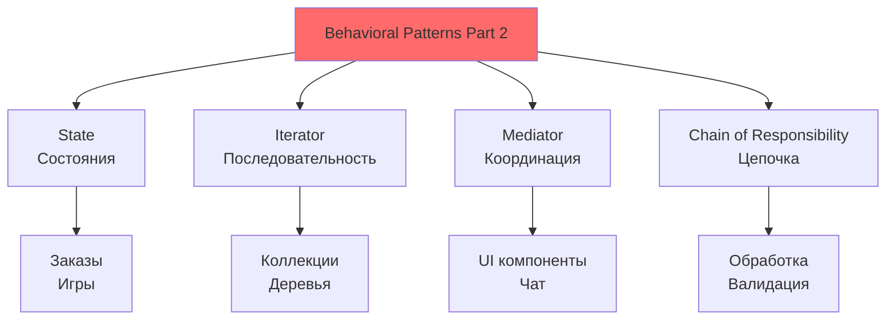
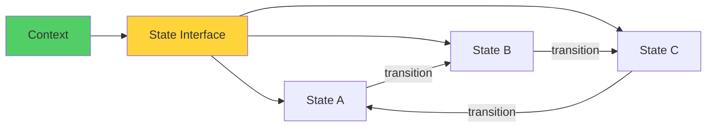

# 🧩 Урок 5: Behavioral Patterns Part 2 (Состояние, Итератор, Посредник, Цепочка)

## 🎯 Цели урока

После изучения этого урока вы сможете:
- ✅ Применять State для управления состояниями объектов
- ✅ Использовать Iterator для последовательного доступа к элементам
- ✅ Реализовывать Mediator для снижения связности между компонентами
- ✅ Создавать Chain of Responsibility для обработки запросов

## 📖 Behavioral Patterns Part 2

Продолжаем изучение поведенческих паттернов, которые помогают организовать сложные взаимодействия между объектами и управлять их поведением.

### 💡 Простыми словами

**Аналогия**: Продолжаем театр взаимодействий

- **State** = светофор (разные состояния, разное поведение)
- **Iterator** = перелистывание страниц (последовательный доступ)
- **Mediator** = диспетчер такси (координация без прямых связей)
- **Chain of Responsibility** = цепочка обработки (как эскалация в поддержке)

### 📊 Визуализация Behavioral Patterns Part 2



### 🎯 Когда использовать эти паттерны?

1. **Объект имеет множество состояний** с разным поведением
2. **Нужно обеспечить последовательный доступ** к элементам коллекции
3. **Между объектами слишком много зависимостей**
4. **Запросы должны обрабатываться** разными объектами в зависимости от условий

## 🔄 State Pattern

### 💡 Простыми словами

**Аналогия**: Светофор
- Красный свет (состояние 1) - остановиться
- Желтый свет (состояние 2) - приготовиться
- Зеленый свет (состояние 3) - ехать
- Каждое состояние имеет свое поведение

### 📊 Визуализация State



### Проблема
Объект должен менять свое поведение в зависимости от внутреннего состояния, но нельзя использовать множество условных операторов.

### Решение
```python
from abc import ABC, abstractmethod

# Состояние
class OrderState(ABC):
    @abstractmethod
    def handle_payment(self, order: 'Order') -> None:
        pass

    @abstractmethod
    def cancel_order(self, order: 'Order') -> None:
        pass

    @abstractmethod
    def ship_order(self, order: 'Order') -> None:
        pass

# Конкретные состояния
class PendingState(OrderState):
    def handle_payment(self, order: 'Order') -> None:
        print("💳 Оплата обработана. Заказ переходит в статус 'Оплачен'")
        order.set_state(PaidState())

    def cancel_order(self, order: 'Order') -> None:
        print("❌ Заказ отменен")
        order.set_state(CancelledState())

    def ship_order(self, order: 'Order') -> None:
        print("🚫 Невозможно отправить неоплаченный заказ")

class PaidState(OrderState):
    def handle_payment(self, order: 'Order') -> None:
        print("💰 Заказ уже оплачен")

    def cancel_order(self, order: 'Order') -> None:
        print("🔄 Оформляется возврат средств. Заказ отменен")
        order.set_state(CancelledState())

    def ship_order(self, order: 'Order') -> None:
        print("📦 Заказ отправлен")
        order.set_state(ShippedState())

class ShippedState(OrderState):
    def handle_payment(self, order: 'Order') -> None:
        print("📦 Заказ уже отправлен")

    def cancel_order(self, order: 'Order') -> None:
        print("🚫 Невозможно отменить отправленный заказ")

    def ship_order(self, order: 'Order') -> None:
        print("📦 Заказ уже отправлен")

class CancelledState(OrderState):
    def handle_payment(self, order: 'Order') -> None:
        print("❌ Заказ отменен")

    def cancel_order(self, order: 'Order') -> None:
        print("❌ Заказ уже отменен")

    def ship_order(self, order: 'Order') -> None:
        print("❌ Невозможно отправить отмененный заказ")

# Контекст
class Order:
    def __init__(self, order_id: str):
        self.order_id = order_id
        self.state: OrderState = PendingState()

    def set_state(self, state: OrderState) -> None:
        self.state = state
        print(f"📋 Заказ {self.order_id}: состояние изменено на {type(state).__name__}")

    def pay(self) -> None:
        self.state.handle_payment(self)

    def cancel(self) -> None:
        self.state.cancel_order(self)

    def ship(self) -> None:
        self.state.ship_order(self)

# Использование
order = Order("ORD-001")
order.pay()      # Оплата обработана
order.ship()     # Заказ отправлен
order.cancel()   # Невозможно отменить отправленный заказ
```

### Пример: Система управления документами

```python
# Состояния документа
class DocumentState(ABC):
    @abstractmethod
    def edit(self, document: 'Document') -> None:
        pass

    @abstractmethod
    def review(self, document: 'Document') -> None:
        pass

    @abstractmethod
    def publish(self, document: 'Document') -> None:
        pass

class DraftState(DocumentState):
    def edit(self, document: 'Document') -> None:
        print("✏️  Документ редактируется")

    def review(self, document: 'Document') -> None:
        print("📝 Документ отправлен на ревью")
        document.set_state(ReviewState())

    def publish(self, document: 'Document') -> None:
        print("🚫 Невозможно опубликовать черновик")

class ReviewState(DocumentState):
    def edit(self, document: 'Document') -> None:
        print("🔄 Документ возвращен на доработку")
        document.set_state(DraftState())

    def review(self, document: 'Document') -> None:
        print("✅ Документ одобрен")
        document.set_state(ApprovedState())

    def publish(self, document: 'Document') -> None:
        print("🚫 Сначала нужно одобрить документ")

class ApprovedState(DocumentState):
    def edit(self, document: 'Document') -> None:
        print("🔄 Документ возвращен на доработку")
        document.set_state(DraftState())

    def review(self, document: 'Document') -> None:
        print("✅ Документ уже одобрен")

    def publish(self, document: 'Document') -> None:
        print("📢 Документ опубликован")
        document.set_state(PublishedState())

class PublishedState(DocumentState):
    def edit(self, document: 'Document') -> None:
        print("📝 Создается новая версия документа")
        document.set_state(DraftState())

    def review(self, document: 'Document') -> None:
        print("📄 Опубликованный документ не нуждается в ревью")

    def publish(self, document: 'Document') -> None:
        print("📄 Документ уже опубликован")

# Документ
class Document:
    def __init__(self, title: str):
        self.title = title
        self.state: DocumentState = DraftState()
        self.version = 1

    def set_state(self, state: DocumentState) -> None:
        self.state = state
        print(f"📋 {self.title}: состояние изменено на {type(state).__name__}")

    def edit(self) -> None:
        self.state.edit(self)

    def review(self) -> None:
        self.state.review(self)

    def publish(self) -> None:
        self.state.publish(self)

# Использование
doc = Document("Руководство пользователя")
doc.edit()      # Документ редактируется
doc.review()    # Документ отправлен на ревью
doc.publish()   # Сначала нужно одобрить
doc.review()    # Документ одобрен
doc.publish()   # Документ опубликован
```

## 🔁 Iterator Pattern

### Проблема
Нужно обеспечить последовательный доступ к элементам коллекции, не раскрывая ее внутреннюю структуру.

### Решение
```python
from abc import ABC, abstractmethod
from typing import Any, Iterator as IteratorType

# Итератор
class Iterator(ABC):
    @abstractmethod
    def has_next(self) -> bool:
        pass

    @abstractmethod
    def next(self) -> Any:
        pass

# Конкретный итератор
class BookIterator(Iterator):
    def __init__(self, books: list):
        self.books = books
        self.position = 0

    def has_next(self) -> bool:
        return self.position < len(self.books)

    def next(self) -> Any:
        if self.has_next():
            book = self.books[self.position]
            self.position += 1
            return book
        raise StopIteration()

# Коллекция
class BookCollection:
    def __init__(self):
        self.books = []

    def add_book(self, book: str) -> None:
        self.books.append(book)

    def create_iterator(self) -> Iterator:
        return BookIterator(self.books)

# Использование
collection = BookCollection()
collection.add_book("1984")
collection.add_book("Brave New World")
collection.add_book("Fahrenheit 451")

iterator = collection.create_iterator()
while iterator.has_next():
    print(f"📖 {iterator.next()}")
```

### Python-style Iterator

```python
from typing import Iterator, Iterable

class BookCollection:
    def __init__(self):
        self.books = []

    def add_book(self, book: str) -> None:
        self.books.append(book)

    def __iter__(self) -> Iterator[str]:
        return BookIterator(self.books)

class BookIterator:
    def __init__(self, books: list):
        self.books = books
        self.index = 0

    def __iter__(self):
        return self

    def __next__(self) -> str:
        if self.index >= len(self.books):
            raise StopIteration
        book = self.books[self.index]
        self.index += 1
        return book

# Использование
collection = BookCollection()
collection.add_book("1984")
collection.add_book("Brave New World")

for book in collection:
    print(f"📖 {book}")

# Или с генератором
def book_generator(books: list) -> Iterator[str]:
    for book in books:
        yield book

for book in book_generator(collection.books):
    print(f"📚 {book}")
```

### Пример: Итератор для древовидной структуры

```python
from typing import Iterator, List

class TreeNode:
    def __init__(self, value: str):
        self.value = value
        self.children: List['TreeNode'] = []

    def add_child(self, child: 'TreeNode') -> None:
        self.children.append(child)

    def __iter__(self) -> Iterator[str]:
        return TreeIterator(self)

class TreeIterator:
    def __init__(self, root: TreeNode):
        self.stack = [root]

    def __iter__(self):
        return self

    def __next__(self) -> str:
        if not self.stack:
            raise StopIteration

        node = self.stack.pop()
        # Добавляем детей в обратном порядке для правильного порядка обхода
        for child in reversed(node.children):
            self.stack.append(child)

        return node.value

# Использование
root = TreeNode("Root")
child1 = TreeNode("Child 1")
child2 = TreeNode("Child 2")
grandchild = TreeNode("Grandchild")

root.add_child(child1)
root.add_child(child2)
child1.add_child(grandchild)

print("Обход дерева:")
for node in root:
    print(f"🌳 {node}")
```

## 👥 Mediator Pattern

### Проблема
Между объектами существует множество связей, что делает систему сложной для понимания и поддержки.

### Решение
```python
from abc import ABC, abstractmethod
from typing import List

# Посредник
class ChatMediator(ABC):
    @abstractmethod
    def send_message(self, message: str, user: 'User') -> None:
        pass

    @abstractmethod
    def add_user(self, user: 'User') -> None:
        pass

# Конкретный посредник
class ChatRoom(ChatMediator):
    def __init__(self):
        self.users: List['User'] = []

    def add_user(self, user: 'User') -> None:
        self.users.append(user)

    def send_message(self, message: str, user: 'User') -> None:
        for u in self.users:
            if u != user:  # Не отправляем сообщение отправителю
                u.receive(message, user.name)

# Коллега
class User:
    def __init__(self, name: str, mediator: ChatMediator):
        self.name = name
        self.mediator = mediator

    def send(self, message: str) -> None:
        print(f"📤 {self.name}: {message}")
        self.mediator.send_message(message, self)

    def receive(self, message: str, sender: str) -> None:
        print(f"📥 {self.name} получил от {sender}: {message}")

# Использование
chat_room = ChatRoom()

user1 = User("Alice", chat_room)
user2 = User("Bob", chat_room)
user3 = User("Charlie", chat_room)

chat_room.add_user(user1)
chat_room.add_user(user2)
chat_room.add_user(user3)

user1.send("Привет всем!")
user2.send("Привет Alice!")
user3.send("Добрый день!")
```

### Пример: Система управления воздушным движением

```python
# Посредник - диспетчерская вышка
class AirTrafficControl(ABC):
    @abstractmethod
    def request_landing(self, airplane: 'Airplane') -> None:
        pass

    @abstractmethod
    def notify_landing_complete(self, airplane: 'Airplane') -> None:
        pass

class AirportControl(AirTrafficControl):
    def __init__(self):
        self.airplanes: List['Airplane'] = []
        self.runway_available = True

    def request_landing(self, airplane: 'Airplane') -> None:
        if self.runway_available:
            print(f"🛩️  Диспетчер: {airplane.name}, разрешаю посадку")
            self.runway_available = False
            airplane.land()
        else:
            print(f"🛩️  Диспетчер: {airplane.name}, ожидайте, ВПП занята")
            self.airplanes.append(airplane)

    def notify_landing_complete(self, airplane: 'Airplane') -> None:
        print(f"✅ Диспетчер: {airplane.name} успешно приземлился")
        self.runway_available = True

        # Разрешаем посадку следующему самолету
        if self.airplanes:
            next_plane = self.airplanes.pop(0)
            self.request_landing(next_plane)

# Коллега - самолет
class Airplane:
    def __init__(self, name: str, control: AirTrafficControl):
        self.name = name
        self.control = control

    def request_landing(self) -> None:
        print(f"✈️  {self.name}: Запрашиваю разрешение на посадку")
        self.control.request_landing(self)

    def land(self) -> None:
        print(f"🛬 {self.name}: Выполняю посадку")
        # Имитация времени посадки
        import time
        time.sleep(1)
        self.control.notify_landing_complete(self)

# Использование
control = AirportControl()

plane1 = Airplane("Flight 101", control)
plane2 = Airplane("Flight 202", control)
plane3 = Airplane("Flight 303", control)

plane1.request_landing()
plane2.request_landing()  # Будет в очереди
plane3.request_landing()  # Будет в очереди
```

## ⛓️ Chain of Responsibility Pattern

### Проблема
Нужно обработать запрос несколькими способами, но заранее неизвестно, какой обработчик подойдет.

### Решение
```python
from abc import ABC, abstractmethod
from typing import Optional

# Обработчик
class SupportHandler(ABC):
    def __init__(self):
        self.next_handler: Optional['SupportHandler'] = None

    def set_next(self, handler: 'SupportHandler') -> 'SupportHandler':
        self.next_handler = handler
        return handler

    @abstractmethod
    def handle_request(self, request: str) -> Optional[str]:
        pass

# Конкретные обработчики
class BasicSupport(SupportHandler):
    def handle_request(self, request: str) -> Optional[str]:
        if "basic" in request.lower():
            return "Базовая поддержка: Проблема решена на уровне 1"
        elif self.next_handler:
            return self.next_handler.handle_request(request)
        return None

class AdvancedSupport(SupportHandler):
    def handle_request(self, request: str) -> Optional[str]:
        if "advanced" in request.lower() or "complex" in request.lower():
            return "Расширенная поддержка: Проблема решена на уровне 2"
        elif self.next_handler:
            return self.next_handler.handle_request(request)
        return None

class ExpertSupport(SupportHandler):
    def handle_request(self, request: str) -> Optional[str]:
        if "expert" in request.lower() or "critical" in request.lower():
            return "Экспертная поддержка: Проблема решена на уровне 3"
        elif self.next_handler:
            return self.next_handler.handle_request(request)
        return None

# Использование
basic = BasicSupport()
advanced = AdvancedSupport()
expert = ExpertSupport()

basic.set_next(advanced).set_next(expert)

requests = [
    "Basic login issue",
    "Advanced database problem",
    "Expert critical system failure",
    "Unknown issue"
]

for request in requests:
    result = basic.handle_request(request)
    if result:
        print(f"🎫 {request}: {result}")
    else:
        print(f"❌ {request}: Не удалось обработать")
```

### Пример: Система аутентификации

```python
# Обработчики аутентификации
class AuthenticationHandler(ABC):
    def __init__(self):
        self.next_handler: Optional['AuthenticationHandler'] = None

    def set_next(self, handler: 'AuthenticationHandler') -> 'AuthenticationHandler':
        self.next_handler = handler
        return handler

    def authenticate(self, credentials: dict) -> Optional[dict]:
        if self.can_handle(credentials):
            return self.handle_authentication(credentials)
        elif self.next_handler:
            return self.next_handler.authenticate(credentials)
        return None

    @abstractmethod
    def can_handle(self, credentials: dict) -> bool:
        pass

    @abstractmethod
    def handle_authentication(self, credentials: dict) -> dict:
        pass

class UsernamePasswordHandler(AuthenticationHandler):
    def can_handle(self, credentials: dict) -> bool:
        return 'username' in credentials and 'password' in credentials

    def handle_authentication(self, credentials: dict) -> dict:
        # Имитация проверки логина/пароля
        if credentials['username'] == 'admin' and credentials['password'] == 'secret':
            return {'user_id': 1, 'role': 'admin', 'method': 'username/password'}
        return None

class TokenHandler(AuthenticationHandler):
    def can_handle(self, credentials: dict) -> bool:
        return 'token' in credentials

    def handle_authentication(self, credentials: dict) -> dict:
        # Имитация проверки токена
        if credentials['token'] == 'valid_token_123':
            return {'user_id': 2, 'role': 'user', 'method': 'token'}
        return None

class OAuthHandler(AuthenticationHandler):
    def can_handle(self, credentials: dict) -> bool:
        return 'oauth_token' in credentials

    def handle_authentication(self, credentials: dict) -> dict:
        # Имитация OAuth проверки
        if credentials['oauth_token'].startswith('oauth_'):
            return {'user_id': 3, 'role': 'user', 'method': 'oauth'}
        return None

# Цепочка аутентификации
auth_chain = UsernamePasswordHandler()
auth_chain.set_next(TokenHandler()).set_next(OAuthHandler())

# Тестирование разных способов аутентификации
test_cases = [
    {'username': 'admin', 'password': 'secret'},
    {'token': 'valid_token_123'},
    {'oauth_token': 'oauth_abc123'},
    {'unknown': 'method'}
]

for credentials in test_cases:
    result = auth_chain.authenticate(credentials)
    if result:
        print(f"✅ Аутентификация успешна: {result}")
    else:
        print(f"❌ Аутентификация не удалась для: {credentials}")
```

## 🎮 Практические упражнения

### Упражнение 1: Реализация паттернов

**Задание:** Создайте систему управления заказами с использованием изученных паттернов.

### Упражнение 2: Выбор подходящего паттерна

**Задание:** Для каждой ситуации выберите наиболее подходящий паттерн:

1. **Веб-сервер должен обрабатывать HTTP запросы** разными обработчиками
2. **Между компонентами UI слишком много связей**
3. **Объект должен менять поведение** в зависимости от состояния
4. **Нужно обеспечить последовательный доступ** к элементам большой коллекции

## 🎯 Ключевые выводы

1. **State** позволяет объектам менять поведение в зависимости от состояния
2. **Iterator** обеспечивает последовательный доступ к элементам
3. **Mediator** снижает связность между компонентами
4. **Chain of Responsibility** позволяет передавать запросы по цепочке обработчиков

## 🚀 Следующие шаги

Теперь вы готовы изучить **[Практическое применение паттернов](06-patterns-application.md)** - как комбинировать паттерны и применять их в реальных проектах!

---

!!! tip "Практический совет"
    Эти паттерны особенно полезны в сложных системах с множеством взаимодействий между компонентами.

!!! info "Дополнительные ресурсы"
    - [Behavioral Patterns Part 2](https://refactoring.guru/design-patterns/behavioral-patterns)
    - [Python Patterns Guide](https://python-patterns.guide/)

## 🧪 Проверьте свои знания: Behavioral Patterns Part 2

<div class="quiz-container" id="behavioral-patterns-2-quiz">
<script type="application/json">
{
  "title": "Behavioral Patterns Part 2",
  "description": "Проверьте понимание State, Iterator, Mediator и Chain of Responsibility",
  "icon": "🧩",
  "questions": [
    {
      "question": "Какой паттерн позволяет объекту менять поведение при изменении состояния?",
      "type": "single",
      "points": 1,
      "options": [
        {"text": "State", "correct": true},
        {"text": "Iterator", "correct": false},
        {"text": "Mediator", "correct": false},
        {"text": "Chain of Responsibility", "correct": false}
      ],
      "explanation": "State паттерн позволяет инкапсулировать состояния и их поведение"
    },
    {
      "question": "Что обеспечивает Iterator паттерн?",
      "type": "single",
      "points": 1,
      "options": [
        {"text": "Изменение поведения объекта", "correct": false},
        {"text": "Последовательный доступ к элементам", "correct": true},
        {"text": "Посредничество между объектами", "correct": false},
        {"text": "Передачу запросов по цепочке", "correct": false}
      ],
      "explanation": "Iterator предоставляет способ последовательного доступа к элементам коллекции"
    },
    {
      "question": "Когда использовать Mediator паттерн?",
      "type": "multiple",
      "points": 2,
      "options": [
        {"text": "Когда между объектами слишком много прямых связей", "correct": true},
        {"text": "Когда нужно инкапсулировать взаимодействие", "correct": true},
        {"text": "Когда объекты должны взаимодействовать только через посредника", "correct": true},
        {"text": "Когда нужно обеспечить последовательный доступ", "correct": false}
      ],
      "explanation": "Mediator снижает связность между компонентами через централизованное взаимодействие"
    },
    {
      "question": "Что такое Chain of Responsibility?",
      "type": "single",
      "points": 1,
      "options": [
        {"text": "Цепочка наследования классов", "correct": false},
        {"text": "Цепочка обработчиков запросов", "correct": true},
        {"text": "Цепочка состояний объекта", "correct": false},
        {"text": "Цепочка итераторов", "correct": false}
      ],
      "explanation": "Chain of Responsibility передает запросы вдоль цепочки обработчиков"
    },
    {
      "question": "Преимущества State паттерна:",
      "type": "multiple",
      "points": 2,
      "options": [
        {"text": "Убирает условные операторы", "correct": true},
        {"text": "Упрощает добавление новых состояний", "correct": true},
        {"text": "Инкапсулирует поведение для каждого состояния", "correct": true},
        {"text": "Обеспечивает последовательный доступ", "correct": false}
      ],
      "explanation": "State локализует поведение, связанное с каждым состоянием"
    },
    {
      "question": "Какой паттерн лучше использовать для обработки HTTP запросов?",
      "type": "single",
      "points": 1,
      "options": [
        {"text": "State", "correct": false},
        {"text": "Iterator", "correct": false},
        {"text": "Mediator", "correct": false},
        {"text": "Chain of Responsibility", "correct": true}
      ],
      "explanation": "Chain of Responsibility идеален для middleware и обработки запросов"
    },
    {
      "question": "Что такое 'посредник' в Mediator паттерне?",
      "type": "single",
      "points": 1,
      "options": [
        {"text": "Класс, который управляет взаимодействием", "correct": true},
        {"text": "Метод для передачи сообщений", "correct": false},
        {"text": "Интерфейс для общения объектов", "correct": false},
        {"text": "Специальный тип состояния", "correct": false}
      ],
      "explanation": "Mediator - это объект, который инкапсулирует взаимодействие между другими объектами"
    },
    {
      "question": "Какой паттерн позволяет объектам взаимодействовать без жестких зависимостей?",
      "type": "single",
      "points": 1,
      "options": [
        {"text": "State", "correct": false},
        {"text": "Iterator", "correct": false},
        {"text": "Mediator", "correct": true},
        {"text": "Chain of Responsibility", "correct": false}
      ],
      "explanation": "Mediator обеспечивает loose coupling между взаимодействующими объектами"
    },
    {
      "question": "Что обеспечивает Iterator в Python?",
      "type": "multiple",
      "points": 2,
      "options": [
        {"text": "Протокол __iter__ и __next__", "correct": true},
        {"text": "Ключевое слово yield", "correct": false},
        {"text": "Метод items() для словарей", "correct": false},
        {"text": "Цикл for автоматически", "correct": true}
      ],
      "explanation": "Python имеет встроенную поддержку итераторов через специальные методы"
    },
    {
      "question": "Когда Chain of Responsibility особенно полезен?",
      "type": "single",
      "points": 1,
      "options": [
        {"text": "Когда нужно обработать запрос разными способами", "correct": true},
        {"text": "Когда объект меняет состояние", "correct": false},
        {"text": "Когда нужен последовательный доступ", "correct": false},
        {"text": "Когда объекты должны взаимодействовать через посредника", "correct": false}
      ],
      "explanation": "Chain of Responsibility позволяет гибко обрабатывать запросы разными обработчиками"
    }
  ]
}
</script>
</div>

## 💻 Практическое задание: Реализация Behavioral Patterns Part 2

{{ create_exercise_form(
    "behavioral_patterns_2_implementation",
    "Реализация системы workflow с State, Iterator, Mediator и Chain of Responsibility",
    "Создайте полнофункциональную систему управления рабочими процессами (workflow), применив все изученные поведенческие паттерны для создания гибкой и расширяемой архитектуры.",
    """from abc import ABC, abstractmethod
from typing import List, Dict, Any, Optional, Iterator
from datetime import datetime
import uuid

# Задание: Создать систему управления рабочими процессами с поведенческими паттернами

# 1. STATE PATTERN
# TODO: Создайте состояния для задач в workflow
class TaskState(ABC):
    @abstractmethod
    def start_task(self, task: 'WorkflowTask') -> None:
        pass

    @abstractmethod
    def complete_task(self, task: 'WorkflowTask') -> None:
        pass

    @abstractmethod
    def cancel_task(self, task: 'WorkflowTask') -> None:
        pass

# TODO: Конкретные состояния задач
class TodoState(TaskState):
    def start_task(self, task: 'WorkflowTask') -> None:
        # TODO: Перевести задачу в состояние InProgress
        pass

    def complete_task(self, task: 'WorkflowTask') -> None:
        print("🚫 Невозможно завершить не начатую задачу")

    def cancel_task(self, task: 'WorkflowTask') -> None:
        # TODO: Отменить задачу
        pass

class InProgressState(TaskState):
    def start_task(self, task: 'WorkflowTask') -> None:
        print("⚡ Задача уже выполняется")

    def complete_task(self, task: 'WorkflowTask') -> None:
        # TODO: Завершить задачу
        pass

    def cancel_task(self, task: 'WorkflowTask') -> None:
        # TODO: Отменить выполняемую задачу
        pass

class CompletedState(TaskState):
    def start_task(self, task: 'WorkflowTask') -> None:
        print("✅ Задача уже завершена")

    def complete_task(self, task: 'WorkflowTask') -> None:
        print("✅ Задача уже завершена")

    def cancel_task(self, task: 'WorkflowTask') -> None:
        print("🚫 Невозможно отменить завершенную задачу")

class CancelledState(TaskState):
    def start_task(self, task: 'WorkflowTask') -> None:
        print("🚫 Невозможно начать отмененную задачу")

    def complete_task(self, task: 'WorkflowTask') -> None:
        print("🚫 Невозможно завершить отмененную задачу")

    def cancel_task(self, task: 'WorkflowTask') -> None:
        print("🚫 Задача уже отменена")

# 2. ITERATOR PATTERN
# TODO: Создайте итератор для обхода задач в workflow
class WorkflowIterator(ABC):
    @abstractmethod
    def has_next(self) -> bool:
        pass

    @abstractmethod
    def next(self) -> 'WorkflowTask':
        pass

# TODO: Конкретный итератор для обхода по приоритету
class PriorityIterator(WorkflowIterator):
    def __init__(self, tasks: List['WorkflowTask']):
        # TODO: Отсортировать задачи по приоритету
        pass

    def has_next(self) -> bool:
        # TODO: Проверить наличие следующей задачи
        pass

    def next(self) -> 'WorkflowTask':
        # TODO: Вернуть следующую задачу
        pass

# TODO: Итератор для обхода по статусу
class StatusIterator(WorkflowIterator):
    def __init__(self, tasks: List['WorkflowTask'], status: str):
        # TODO: Отфильтровать задачи по статусу
        pass

    # TODO: Реализовать методы has_next и next

# 3. MEDIATOR PATTERN
# TODO: Создайте посредника для координации workflow компонентов
class WorkflowMediator(ABC):
    @abstractmethod
    def notify_task_changed(self, task: 'WorkflowTask', event: str) -> None:
        pass

    @abstractmethod
    def request_resource(self, resource_type: str, requester: 'WorkflowTask') -> bool:
        pass

# TODO: Конкретный посредник
class WorkflowCoordinator(WorkflowMediator):
    def __init__(self):
        self.tasks: List['WorkflowTask'] = []
        self.resources: Dict[str, bool] = {
            'database': True,
            'api': True,
            'file_system': True
        }

    def add_task(self, task: 'WorkflowTask') -> None:
        self.tasks.append(task)

    def notify_task_changed(self, task: 'WorkflowTask', event: str) -> None:
        # TODO: Уведомить другие задачи о изменениях
        pass

    def request_resource(self, resource_type: str, requester: 'WorkflowTask') -> bool:
        # TODO: Управлять доступом к ресурсам
        pass

# 4. CHAIN OF RESPONSIBILITY PATTERN
# TODO: Создайте цепочку обработчиков для валидации и обработки задач
class TaskHandler(ABC):
    def __init__(self):
        self.next_handler: Optional['TaskHandler'] = None

    def set_next(self, handler: 'TaskHandler') -> 'TaskHandler':
        self.next_handler = handler
        return handler

    @abstractmethod
    def handle(self, task: 'WorkflowTask') -> Optional[str]:
        pass

# TODO: Конкретные обработчики
class ValidationHandler(TaskHandler):
    def handle(self, task: 'WorkflowTask') -> Optional[str]:
        # TODO: Проверить корректность задачи
        pass

class AuthorizationHandler(TaskHandler):
    def handle(self, task: 'WorkflowTask') -> Optional[str]:
        # TODO: Проверить права доступа
        pass

class ResourceHandler(TaskHandler):
    def handle(self, task: 'WorkflowTask') -> Optional[str]:
        # TODO: Проверить доступность ресурсов
        pass

class ExecutionHandler(TaskHandler):
    def handle(self, task: 'WorkflowTask') -> Optional[str]:
        # TODO: Выполнить задачу
        pass

# 5. ОСНОВНЫЕ КЛАССЫ СИСТЕМЫ
# TODO: Создайте задачу workflow
class WorkflowTask:
    def __init__(self, title: str, description: str, priority: str = 'medium'):
        self.id = str(uuid.uuid4())
        self.title = title
        self.description = description
        self.priority = priority
        self.state: TaskState = TodoState()
        self.created_at = datetime.now()
        self.completed_at: Optional[datetime] = None
        self.mediator: Optional[WorkflowMediator] = None

    def set_mediator(self, mediator: WorkflowMediator) -> None:
        self.mediator = mediator

    def set_state(self, state: TaskState) -> None:
        self.state = state
        if self.mediator:
            self.mediator.notify_task_changed(self, 'state_changed')

    def start(self) -> None:
        self.state.start_task(self)

    def complete(self) -> None:
        self.state.complete_task(self)

    def cancel(self) -> None:
        self.state.cancel_task(self)

    def request_resource(self, resource_type: str) -> bool:
        if self.mediator:
            return self.mediator.request_resource(resource_type, self)
        return False

# TODO: Создайте менеджер workflow
class WorkflowManager:
    def __init__(self):
        self.tasks: List[WorkflowTask] = []
        self.mediator = WorkflowCoordinator()
        self.handler_chain = self._build_handler_chain()

    def _build_handler_chain(self) -> TaskHandler:
        # TODO: Построить цепочку обработчиков
        pass

    def create_task(self, title: str, description: str, priority: str = 'medium') -> WorkflowTask:
        # TODO: Создать задачу и добавить в систему
        pass

    def process_task(self, task: WorkflowTask) -> Optional[str]:
        # TODO: Обработать задачу через цепочку
        pass

    def get_tasks_iterator(self, iterator_type: str = 'priority') -> WorkflowIterator:
        # TODO: Создать соответствующий итератор
        pass

# Демонстрация работы системы
if __name__ == "__main__":
    print("=== Workflow System Demo ===\n")

    # Создание системы
    workflow = WorkflowManager()

    # Создание задач
    print("1. Создание задач:")
    task1 = workflow.create_task("Анализ требований", "Проанализировать требования к проекту", "high")
    task2 = workflow.create_task("Проектирование БД", "Спроектировать структуру базы данных", "medium")
    task3 = workflow.create_task("Написание кода", "Реализовать функциональность", "medium")

    # Обработка задач
    print("\n2. Обработка задач:")
    result1 = workflow.process_task(task1)
    print(f"Результат обработки: {result1}")

    # Использование итераторов
    print("\n3. Итерация по задачам:")
    priority_iter = workflow.get_tasks_iterator('priority')
    while priority_iter.has_next():
        task = priority_iter.next()
        print(f"📋 {task.title} (приоритет: {task.priority})")

    # Изменение состояний
    print("\n4. Изменение состояний:")
    task1.start()
    task1.complete()

    print("\n🎉 Все Behavioral паттерны успешно реализованы!")

# TODO: Расширьте систему:
# - Добавьте больше типов итераторов (по дате, по исполнителю)
# - Реализуйте сложную логику посредника с конфликтами ресурсов
# - Создайте ветвления в цепочке обработчиков
# - Добавьте логирование всех операций
# - Создайте UI для управления workflow""",
    [
        "Реализовать State паттерн для управления состояниями задач",
        "Создать Iterator паттерн для различных способов обхода задач",
        "Применить Mediator паттерн для координации компонентов",
        "Реализовать Chain of Responsibility для обработки задач",
        "Создать полную систему workflow с интеграцией всех паттернов",
        "Продемонстрировать работу системы с примерами",
        "Написать тесты для проверки корректности всех паттернов"
    ]
) }}


