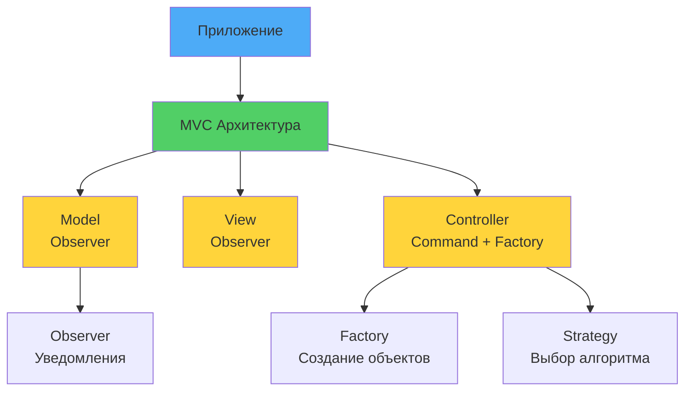

# 🏗 Практическое применение паттернов

## 🎯 Цели урока

После изучения этого урока вы сможете:
- ✅ Комбинировать паттерны для решения сложных задач
- ✅ Выбирать подходящие паттерны для конкретных сценариев
- ✅ Применять паттерны в реальных проектах
- ✅ Рефакторить существующий код с использованием паттернов

## 📖 Комбинирование паттернов

### 💡 Простыми словами

**Аналогия**: Строительство дома
- Один инструмент (паттерн) не построит дом
- Нужна комбинация: молоток (Factory) + гвозди (Strategy) + уровень (Observer)
- Каждый паттерн решает свою задачу, вместе они создают архитектуру

**В программировании:**
- Паттерны редко используются поодиночке
- Комбинация паттернов решает сложные задачи
- Важно понимать, как паттерны взаимодействуют

### 📊 Визуализация комбинирования паттернов



### 🎨 Шаблоны комбинаций паттернов

#### MVC + Observer + Command
```python
# Model-View-Controller с Observer для обновления UI и Command для операций

class Model:
    def __init__(self):
        self._data = {}
        self._observers = []

    def attach(self, observer):
        self._observers.append(observer)

    def notify(self):
        for observer in self._observers:
            observer.update(self)

    def set_data(self, key, value):
        self._data[key] = value
        self.notify()

class View:
    def __init__(self, controller):
        self.controller = controller

    def update(self, model):
        print(f"View updated: {model._data}")

    def user_action(self, action_type, data):
        command = self.controller.create_command(action_type, data)
        command.execute()

class Controller:
    def __init__(self, model):
        self.model = model

    def create_command(self, action_type, data):
        if action_type == "update":
            return UpdateCommand(self.model, data)
        elif action_type == "delete":
            return DeleteCommand(self.model, data)

class UpdateCommand:
    def __init__(self, model, data):
        self.model = model
        self.data = data

    def execute(self):
        self.model.set_data(self.data['key'], self.data['value'])

# Использование
model = Model()
controller = Controller(model)
view = View(controller)

model.attach(view)
view.user_action("update", {"key": "name", "value": "John"})
```

#### Factory + Strategy + Singleton
```python
# Фабрика создает объекты, Strategy выбирает алгоритм, Singleton обеспечивает единственный экземпляр

class AlgorithmStrategy:
    def execute(self, data):
        pass

class QuickSortStrategy(AlgorithmStrategy):
    def execute(self, data):
        # Быстрая сортировка
        return sorted(data)

class MergeSortStrategy(AlgorithmStrategy):
    def execute(self, data):
        # Сортировка слиянием
        return sorted(data)

class AlgorithmFactory:
    _instance = None

    def __new__(cls):
        if cls._instance is None:
            cls._instance = super().__new__(cls)
        return cls._instance

    def create_algorithm(self, algorithm_type):
        if algorithm_type == "quick":
            return QuickSortStrategy()
        elif algorithm_type == "merge":
            return MergeSortStrategy()

# Использование
factory = AlgorithmFactory()
algorithm = factory.create_algorithm("quick")
result = algorithm.execute([3, 1, 4, 1, 5])
```

## 🛠 Антипаттерны при работе с паттернами

### ❌ Pattern Abuse (Злоупотребление паттернами)
```python
# Антипаттерн: Применение паттернов без необходимости
class SimpleCalculator:
    _instance = None
    
    def __new__(cls):  # НЕ НУЖЕН Singleton для простых вычислений!
        if cls._instance is None:
            cls._instance = super().__new__(cls)
        return cls._instance
    
    def add(self, a, b):
        return AdditionStrategy().execute(a, b)  # НЕ НУЖЕН Strategy!

# Правильно: Keep It Simple (KISS)
class SimpleCalculator:
    def add(self, a, b):
        return a + b
```

### ❌ Golden Hammer
```python
# Антипаттерн: Применение одного паттерна везде
class EverythingIsObserver:
    def __init__(self):
        self._observers = []

    def attach(self, observer):
        self._observers.append(observer)

    def notify(self):
        for obs in self._observers:
            obs.update()

    def do_something_simple(self):
        print("Simple action")
        self.notify()  # Observer для каждой мелочи!

# Правильно: Используйте паттерны по назначению
class SimpleService:
    def do_something_simple(self):
        print("Simple action")
```

### ❌ Over-engineering
```python
# Антипаттерн: Слишком сложная архитектура
class OverEngineeredCalculator:
    def __init__(self):
        self.strategy = AdditionStrategy()
        self.observer = ResultObserver()
        self.factory = OperationFactory()

    def calculate(self, a, b):
        operation = self.factory.create_operation("add")
        result = operation.execute(a, b)
        self.observer.notify_result(result)
        return result

# Правильно: Простота важнее паттернов
class SimpleCalculator:
    def add(self, a, b):
        return a + b
```

## 🎯 Выбор подходящего паттерна

### 📋 Карта выбора паттернов

| Сценарий | Рекомендуемые паттерны | Пример |
|----------|-------------------------|---------|
| **Создание объектов** | Factory, Builder, Prototype | Создание сложных объектов |
| **Выбор алгоритма** | Strategy, State | Разные способы обработки данных |
| **Взаимодействие объектов** | Observer, Mediator | События и коммуникация |
| **Последовательная обработка** | Iterator, Chain of Responsibility | Обработка коллекций, middleware |
| **Структурирование кода** | Adapter, Decorator, Facade | Интеграция, расширение функциональности |
| **Управление состоянием** | State, Memento | Сложные состояния объектов |

### 🔍 Анализ требований

#### Шаг 1: Определите проблему
```python
# ❌ Слишком абстрактно
"Нужно сделать систему лучше"

# ✅ Конкретно
"Нужно обрабатывать заказы с разными статусами и уведомлениями"
```

#### Шаг 2: Выделите изменяющиеся аспекты
```python
# Изменяющиеся аспекты:
# - Способы оплаты
# - Типы уведомлений
# - Статусы заказов
# - Правила валидации

# Неизменяющиеся аспекты:
# - Структура заказа
# - Базовые операции
```

#### Шаг 3: Выберите паттерны
```python
# Для способов оплаты: Strategy
# Для уведомлений: Observer
# Для статусов: State
# Для валидации: Chain of Responsibility
```

## 🏗 Рефакторинг с паттернами

### 📝 Пример рефакторинга

#### Исходный код (без паттернов)
```python
class OrderProcessor:
    def __init__(self):
        self.notifications = []
        self.logger = FileLogger()

    def process_order(self, order):
        # Обработка заказа
        if order.status == "new":
            self._validate_order(order)
            self._charge_payment(order)
            self._send_confirmation(order)
            order.status = "processed"
        elif order.status == "cancelled":
            self._refund_payment(order)
            self._send_cancellation(order)

    def _validate_order(self, order):
        # Валидация
        pass

    def _charge_payment(self, order):
        # Оплата
        pass

    def _send_confirmation(self, order):
        # Уведомление
        pass
```

#### Рефакторинг с паттернами
```python
# Шаг 1: Strategy для обработки разных статусов
class OrderProcessingStrategy:
    def process(self, order, processor):
        pass

class NewOrderStrategy(OrderProcessingStrategy):
    def process(self, order, processor):
        processor.validate_order(order)
        processor.charge_payment(order)
        processor.send_confirmation(order)

class CancelledOrderStrategy(OrderProcessingStrategy):
    def process(self, order, processor):
        processor.refund_payment(order)
        processor.send_cancellation(order)

# Шаг 2: Observer для уведомлений
class OrderObserver:
    def on_order_processed(self, order):
        pass

class EmailNotifier(OrderObserver):
    def on_order_processed(self, order):
        print(f"Email sent for order {order.id}")

# Шаг 3: Рефакторинг основного класса
class OrderProcessor:
    def __init__(self):
        self.strategies = {
            "new": NewOrderStrategy(),
            "cancelled": CancelledOrderStrategy()
        }
        self.observers = []

    def attach_observer(self, observer):
        self.observers.append(observer)

    def process_order(self, order):
        strategy = self.strategies.get(order.status)
        if strategy:
            strategy.process(order, self)

            # Уведомление наблюдателей
            for observer in self.observers:
                observer.on_order_processed(order)

    def validate_order(self, order):
        print(f"Validating order {order.id}")

    def charge_payment(self, order):
        print(f"Charging payment for order {order.id}")

    def send_confirmation(self, order):
        print(f"Sending confirmation for order {order.id}")
```

## 🎨 Паттерны в Python экосистеме

### 🐍 Python-специфичные паттерны

#### Context Managers (Resource Acquisition is Initialization)
```python
class DatabaseConnection:
    def __enter__(self):
        self.connection = self._connect()
        return self

    def __exit__(self, exc_type, exc_val, exc_tb):
        self.connection.close()

# Использование
with DatabaseConnection() as db:
    db.execute("SELECT * FROM users")
```

#### Decorators
```python
import functools

def cached(func):
    cache = {}

    @functools.wraps(func)
    def wrapper(*args, **kwargs):
        key = str(args) + str(sorted(kwargs.items()))
        if key not in cache:
            cache[key] = func(*args, **kwargs)
        return cache[key]

    return wrapper

@cached
def expensive_operation(n):
    return sum(i * i for i in range(n))
```

#### Generators (Iterator Pattern)
```python
def fibonacci_generator(n):
    a, b = 0, 1
    for _ in range(n):
        yield a
        a, b = b, a + b

for num in fibonacci_generator(10):
    print(num)
```

## 🧪 Лучшие практики применения паттернов

### 📋 Checklist выбора паттернов

- [ ] **Проблема четко определена?**
- [ ] **Есть изменяющиеся аспекты системы?**
- [ ] **Паттерн решает конкретную проблему, а не добавляет сложность?**
- [ ] **Паттерн используется в соответствии с его назначением?**
- [ ] **Комбинация паттернов логична и не избыточна?**
- [ ] **Есть тесты для проверки работы паттернов?**

### 🔧 Принципы эффективного использования

1. **Начинайте с простого решения**
2. **Применяйте паттерны только когда нужно**
3. **Документируйте использование паттернов**
4. **Тестируйте паттерны изолированно**
5. **Рефакторите к паттернам постепенно**

### 📊 Метрики качества

```python
class PatternMetrics:
    @staticmethod
    def calculate_coupling(module):
        """Рассчитать связность модуля"""
        # Количество зависимостей
        return len(module.dependencies)

    @staticmethod
    def calculate_cohesion(module):
        """Рассчитать cohesion модуля"""
        # Насколько методы связаны между собой
        return len(module.related_methods) / len(module.methods)

    @staticmethod
    def pattern_effectiveness(before, after):
        """Оценить эффективность применения паттерна"""
        return {
            'coupling_reduction': before.coupling - after.coupling,
            'cohesion_improvement': after.cohesion - before.cohesion,
            'complexity_change': after.complexity - before.complexity
        }
```

## 🎮 Практические упражнения

### Упражнение 1: Рефакторинг существующего кода

**Задание:** Возьмите код из вашего проекта и примените подходящие паттерны.

### Упражнение 2: Проектирование системы

**Задание:** Спроектируйте систему для онлайн-магазина с использованием паттернов.

## 🎯 Ключевые выводы

1. **Паттерны - это инструменты, а не догма**
2. **Комбинируйте паттерны для решения комплексных задач**
3. **Выбирайте паттерны осознанно, анализируя требования**
4. **Рефакторинг к паттернам должен улучшать код**
5. **Python предоставляет мощные встроенные паттерны**

## 🚀 Следующие шаги

!!! success "Что вы узнали"
    - ✅ Как комбинировать паттерны для решения сложных задач
    - ✅ Как выбирать подходящие паттерны для конкретных сценариев
    - ✅ Шаблоны комбинаций паттернов (MVC + Observer + Command)
    - ✅ Практические примеры применения паттернов

!!! tip "Практика"
    Найдите в своем проекте место, где можно применить комбинацию паттернов. Попробуйте создать небольшую архитектуру с использованием нескольких паттернов.

Теперь вы готовы изучить **[Паттерны в реальном мире](07-real-world-patterns.md)** - как паттерны применяются в популярных библиотеках!

---

!!! success "Поздравляем с завершением Модуля 2! 🎉"
    Вы изучили все основные паттерны проектирования и научились применять их на практике. Эти знания помогут вам создавать гибкие и поддерживаемые системы.

!!! tip "Продолжайте практику"
    Регулярно применяйте паттерны в своих проектах. Со временем вы начнете замечать паттерны в существующем коде и сможете лучше выбирать подходящие решения.

!!! info "Рекомендуемая литература"
    - **"Head First Design Patterns"** - практическое введение
    - **"Design Patterns in Python"** - Python-специфичные примеры
    - **Refactoring.Guru** - онлайн-ресурс с интерактивными примерами

## 🧪 Финальный тест: Применение паттернов

<div class="quiz-container" id="patterns-application-final-quiz">
<script type="application/json">
{
  "title": "Финальный тест: Применение паттернов",
  "description": "Комплексная проверка понимания паттернов и их практического применения",
  "icon": "🎯",
  "questions": [
    {
      "question": "Какой паттерн лучше использовать для создания объектов с множеством опциональных параметров?",
      "type": "single",
      "points": 1,
      "options": [
        {"text": "Factory Method", "correct": false},
        {"text": "Builder", "correct": true},
        {"text": "Prototype", "correct": false},
        {"text": "Singleton", "correct": false}
      ],
      "explanation": "Builder идеален для пошагового создания сложных объектов"
    },
    {
      "question": "Какая комбинация паттернов часто используется в UI фреймворках?",
      "type": "multiple",
      "points": 2,
      "options": [
        {"text": "Observer для обработки событий", "correct": true},
        {"text": "Strategy для разных способов рендеринга", "correct": true},
        {"text": "Command для обработки действий пользователя", "correct": true},
        {"text": "Singleton для управления состоянием приложения", "correct": false}
      ],
      "explanation": "UI фреймворки активно используют Observer, Strategy и Command"
    },
    {
      "question": "Что является признаком правильного применения паттернов?",
      "type": "multiple",
      "points": 2,
      "options": [
        {"text": "Код становится более читаемым", "correct": true},
        {"text": "Увеличивается количество классов", "correct": false},
        {"text": "Упрощается тестирование", "correct": true},
        {"text": "Код становится более гибким", "correct": true},
        {"text": "Увеличивается сложность понимания", "correct": false}
      ],
      "explanation": "Правильное применение паттернов улучшает качество кода"
    },
    {
      "question": "Какой паттерн лучше использовать для обработки HTTP запросов в веб-фреймворке?",
      "type": "single",
      "points": 1,
      "options": [
        {"text": "Chain of Responsibility", "correct": true},
        {"text": "State", "correct": false},
        {"text": "Iterator", "correct": false},
        {"text": "Mediator", "correct": false}
      ],
      "explanation": "Chain of Responsibility идеален для middleware в веб-фреймворках"
    },
    {
      "question": "Что такое 'pattern abuse'?",
      "type": "single",
      "points": 1,
      "options": [
        {"text": "Неправильное использование паттерна", "correct": true},
        {"text": "Отсутствие паттернов в коде", "correct": false},
        {"text": "Слишком много паттернов", "correct": false},
        {"text": "Устаревшие паттерны", "correct": false}
      ],
      "explanation": "Pattern abuse - это неправильное или избыточное применение паттернов"
    },
    {
      "question": "Какие факторы учитывать при выборе паттерна?",
      "type": "multiple",
      "points": 2,
      "options": [
        {"text": "Сложность реализации", "correct": true},
        {"text": "Влияние на производительность", "correct": true},
        {"text": "Уровень экспертизы команды", "correct": true},
        {"text": "Количество строк кода", "correct": false},
        {"text": "Время компиляции", "correct": false}
      ],
      "explanation": "Выбор паттерна должен учитывать практические аспекты"
    },
    {
      "question": "Что такое 'emergent design'?",
      "type": "single",
      "points": 1,
      "options": [
        {"text": "Проектирование с нуля", "correct": false},
        {"text": "Паттерны появляются естественным образом", "correct": true},
        {"text": "Автоматическая генерация паттернов", "correct": false},
        {"text": "Копирование паттернов из книг", "correct": false}
      ],
      "explanation": "Emergent design - это когда паттерны появляются в процессе рефакторинга"
    },
    {
      "question": "Какой паттерн лучше использовать для кэширования результатов вычислений?",
      "type": "single",
      "points": 1,
      "options": [
        {"text": "Proxy", "correct": true},
        {"text": "Adapter", "correct": false},
        {"text": "Decorator", "correct": false},
        {"text": "Facade", "correct": false}
      ],
      "explanation": "Proxy паттерн идеален для ленивой загрузки и кэширования"
    },
    {
      "question": "Что является преимуществом комбинации паттернов?",
      "type": "multiple",
      "points": 2,
      "options": [
        {"text": "Решение комплексных задач", "correct": true},
        {"text": "Улучшение разделения ответственностей", "correct": true},
        {"text": "Повышение гибкости системы", "correct": true},
        {"text": "Упрощение понимания кода", "correct": false},
        {"text": "Снижение количества кода", "correct": false}
      ],
      "explanation": "Комбинация паттернов позволяет решать сложные задачи, но может усложнить код"
    },
    {
      "question": "Как часто следует применять паттерны в проекте?",
      "type": "single",
      "points": 1,
      "options": [
        {"text": "Во всех классах", "correct": false},
        {"text": "Только когда это необходимо", "correct": true},
        {"text": "В каждом методе", "correct": false},
        {"text": "По требованию руководителя", "correct": false}
      ],
      "explanation": "Паттерны следует применять осознанно, когда они решают конкретную проблему"
    }
  ]
}
</script>
</div>

## 💻 Практическое задание: Комплексное применение паттернов

{{ create_exercise_form(
    "patterns_comprehensive_application",
    "Разработка системы управления контентом с применением всех изученных паттернов",
    "Создайте полнофункциональную систему управления контентом (CMS), комбинируя все изученные паттерны для создания профессиональной архитектуры.",
    """from abc import ABC, abstractmethod
from typing import List, Dict, Any, Optional, Iterator
from datetime import datetime
import uuid
import functools

# Задание: Создать полноценную CMS систему с использованием всех паттернов

# 1. CREATIONAL PATTERNS
# TODO: Реализовать систему создания контента

class ContentFactory:
    '''Factory для создания разных типов контента'''
    @staticmethod
    def create_content(content_type: str, **kwargs):
        if content_type == 'article':
            return Article(**kwargs)
        elif content_type == 'video':
            return Video(**kwargs)
        elif content_type == 'image':
            return Image(**kwargs)
        else:
            raise ValueError(f"Неизвестный тип контента: {content_type}")

class ContentBuilder:
    '''Builder для создания сложного контента'''
    def __init__(self):
        self.content = None
        self.metadata = {}
        self.tags = []
        self.categories = []

    def set_type(self, content_type: str):
        # TODO: Создать базовый контент соответствующего типа
        pass

    def set_metadata(self, **metadata):
        self.metadata.update(metadata)
        return self

    def add_tags(self, *tags):
        self.tags.extend(tags)
        return self

    def set_categories(self, *categories):
        self.categories.extend(categories)
        return self

    def build(self):
        # TODO: Применить все настройки к контенту
        pass

# 2. STRUCTURAL PATTERNS
# TODO: Реализовать адаптеры для разных хранилищ

class ContentStorage(ABC):
    @abstractmethod
    def save(self, content) -> str:
        pass

    @abstractmethod
    def load(self, content_id: str):
        pass

class FileSystemStorage:
    '''Сторонняя библиотека для работы с файлами'''
    def save_file(self, filename: str, data: bytes) -> str:
        return f"file://{filename}"

    def load_file(self, filename: str) -> bytes:
        return b"file data"

class DatabaseStorage:
    '''Сторонняя БД библиотека'''
    def insert_record(self, table: str, data: dict) -> int:
        return 123

    def select_record(self, table: str, record_id: int) -> dict:
        return {"id": record_id, "data": "record data"}

class FileSystemAdapter(ContentStorage):
    '''Adapter для файловой системы'''
    def __init__(self, fs_storage: FileSystemStorage):
        self.fs = fs_storage

    def save(self, content) -> str:
        # TODO: Адаптировать интерфейс
        pass

    def load(self, content_id: str):
        # TODO: Адаптировать интерфейс
        pass

# TODO: Реализовать Decorator для функциональности контента
class ContentDecorator(ABC):
    def __init__(self, content):
        self.content = content

    @abstractmethod
    def render(self) -> str:
        pass

class SEOOptimizedContent(ContentDecorator):
    def render(self) -> str:
        base_render = self.content.render()
        # TODO: Добавить SEO оптимизацию
        pass

class CachedContent(ContentDecorator):
    def __init__(self, content):
        super().__init__(content)
        self._cache = {}

    def render(self) -> str:
        cache_key = id(self.content)
        if cache_key not in self._cache:
            self._cache[cache_key] = self.content.render()
        return self._cache[cache_key]

# TODO: Реализовать Facade для упрощения работы с CMS
class CMSFacade:
    def __init__(self):
        self.factory = ContentFactory()
        self.storage_adapters = {}
        self.content_cache = {}

    def create_and_publish_content(self, content_type: str, **kwargs) -> str:
        '''Упрощенный интерфейс для создания и публикации контента'''
        # TODO: Создать, сохранить и опубликовать контент
        pass

    def get_content(self, content_id: str):
        '''Получить контент с кэшированием'''
        # TODO: Загрузить контент с кэшем
        pass

# 3. BEHAVIORAL PATTERNS
# TODO: Реализовать Observer для уведомлений о изменениях контента
class ContentObserver(ABC):
    @abstractmethod
    def on_content_created(self, content):
        pass

    @abstractmethod
    def on_content_published(self, content):
        pass

class EmailNotificationObserver(ContentObserver):
    def on_content_created(self, content):
        print(f"📧 Уведомление: Контент '{content.title}' создан")

    def on_content_published(self, content):
        print(f"📧 Уведомление: Контент '{content.title}' опубликован")

class SearchIndexObserver(ContentObserver):
    def on_content_created(self, content):
        print(f"🔍 Индексация: Контент '{content.title}' добавлен в поиск")

    def on_content_published(self, content):
        print(f"🔍 Индексация: Контент '{content.title}' обновлен в поиске")

# TODO: Реализовать Strategy для разных способов рендеринга
class RenderStrategy(ABC):
    @abstractmethod
    def render(self, content) -> str:
        pass

class HTMLRenderStrategy(RenderStrategy):
    def render(self, content) -> str:
        # TODO: Рендеринг в HTML
        pass

class JSONRenderStrategy(RenderStrategy):
    def render(self, content) -> str:
        # TODO: Рендеринг в JSON
        pass

class XMLRenderStrategy(RenderStrategy):
    def render(self, content) -> str:
        # TODO: Рендеринг в XML
        pass

# TODO: Реализовать State для управления состоянием контента
class ContentState(ABC):
    @abstractmethod
    def publish(self, content):
        pass

    @abstractmethod
    def archive(self, content):
        pass

class DraftState(ContentState):
    def publish(self, content):
        # TODO: Опубликовать контент
        pass

    def archive(self, content):
        # TODO: Переместить в архив
        pass

class PublishedState(ContentState):
    def publish(self, content):
        print("✅ Контент уже опубликован")

    def archive(self, content):
        # TODO: Переместить в архив
        pass

# TODO: Реализовать Iterator для обхода контента
class ContentIterator(ABC):
    @abstractmethod
    def has_next(self) -> bool:
        pass

    @abstractmethod
    def next(self):
        pass

class CategoryIterator(ContentIterator):
    def __init__(self, contents: List, category: str):
        # TODO: Отфильтровать контент по категории
        pass

    def has_next(self) -> bool:
        # TODO: Проверить наличие следующего элемента
        pass

    def next(self):
        # TODO: Вернуть следующий элемент
        pass

# TODO: Реализовать Mediator для координации компонентов CMS
class CMSMediator(ABC):
    @abstractmethod
    def notify_content_change(self, content, event: str):
        pass

    @abstractmethod
    def request_rendering(self, content, format: str) -> str:
        pass

class ContentManagementMediator(CMSMediator):
    def __init__(self):
        self.observers = []
        self.render_strategies = {
            'html': HTMLRenderStrategy(),
            'json': JSONRenderStrategy(),
            'xml': XMLRenderStrategy()
        }

    def add_observer(self, observer: ContentObserver):
        self.observers.append(observer)

    def notify_content_change(self, content, event: str):
        # TODO: Уведомить всех наблюдателей
        pass

    def request_rendering(self, content, format: str) -> str:
        # TODO: Выполнить рендеринг с помощью подходящей стратегии
        pass

# TODO: Реализовать Chain of Responsibility для обработки контента
class ContentHandler(ABC):
    def __init__(self):
        self.next_handler = None

    def set_next(self, handler):
        self.next_handler = handler
        return handler

    @abstractmethod
    def handle(self, content) -> Optional[str]:
        pass

class ValidationHandler(ContentHandler):
    def handle(self, content) -> Optional[str]:
        # TODO: Проверить корректность контента
        pass

class SEOHandler(ContentHandler):
    def handle(self, content) -> Optional[str]:
        # TODO: Оптимизировать для SEO
        pass

class PublishingHandler(ContentHandler):
    def handle(self, content) -> Optional[str]:
        # TODO: Опубликовать контент
        pass

# 4. ОСНОВНЫЕ КЛАССЫ СИСТЕМЫ
# TODO: Создайте базовый класс контента
class Content(ABC):
    def __init__(self, title: str, author: str):
        self.id = str(uuid.uuid4())
        self.title = title
        self.author = author
        self.created_at = datetime.now()
        self.state = DraftState()
        self.mediator = None

    def set_mediator(self, mediator: CMSMediator):
        self.mediator = mediator

    def set_state(self, state: ContentState):
        self.state = state

    def publish(self):
        self.state.publish(self)
        if self.mediator:
            self.mediator.notify_content_change(self, 'published')

    def archive(self):
        self.state.archive(self)

    @abstractmethod
    def render(self, format: str = 'html') -> str:
        pass

# TODO: Реализуйте конкретные типы контента
class Article(Content):
    def __init__(self, title: str, author: str, content: str):
        super().__init__(title, author)
        self.content = content

    def render(self, format: str = 'html') -> str:
        # TODO: Рендеринг статьи
        pass

class Video(Content):
    def __init__(self, title: str, author: str, url: str, duration: int):
        super().__init__(title, author)
        self.url = url
        self.duration = duration

    def render(self, format: str = 'html') -> str:
        # TODO: Рендеринг видео
        pass

class Image(Content):
    def __init__(self, title: str, author: str, url: str, alt_text: str):
        super().__init__(title, author)
        self.url = url
        self.alt_text = alt_text

    def render(self, format: str = 'html') -> str:
        # TODO: Рендеринг изображения
        pass

# TODO: Создайте главный класс CMS
class ContentManagementSystem:
    def __init__(self):
        self.mediator = ContentManagementMediator()
        self.contents: Dict[str, Content] = {}
        self.storage_adapters = {}
        self.handler_chain = self._build_handler_chain()

    def _build_handler_chain(self) -> ContentHandler:
        # TODO: Построить цепочку обработчиков
        pass

    def create_content(self, content_type: str, **kwargs) -> Content:
        '''Создать контент через Factory'''
        # TODO: Использовать ContentFactory
        pass

    def build_content(self, content_type: str) -> ContentBuilder:
        '''Создать билдер для контента'''
        # TODO: Вернуть настроенный билдер
        pass

    def save_content(self, content: Content, storage_type: str = 'filesystem') -> str:
        '''Сохранить контент через Adapter'''
        # TODO: Использовать подходящий адаптер хранилища
        pass

    def process_content(self, content: Content) -> Optional[str]:
        '''Обработать контент через Chain of Responsibility'''
        # TODO: Пропустить через цепочку обработчиков
        pass

    def render_content(self, content: Content, format: str) -> str:
        '''Рендерить контент через Strategy'''
        # TODO: Использовать подходящую стратегию рендеринга
        pass

    def get_content_iterator(self, filter_type: str, **filter_params) -> ContentIterator:
        '''Получить итератор для обхода контента'''
        # TODO: Создать соответствующий итератор
        pass

# Демонстрация работы системы
if __name__ == "__main__":
    print("=== CMS System Demo ===\n")

    # Создание CMS
    cms = ContentManagementSystem()

    # Добавление наблюдателей
    email_observer = EmailNotificationObserver()
    search_observer = SearchIndexObserver()
    cms.mediator.add_observer(email_observer)
    cms.mediator.add_observer(search_observer)

    # Создание контента разными способами
    print("1. Создание контента через Factory:")
    article = cms.create_content('article', title='Мой первый пост', author='Автор', content='Текст статьи')
    print(f"Создан: {article.title}")

    print("\n2. Создание контента через Builder:")
    builder = cms.build_content('video')
    video = (builder
             .set_metadata(duration=300, quality='HD')
             .add_tags('tutorial', 'python')
             .build())
    print(f"Создан: {video.title}")

    # Обработка и публикация
    print("\n3. Обработка контента:")
    result = cms.process_content(article)
    print(f"Результат обработки: {result}")

    print("\n4. Публикация контента:")
    article.publish()

    # Рендеринг в разных форматах
    print("\n5. Рендеринг контента:")
    html_render = cms.render_content(article, 'html')
    json_render = cms.render_content(article, 'json')
    print("HTML рендеринг выполнен")
    print("JSON рендеринг выполнен")

    # Использование итераторов
    print("\n6. Итерация по контенту:")
    iterator = cms.get_content_iterator('published')
    while iterator.has_next():
        content = iterator.next()
        print(f"📄 {content.title} by {content.author}")

    print("\n🎉 Полнофункциональная CMS система создана!")

# TODO: Расширьте систему:
# - Добавьте аутентификацию и авторизацию пользователей
# - Реализуйте систему версий для контента
# - Добавьте аналитику просмотров и взаимодействий
# - Создайте REST API для управления контентом
# - Добавьте систему шаблонов для рендеринга
# - Реализуйте кэширование и оптимизацию производительности
# - Добавьте поддержку мультиязычности и локализации""",
    [
        "Реализовать Creational паттерны (Factory, Builder, Prototype)",
        "Применить Structural паттерны (Adapter, Decorator, Facade, Composite)",
        "Использовать Behavioral паттерны (Observer, Strategy, State, Iterator, Mediator, Chain)",
        "Создать полную систему CMS с интеграцией всех паттернов",
        "Продемонстрировать работу системы с примерами использования",
        "Написать комплексные тесты для всех компонентов",
        "Документировать архитектуру и паттерны системы"
    ]
) }}

---

!!! success "Модуль 2 завершен! 🎉"
    Поздравляем! Вы завершили изучение паттернов проектирования. Теперь у вас есть:

    - 📚 **23 классических паттерна** Gang of Four
    - 🛠 **Практические навыки** их реализации на Python
    - 🎯 **Понимание** когда и как применять паттерны
    - 🔧 **Опыт** комбинирования паттернов для комплексных решений
    - 💡 **Знания** лучших практик и антипаттернов

    **Следующий шаг:** **[Модуль 3: Архитектурные Подходы](../module-03-architecture/)** - изучение высокоуровневых архитектурных стилей!
