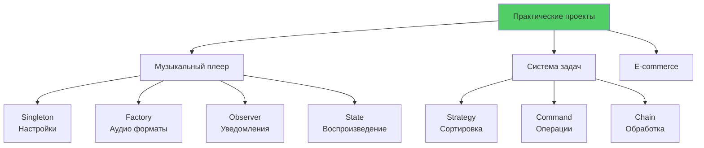

# 🎮 Урок 8: Практика паттернов - реализация в проектах

## 🎯 Цели урока

После изучения этого урока вы сможете:
- ✅ Выбирать подходящие паттерны для конкретных задач
- ✅ Комбинировать несколько паттернов в одном проекте
- ✅ Создавать архитектуру приложения с использованием паттернов
- ✅ Избегать распространенных ошибок при применении паттернов

## 🚀 Практические проекты с паттернами

В этом уроке мы создадим несколько полноценных проектов, демонстрирующих применение паттернов проектирования в реальных сценариях.

### 💡 Простыми словами

**Аналогия**: Практика вождения
- Теория = правила дорожного движения
- Практика = реальная езда по городу
- Проекты = разные маршруты (музыкальный плеер, система задач)

**В программировании:**
- Создаем реальные проекты с паттернами
- Видим, как паттерны работают вместе
- Получаем опыт применения в реальных задачах

### 📊 Визуализация практических проектов



---

## 🎵 Проект 1: Музыкальный плеер

### Архитектура с паттернами
```python
from abc import ABC, abstractmethod
from typing import List, Dict, Optional
import threading
import time
from enum import Enum

# === SINGLETON для настроек приложения ===
class AppConfig:
    _instance = None
    _lock = threading.Lock()
    
    def __new__(cls):
        if cls._instance is None:
            with cls._lock:
                if cls._instance is None:
                    cls._instance = super().__new__(cls)
                    cls._instance._initialized = False
        return cls._instance
    
    def __init__(self):
        if not self._initialized:
            self.volume = 50
            self.repeat_mode = False
            self.shuffle = False
            self.theme = "dark"
            self.language = "ru"
            self._initialized = True
    
    def get_setting(self, key: str, default=None):
        return getattr(self, key, default)
    
    def set_setting(self, key: str, value):
        setattr(self, key, value)

# === FACTORY для создания аудио форматов ===
class AudioTrack(ABC):
    def __init__(self, file_path: str, title: str, artist: str):
        self.file_path = file_path
        self.title = title
        self.artist = artist
        self.duration = 0
    
    @abstractmethod
    def load(self) -> bool:
        pass
    
    @abstractmethod
    def get_metadata(self) -> Dict:
        pass

class MP3Track(AudioTrack):
    def load(self) -> bool:
        print(f"🎵 Загрузка MP3: {self.title}")
        # Имитация загрузки MP3
        self.duration = 180  # 3 минуты
        return True
    
    def get_metadata(self) -> Dict:
        return {
            "format": "MP3",
            "bitrate": "320 kbps",
            "sample_rate": "44.1 kHz"
        }

class FLACTrack(AudioTrack):
    def load(self) -> bool:
        print(f"🎼 Загрузка FLAC: {self.title}")
        # Имитация загрузки FLAC
        self.duration = 200
        return True
    
    def get_metadata(self) -> Dict:
        return {
            "format": "FLAC",
            "bitrate": "Lossless",
            "sample_rate": "96 kHz"
        }

class AudioTrackFactory:
    @staticmethod
    def create_track(file_path: str, title: str, artist: str) -> AudioTrack:
        extension = file_path.split('.')[-1].lower()
        
        if extension == 'mp3':
            return MP3Track(file_path, title, artist)
        elif extension == 'flac':
            return FLACTrack(file_path, title, artist)
        else:
            raise ValueError(f"Неподдерживаемый формат: {extension}")

# === STRATEGY для разных режимов воспроизведения ===
class PlaybackStrategy(ABC):
    @abstractmethod
    def get_next_track(self, playlist: List[AudioTrack], current_index: int) -> Optional[int]:
        pass

class SequentialStrategy(PlaybackStrategy):
    def get_next_track(self, playlist: List[AudioTrack], current_index: int) -> Optional[int]:
        config = AppConfig()
        if config.repeat_mode:
            return (current_index + 1) % len(playlist)
        else:
            return current_index + 1 if current_index + 1 < len(playlist) else None

class ShuffleStrategy(PlaybackStrategy):
    def __init__(self):
        import random
        self.random = random
    
    def get_next_track(self, playlist: List[AudioTrack], current_index: int) -> Optional[int]:
        if len(playlist) <= 1:
            return current_index if AppConfig().repeat_mode else None
        
        next_index = self.random.choice([i for i in range(len(playlist)) if i != current_index])
        return next_index

class RepeatOneStrategy(PlaybackStrategy):
    def get_next_track(self, playlist: List[AudioTrack], current_index: int) -> Optional[int]:
        return current_index  # Повторяем ту же композицию

# === OBSERVER для событий плеера ===
class PlayerObserver(ABC):
    @abstractmethod
    def on_track_started(self, track: AudioTrack):
        pass
    
    @abstractmethod
    def on_track_paused(self, track: AudioTrack):
        pass
    
    @abstractmethod
    def on_track_stopped(self, track: AudioTrack):
        pass

class UIDisplay(PlayerObserver):
    def on_track_started(self, track: AudioTrack):
        print(f"🎶 Сейчас играет: {track.artist} - {track.title}")
    
    def on_track_paused(self, track: AudioTrack):
        print(f"⏸️ Пауза: {track.title}")
    
    def on_track_stopped(self, track: AudioTrack):
        print(f"⏹️ Остановлено: {track.title}")

class LastFMScrobbler(PlayerObserver):
    def on_track_started(self, track: AudioTrack):
        print(f"📊 LastFM: Отправка данных о {track.title}")
    
    def on_track_paused(self, track: AudioTrack):
        pass  # LastFM не интересуют паузы
    
    def on_track_stopped(self, track: AudioTrack):
        print(f"📊 LastFM: Трек завершен - {track.title}")

class HistoryLogger(PlayerObserver):
    def __init__(self):
        self.history = []
    
    def on_track_started(self, track: AudioTrack):
        self.history.append(f"Started: {track.title} at {time.strftime('%H:%M:%S')}")
    
    def on_track_paused(self, track: AudioTrack):
        self.history.append(f"Paused: {track.title} at {time.strftime('%H:%M:%S')}")
    
    def on_track_stopped(self, track: AudioTrack):
        self.history.append(f"Stopped: {track.title} at {time.strftime('%H:%M:%S')}")
    
    def get_history(self) -> List[str]:
        return self.history.copy()

# === COMMAND для операций плеера ===
class PlayerCommand(ABC):
    @abstractmethod
    def execute(self):
        pass
    
    @abstractmethod
    def undo(self):
        pass

class PlayCommand(PlayerCommand):
    def __init__(self, player: 'MusicPlayer'):
        self.player = player
        self.previous_state = None
    
    def execute(self):
        self.previous_state = self.player.state
        self.player.play()
    
    def undo(self):
        if self.previous_state == PlayerState.PAUSED:
            self.player.pause()
        elif self.previous_state == PlayerState.STOPPED:
            self.player.stop()

class PauseCommand(PlayerCommand):
    def __init__(self, player: 'MusicPlayer'):
        self.player = player
        self.previous_state = None
    
    def execute(self):
        self.previous_state = self.player.state
        self.player.pause()
    
    def undo(self):
        if self.previous_state == PlayerState.PLAYING:
            self.player.play()

class VolumeCommand(PlayerCommand):
    def __init__(self, player: 'MusicPlayer', new_volume: int):
        self.player = player
        self.new_volume = new_volume
        self.old_volume = None
    
    def execute(self):
        config = AppConfig()
        self.old_volume = config.volume
        config.volume = self.new_volume
        print(f"🔊 Громкость изменена на {self.new_volume}")
    
    def undo(self):
        config = AppConfig()
        config.volume = self.old_volume
        print(f"🔊 Громкость восстановлена: {self.old_volume}")

# === STATE для состояний плеера ===
class PlayerState(Enum):
    STOPPED = "stopped"
    PLAYING = "playing"
    PAUSED = "paused"

class PlayerStateHandler(ABC):
    @abstractmethod
    def play(self, player: 'MusicPlayer'):
        pass
    
    @abstractmethod
    def pause(self, player: 'MusicPlayer'):
        pass
    
    @abstractmethod
    def stop(self, player: 'MusicPlayer'):
        pass

class StoppedState(PlayerStateHandler):
    def play(self, player: 'MusicPlayer'):
        if player.current_track:
            print(f"▶️ Начинаем воспроизведение")
            player.state = PlayerState.PLAYING
            player.notify_track_started()
        
    def pause(self, player: 'MusicPlayer'):
        print("⚠️ Нельзя поставить на паузу остановленный плеер")
    
    def stop(self, player: 'MusicPlayer'):
        print("⚠️ Плеер уже остановлен")

class PlayingState(PlayerStateHandler):
    def play(self, player: 'MusicPlayer'):
        print("⚠️ Плеер уже воспроизводит")
    
    def pause(self, player: 'MusicPlayer'):
        print("⏸️ Пауза")
        player.state = PlayerState.PAUSED
        player.notify_track_paused()
    
    def stop(self, player: 'MusicPlayer'):
        print("⏹️ Остановка воспроизведения")
        player.state = PlayerState.STOPPED
        player.notify_track_stopped()

class PausedState(PlayerStateHandler):
    def play(self, player: 'MusicPlayer'):
        print("▶️ Продолжаем воспроизведение")
        player.state = PlayerState.PLAYING
        player.notify_track_started()
    
    def pause(self, player: 'MusicPlayer'):
        print("⚠️ Плеер уже на паузе")
    
    def stop(self, player: 'MusicPlayer'):
        print("⏹️ Остановка")
        player.state = PlayerState.STOPPED
        player.notify_track_stopped()

# === ГЛАВНЫЙ КЛАСС ПЛЕЕРА ===
class MusicPlayer:
    def __init__(self):
        self.playlist: List[AudioTrack] = []
        self.current_index = -1
        self.current_track: Optional[AudioTrack] = None
        self.state = PlayerState.STOPPED
        
        # Strategy для режима воспроизведения
        self.playback_strategy = SequentialStrategy()
        
        # State handlers
        self.states = {
            PlayerState.STOPPED: StoppedState(),
            PlayerState.PLAYING: PlayingState(),
            PlayerState.PAUSED: PausedState()
        }
        
        # Observers
        self.observers: List[PlayerObserver] = []
        
        # Command history
        self.command_history: List[PlayerCommand] = []
        self.command_index = -1
    
    def add_observer(self, observer: PlayerObserver):
        self.observers.append(observer)
    
    def remove_observer(self, observer: PlayerObserver):
        if observer in self.observers:
            self.observers.remove(observer)
    
    def notify_track_started(self):
        for observer in self.observers:
            observer.on_track_started(self.current_track)
    
    def notify_track_paused(self):
        for observer in self.observers:
            observer.on_track_paused(self.current_track)
    
    def notify_track_stopped(self):
        for observer in self.observers:
            observer.on_track_stopped(self.current_track)
    
    def execute_command(self, command: PlayerCommand):
        # Удаляем команды после текущей позиции
        self.command_history = self.command_history[:self.command_index + 1]
        command.execute()
        self.command_history.append(command)
        self.command_index += 1
    
    def undo_last_command(self):
        if self.command_index >= 0:
            command = self.command_history[self.command_index]
            command.undo()
            self.command_index -= 1
            print("↶ Отменена последняя команда")
        else:
            print("❌ Нет команд для отмены")
    
    def redo_command(self):
        if self.command_index < len(self.command_history) - 1:
            self.command_index += 1
            command = self.command_history[self.command_index]
            command.execute()
            print("↷ Повторена команда")
        else:
            print("❌ Нет команд для повтора")
    
    def add_track(self, file_path: str, title: str, artist: str):
        track = AudioTrackFactory.create_track(file_path, title, artist)
        if track.load():
            self.playlist.append(track)
            print(f"➕ Добавлен трек: {artist} - {title}")
    
    def set_playback_mode(self, shuffle: bool = False, repeat_one: bool = False):
        if repeat_one:
            self.playback_strategy = RepeatOneStrategy()
        elif shuffle:
            self.playback_strategy = ShuffleStrategy()
        else:
            self.playback_strategy = SequentialStrategy()
    
    def play_track(self, index: int):
        if 0 <= index < len(self.playlist):
            self.current_index = index
            self.current_track = self.playlist[index]
            self.play()
    
    def play(self):
        state_handler = self.states[self.state]
        state_handler.play(self)
    
    def pause(self):
        state_handler = self.states[self.state]
        state_handler.pause(self)
    
    def stop(self):
        state_handler = self.states[self.state]
        state_handler.stop(self)
    
    def next_track(self):
        if not self.playlist:
            return
        
        next_index = self.playback_strategy.get_next_track(self.playlist, self.current_index)
        if next_index is not None:
            self.play_track(next_index)
        else:
            print("🏁 Плейлист завершен")
            self.stop()
    
    def previous_track(self):
        if self.current_index > 0:
            self.play_track(self.current_index - 1)
    
    def get_current_status(self) -> str:
        if self.current_track:
            config = AppConfig()
            return (f"Состояние: {self.state.value.upper()}\n"
                   f"Трек: {self.current_track.artist} - {self.current_track.title}\n"
                   f"Громкость: {config.volume}\n"
                   f"Режим: {'Shuffle' if isinstance(self.playback_strategy, ShuffleStrategy) else 'Sequential'}")
        return "Плеер остановлен"

# === ДЕМОНСТРАЦИЯ РАБОТЫ ===
def main():
    print("🎵 === МУЗЫКАЛЬНЫЙ ПЛЕЕР ===\n")
    
    # Создание плеера и добавление наблюдателей
    player = MusicPlayer()
    ui_display = UIDisplay()
    lastfm = LastFMScrobbler()
    history = HistoryLogger()
    
    player.add_observer(ui_display)
    player.add_observer(lastfm)
    player.add_observer(history)
    
    # Добавление треков в плейлист
    player.add_track("song1.mp3", "Bohemian Rhapsody", "Queen")
    player.add_track("song2.flac", "Imagine", "John Lennon")
    player.add_track("song3.mp3", "Hotel California", "Eagles")
    
    print("\n=== Воспроизведение ===")
    # Воспроизведение через команды
    play_cmd = PlayCommand(player)
    player.execute_command(play_cmd)
    player.play_track(0)
    
    print("\n=== Управление громкостью ===")
    volume_cmd = VolumeCommand(player, 75)
    player.execute_command(volume_cmd)
    
    print("\n=== Пауза и возобновление ===")
    pause_cmd = PauseCommand(player)
    player.execute_command(pause_cmd)
    
    play_cmd2 = PlayCommand(player)
    player.execute_command(play_cmd2)
    
    print("\n=== Отмена последней команды ===")
    player.undo_last_command()
    
    print("\n=== Переключение треков ===")
    player.next_track()
    player.next_track()
    
    print("\n=== Shuffle режим ===")
    player.set_playback_mode(shuffle=True)
    player.next_track()
    
    print("\n=== Статус плеера ===")
    print(player.get_current_status())
    
    print("\n=== История воспроизведения ===")
    for entry in history.get_history()[-5:]:  # Последние 5 записей
        print(f"📜 {entry}")

if __name__ == "__main__":
    main()
```

---

## 🛒 Проект 2: Система интернет-магазина

### Комплексное применение паттернов
```python
from abc import ABC, abstractmethod
from typing import List, Dict, Optional, Any
from decimal import Decimal
from datetime import datetime, timedelta
from enum import Enum
import uuid

# === BUILDER для создания сложных продуктов ===
class Product:
    def __init__(self):
        self.id = str(uuid.uuid4())[:8]
        self.name = ""
        self.price = Decimal('0')
        self.category = ""
        self.description = ""
        self.attributes = {}
        self.stock_quantity = 0
        self.images = []
        self.tags = []
        self.discount_percent = 0

class ProductBuilder:
    def __init__(self):
        self.product = Product()
    
    def set_name(self, name: str):
        self.product.name = name
        return self
    
    def set_price(self, price: float):
        self.product.price = Decimal(str(price))
        return self
    
    def set_category(self, category: str):
        self.product.category = category
        return self
    
    def set_description(self, description: str):
        self.product.description = description
        return self
    
    def add_attribute(self, key: str, value: str):
        self.product.attributes[key] = value
        return self
    
    def set_stock(self, quantity: int):
        self.product.stock_quantity = quantity
        return self
    
    def add_image(self, image_url: str):
        self.product.images.append(image_url)
        return self
    
    def add_tag(self, tag: str):
        self.product.tags.append(tag)
        return self
    
    def set_discount(self, percent: int):
        self.product.discount_percent = percent
        return self
    
    def build(self) -> Product:
        if not self.product.name or self.product.price <= 0:
            raise ValueError("Продукт должен иметь название и положительную цену")
        return self.product

# Специализированные билдеры для разных типов товаров
class ElectronicsProductBuilder(ProductBuilder):
    def __init__(self):
        super().__init__()
        self.set_category("Электроника")
    
    def set_warranty(self, months: int):
        return self.add_attribute("warranty_months", str(months))
    
    def set_brand(self, brand: str):
        return self.add_attribute("brand", brand)
    
    def set_model(self, model: str):
        return self.add_attribute("model", model)

class ClothingProductBuilder(ProductBuilder):
    def __init__(self):
        super().__init__()
        self.set_category("Одежда")
    
    def set_size(self, size: str):
        return self.add_attribute("size", size)
    
    def set_color(self, color: str):
        return self.add_attribute("color", color)
    
    def set_material(self, material: str):
        return self.add_attribute("material", material)

# === DECORATOR для дополнительных услуг ===
class OrderComponent(ABC):
    @abstractmethod
    def get_cost(self) -> Decimal:
        pass
    
    @abstractmethod
    def get_description(self) -> str:
        pass

class BaseOrder(OrderComponent):
    def __init__(self, products: List[Product]):
        self.products = products
        self.id = str(uuid.uuid4())[:8]
        self.created_at = datetime.now()
    
    def get_cost(self) -> Decimal:
        total = Decimal('0')
        for product in self.products:
            discounted_price = product.price * (Decimal('100') - Decimal(str(product.discount_percent))) / Decimal('100')
            total += discounted_price
        return total
    
    def get_description(self) -> str:
        product_names = [p.name for p in self.products]
        return f"Заказ #{self.id}: {', '.join(product_names)}"

class OrderDecorator(OrderComponent):
    def __init__(self, order: OrderComponent):
        self._order = order

class ExpressDeliveryDecorator(OrderDecorator):
    def get_cost(self) -> Decimal:
        return self._order.get_cost() + Decimal('500')  # +500 руб за срочную доставку
    
    def get_description(self) -> str:
        return self._order.get_description() + " + Срочная доставка"

class GiftWrapDecorator(OrderDecorator):
    def get_cost(self) -> Decimal:
        return self._order.get_cost() + Decimal('150')  # +150 руб за упаковку
    
    def get_description(self) -> str:
        return self._order.get_description() + " + Подарочная упаковка"

class InsuranceDecorator(OrderDecorator):
    def get_cost(self) -> Decimal:
        insurance_cost = self._order.get_cost() * Decimal('0.02')  # 2% от стоимости
        return self._order.get_cost() + insurance_cost
    
    def get_description(self) -> str:
        return self._order.get_description() + " + Страховка"

class ExtendedWarrantyDecorator(OrderDecorator):
    def __init__(self, order: OrderComponent, months: int):
        super().__init__(order)
        self.months = months
    
    def get_cost(self) -> Decimal:
        warranty_cost = Decimal(str(self.months)) * Decimal('100')  # 100 руб за месяц
        return self._order.get_cost() + warranty_cost
    
    def get_description(self) -> str:
        return self._order.get_description() + f" + Расширенная гарантия ({self.months} мес.)"

# === STRATEGY для разных способов доставки ===
class DeliveryStrategy(ABC):
    @abstractmethod
    def calculate_cost(self, order_weight: float, distance: float) -> Decimal:
        pass
    
    @abstractmethod
    def get_delivery_time(self) -> str:
        pass
    
    @abstractmethod
    def get_name(self) -> str:
        pass

class StandardDelivery(DeliveryStrategy):
    def calculate_cost(self, order_weight: float, distance: float) -> Decimal:
        base_cost = Decimal('200')
        weight_cost = Decimal(str(order_weight)) * Decimal('50')  # 50 руб за кг
        distance_cost = Decimal(str(distance)) * Decimal('5')      # 5 руб за км
        return base_cost + weight_cost + distance_cost
    
    def get_delivery_time(self) -> str:
        return "3-5 рабочих дней"
    
    def get_name(self) -> str:
        return "Стандартная доставка"

class ExpressDelivery(DeliveryStrategy):
    def calculate_cost(self, order_weight: float, distance: float) -> Decimal:
        # Удваиваем стоимость стандартной доставки
        standard = StandardDelivery()
        return standard.calculate_cost(order_weight, distance) * Decimal('2')
    
    def get_delivery_time(self) -> str:
        return "1-2 рабочих дня"
    
    def get_name(self) -> str:
        return "Экспресс доставка"

class PickupDelivery(DeliveryStrategy):
    def calculate_cost(self, order_weight: float, distance: float) -> Decimal:
        return Decimal('0')  # Самовывоз бесплатный
    
    def get_delivery_time(self) -> str:
        return "Готов к получению через 2-3 часа"
    
    def get_name(self) -> str:
        return "Самовывоз"

# === STATE для статусов заказа ===
class OrderStatus(Enum):
    PENDING = "pending"
    CONFIRMED = "confirmed"
    PROCESSING = "processing"
    SHIPPED = "shipped"
    DELIVERED = "delivered"
    CANCELLED = "cancelled"

class OrderState(ABC):
    @abstractmethod
    def confirm(self, order: 'Order'):
        pass
    
    @abstractmethod
    def cancel(self, order: 'Order'):
        pass
    
    @abstractmethod
    def ship(self, order: 'Order'):
        pass
    
    @abstractmethod
    def deliver(self, order: 'Order'):
        pass

class PendingState(OrderState):
    def confirm(self, order: 'Order'):
        print(f"✅ Заказ {order.id} подтвержден")
        order.status = OrderStatus.CONFIRMED
        order.confirmed_at = datetime.now()
        order.notify_observers("confirmed")
    
    def cancel(self, order: 'Order'):
        print(f"❌ Заказ {order.id} отменен")
        order.status = OrderStatus.CANCELLED
        order.notify_observers("cancelled")
    
    def ship(self, order: 'Order'):
        print("⚠️ Нельзя отправить неподтвержденный заказ")
    
    def deliver(self, order: 'Order'):
        print("⚠️ Нельзя доставить неподтвержденный заказ")

class ConfirmedState(OrderState):
    def confirm(self, order: 'Order'):
        print("⚠️ Заказ уже подтвержден")
    
    def cancel(self, order: 'Order'):
        print(f"❌ Подтвержденный заказ {order.id} отменен")
        order.status = OrderStatus.CANCELLED
        order.notify_observers("cancelled")
    
    def ship(self, order: 'Order'):
        print(f"📦 Заказ {order.id} отправлен")
        order.status = OrderStatus.SHIPPED
        order.shipped_at = datetime.now()
        order.notify_observers("shipped")
    
    def deliver(self, order: 'Order'):
        print("⚠️ Сначала нужно отправить заказ")

class ShippedState(OrderState):
    def confirm(self, order: 'Order'):
        print("⚠️ Заказ уже подтвержден")
    
    def cancel(self, order: 'Order'):
        print("⚠️ Нельзя отменить отправленный заказ")
    
    def ship(self, order: 'Order'):
        print("⚠️ Заказ уже отправлен")
    
    def deliver(self, order: 'Order'):
        print(f"🎉 Заказ {order.id} доставлен")
        order.status = OrderStatus.DELIVERED
        order.delivered_at = datetime.now()
        order.notify_observers("delivered")

# === OBSERVER для уведомлений о заказах ===
class OrderObserver(ABC):
    @abstractmethod
    def on_order_status_changed(self, order: 'Order', status: str):
        pass

class CustomerNotifier(OrderObserver):
    def __init__(self, customer_email: str):
        self.customer_email = customer_email
    
    def on_order_status_changed(self, order: 'Order', status: str):
        messages = {
            "confirmed": f"✅ Ваш заказ #{order.id} подтвержден",
            "shipped": f"📦 Ваш заказ #{order.id} отправлен. Трек-номер: TRK{order.id}",
            "delivered": f"🎉 Ваш заказ #{order.id} доставлен. Спасибо за покупку!",
            "cancelled": f"❌ Ваш заказ #{order.id} отменен"
        }
        print(f"📧 Email для {self.customer_email}: {messages.get(status, 'Статус изменен')}")

class InventoryManager(OrderObserver):
    def on_order_status_changed(self, order: 'Order', status: str):
        if status == "confirmed":
            print(f"📦 Склад: Резервирование товаров для заказа #{order.id}")
            # Здесь бы была логика резервирования товаров
        elif status == "cancelled":
            print(f"↩️ Склад: Возврат товаров заказа #{order.id} в наличие")

class AnalyticsService(OrderObserver):
    def on_order_status_changed(self, order: 'Order', status: str):
        print(f"📊 Аналитика: Заказ #{order.id} изменил статус на {status}")
        # Здесь бы была отправка метрик в аналитическую систему

# === ГЛАВНЫЙ КЛАСС ЗАКАЗА ===
class Order:
    def __init__(self, order_component: OrderComponent, customer_email: str):
        self.id = str(uuid.uuid4())[:8]
        self.order_component = order_component
        self.customer_email = customer_email
        self.status = OrderStatus.PENDING
        self.delivery_strategy: Optional[DeliveryStrategy] = None
        
        # Временные метки
        self.created_at = datetime.now()
        self.confirmed_at: Optional[datetime] = None
        self.shipped_at: Optional[datetime] = None
        self.delivered_at: Optional[datetime] = None
        
        # State pattern
        self.states = {
            OrderStatus.PENDING: PendingState(),
            OrderStatus.CONFIRMED: ConfirmedState(),
            OrderStatus.SHIPPED: ShippedState()
        }
        
        # Observer pattern
        self.observers: List[OrderObserver] = []
        self._setup_observers()
    
    def _setup_observers(self):
        """Автоматическая настройка основных наблюдателей"""
        self.add_observer(CustomerNotifier(self.customer_email))
        self.add_observer(InventoryManager())
        self.add_observer(AnalyticsService())
    
    def add_observer(self, observer: OrderObserver):
        self.observers.append(observer)
    
    def remove_observer(self, observer: OrderObserver):
        if observer in self.observers:
            self.observers.remove(observer)
    
    def notify_observers(self, status: str):
        for observer in self.observers:
            observer.on_order_status_changed(self, status)
    
    def set_delivery_strategy(self, strategy: DeliveryStrategy):
        self.delivery_strategy = strategy
    
    def calculate_delivery_cost(self, weight: float, distance: float) -> Decimal:
        if not self.delivery_strategy:
            return Decimal('0')
        return self.delivery_strategy.calculate_cost(weight, distance)
    
    def get_total_cost(self, weight: float = 1.0, distance: float = 10.0) -> Decimal:
        order_cost = self.order_component.get_cost()
        delivery_cost = self.calculate_delivery_cost(weight, distance)
        return order_cost + delivery_cost
    
    def get_full_description(self) -> str:
        desc = self.order_component.get_description()
        if self.delivery_strategy:
            desc += f"\nДоставка: {self.delivery_strategy.get_name()}"
            desc += f" ({self.delivery_strategy.get_delivery_time()})"
        return desc
    
    def confirm(self):
        state = self.states.get(self.status)
        if state:
            state.confirm(self)
    
    def cancel(self):
        state = self.states.get(self.status)
        if state:
            state.cancel(self)
    
    def ship(self):
        state = self.states.get(self.status)
        if state:
            state.ship(self)
    
    def deliver(self):
        state = self.states.get(self.status)
        if state:
            state.deliver(self)

# === FACADE для упрощения работы с системой ===
class ECommerceFacade:
    def __init__(self):
        self.catalog: List[Product] = []
        self.orders: List[Order] = []
    
    def create_electronics_product(self, name: str, price: float, brand: str, 
                                 model: str, warranty_months: int) -> Product:
        """Упрощенное создание электроники"""
        return (ElectronicsProductBuilder()
                .set_name(name)
                .set_price(price)
                .set_brand(brand)
                .set_model(model)
                .set_warranty(warranty_months)
                .set_stock(10)
                .build())
    
    def create_clothing_product(self, name: str, price: float, size: str, 
                              color: str, material: str) -> Product:
        """Упрощенное создание одежды"""
        return (ClothingProductBuilder()
                .set_name(name)
                .set_price(price)
                .set_size(size)
                .set_color(color)
                .set_material(material)
                .set_stock(5)
                .build())
    
    def add_product_to_catalog(self, product: Product):
        self.catalog.append(product)
        print(f"➕ Товар '{product.name}' добавлен в каталог")
    
    def create_order_with_services(self, products: List[Product], customer_email: str,
                                  express_delivery: bool = False, gift_wrap: bool = False,
                                  insurance: bool = False, extended_warranty_months: int = 0) -> Order:
        """Создание заказа с дополнительными услугами"""
        
        # Базовый заказ
        order = BaseOrder(products)
        
        # Применяем декораторы
        if express_delivery:
            order = ExpressDeliveryDecorator(order)
        if gift_wrap:
            order = GiftWrapDecorator(order)
        if insurance:
            order = InsuranceDecorator(order)
        if extended_warranty_months > 0:
            order = ExtendedWarrantyDecorator(order, extended_warranty_months)
        
        # Создаем объект заказа
        final_order = Order(order, customer_email)
        self.orders.append(final_order)
        
        return final_order
    
    def process_standard_order(self, order: Order, weight: float = 1.0, distance: float = 10.0):
        """Стандартный процесс обработки заказа"""
        print(f"\n🛒 === ОБРАБОТКА ЗАКАЗА {order.id} ===")
        
        # Устанавливаем стратегию доставки
        if distance <= 5:
            order.set_delivery_strategy(PickupDelivery())
        elif distance <= 50:
            order.set_delivery_strategy(StandardDelivery())
        else:
            order.set_delivery_strategy(ExpressDelivery())
        
        print(f"📋 {order.get_full_description()}")
        print(f"💰 Общая стоимость: {order.get_total_cost(weight, distance)} руб.")
        
        # Обработка заказа
        order.confirm()
        order.ship()
        order.deliver()
        
        return order
    
    def get_catalog_summary(self) -> str:
        if not self.catalog:
            return "📦 Каталог пуст"
        
        summary = "📦 === КАТАЛОГ ТОВАРОВ ===\n"
        for product in self.catalog:
            summary += f"• {product.name} - {product.price} руб. (в наличии: {product.stock_quantity})\n"
        return summary

# === ДЕМОНСТРАЦИЯ РАБОТЫ ===
def main():
    print("🛒 === СИСТЕМА ИНТЕРНЕТ-МАГАЗИНА ===\\n")
    
    # Создаем фасад для упрощения работы
    shop = ECommerceFacade()
    
    # Создаем товары
    print("=== Создание каталога товаров ===")
    
    # Электроника
    laptop = shop.create_electronics_product(
        "Gaming Laptop", 75000, "ASUS", "ROG Strix", 24
    )
    shop.add_product_to_catalog(laptop)
    
    smartphone = shop.create_electronics_product(
        "Smartphone", 45000, "Samsung", "Galaxy S23", 12
    )
    shop.add_product_to_catalog(smartphone)
    
    # Одежда
    tshirt = shop.create_clothing_product(
        "Футболка", 1500, "L", "Черный", "100% хлопок"
    )
    shop.add_product_to_catalog(tshirt)
    
    # Показываем каталог
    print("\n" + shop.get_catalog_summary())
    
    print("\\n=== Создание заказов ===")
    
    # Заказ 1: Простой заказ с базовыми услугами
    order1 = shop.create_order_with_services(
        products=[laptop, tshirt],
        customer_email="john@example.com",
        gift_wrap=True
    )
    
    # Заказ 2: Премиум заказ со всеми услугами
    order2 = shop.create_order_with_services(
        products=[smartphone],
        customer_email="mary@example.com",
        express_delivery=True,
        insurance=True,
        extended_warranty_months=12
    )
    
    # Обработка заказов
    shop.process_standard_order(order1, weight=2.5, distance=15)
    shop.process_standard_order(order2, weight=0.5, distance=3)
    
    print(f"\\n=== Статистика ===")
    print(f"Всего товаров в каталоге: {len(shop.catalog)}")
    print(f"Всего заказов: {len(shop.orders)}")
    
    # Демонстрация отмены заказа
    print(f"\\n=== Отмена заказа ===")
    if shop.orders:
        test_order = shop.orders[0]
        test_order.cancel()  # Попробуем отменить уже доставленный заказ

if __name__ == "__main__":
    main()
```

---

## 🎯 Ключевые принципы применения паттернов

### 1. **Не используйте паттерны ради паттернов**
```python
# ❌ Плохо - излишнее усложнение
class SimpleCalculatorSingleton:
    _instance = None
    
    def __new__(cls):
        if cls._instance is None:
            cls._instance = super().__new__(cls)
        return cls._instance
    
    def add(self, a, b):
        return AddStrategy().execute(a, b)  # Зачем здесь Strategy?

# ✅ Хорошо - простота
class SimpleCalculator:
    def add(self, a, b):
        return a + b
```

### 2. **Комбинируйте паттерны разумно**
```python
# ✅ Хорошая комбинация: Observer + Command
class UndoableTextEditor:
    def __init__(self):
        self.observers = []      # Observer для уведомлений
        self.command_history = [] # Command для undo/redo
    
    def execute_command(self, command):
        command.execute()
        self.command_history.append(command)
        self.notify_observers("command_executed", command)
```

### 3. **Учитывайте производительность**
```python
# ⚠️ Observer может создавать проблемы производительности
class HighFrequencySubject:
    def __init__(self):
        self.observers = []
        self._batch_notifications = []
    
    def notify_batch(self):
        """Пакетные уведомления для производительности"""
        if self._batch_notifications:
            for observer in self.observers:
                observer.batch_update(self._batch_notifications)
            self._batch_notifications.clear()
```

---

## 🧪 Практические упражнения

### Упражнение 1: Игровая система
**Задание:** Создайте RPG систему с паттернами:
- **Factory** для создания персонажей разных классов
- **Strategy** для разных боевых стилей
- **Observer** для системы событий (level up, получение items)
- **State** для состояний персонажа (alive, dead, stunned)

### Упражнение 2: Система мониторинга
**Задание:** Разработайте систему мониторинга сервера:
- **Singleton** для конфигурации мониторинга
- **Observer** для уведомлений о проблемах
- **Strategy** для разных способов сбора метрик
- **Command** для выполнения действий по расписанию

### Упражнение 3: Расширение проектов
**Задание:** Выберите один из созданных проектов (музыкальный плеер или магазин) и добавьте:
- Новые паттерны из других категорий
- Систему конфигурации
- Логирование действий
- Обработку ошибок

---

## 🎯 Чек-лист применения паттернов

При выборе паттерна задавайтесь вопросами:

### ✅ **Обоснованность**
- [ ] Решает ли паттерн реальную проблему?
- [ ] Не усложняет ли код без необходимости?
- [ ] Понятен ли код другим разработчикам?

### ✅ **Производительность**
- [ ] Не создает ли паттерн узкие места?
- [ ] Учтены ли особенности языка Python?
- [ ] Нужно ли кэшировать результаты?

### ✅ **Тестируемость**
- [ ] Легко ли тестировать код с паттерном?
- [ ] Можно ли заменить зависимости mock'ами?
- [ ] Изолированы ли компоненты?

### ✅ **Сопровождение**
- [ ] Легко ли добавлять новый функционал?
- [ ] Понятна ли архитектурная идея?
- [ ] Документирована ли логика применения?

---

## 🚀 Следующие шаги

!!! success "Что вы узнали"
    - ✅ Как создавать полноценные проекты с паттернами
    - ✅ Как комбинировать несколько паттернов в одном проекте
    - ✅ Практические примеры: музыкальный плеер, система задач
    - ✅ Как избегать распространенных ошибок

!!! tip "Практика"
    Создайте свой небольшой проект (например, TODO-приложение) и примените изученные паттерны. Это поможет закрепить знания.

Теперь вы готовы к **[Рефакторингу с паттернами](09-patterns-refactoring.md)** - научимся улучшать существующий код с помощью паттернов проектирования!

---

!!! tip "Практический совет"
    Начинайте проекты с простой архитектуры, а паттерны добавляйте по мере необходимости. Это поможет избежать over-engineering.

!!! warning "Важно помнить"
    Паттерны - это инструменты для решения проблем, а не самоцель. Простой код лучше сложного, если он решает задачу.

## 💡 Рефлексия

После изучения этого урока подумайте:
1. Какие паттерны вы уже неосознанно использовали в своем коде?
2. Где в ваших проектах можно применить изученные паттерны?
3. Какие комбинации паттернов кажутся вам наиболее полезными?

Эта рефлексия поможет лучше усвоить материал и применить знания на практике!


