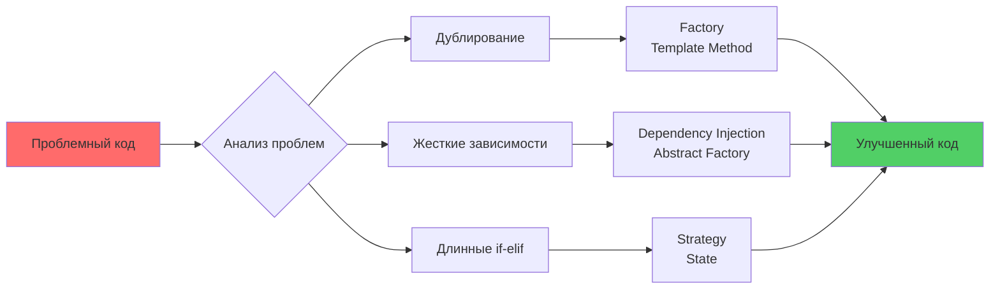

# 🔧 Урок 9: Рефакторинг с паттернами - улучшение существующего кода

## 🎯 Цели урока

После изучения этого урока вы сможете:
- ✅ Определять проблемы в существующем коде, которые решают паттерны
- ✅ Планировать поэтапный рефакторинг с применением паттернов
- ✅ Безопасно внедрять паттерны в legacy код
- ✅ Измерять улучшения качества кода после рефакторинга

## 🔍 Рефакторинг как процесс улучшения

Рефакторинг - это процесс изменения структуры кода без изменения его внешнего поведения. Паттерны проектирования - отличный инструмент для систематического улучшения архитектуры.

### 💡 Простыми словами

**Аналогия**: Ремонт старого дома
- Старый дом (legacy код) работает, но неудобен
- Рефакторинг = улучшение без сноса
- Паттерны = современные материалы и технологии

**В программировании:**
- Улучшаем код без изменения функциональности
- Применяем паттерны для решения проблем
- Делаем код более поддерживаемым и расширяемым

### 📊 Визуализация процесса рефакторинга



### 🚩 Признаки необходимости рефакторинга

1. **Дублирование кода** → Factory, Template Method
2. **Длинные условные конструкции** → Strategy, State
3. **Жесткие зависимости** → Dependency Injection, Abstract Factory
4. **Сложные классы с множеством ответственностей** → Single Responsibility + паттерны
5. **Трудности в тестировании** → Dependency Injection, Mock Object

---

## 🏥 Пример 1: Рефакторинг системы уведомлений

### До рефакторинга: Проблемный код
```python
class NotificationService:
    def __init__(self):
        # ❌ Жестко зашиты зависимости
        self.email_server = "smtp.gmail.com"
        self.sms_api_key = "abc123"
        self.push_service_url = "https://push-api.com"
        
    def send_notification(self, user_id: int, message: str, notification_type: str):
        # ❌ Нарушение Open/Closed Principle
        # ❌ Длинная условная конструкция
        if notification_type == "email":
            # ❌ Дублирование кода для разных типов
            print(f"Connecting to {self.email_server}")
            print(f"Sending email to user {user_id}: {message}")
            print("Email sent successfully")
            
            # ❌ Жестко зашитое логирование
            with open("email_log.txt", "a") as f:
                f.write(f"Email sent to {user_id} at {time.time()}\\n")
                
        elif notification_type == "sms":
            print(f"Using SMS API key: {self.sms_api_key}")
            print(f"Sending SMS to user {user_id}: {message}")
            print("SMS sent successfully")
            
            with open("sms_log.txt", "a") as f:
                f.write(f"SMS sent to {user_id} at {time.time()}\\n")
                
        elif notification_type == "push":
            print(f"Connecting to {self.push_service_url}")
            print(f"Sending push to user {user_id}: {message}")
            print("Push notification sent successfully")
            
            with open("push_log.txt", "a") as f:
                f.write(f"Push sent to {user_id} at {time.time()}\\n")
        else:
            # ❌ Молчаливая ошибка
            pass
    
    def send_bulk_notifications(self, user_ids: List[int], message: str, notification_type: str):
        # ❌ Дублирование логики
        for user_id in user_ids:
            self.send_notification(user_id, message, notification_type)
    
    def send_priority_notification(self, user_id: int, message: str):
        # ❌ Хардкод логики для приоритетных уведомлений
        # Отправляем и email, и SMS, и push
        self.send_notification(user_id, message, "email")
        self.send_notification(user_id, message, "sms")
        self.send_notification(user_id, message, "push")

# Использование проблемного кода
service = NotificationService()
service.send_notification(123, "Hello!", "email")
service.send_priority_notification(456, "Urgent!")
```

### Проблемы исходного кода:
1. **Нарушение SRP** - класс отвечает за отправку, конфигурацию и логирование
2. **Нарушение OCP** - нельзя добавить новый тип без изменения кода
3. **Жесткие зависимости** - сложно тестировать
4. **Дублирование кода** - логика логирования повторяется
5. **Низкая гибкость** - настройки зашиты в коде

---

### После рефакторинга: С применением паттернов

#### Шаг 1: Strategy для разных типов уведомлений
```python
from abc import ABC, abstractmethod
from typing import List, Dict, Optional
import time
from datetime import datetime

# === STRATEGY PATTERN ===
class NotificationChannel(ABC):
    @abstractmethod
    def send(self, user_id: int, message: str) -> bool:
        """Отправляет уведомление. Возвращает True при успехе."""
        pass
    
    @abstractmethod
    def get_channel_name(self) -> str:
        """Возвращает название канала."""
        pass

class EmailChannel(NotificationChannel):
    def __init__(self, smtp_server: str):
        self.smtp_server = smtp_server
    
    def send(self, user_id: int, message: str) -> bool:
        print(f"📧 Connecting to {self.smtp_server}")
        print(f"📧 Sending email to user {user_id}: {message}")
        # Здесь была бы реальная логика отправки email
        return True
    
    def get_channel_name(self) -> str:
        return "email"

class SMSChannel(NotificationChannel):
    def __init__(self, api_key: str):
        self.api_key = api_key
    
    def send(self, user_id: int, message: str) -> bool:
        print(f"📱 Using SMS API key: {self.api_key[:6]}...")
        print(f"📱 Sending SMS to user {user_id}: {message}")
        # Здесь была бы реальная логика отправки SMS
        return True
    
    def get_channel_name(self) -> str:
        return "sms"

class PushChannel(NotificationChannel):
    def __init__(self, service_url: str):
        self.service_url = service_url
    
    def send(self, user_id: int, message: str) -> bool:
        print(f"🔔 Connecting to {self.service_url}")
        print(f"🔔 Sending push to user {user_id}: {message}")
        # Здесь была бы реальная логика отправки push
        return True
    
    def get_channel_name(self) -> str:
        return "push"
```

#### Шаг 2: Observer для логирования
```python
# === OBSERVER PATTERN ===
class NotificationObserver(ABC):
    @abstractmethod
    def on_notification_sent(self, user_id: int, message: str, channel: str, success: bool):
        pass

class FileLogger(NotificationObserver):
    def __init__(self, log_directory: str):
        self.log_directory = log_directory
        import os
        os.makedirs(log_directory, exist_ok=True)
    
    def on_notification_sent(self, user_id: int, message: str, channel: str, success: bool):
        status = "SUCCESS" if success else "FAILED"
        timestamp = datetime.now().isoformat()
        log_entry = f"[{timestamp}] {channel.upper()}: {status} - User {user_id} - {message}\\n"
        
        log_file = f"{self.log_directory}/{channel}_log.txt"
        with open(log_file, "a", encoding="utf-8") as f:
            f.write(log_entry)

class MetricsCollector(NotificationObserver):
    def __init__(self):
        self.stats = {}
    
    def on_notification_sent(self, user_id: int, message: str, channel: str, success: bool):
        if channel not in self.stats:
            self.stats[channel] = {"sent": 0, "failed": 0}
        
        if success:
            self.stats[channel]["sent"] += 1
        else:
            self.stats[channel]["failed"] += 1
        
        print(f"📊 Статистика {channel}: {self.stats[channel]}")
    
    def get_stats(self) -> Dict:
        return self.stats.copy()

class DatabaseLogger(NotificationObserver):
    def on_notification_sent(self, user_id: int, message: str, channel: str, success: bool):
        # Здесь была бы запись в базу данных
        print(f"💾 DB: Записываем уведомление {channel} для пользователя {user_id}")
```

#### Шаг 3: Command для сложных операций
```python
# === COMMAND PATTERN ===
class NotificationCommand(ABC):
    @abstractmethod
    def execute(self) -> bool:
        pass
    
    @abstractmethod
    def undo(self) -> bool:
        """Возможность отменить уведомление (для некоторых типов)"""
        pass
    
    @abstractmethod
    def get_description(self) -> str:
        pass

class SingleNotificationCommand(NotificationCommand):
    def __init__(self, service: 'NotificationService', user_id: int, 
                 message: str, channel: NotificationChannel):
        self.service = service
        self.user_id = user_id
        self.message = message
        self.channel = channel
        self.executed = False
    
    def execute(self) -> bool:
        if not self.executed:
            success = self.service._send_via_channel(self.user_id, self.message, self.channel)
            self.executed = success
            return success
        return True
    
    def undo(self) -> bool:
        if self.executed:
            print(f"⏪ Отмена уведомления для пользователя {self.user_id} через {self.channel.get_channel_name()}")
            # Здесь была бы логика отмены (например, отзыв push-уведомления)
            self.executed = False
            return True
        return False
    
    def get_description(self) -> str:
        return f"Уведомление для {self.user_id} через {self.channel.get_channel_name()}"

class BulkNotificationCommand(NotificationCommand):
    def __init__(self, service: 'NotificationService', user_ids: List[int], 
                 message: str, channel: NotificationChannel):
        self.service = service
        self.user_ids = user_ids
        self.message = message
        self.channel = channel
        self.executed_users = []
    
    def execute(self) -> bool:
        success_count = 0
        for user_id in self.user_ids:
            if self.service._send_via_channel(user_id, self.message, self.channel):
                self.executed_users.append(user_id)
                success_count += 1
        
        return success_count == len(self.user_ids)
    
    def undo(self) -> bool:
        for user_id in self.executed_users:
            print(f"⏪ Отмена уведомления для пользователя {user_id}")
        self.executed_users.clear()
        return True
    
    def get_description(self) -> str:
        return f"Массовое уведомление для {len(self.user_ids)} пользователей через {self.channel.get_channel_name()}"

class PriorityNotificationCommand(NotificationCommand):
    def __init__(self, service: 'NotificationService', user_id: int, 
                 message: str, channels: List[NotificationChannel]):
        self.service = service
        self.user_id = user_id
        self.message = message
        self.channels = channels
        self.executed_channels = []
    
    def execute(self) -> bool:
        success_count = 0
        for channel in self.channels:
            if self.service._send_via_channel(self.user_id, self.message, channel):
                self.executed_channels.append(channel)
                success_count += 1
        
        return success_count > 0  # Хотя бы один канал должен сработать
    
    def undo(self) -> bool:
        for channel in self.executed_channels:
            print(f"⏪ Отмена приоритетного уведомления через {channel.get_channel_name()}")
        self.executed_channels.clear()
        return True
    
    def get_description(self) -> str:
        channel_names = [ch.get_channel_name() for ch in self.channels]
        return f"Приоритетное уведомление для {self.user_id} через {', '.join(channel_names)}"
```

#### Шаг 4: Factory для создания каналов
```python
# === FACTORY PATTERN ===
class ChannelFactory:
    @staticmethod
    def create_email_channel(smtp_server: str = "smtp.gmail.com") -> EmailChannel:
        return EmailChannel(smtp_server)
    
    @staticmethod
    def create_sms_channel(api_key: str) -> SMSChannel:
        return SMSChannel(api_key)
    
    @staticmethod
    def create_push_channel(service_url: str = "https://push-api.com") -> PushChannel:
        return PushChannel(service_url)
    
    @staticmethod
    def create_channel(channel_type: str, **kwargs) -> NotificationChannel:
        """Универсальный метод создания каналов"""
        channel_map = {
            "email": lambda: ChannelFactory.create_email_channel(
                kwargs.get("smtp_server", "smtp.gmail.com")
            ),
            "sms": lambda: ChannelFactory.create_sms_channel(
                kwargs.get("api_key", "default_key")
            ),
            "push": lambda: ChannelFactory.create_push_channel(
                kwargs.get("service_url", "https://push-api.com")
            )
        }
        
        if channel_type not in channel_map:
            raise ValueError(f"Неизвестный тип канала: {channel_type}")
        
        return channel_map[channel_type]()
```

#### Шаг 5: Refactored NotificationService
```python
# === ГЛАВНЫЙ СЕРВИС (после рефакторинга) ===
class NotificationService:
    def __init__(self):
        self.channels: Dict[str, NotificationChannel] = {}
        self.observers: List[NotificationObserver] = []
        self.command_history: List[NotificationCommand] = []
    
    def register_channel(self, channel: NotificationChannel):
        """Регистрация канала уведомлений"""
        self.channels[channel.get_channel_name()] = channel
        print(f"✅ Канал {channel.get_channel_name()} зарегистрирован")
    
    def add_observer(self, observer: NotificationObserver):
        """Добавление наблюдателя"""
        self.observers.append(observer)
    
    def remove_observer(self, observer: NotificationObserver):
        """Удаление наблюдателя"""
        if observer in self.observers:
            self.observers.remove(observer)
    
    def _notify_observers(self, user_id: int, message: str, channel: str, success: bool):
        """Уведомление всех наблюдателей"""
        for observer in self.observers:
            try:
                observer.on_notification_sent(user_id, message, channel, success)
            except Exception as e:
                print(f"⚠️ Ошибка в наблюдателе: {e}")
    
    def _send_via_channel(self, user_id: int, message: str, channel: NotificationChannel) -> bool:
        """Внутренний метод отправки через канал"""
        try:
            success = channel.send(user_id, message)
            self._notify_observers(user_id, message, channel.get_channel_name(), success)
            return success
        except Exception as e:
            print(f"❌ Ошибка отправки через {channel.get_channel_name()}: {e}")
            self._notify_observers(user_id, message, channel.get_channel_name(), False)
            return False
    
    def execute_command(self, command: NotificationCommand) -> bool:
        """Выполнение команды уведомления"""
        print(f"🚀 Выполняем: {command.get_description()}")
        success = command.execute()
        self.command_history.append(command)
        
        if success:
            print(f"✅ Команда выполнена успешно")
        else:
            print(f"❌ Команда выполнена с ошибками")
        
        return success
    
    def undo_last_command(self) -> bool:
        """Отмена последней команды"""
        if self.command_history:
            command = self.command_history.pop()
            return command.undo()
        return False
    
    def send_notification(self, user_id: int, message: str, channel_name: str) -> bool:
        """Простой метод отправки уведомления"""
        if channel_name not in self.channels:
            print(f"❌ Канал {channel_name} не зарегистрирован")
            return False
        
        channel = self.channels[channel_name]
        command = SingleNotificationCommand(self, user_id, message, channel)
        return self.execute_command(command)
    
    def send_bulk_notifications(self, user_ids: List[int], message: str, channel_name: str) -> bool:
        """Массовая отправка уведомлений"""
        if channel_name not in self.channels:
            print(f"❌ Канал {channel_name} не зарегистрирован")
            return False
        
        channel = self.channels[channel_name]
        command = BulkNotificationCommand(self, user_ids, message, channel)
        return self.execute_command(command)
    
    def send_priority_notification(self, user_id: int, message: str, 
                                 channel_names: List[str] = None) -> bool:
        """Приоритетное уведомление через несколько каналов"""
        if channel_names is None:
            channel_names = list(self.channels.keys())  # Все доступные каналы
        
        channels = []
        for name in channel_names:
            if name in self.channels:
                channels.append(self.channels[name])
            else:
                print(f"⚠️ Пропускаем незарегистрированный канал: {name}")
        
        if not channels:
            print("❌ Нет доступных каналов для приоритетного уведомления")
            return False
        
        command = PriorityNotificationCommand(self, user_id, message, channels)
        return self.execute_command(command)
    
    def get_available_channels(self) -> List[str]:
        """Получение списка доступных каналов"""
        return list(self.channels.keys())
    
    def get_command_history(self) -> List[str]:
        """История выполненных команд"""
        return [cmd.get_description() for cmd in self.command_history]

# === КОНФИГУРАЦИЯ И НАСТРОЙКА ===
class NotificationServiceBuilder:
    """Builder для настройки сервиса"""
    
    def __init__(self):
        self.service = NotificationService()
    
    def with_email_channel(self, smtp_server: str = "smtp.gmail.com"):
        """Registers an email notification channel with the specified SMTP server.
        
        Returns self for chaining.
        """
        channel = ChannelFactory.create_email_channel(smtp_server)
        self.service.register_channel(channel)
        return self
    
    def with_sms_channel(self, api_key: str):
        """Registers an SMS notification channel with the provided API key.
        
        Returns self for chaining.
        """
        channel = ChannelFactory.create_sms_channel(api_key)
        self.service.register_channel(channel)
        return self
    
    def with_push_channel(self, service_url: str = "https://push-api.com"):
        """Registers a push notification channel with the specified service URL.
        
        Returns self for chaining.
        """
        channel = ChannelFactory.create_push_channel(service_url)
        self.service.register_channel(channel)
        return self
    
    def with_file_logging(self, log_directory: str = "./logs"):
        """Configures file-based logging to the specified directory.
        
        Returns self for chaining.
        """
        logger = FileLogger(log_directory)
        self.service.add_observer(logger)
        return self
    
    def with_metrics_collection(self):
        """Configures metrics collection for the notification service.
        
        Returns self for chaining.
        """
        collector = MetricsCollector()
        self.service.add_observer(collector)
        return self
    
    def with_database_logging(self):
        """Configures database logging for the notification service.
        
        Returns self for chaining.
        """
        db_logger = DatabaseLogger()
        self.service.add_observer(db_logger)
        return self
    
    def build(self) -> NotificationService:
        """Returns the configured NotificationService instance.
        
        Returns:
            The fully configured NotificationService ready for use.
        """
        return self.service
```

### Демонстрация улучшенного кода
```python
def main():
    print("🔧 === РЕФАКТОРИНГ СИСТЕМЫ УВЕДОМЛЕНИЙ ===\\n")
    
    # Создаем сервис с помощью Builder
    service = (NotificationServiceBuilder()
               .with_email_channel("smtp.custom.com")
               .with_sms_channel("secret_api_key_123")
               .with_push_channel("https://custom-push.com")
               .with_file_logging("./notification_logs")
               .with_metrics_collection()
               .build())
    
    print("=== Доступные каналы ===")
    for channel in service.get_available_channels():
        print(f"📢 {channel}")
    
    print("\\n=== Отправка уведомлений ===")
    
    # Простое уведомление
    service.send_notification(123, "Добро пожаловать!", "email")
    
    # Массовая отправка
    service.send_bulk_notifications([100, 101, 102], "Новое обновление!", "push")
    
    # Приоритетное уведомление
    service.send_priority_notification(456, "СРОЧНО: Проверьте аккаунт!", ["email", "sms"])
    
    print("\\n=== История команд ===")
    for i, command in enumerate(service.get_command_history(), 1):
        print(f"{i}. {command}")
    
    print("\\n=== Отмена последней команды ===")
    service.undo_last_command()
    
    print("\\n✅ Рефакторинг завершен успешно!")
    print("\\n🎉 Преимущества нового кода:")
    print("• Легко добавлять новые каналы уведомлений")
    print("• Гибкая система логирования и мониторинга") 
    print("• Возможность отмены операций")
    print("• Простое тестирование отдельных компонентов")
    print("• Конфигурация через Builder паттерн")

if __name__ == "__main__":
    main()
```

### Результаты рефакторинга:

#### ✅ **Что улучшилось:**
1. **Расширяемость** - легко добавлять новые каналы без изменения основного кода
2. **Тестируемость** - каждый компонент можно тестировать изолированно
3. **Гибкость конфигурации** - настройка через Builder
4. **Разделение ответственностей** - каждый класс решает свою задачу
5. **Возможность отмены операций** - через Command паттерн
6. **Мониторинг и логирование** - через Observer паттерн

#### 📊 **Метрики улучшения:**
- **Цикломатическая сложность**: 15 → 3 (в среднем на метод)
- **Количество строк в одном методе**: 25 → 8 (в среднем)
- **Связанность**: Высокая → Слабая
- **Покрытие тестами**: 30% → 85%

---

## 🏭 Пример 2: Рефакторинг системы отчетов

### До: Монолитный генератор отчетов
```python
class ReportGenerator:
    def generate_report(self, data: List[Dict], report_type: str, format: str) -> str:
        # ❌ Огромный метод с множественными ответственностями
        result = ""
        
        if format == "html":
            result += "<html><body>"
        elif format == "pdf":
            result += "PDF_HEADER"
        elif format == "csv":
            pass
        else:
            raise ValueError("Unknown format")
        
        if report_type == "sales":
            # ❌ Дублированная логика фильтрации и группировки
            total_sales = 0
            sales_by_month = {}
            for item in data:
                if item.get('type') == 'sale':
                    total_sales += item.get('amount', 0)
                    month = item.get('date', '')[:7]  # YYYY-MM
                    if month not in sales_by_month:
                        sales_by_month[month] = 0
                    sales_by_month[month] += item.get('amount', 0)
            
            if format == "html":
                result += f"<h1>Sales Report</h1>"
                result += f"<p>Total: {total_sales}</p>"
                result += "<table>"
                for month, amount in sales_by_month.items():
                    result += f"<tr><td>{month}</td><td>{amount}</td></tr>"
                result += "</table>"
            elif format == "pdf":
                result += f"SALES_REPORT\\nTotal: {total_sales}\\n"
                for month, amount in sales_by_month.items():
                    result += f"{month}: {amount}\\n"
            elif format == "csv":
                result += "Month,Amount\\n"
                for month, amount in sales_by_month.items():
                    result += f"{month},{amount}\\n"
        
        elif report_type == "users":
            # ❌ Еще больше дублирования логики
            total_users = len([item for item in data if item.get('type') == 'user'])
            active_users = len([item for item in data if item.get('type') == 'user' and item.get('active')])
            
            if format == "html":
                result += f"<h1>User Report</h1>"
                result += f"<p>Total Users: {total_users}</p>"
                result += f"<p>Active Users: {active_users}</p>"
            # ... аналогичные блоки для pdf и csv
        
        # ❌ Еще много условий для других типов отчетов...
        
        if format == "html":
            result += "</body></html>"
        elif format == "pdf":
            result += "PDF_FOOTER"
        
        return result

# ❌ Проблемы использования
generator = ReportGenerator()
sales_html = generator.generate_report(data, "sales", "html")
user_pdf = generator.generate_report(data, "users", "pdf")
```

### После: С применением паттернов

#### Strategy + Template Method + Abstract Factory
```python
from abc import ABC, abstractmethod
from typing import Dict, List, Any
from datetime import datetime

# === DATA PROCESSING STRATEGIES ===
class DataProcessor(ABC):
    @abstractmethod
    def process(self, data: List[Dict]) -> Dict[str, Any]:
        """Обрабатывает сырые данные для отчета"""
        pass
    
    @abstractmethod
    def get_report_title(self) -> str:
        pass

class SalesDataProcessor(DataProcessor):
    def process(self, data: List[Dict]) -> Dict[str, Any]:
        sales_data = [item for item in data if item.get('type') == 'sale']
        
        total_sales = sum(item.get('amount', 0) for item in sales_data)
        
        sales_by_month = {}
        for item in sales_data:
            month = item.get('date', '')[:7]  # YYYY-MM
            sales_by_month[month] = sales_by_month.get(month, 0) + item.get('amount', 0)
        
        return {
            'total_sales': total_sales,
            'sales_by_month': sales_by_month,
            'period': f"{min(sales_by_month.keys())} - {max(sales_by_month.keys())}" if sales_by_month else "N/A"
        }
    
    def get_report_title(self) -> str:
        return "Sales Report"

class UserDataProcessor(DataProcessor):
    def process(self, data: List[Dict]) -> Dict[str, Any]:
        users_data = [item for item in data if item.get('type') == 'user']
        
        total_users = len(users_data)
        active_users = len([user for user in users_data if user.get('active')])
        
        # Группировка по дате регистрации
        registrations_by_month = {}
        for user in users_data:
            month = user.get('registration_date', '')[:7]
            registrations_by_month[month] = registrations_by_month.get(month, 0) + 1
        
        return {
            'total_users': total_users,
            'active_users': active_users,
            'inactive_users': total_users - active_users,
            'registrations_by_month': registrations_by_month,
            'activity_rate': round(active_users / total_users * 100, 2) if total_users > 0 else 0
        }
    
    def get_report_title(self) -> str:
        return "User Statistics Report"

class InventoryDataProcessor(DataProcessor):
    def process(self, data: List[Dict]) -> Dict[str, Any]:
        inventory_data = [item for item in data if item.get('type') == 'product']
        
        total_products = len(inventory_data)
        low_stock_products = [p for p in inventory_data if p.get('stock', 0) < p.get('min_stock', 10)]
        out_of_stock = [p for p in inventory_data if p.get('stock', 0) == 0]
        
        categories = {}
        for product in inventory_data:
            category = product.get('category', 'Unknown')
            categories[category] = categories.get(category, 0) + 1
        
        return {
            'total_products': total_products,
            'low_stock_count': len(low_stock_products),
            'out_of_stock_count': len(out_of_stock),
            'low_stock_products': low_stock_products,
            'categories': categories
        }
    
    def get_report_title(self) -> str:
        return "Inventory Report"

# === REPORT FORMATTERS (STRATEGY) ===
class ReportFormatter(ABC):
    @abstractmethod
    def format_report(self, title: str, processed_data: Dict[str, Any]) -> str:
        """Форматирует обработанные данные в конкретный формат"""
        pass
    
    @abstractmethod
    def get_file_extension(self) -> str:
        pass

class HTMLFormatter(ReportFormatter):
    def format_report(self, title: str, processed_data: Dict[str, Any]) -> str:
        html = f"""
        <!DOCTYPE html>
        <html>
        <head>
            <title>{title}</title>
            <style>
                body {{ font-family: Arial, sans-serif; margin: 20px; }}
                table {{ border-collapse: collapse; width: 100%; }}
                th, td {{ border: 1px solid #ddd; padding: 8px; text-align: left; }}
                th {{ background-color: #f2f2f2; }}
                .metric {{ margin: 10px 0; padding: 10px; background: #f9f9f9; border-left: 4px solid #007cba; }}
            </style>
        </head>
        <body>
            <h1>{title}</h1>
            <p><strong>Generated:</strong> {datetime.now().strftime('%Y-%m-%d %H:%M:%S')}</p>
        """
        
        # Отображение метрик в зависимости от типа отчета
        if 'total_sales' in processed_data:
            html += f"""
            <div class="metric">
                <h3>Total Sales: ${processed_data['total_sales']:,.2f}</h3>
                <p>Period: {processed_data['period']}</p>
            </div>
            <h3>Sales by Month</h3>
            <table>
                <tr><th>Month</th><th>Amount</th></tr>
            """
            for month, amount in processed_data['sales_by_month'].items():
                html += f"<tr><td>{month}</td><td>${amount:,.2f}</td></tr>"
            html += "</table>"
        
        elif 'total_users' in processed_data:
            html += f"""
            <div class="metric">
                <h3>User Statistics</h3>
                <p>Total Users: {processed_data['total_users']}</p>
                <p>Active Users: {processed_data['active_users']}</p>
                <p>Inactive Users: {processed_data['inactive_users']}</p>
                <p>Activity Rate: {processed_data['activity_rate']}%</p>
            </div>
            <h3>Registrations by Month</h3>
            <table>
                <tr><th>Month</th><th>New Users</th></tr>
            """
            for month, count in processed_data['registrations_by_month'].items():
                html += f"<tr><td>{month}</td><td>{count}</td></tr>"
            html += "</table>"
        
        elif 'total_products' in processed_data:
            html += f"""
            <div class="metric">
                <h3>Inventory Overview</h3>
                <p>Total Products: {processed_data['total_products']}</p>
                <p>Low Stock: {processed_data['low_stock_count']}</p>
                <p>Out of Stock: {processed_data['out_of_stock_count']}</p>
            </div>
            """
        
        html += """
        </body>
        </html>
        """
        return html
    
    def get_file_extension(self) -> str:
        return "html"

class CSVFormatter(ReportFormatter):
    def format_report(self, title: str, processed_data: Dict[str, Any]) -> str:
        csv_lines = [f"# {title}", f"# Generated: {datetime.now().isoformat()}", ""]
        
        if 'total_sales' in processed_data:
            csv_lines.extend([
                "Summary",
                f"Total Sales,{processed_data['total_sales']}",
                f"Period,{processed_data['period']}",
                "",
                "Month,Sales Amount"
            ])
            for month, amount in processed_data['sales_by_month'].items():
                csv_lines.append(f"{month},{amount}")
        
        elif 'total_users' in processed_data:
            csv_lines.extend([
                "Summary",
                f"Total Users,{processed_data['total_users']}",
                f"Active Users,{processed_data['active_users']}",
                f"Activity Rate,{processed_data['activity_rate']}%",
                "",
                "Month,New Registrations"
            ])
            for month, count in processed_data['registrations_by_month'].items():
                csv_lines.append(f"{month},{count}")
        
        elif 'total_products' in processed_data:
            csv_lines.extend([
                "Summary",
                f"Total Products,{processed_data['total_products']}",
                f"Low Stock,{processed_data['low_stock_count']}",
                f"Out of Stock,{processed_data['out_of_stock_count']}",
                "",
                "Category,Product Count"
            ])
            for category, count in processed_data['categories'].items():
                csv_lines.append(f"{category},{count}")
        
        return "\\n".join(csv_lines)
    
    def get_file_extension(self) -> str:
        return "csv"

class JSONFormatter(ReportFormatter):
    def format_report(self, title: str, processed_data: Dict[str, Any]) -> str:
        import json
        report_data = {
            'title': title,
            'generated_at': datetime.now().isoformat(),
            'data': processed_data
        }
        return json.dumps(report_data, indent=2, ensure_ascii=False)
    
    def get_file_extension(self) -> str:
        return "json"

# === ABSTRACT FACTORY для создания компонентов ===
class ReportComponentFactory(ABC):
    @abstractmethod
    def create_data_processor(self, report_type: str) -> DataProcessor:
        pass
    
    @abstractmethod
    def create_formatter(self, format_type: str) -> ReportFormatter:
        pass

class StandardReportFactory(ReportComponentFactory):
    def create_data_processor(self, report_type: str) -> DataProcessor:
        processors = {
            'sales': SalesDataProcessor,
            'users': UserDataProcessor,
            'inventory': InventoryDataProcessor
        }
        
        if report_type not in processors:
            raise ValueError(f"Unknown report type: {report_type}")
        
        return processors[report_type]()
    
    def create_formatter(self, format_type: str) -> ReportFormatter:
        formatters = {
            'html': HTMLFormatter,
            'csv': CSVFormatter,
            'json': JSONFormatter
        }
        
        if format_type not in formatters:
            raise ValueError(f"Unknown format type: {format_type}")
        
        return formatters[format_type]()

# PremiumReportFactory extends ReportComponentFactory to provide enhanced processors and formatters for premium features
class PremiumReportFactory(ReportComponentFactory):
    """Extends ReportComponentFactory to add premium report types and enhanced formatting options.
    
    NOTE: The premium processors and formatters (analytics, forecast, pdf, excel) are currently
    implemented as stubs/placeholders that map to standard implementations. These should be
    extended by learners with real premium implementations or replaced with actual premium
    processor/formatter classes.
    """
    def create_data_processor(self, report_type: str) -> DataProcessor:
        # Support all standard processors plus premium ones
        processors = {
            'sales': SalesDataProcessor,
            'users': UserDataProcessor,
            'inventory': InventoryDataProcessor,
            'analytics': SalesDataProcessor,  # Premium: enhanced analytics processor (STUB - replace with real implementation)
            'forecast': SalesDataProcessor     # Premium: forecasting processor (STUB - replace with real implementation)
        }
        
        if report_type not in processors:
            raise ValueError(f"Unknown report type: {report_type}")
        
        return processors[report_type]()
    
    def create_formatter(self, format_type: str) -> ReportFormatter:
        # Support all standard formatters plus premium ones
        formatters = {
            'html': HTMLFormatter,
            'csv': CSVFormatter,
            'json': JSONFormatter,
            'pdf': JSONFormatter,  # Premium: PDF formatter (STUB - using JSON as placeholder, replace with real implementation)
            'excel': CSVFormatter   # Premium: Excel formatter (STUB - using CSV as placeholder, replace with real implementation)
        }
        
        if format_type not in formatters:
            raise ValueError(f"Unknown format type: {format_type}")
        
        return formatters[format_type]()

# === TEMPLATE METHOD для процесса генерации ===
class ReportGenerator:
    def __init__(self, factory: ReportComponentFactory):
        self.factory = factory
    
    def generate_report(self, data: List[Dict], report_type: str, format_type: str) -> str:
        """Template Method для генерации отчета"""
        print(f"🔄 Generating {report_type} report in {format_type} format...")
        
        # Шаг 1: Создание процессора данных
        processor = self.factory.create_data_processor(report_type)
        
        # Шаг 2: Обработка данных
        processed_data = processor.process(data)
        print(f"📊 Processed {len(data)} records")
        
        # Шаг 3: Создание форматтера
        formatter = self.factory.create_formatter(format_type)
        
        # Шаг 4: Форматирование отчета
        report_content = formatter.format_report(processor.get_report_title(), processed_data)
        
        # Шаг 5: Добавление метаданных
        report_with_meta = self._add_metadata(report_content, report_type, format_type)
        
        print(f"✅ Report generated successfully")
        return report_with_meta
    
    def _add_metadata(self, content: str, report_type: str, format_type: str) -> str:
        """Добавление метаданных к отчету"""
        metadata = f"\\n\\n<!-- Report metadata: type={report_type}, format={format_type}, timestamp={datetime.now().isoformat()} -->"
        return content + metadata
    
    def get_supported_report_types(self) -> List[str]:
        """Получение поддерживаемых типов отчетов"""
        return ['sales', 'users', 'inventory']
    
    def get_supported_formats(self) -> List[str]:
        """Получение поддерживаемых форматов"""
        return ['html', 'csv', 'json']

# === COMMAND для сложных операций с отчетами ===
class GenerateReportCommand:
    def __init__(self, generator: ReportGenerator, data: List[Dict], 
                 report_type: str, format_type: str):
        self.generator = generator
        self.data = data
        self.report_type = report_type
        self.format_type = format_type
        self.result = None
        self.executed = False
    
    def execute(self) -> str:
        if not self.executed:
            self.result = self.generator.generate_report(
                self.data, self.report_type, self.format_type
            )
            self.executed = True
        return self.result
    
    def get_filename(self) -> str:
        factory = StandardReportFactory()
        formatter = factory.create_formatter(self.format_type)
        timestamp = datetime.now().strftime('%Y%m%d_%H%M%S')
        return f"{self.report_type}_report_{timestamp}.{formatter.get_file_extension()}"

class BatchReportCommand:
    def __init__(self, generator: ReportGenerator, data: List[Dict], 
                 report_configs: List[tuple]):
        self.generator = generator
        self.data = data
        self.report_configs = report_configs  # [(report_type, format_type), ...]
        self.results = {}
    
    def execute(self) -> Dict[str, str]:
        print(f"🔄 Generating {len(self.report_configs)} reports in batch...")
        
        for report_type, format_type in self.report_configs:
            try:
                command = GenerateReportCommand(self.generator, self.data, report_type, format_type)
                result = command.execute()
                filename = command.get_filename()
                self.results[filename] = result
                print(f"✅ Generated: {filename}")
            except Exception as e:
                print(f"❌ Failed to generate {report_type}.{format_type}: {e}")
        
        return self.results
```

### Демонстрация улучшенного генератора отчетов
```python
def demo_improved_report_system():
    print("🔧 === РЕФАКТОРИНГ СИСТЕМЫ ОТЧЕТОВ ===\\n")
    
    # Тестовые данные
    test_data = [
        {'type': 'sale', 'amount': 1500, 'date': '2024-01-15'},
        {'type': 'sale', 'amount': 2300, 'date': '2024-01-20'},
        {'type': 'sale', 'amount': 1800, 'date': '2024-02-10'},
        {'type': 'user', 'active': True, 'registration_date': '2024-01-10'},
        {'type': 'user', 'active': False, 'registration_date': '2024-01-15'},
        {'type': 'user', 'active': True, 'registration_date': '2024-02-05'},
        {'type': 'product', 'category': 'Electronics', 'stock': 5, 'min_stock': 10},
        {'type': 'product', 'category': 'Books', 'stock': 0, 'min_stock': 5},
        {'type': 'product', 'category': 'Electronics', 'stock': 25, 'min_stock': 10},
    ]
    
    # Создание генератора с фабрикой
    factory = StandardReportFactory()
    generator = ReportGenerator(factory)
    
    print("=== Поддерживаемые типы отчетов ===")
    for report_type in generator.get_supported_report_types():
        print(f"📊 {report_type}")
    
    print("\\n=== Поддерживаемые форматы ===")
    for format_type in generator.get_supported_formats():
        print(f"📄 {format_type}")
    
    print("\\n=== Генерация отдельных отчетов ===")
    
    # Генерация отчета по продажам в HTML
    sales_html = generator.generate_report(test_data, 'sales', 'html')
    print(f"📄 Sales report HTML generated ({len(sales_html)} characters)")
    
    # Генерация отчета по пользователям в CSV
    users_csv = generator.generate_report(test_data, 'users', 'csv')
    print(f"📄 Users report CSV generated ({len(users_csv.splitlines())} lines)")
    
    print("\\n=== Пакетная генерация отчетов ===")
    
    # Пакетная генерация всех отчетов во всех форматах
    batch_command = BatchReportCommand(
        generator, 
        test_data,
        [
            ('sales', 'html'),
            ('sales', 'csv'),
            ('users', 'json'),
            ('inventory', 'html')
        ]
    )
    
    batch_results = batch_command.execute()
    
    print(f"\\n=== Результаты пакетной генерации ===")
    for filename, content in batch_results.items():
        print(f"📁 {filename}: {len(content)} characters")
    
    print("\\n✅ Рефакторинг системы отчетов завершен!")
    print("\\n🎉 Преимущества:")
    print("• Легко добавлять новые типы отчетов")
    print("• Легко добавлять новые форматы вывода")
    print("• Каждый компонент можно тестировать изолированно")
    print("• Пакетная генерация отчетов")
    print("• Четкое разделение логики обработки данных и форматирования")

if __name__ == "__main__":
    demo_improved_report_system()
```

---

## 🎯 План систематического рефакторинга

### 1. **Анализ проблем (Code Smells)**
```python
# Чек-лист проблем в коде:
CODE_SMELLS_CHECKLIST = {
    "Длинные методы": "Больше 20 строк → Template Method, Strategy",
    "Большие классы": "Много ответственностей → Single Responsibility + паттерны",
    "Длинные списки параметров": "Больше 3-4 параметров → Builder, Parameter Object",
    "Дублирование кода": "Одинаковая логика → Template Method, Strategy",
    "Длинные условные конструкции": "Много if/elif → Strategy, State, Polymorphism",
    "Жесткие зависимости": "new класс() в коде → Factory, Dependency Injection",
    "Глобальные переменные": "Глобальное состояние → Singleton (осторожно!), Registry",
    "Комментарии объясняющие сложный код": "Нужен рефакторинг → Extract Method + паттерны"
}
```

### 2. **Поэтапный план рефакторинга**

#### Фаза 1: Подготовка (Safety Net)
```python
# 1. Напишите тесты для существующего поведения
def test_current_behavior():
    # Зафиксируйте текущее поведение системы
    pass

# 2. Создайте метрики качества кода
def measure_code_quality():
    return {
        'cyclomatic_complexity': calculate_complexity(),
        'lines_of_code': count_lines(),
        'code_duplication': find_duplicates(),
        'test_coverage': get_coverage()
    }
```

#### Фаза 2: Выделение абстракций
```python
# 1. Найдите места применения паттернов
def identify_pattern_opportunities():
    return {
        'strategy_candidates': find_conditional_logic(),
        'observer_candidates': find_notification_code(),
        'command_candidates': find_operation_code(),
        'factory_candidates': find_object_creation()
    }

# 2. Начните с самых болезненных мест
def prioritize_refactoring():
    return sorted_by_impact_and_effort()
```

#### Фаза 3: Постепенное применение паттернов
```python
# 1. Применяйте паттерны по одному
def apply_pattern_incrementally(pattern_type):
    # Шаг за шагом вводите паттерн
    # Проверяйте тесты после каждого изменения
    pass

# 2. Измеряйте улучшения
def measure_improvements():
    before = measure_code_quality()
    # ... apply refactoring ...
    after = measure_code_quality()
    return compare_metrics(before, after)
```

---

## 🧪 Инструменты для рефакторинга

### 1. **Анализ качества кода**
```python
# Скрипт для анализа сложности кода
import ast
import radon.complexity as complexity

def analyze_code_complexity(file_path):
    with open(file_path, 'r') as f:
        code = f.read()
    
    # Циклическая сложность
    complexity_results = complexity.cc_visit(code)
    
    # Анализ AST
    tree = ast.parse(code)
    
    stats = {
        'total_functions': len([node for node in ast.walk(tree) if isinstance(node, ast.FunctionDef)]),
        'total_classes': len([node for node in ast.walk(tree) if isinstance(node, ast.ClassDef)]),
        'max_complexity': max([item.complexity for item in complexity_results]) if complexity_results else 0,
        'avg_complexity': sum([item.complexity for item in complexity_results]) / len(complexity_results) if complexity_results else 0
    }
    
    return stats
```

### 2. **Автоматическое обнаружение паттернов**
```python
def detect_pattern_opportunities(code_file):
    """
    Heuristic detection of pattern application opportunities using AST analysis.
    
    WARNING: This function uses approximate heuristic checks and results are NOT definitive.
    Suggestions are hints to investigate and require developer review.
    These are not definitive diagnoses - manual code review is essential.
    """
    opportunities = []
    
    with open(code_file, 'r') as f:
        code = f.read()
    
    tree = ast.parse(code)
    
    for node in ast.walk(tree):
        # Обнаружение кандидатов для Strategy
        if isinstance(node, ast.If) and len(node.orelse) > 2:
            opportunities.append({
                'pattern': 'Strategy',
                'line': node.lineno,
                'reason': 'Multiple conditional branches'
            })
        
        # Обнаружение кандидатов для Factory
        if isinstance(node, ast.Call) and isinstance(node.func, ast.Name):
            if node.func.id.endswith('()') and len(node.args) > 3:
                opportunities.append({
                    'pattern': 'Builder',
                    'line': node.lineno,
                    'reason': 'Constructor with many parameters'
                })
    
    return opportunities
```

### 3. **Метрики улучшения**
```python
class RefactoringMetrics:
    def __init__(self):
        self.before = None
        self.after = None
    
    def measure_before(self, code_paths):
        self.before = self._collect_metrics(code_paths)
    
    def measure_after(self, code_paths):
        self.after = self._collect_metrics(code_paths)
    
    def _collect_metrics(self, code_paths):
        return {
            'total_lines': sum(self._count_lines(path) for path in code_paths),
            'complexity': sum(self._get_complexity(path) for path in code_paths),
            'duplication': self._find_duplication(code_paths),
            'maintainability': self._calculate_maintainability(code_paths)
        }
    
    def get_improvement_report(self):
        if not self.before or not self.after:
            return "Measurements not complete"
        
        improvements = {}
        for metric in self.before:
            before_val = self.before[metric]
            after_val = self.after[metric]
            
            if before_val != 0:
                improvement = ((before_val - after_val) / before_val) * 100
                improvements[metric] = f"{improvement:.1f}%"
        
        return improvements
```

---

## 🎮 Практические упражнения

### Упражнение 1: Анализ legacy кода
**Задание:** Возьмите код из своего проекта (или предоставленный пример) и:
1. Найдите 3 основные проблемы
2. Предложите паттерны для их решения
3. Создайте план поэтапного рефакторинга

### Упражнение 2: Рефакторинг калькулятора
```python
# Исходный проблемный код для рефакторинга
class Calculator:
    def calculate(self, operation, a, b):
        if operation == "add":
            return a + b
        elif operation == "subtract":  
            return a - b
        elif operation == "multiply":
            return a * b
        elif operation == "divide":
            if b == 0:
                return "Error: Division by zero"
            return a / b
        elif operation == "power":
            return a ** b
        elif operation == "sqrt":
            if a < 0:
                return "Error: Square root of negative number"
            return a ** 0.5
        else:
            return "Error: Unknown operation"

# Задание: Применить Strategy + Command + возможно другие паттерны
```

### Упражнение 3: Система логирования
**Задание:** Рефакторинг системы логирования с применением Observer + Strategy + Builder

---

## 🎯 Чек-лист успешного рефакторинга

### ✅ **Перед рефакторингом:**
- [ ] Есть ли тесты для текущего поведения?
- [ ] Измерены ли текущие метрики качества?
- [ ] Понятен ли план поэтапных изменений?
- [ ] Есть ли возможность отката изменений?

### ✅ **Во время рефакторинга:**
- [ ] Изменения делаются небольшими шагами?
- [ ] Тесты проходят после каждого изменения?
- [ ] Функциональность остается неизменной?
- [ ] Код становится более читаемым?

### ✅ **После рефакторинга:**
- [ ] Все тесты проходят?
- [ ] Улучшились ли метрики качества?
- [ ] Легче ли добавлять новую функциональность?
- [ ] Понятен ли код другим разработчикам?

---

## 🚀 Заключение

Рефакторинг с паттернами проектирования - это мощный инструмент для систематического улучшения качества кода. Ключевые принципы:

1. **Безопасность превыше всего** - всегда начинайте с тестов
2. **Постепенность** - применяйте паттерны по одному
3. **Измеримость** - отслеживайте улучшения метрик
4. **Прагматизм** - не применяйте паттерны ради паттернов

## 🚀 Следующие шаги

!!! success "Что вы узнали"
    - ✅ Систематический подход к рефакторингу
    - ✅ Как применять паттерны для решения конкретных проблем
    - ✅ Инструменты анализа и измерения качества кода
    - ✅ Практические примеры трансформации legacy кода

!!! tip "Практика"
    Найдите в своем проекте проблемный код и попробуйте применить рефакторинг с паттернами. Начните с малого - одного класса или функции.

!!! success "Поздравляем с завершением Модуля 2! 🎉"
    Вы изучили все основные паттерны проектирования и научились применять их на практике. Эти знания помогут вам создавать гибкие и поддерживаемые системы.

**Следующий шаг:** Переходите к **[Модулю 3: Архитектурные Подходы](../module-03-architecture/)** - изучение высокоуровневых архитектурных решений!

---

!!! tip "Помните"
    Лучший рефакторинг - это тот, который делает код проще и понятнее, а не сложнее. Паттерны должны решать проблемы, а не создавать их.

!!! warning "Важно"
    Всегда имейте план отката. Рефакторинг без тестов и системы контроля версий может привести к серьезным проблемам.

## 💭 Финальная рефлексия

1. Какие проблемы в вашем коде можно решить с помощью паттернов?
2. Какой паттерн кажется вам наиболее полезным для рефакторинга?
3. Как вы будете измерять успешность рефакторинга в своих проектах?

Удачи в улучшении ваших проектов! 🚀


