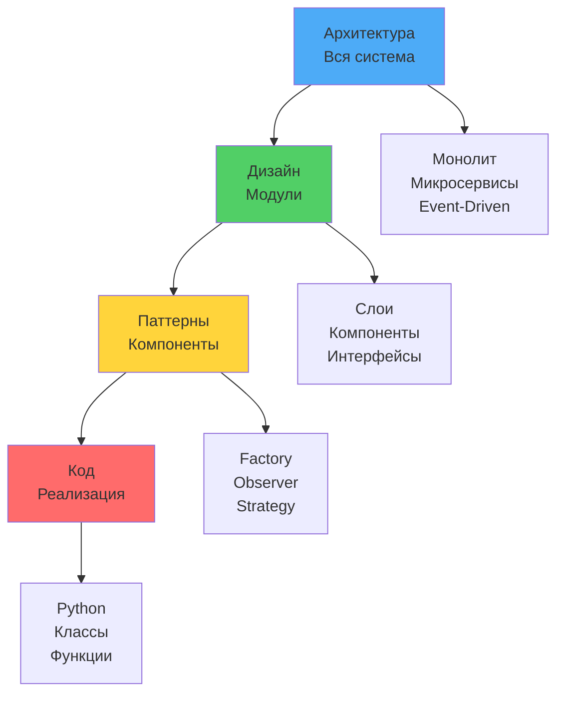
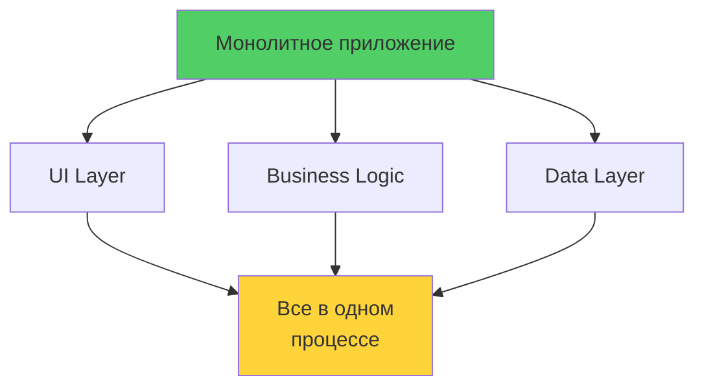
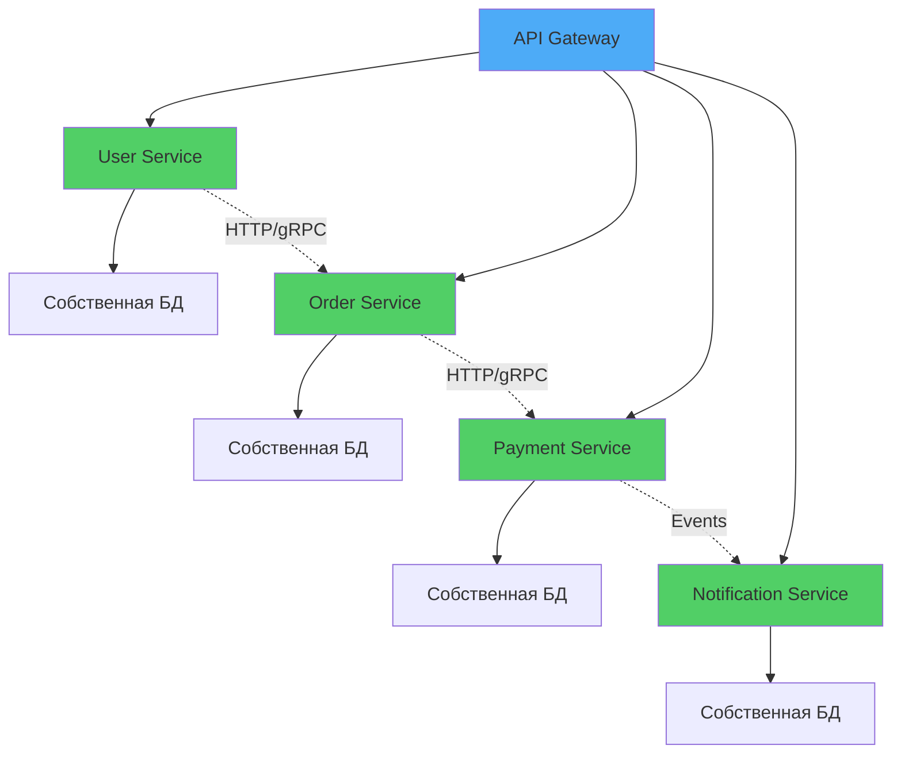
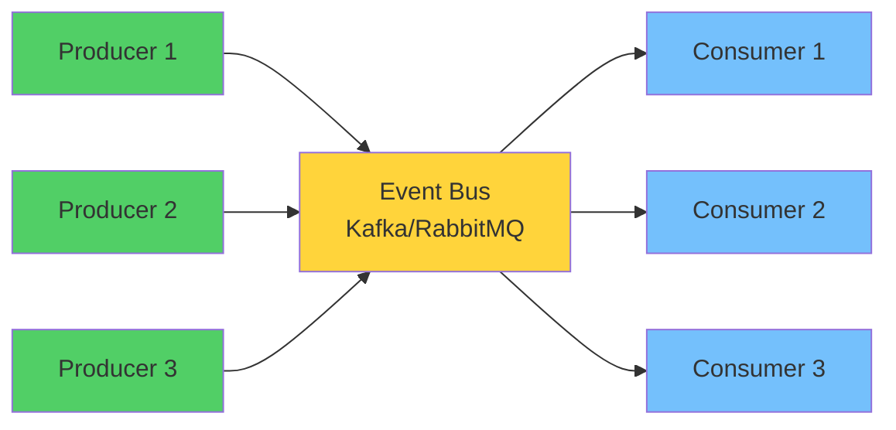

# 🏗 Урок 1: Введение в архитектурные стили

## 🎯 Цели урока

После изучения этого урока вы сможете:
- ✅ Понимать различные архитектурные стили и их применение
- ✅ Оценивать преимущества и недостатки каждой архитектуры
- ✅ Выбирать подходящий архитектурный стиль для проекта
- ✅ Понимать эволюцию архитектурных подходов

## 📖 Что такое архитектурный стиль?

!!! quote "Определение архитектуры"
    **Архитектурный стиль** - это набор принципов и паттернов, определяющих структуру, взаимодействие и организацию компонентов программной системы.

### 💡 Простыми словами

**Аналогия**: Планирование города
- **Архитектура** = общий план города (где жилые районы, где промышленность)
- **Дизайн** = планировка отдельного дома (сколько комнат, где кухня)
- **Паттерны** = типовые решения (как сделать перекресток)

**В программировании:**
- **Архитектура** = как организована вся система (монолит, микросервисы)
- **Дизайн** = как устроен отдельный модуль (классы, функции)
- **Паттерны** = готовые решения (Factory, Observer)

### 📊 Визуализация уровней абстракции



### Архитектура vs Дизайн

- **Архитектура** = высокоуровневые решения для всей системы
- **Дизайн** = детальные решения для конкретных компонентов
- **Паттерны** = повторяемые решения типичных проблем

## 🏛 Классификация архитектурных стилей

### 1. **Монолитная архитектура** (Monolithic)

#### 💡 Простыми словами

**Аналогия**: Один большой дом
- Все комнаты (модули) в одном здании
- Одна входная дверь (один процесс)
- Легко перейти из комнаты в комнату (быстрые вызовы)
- Но если нужно расшириться - нужно строить весь дом заново

#### Описание
Все компоненты системы объединены в единое приложение, работающее в одном процессе.

#### 📊 Визуализация монолита



#### Структура
```
┌─────────────────────────────────────┐
│           МОНолит                    │
│  ┌─────────┐  ┌─────────┐  ┌─────┐   │
│  │  UI     │  │Business │  │Data │   │
│  │         │  │ Logic   │  │     │   │
│  └─────────┘  └─────────┘  └─────┘   │
└─────────────────────────────────────┘
```

#### Примеры
- Классические веб-приложения (Django, Rails)
- Корпоративные системы (SAP, Oracle)
- Мобильные приложения

#### Когда использовать
✅ **Плюсы:**
- Простота разработки и развертывания
- Легче тестировать и отлаживать
- Консистентность данных
- Быстрый старт проекта

❌ **Минусы:**
- Сложность масштабирования
- Трудности с командной разработкой
- Ограниченная технологическая гибкость
- Долгое время развертывания

### 2. **Микросервисная архитектура** (Microservices)

#### 💡 Простыми словами

**Аналогия**: Район с отдельными домами
- Каждый дом (сервис) независим
- У каждого свой адрес (API endpoint)
- Можно перестроить один дом, не трогая другие
- Но нужно строить дороги между домами (сеть, очереди)

#### Описание
Система разбивается на небольшие независимые сервисы, каждый из которых отвечает за конкретную бизнес-функцию.

#### 📊 Визуализация микросервисов



#### Структура
```
┌─────────┐    ┌─────────┐    ┌─────────┐
│ Service │    │ Service │    │ Service │
│   A     │◄──►│   B     │◄──►│   C     │
│         │    │         │    │         │
│ ┌─────┐ │    │ ┌─────┐ │    │ ┌─────┐ │
│ │ API │ │    │ │ API │ │    │ │ API │ │
│ └─────┘ │    │ └─────┘ │    │ └─────┘ │
└─────────┘    └─────────┘    └─────────┘
     │              │              │
     └──────────────┼──────────────┘
                    │
             ┌─────────────┐
             │   Gateway  │
             └─────────────┘
```

#### Примеры
- Netflix, Amazon, Uber
- Современные SaaS платформы
- Финтех и e-commerce системы

#### Когда использовать
✅ **Плюсы:**
- Независимое масштабирование сервисов
- Технологическая гибкость
- Упрощенная командная разработка
- Быстрое развертывание

❌ **Минусы:**
- Сложность распределенных систем
- Управление данными между сервисами
- Сложность тестирования и отладки
- Операционная сложность

### 3. **Событийная архитектура** (Event-Driven)

#### 💡 Простыми словами

**Аналогия**: Почтовая система
- Отправитель (Producer) отправляет письмо (Event)
- Почтовое отделение (Event Bus) доставляет письмо
- Получатель (Consumer) читает письмо и реагирует
- Все асинхронно - не нужно ждать ответа сразу

#### Описание
Компоненты системы взаимодействуют через события, обеспечивая слабую связность и асинхронность.

#### 📊 Визуализация Event-Driven



#### Структура
```
┌─────────────┐    ┌─────────────┐    ┌─────────────┐
│  Producer   │───▶│   Event     │───▶│ Consumer    │
│             │    │   Bus       │    │             │
│ ┌─────────┐ │    │             │    │ ┌─────────┐ │
│ │ Generate│ │    │ ┌─────────┐ │    │ │ Process │ │
│ │ Events  │ │    │ │ Queue   │ │    │ │ Events  │ │
│ └─────────┘ │    │ └─────────┘ │    │ └─────────┘ │
└─────────────┘    └─────────────┘    └─────────────┘
```

#### Примеры
- Финансовые системы (торговые платформы)
- IoT системы (датчики, умный дом)
- Системы реального времени (чат, онлайн-игры)

#### Когда использовать
✅ **Плюсы:**
- Высокая масштабируемость
- Асинхронная обработка
- Слабая связность компонентов
- Хорошая отказоустойчивость

❌ **Минусы:**
- Сложность отладки
- Eventual consistency
- Сложность тестирования
- Дополнительная инфраструктура

### 4. **Серверлес архитектура** (Serverless)

#### Описание
Приложения запускаются только по требованию, без управления серверами.

#### Структура
```
┌─────────────┐
│   Client    │
└──────┬──────┘
       │
       ▼
┌─────────────┐
│   API       │
│  Gateway    │
└──────┬──────┘
       │
       ▼
┌─────────────┐    ┌─────────────┐
│ Function A  │    │ Function B  │
│             │    │             │
│ ┌─────────┐ │    │ ┌─────────┐ │
│ │ Execute │ │    │ │ Execute │ │
│ │ on      │ │    │ │ on      │ │
│ │ Demand  │ │    │ │ Demand  │ │
│ └─────────┘ │    │ └─────────┘ │
└─────────────┘    └─────────────┘
```

#### Примеры
- AWS Lambda, Google Cloud Functions
- API backends, вебхуки
- Периодические задачи

#### Когда использовать
✅ **Плюсы:**
- Автоматическое масштабирование
- Платите только за использование
- Не нужно управлять серверами
- Быстрое развертывание

❌ **Минусы:**
- Vendor lock-in
- Холодный старт (cold start)
- Ограниченное время выполнения
- Сложность отладки

### 5. **Гибридные архитектуры**

#### Microservices + Event-Driven
```
┌─────────┐    ┌─────────────┐    ┌─────────┐
│ Service │───▶│   Event     │───▶│ Service │
│   A     │    │    Bus      │    │   B     │
│         │    │             │    │         │
│ ┌─────┐ │    │ ┌─────────┐ │    │ ┌─────┐ │
│ │Sync│ │    │ │ Queue   │ │    │ │Async│ │
│ └─────┘ │    │ └─────────┘ │    │ └─────┘ │
└─────────┘    └─────────────┘    └─────────┘
```

#### Monolithic Core + Microservices
```
┌─────────────────────────────────────┐
│           MONOLITH CORE             │
│  ┌─────────┐  ┌─────────┐  ┌─────┐   │
│  │Legacy   │  │Business │  │New  │   │
│  │Systems  │  │ Logic   │  │Micro│   │
│  └─────────┘  └─────────┘  └─────┘   │
└─────────────────────────────────────┘
                   │
                   ▼
            ┌─────────────┐
            │   NEW       │
            │ MICROSERVICES│
            │             │
            └─────────────┘
```

## 🔍 Сравнение архитектурных стилей

| Критерий | Монолит | Микросервисы | Событийная | Serverless |
|----------|---------|--------------|------------|------------|
| **Масштабируемость** | ⭐⭐ | ⭐⭐⭐⭐⭐ | ⭐⭐⭐⭐⭐ | ⭐⭐⭐⭐⭐ |
| **Сложность разработки** | ⭐⭐⭐⭐⭐ | ⭐⭐ | ⭐⭐ | ⭐⭐⭐⭐⭐ |
| **Скорость развертывания** | ⭐⭐ | ⭐⭐⭐⭐ | ⭐⭐⭐ | ⭐⭐⭐⭐⭐ |
| **Стоимость инфраструктуры** | ⭐⭐⭐⭐⭐ | ⭐⭐ | ⭐⭐⭐ | ⭐⭐⭐⭐⭐ |
| **Отказоустойчивость** | ⭐⭐⭐ | ⭐⭐⭐⭐⭐ | ⭐⭐⭐⭐⭐ | ⭐⭐⭐⭐⭐ |
| **Тестируемость** | ⭐⭐⭐⭐⭐ | ⭐⭐ | ⭐ | ⭐⭐⭐ |
| **Командная разработка** | ⭐⭐ | ⭐⭐⭐⭐⭐ | ⭐⭐⭐⭐ | ⭐⭐⭐⭐ |

## 🎯 Факторы выбора архитектуры

### 1. **Размер и сложность проекта**

#### Маленький проект (< 10 разработчиков)
```python
# Монолит идеален для старта
# Быстрая разработка, простое развертывание
```

#### Средний проект (10-50 разработчиков)
```python
# Микросервисы или хорошо структурированный монолит
# Баланс между скоростью и масштабируемостью
```

#### Большой проект (> 50 разработчиков)
```python
# Микросервисы + событийная архитектура
# Независимые команды, высокая масштабируемость
```

### 2. **Требования к масштабируемости**

#### Прогнозируемая нагрузка
```python
# Монолит или микросервисы
# Легче планировать ресурсы
```

#### Непрогнозируемая нагрузка
```python
# Serverless или событийная архитектура
# Автоматическое масштабирование
```

### 3. **Бизнес-требования**

#### MVP / Прототип
```python
# Монолит
# Быстрый выход на рынок
```

#### Продукт с долгосрочным развитием
```python
# Микросервисы
# Гибкость в развитии
```

#### Критичная система
```python
# Событийная архитектура
# Высокая отказоустойчивость
```

### 4. **Команда и экспертиза**

#### Новички в распределенных системах
```python
# Монолит
# Меньше сложностей с распределенностью
```

#### Опытная команда
```python
# Микросервисы или событийная архитектура
# Можно использовать преимущества распределенных систем
```

## 🎨 Эволюция архитектур

### Типичная эволюция проекта

```
1. MVP (Монолит)
   ↓
2. Рост нагрузки → Оптимизация монолита
   ↓
3. Дальнейший рост → Переход к микросервисам
   ↓
4. Сложные бизнес-процессы → Событийная архитектура
   ↓
5. Глобальный масштаб → Гибридные решения
```

### Стратегии миграции

#### 1. **Strangler Pattern**
```python
# Постепенная замена монолита микросервисами
# Новые функции → новые сервисы
# Старые функции постепенно мигрируют
```

#### 2. **Anti-Corruption Layer**
```python
# Защита от legacy кода
# Новый код не зависит от старого
# Постепенная миграция данных
```

#### 3. **Branch by Abstraction**
```python
# Параллельная разработка новой архитектуры
# Постепенное переключение трафика
# Без простоев системы
```

## 🛠 Инструменты и технологии

### Для монолитной архитектуры
- **Django** - веб-фреймворк
- **Flask** - легкий веб-фреймворк
- **SQLAlchemy** - ORM для БД

### Для микросервисной архитектуры
- **FastAPI** - API фреймворк
- **Docker** - контейнеризация
- **Kubernetes** - оркестрация
- **Consul** - сервис discovery

### Для событийной архитектуры
- **Apache Kafka** - event bus
- **RabbitMQ** - message broker
- **Redis** - кэширование и pub/sub

### Для serverless
- **AWS Lambda** - функции
- **Google Cloud Functions**
- **Azure Functions**

## 🎮 Практические упражнения

### Упражнение 1: Анализ архитектуры

**Задание:** Проанализируйте существующую систему и предложите архитектурные улучшения.

### Упражнение 2: Выбор архитектуры

**Задание:** Для заданных требований выберите подходящий архитектурный стиль.

## 🎯 Ключевые выводы

1. **Нет универсальной архитектуры** - выбор зависит от контекста
2. **Архитектура эволюционирует** - от простого к сложному
3. **Компромиссы важны** - каждая архитектура имеет trade-offs
4. **Команда влияет на выбор** - учитывайте экспертизу разработчиков
5. **Бизнес-требования в приоритете** - архитектура служит бизнесу

## 🚀 Следующие шаги

!!! success "Что вы узнали"
    - ✅ Различия между архитектурой, дизайном и паттернами
    - ✅ Основные архитектурные стили: Монолит, Микросервисы, Event-Driven
    - ✅ Преимущества и недостатки каждого подхода
    - ✅ Когда использовать каждый архитектурный стиль

!!! tip "Практика"
    Проанализируйте архитектуру проекта, над которым вы работаете. Определите, к какому стилю она относится, и подумайте о возможных улучшениях.

Теперь вы готовы изучить **[Монолитную архитектуру](02-monolithic-architecture.md)** - фундаментальный подход, с которого начинается большинство проектов!

---

!!! tip "Практический совет"
    Начните с монолита для MVP, но проектируйте его так, чтобы потом можно было легко перейти на микросервисы.

!!! info "Дополнительные ресурсы"
    - [Martin Fowler: Microservices](https://martinfowler.com/microservices/)
    - [AWS Architecture Center](https://aws.amazon.com/architecture/)
    - [Microsoft Architecture Patterns](https://learn.microsoft.com/en-us/azure/architecture/patterns/)

## 🧪 Проверьте свои знания: Архитектурные стили

<div class="quiz-container" id="architecture-styles-quiz">
<script type="application/json">
{
  "title": "Архитектурные стили",
  "description": "Проверьте понимание различных архитектурных подходов",
  "icon": "🏗️",
  "questions": [
    {
      "question": "Какой архитектурный стиль лучше всего подходит для MVP проекта?",
      "type": "single",
      "points": 1,
      "options": [
        {"text": "Монолитная архитектура", "correct": true},
        {"text": "Микросервисная архитектура", "correct": false},
        {"text": "Событийная архитектура", "correct": false},
        {"text": "Serverless архитектура", "correct": false}
      ],
      "explanation": "Монолит позволяет быстро разработать и развернуть MVP"
    },
    {
      "question": "Преимущества микросервисной архитектуры:",
      "type": "multiple",
      "points": 2,
      "options": [
        {"text": "Независимое масштабирование сервисов", "correct": true},
        {"text": "Технологическая гибкость", "correct": true},
        {"text": "Простота развертывания", "correct": false},
        {"text": "Упрощенное тестирование", "correct": false},
        {"text": "Лучшая командная разработка", "correct": true}
      ],
      "explanation": "Микросервисы хороши для масштабирования и гибкости, но сложны в развертывании"
    },
    {
      "question": "Когда использовать событийную архитектуру?",
      "type": "single",
      "points": 1,
      "options": [
        {"text": "Для простых CRUD приложений", "correct": false},
        {"text": "Для систем с высокой нагрузкой", "correct": true},
        {"text": "Для прототипов", "correct": false},
        {"text": "Для статических сайтов", "correct": false}
      ],
      "explanation": "Событийная архитектура идеальна для высоконагруженных асинхронных систем"
    },
    {
      "question": "Что такое 'strangler pattern'?",
      "type": "single",
      "points": 1,
      "options": [
        {"text": "Паттерн для создания микросервисов", "correct": false},
        {"text": "Стратегия постепенной миграции с монолита", "correct": true},
        {"text": "Паттерн для обработки ошибок", "correct": false},
        {"text": "Метод оптимизации производительности", "correct": false}
      ],
      "explanation": "Strangler pattern позволяет постепенно заменять монолит микросервисами"
    },
    {
      "question": "Недостатки монолитной архитектуры:",
      "type": "multiple",
      "points": 2,
      "options": [
        {"text": "Сложность масштабирования", "correct": true},
        {"text": "Трудности с командной разработкой", "correct": true},
        {"text": "Ограниченная технологическая гибкость", "correct": true},
        {"text": "Высокая стоимость инфраструктуры", "correct": false},
        {"text": "Проблемы с тестированием", "correct": false}
      ],
      "explanation": "Монолитные системы сложно масштабировать и развивать большими командами"
    },
    {
      "question": "Преимущества serverless архитектуры:",
      "type": "multiple",
      "points": 2,
      "options": [
        {"text": "Автоматическое масштабирование", "correct": true},
        {"text": "Платите только за использование", "correct": true},
        {"text": "Не нужно управлять серверами", "correct": true},
        {"text": "Быстрое развертывание", "correct": true},
        {"text": "Легкость тестирования", "correct": false}
      ],
      "explanation": "Serverless решает проблемы с инфраструктурой, но имеет свои ограничения"
    },
    {
      "question": "Какой архитектурный стиль лучше для команды из 100+ разработчиков?",
      "type": "single",
      "points": 1,
      "options": [
        {"text": "Монолитная архитектура", "correct": false},
        {"text": "Микросервисная архитектура", "correct": true},
        {"text": "Событийная архитектура", "correct": false},
        {"text": "Serverless архитектура", "correct": false}
      ],
      "explanation": "Микросервисы позволяют большим командам работать независимо"
    },
    {
      "question": "Что такое 'cold start' в serverless?",
      "type": "single",
      "points": 1,
      "options": [
        {"text": "Запуск функции после периода бездействия", "correct": true},
        {"text": "Ошибка при запуске сервера", "correct": false},
        {"text": "Проблема с подключением к БД", "correct": false},
        {"text": "Таймаут выполнения функции", "correct": false}
      ],
      "explanation": "Cold start - это задержка при первом вызове serverless функции"
    }
  ]
}
</script>
</div>

## 💻 Практическое задание: Анализ архитектуры проекта

{{ create_exercise_form(
    "architecture_analysis",
    "Анализ архитектуры и выбор оптимального стиля",
    "Проанализируйте требования к проекту и выберите наиболее подходящий архитектурный стиль с обоснованием выбора.",
    """# Задание: Архитектурный анализ проекта

Вам предоставлены требования к проекту. Ваша задача:
1. Проанализировать требования
2. Предложить подходящий архитектурный стиль
3. Обосновать выбор
4. Описать преимущества и риски

## Описание проекта: E-commerce платформа

### Бизнес-требования:
- **Пользователи**: 10,000+ активных пользователей
- **Продукты**: 50,000+ товаров в каталоге
- **Заказы**: 1,000+ заказов в день
- **Время отклика**: < 200ms для основных операций
- **Доступность**: 99.9% SLA
- **Масштабируемость**: Рост на 300% в ближайший год

### Функциональные требования:
- Каталог товаров с поиском и фильтрами
- Корзина и оформление заказов
- Система оплаты (интеграция с платежными системами)
- Уведомления пользователям (email, SMS)
- Админ-панель для управления товарами
- Аналитика продаж и пользовательского поведения
- Интеграция с внешними сервисами (доставка, склад)

### Технические требования:
- **Команда**: 25 разработчиков (backend + frontend + mobile)
- **Технологии**: Python (основной), React (frontend), PostgreSQL (БД)
- **Инфраструктура**: AWS или аналог
- **CI/CD**: Полностью автоматизированное развертывание
- **Мониторинг**: Полный стек observability

### Ограничения:
- **Бюджет**: Ограниченный на инфраструктуру
- **Время**: MVP через 6 месяцев
- **Команда**: Разделена на 5 подкоманд
- **Регуляторные требования**: Обработка персональных данных

## Анализ требований

### Функциональная декомпозиция:
```
📦 E-commerce Platform
├── 🛒 Product Catalog
│   ├── Product listing & search
│   ├── Product details & reviews
│   └── Category management
├── 🛍️ Shopping Cart
│   ├── Add/remove items
│   ├── Cart persistence
│   └── Cart synchronization
├── 💳 Order Management
│   ├── Order creation
│   ├── Order status tracking
│   ├── Order history
│   └── Order cancellation
├── 💰 Payment System
│   ├── Payment processing
│   ├── Payment methods
│   ├── Refund handling
│   └── Payment security
├── 📧 Notifications
│   ├── Email notifications
│   ├── SMS notifications
│   └── Push notifications
├── 👑 Admin Panel
│   ├── Product management
│   ├── Order management
│   ├── User management
│   └── Analytics dashboard
└── 📊 Analytics
    ├── Sales analytics
    ├── User behavior
    └── Performance metrics
```

### Анализ нагрузки:
- **Read operations**: 80% (просмотр каталога, поиск)
- **Write operations**: 20% (заказы, обновления профиля)
- **Peak hours**: 9:00-21:00, пики в обед и вечер
- **Geographic distribution**: Основной рынок - Россия

### Командная структура:
```
👥 Development Team (25 developers)
├── Backend Team (8 devs)
├── Frontend Team (6 devs)
├── Mobile Team (4 devs)
├── DevOps Team (3 devs)
├── QA Team (4 devs)
└── Product Team (2 devs - PM, Designer)
```

## Вопросы для анализа:

### 1. Архитектурные драйверы
Какие факторы больше всего влияют на выбор архитектуры?

**Возможные ответы:**
- [ ] Размер команды и ее распределение
- [ ] Требования к масштабируемости
- [ ] Сложность домена
- [ ] Технологические ограничения
- [ ] Бюджетные ограничения
- [ ] Временные ограничения

### 2. Оценка архитектурных стилей

#### Монолитная архитектура:
**Преимущества:**
- [ ] Быстрая разработка MVP
- [ ] Простота развертывания
- [ ] Консистентность данных
- [ ] Легкость тестирования

**Недостатки:**
- [ ] Сложность масштабирования
- [ ] Трудности с командной разработкой
- [ ] Ограниченная технологическая гибкость
- [ ] Риски единой точки отказа

#### Микросервисная архитектура:
**Преимущества:**
- [ ] Независимое масштабирование
- [ ] Технологическая гибкость
- [ ] Лучшая командная разработка
- [ ] Высокая отказоустойчивость

**Недостатки:**
- [ ] Сложность распределенных систем
- [ ] Операционная сложность
- [ ] Сложность тестирования
- [ ] Управление данными

#### Событийная архитектура:
**Преимущества:**
- [ ] Высокая масштабируемость
- [ ] Асинхронная обработка
- [ ] Слабая связность
- [ ] Хорошая для аналитики

**Недостатки:**
- [ ] Сложность отладки
- [ ] Eventual consistency
- [ ] Дополнительная инфраструктура
- [ ] Сложность понимания

### 3. Рекомендации

#### Предлагаемая архитектура:
```
[Ваше обоснование выбора архитектуры]
```

#### Обоснование:
```
1. [Основной фактор 1]
2. [Основной фактор 2]
3. [Основной фактор 3]
```

#### План миграции:
```
[Как начать и как развивать систему]
```

#### Риски и mitigation:
```
[Возможные риски и как их минимизировать]
```

#### Технологический стек:
```
[Рекомендуемые технологии для каждой части системы]
```

## Практические вопросы:

1. **Как бы вы организовали границы сервисов в микросервисной архитектуре?**

2. **Какие паттерны коммуникации между сервисами вы бы использовали?**

3. **Как обеспечить консистентность данных в распределенной системе?**

4. **Как организовать мониторинг и логирование в выбранной архитектуре?**

5. **Как обеспечить безопасность в распределенной системе?**

## Ожидаемый результат:

Создайте детальный архитектурный документ с:
- Выбором архитектурного стиля
- Обоснованием решения
- Диаграммами компонентов
- Планом реализации
- Оценкой рисков
- Метриками успеха

Пример структуры документа:

```markdown
# Архитектурное решение: E-commerce Platform

## Executive Summary
[Краткое описание выбранной архитектуры]

## Architecture Overview
[Высокоуровневое описание]

## Component Diagram
[Диаграмма компонентов]

## Data Flow
[Поток данных]

## Deployment Strategy
[Стратегия развертывания]

## Risk Assessment
[Оценка рисков]

## Success Metrics
[Метрики успеха]
```

---

*Помните: Архитектура - это не конечное решение, а путь развития системы. Главное - начать с подходящей архитектуры и иметь план эволюции.*""",
    [
        "Проанализировать бизнес и технические требования",
        "Оценить преимущества и недостатки каждого архитектурного стиля",
        "Выбрать наиболее подходящую архитектуру с обоснованием",
        "Создать план миграции и развития системы",
        "Оценить риски и предложить mitigation стратегии"
    ]
) }}


