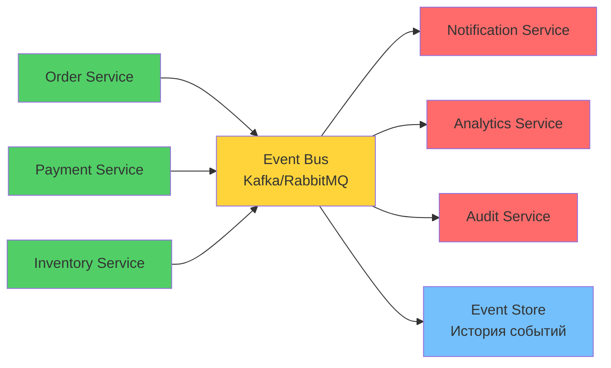

# 📡 Урок 4: Событийная архитектура (Event-Driven Architecture)

## 🎯 Цели урока

После изучения этого урока вы сможете:
- ✅ Понимать принципы событийной архитектуры и ее преимущества
- ✅ Применять Event Sourcing для хранения состояния системы
- ✅ Реализовывать CQRS для разделения операций чтения и записи
- ✅ Создавать реактивные системы с асинхронной обработкой
- ✅ Проектировать отказоустойчивые системы с компенсацией ошибок

## 📖 Что такое событийная архитектура?

!!! quote "Определение событийной архитектуры"
    **Событийная архитектура** - это парадигма проектирования программных систем, где компоненты взаимодействуют друг с другом путем генерации, обнаружения и потребления событий.

### 💡 Простыми словами

**Аналогия**: Почтовая система
- Отправитель (Producer) отправляет письмо (Event)
- Почтовое отделение (Event Bus) доставляет письмо
- Получатель (Consumer) читает письмо и реагирует
- Все асинхронно - не нужно ждать ответа сразу
- Можно отправить одно письмо многим получателям

**В программировании:**
- Компоненты не знают друг о друге напрямую
- Взаимодействие через события
- Асинхронная обработка
- Высокая масштабируемость

### 📊 Визуализация Event-Driven



### Ключевые концепции

1. **События (Events)** - факты, произошедшие в прошлом
2. **Производители (Producers)** - компоненты, генерирующие события
3. **Потребители (Consumers)** - компоненты, реагирующие на события
4. **Посредники (Brokers)** - инфраструктура для маршрутизации событий
5. **Реактивность** - асинхронная обработка и реакция на изменения

## 🎯 Event Sourcing паттерн

### Проблема традиционного хранения данных

```python
# ❌ Традиционный подход: хранение текущего состояния
class BankAccount:
    def __init__(self, account_id: str):
        self.account_id = account_id
        self.balance = 0.0  # Только текущее состояние
        self.owner = ""

    def deposit(self, amount: float):
        self.balance += amount

    def withdraw(self, amount: float):
        if self.balance >= amount:
            self.balance -= amount
        else:
            raise ValueError("Insufficient funds")

# Проблемы:
# - Потеря истории операций
# - Сложность аудита
# - Трудности с отладкой
# - Ограниченные аналитические возможности
```

### Решение: Event Sourcing

```python
# ✅ Event Sourcing: хранение истории событий
from abc import ABC, abstractmethod
from typing import List
from dataclasses import dataclass
from datetime import datetime

# Доменные события
@dataclass
class DomainEvent:
    aggregate_id: str
    timestamp: datetime
    version: int

@dataclass
class AccountCreated(DomainEvent):
    owner: str
    initial_balance: float

@dataclass
class MoneyDeposited(DomainEvent):
    amount: float
    description: str

@dataclass
class MoneyWithdrawn(DomainEvent):
    amount: float
    description: str

@dataclass
class AccountClosed(DomainEvent):
    reason: str

# Event Store - хранилище событий
class EventStore:
    def __init__(self):
        self.events: List[DomainEvent] = []

    def save_event(self, event: DomainEvent) -> None:
        self.events.append(event)

    def get_events_for_aggregate(self, aggregate_id: str) -> List[DomainEvent]:
        return [e for e in self.events if e.aggregate_id == aggregate_id]

# Агрегат с Event Sourcing
class BankAccount:
    def __init__(self, account_id: str, event_store: EventStore):
        self.account_id = account_id
        self.event_store = event_store
        self.balance = 0.0
        self.owner = ""
        self.version = 0
        self.uncommitted_events: List[DomainEvent] = []

    @classmethod
    def create(cls, account_id: str, owner: str, initial_balance: float, event_store: EventStore):
        account = cls(account_id, event_store)

        # Генерация события
        event = AccountCreated(
            aggregate_id=account_id,
            timestamp=datetime.utcnow(),
            version=1,
            owner=owner,
            initial_balance=initial_balance
        )

        # Применение события
        account.apply_event(event)

        return account

    @classmethod
    def load_from_events(cls, account_id: str, event_store: EventStore):
        account = cls(account_id, event_store)
        events = event_store.get_events_for_aggregate(account_id)

        for event in events:
            account.apply_event(event, is_new=False)

        return account

    def deposit(self, amount: float, description: str = "") -> None:
        if amount <= 0:
            raise ValueError("Deposit amount must be positive")

        event = MoneyDeposited(
            aggregate_id=self.account_id,
            timestamp=datetime.utcnow(),
            version=self.version + 1,
            amount=amount,
            description=description
        )

        self.apply_event(event)

    def withdraw(self, amount: float, description: str = "") -> None:
        if amount <= 0:
            raise ValueError("Withdrawal amount must be positive")

        if self.balance < amount:
            raise ValueError("Insufficient funds")

        event = MoneyWithdrawn(
            aggregate_id=self.account_id,
            timestamp=datetime.utcnow(),
            version=self.version + 1,
            amount=amount,
            description=description
        )

        self.apply_event(event)

    def close(self, reason: str) -> None:
        event = AccountClosed(
            aggregate_id=self.account_id,
            timestamp=datetime.utcnow(),
            version=self.version + 1,
            reason=reason
        )

        self.apply_event(event)

    def apply_event(self, event: DomainEvent, is_new: bool = True) -> None:
        """Применение события к состоянию агрегата"""
        if isinstance(event, AccountCreated):
            self.owner = event.owner
            self.balance = event.initial_balance

        elif isinstance(event, MoneyDeposited):
            self.balance += event.amount

        elif isinstance(event, MoneyWithdrawn):
            self.balance -= event.amount

        elif isinstance(event, AccountClosed):
            # Логика закрытия счета
            pass

        self.version = event.version

        if is_new:
            self.uncommitted_events.append(event)

    def commit_events(self) -> None:
        """Сохранение новых событий в Event Store"""
        for event in self.uncommitted_events:
            self.event_store.save_event(event)
        self.uncommitted_events.clear()

# Использование
event_store = EventStore()

# Создание нового счета
account = BankAccount.create("ACC-001", "John Doe", 1000.0, event_store)
account.commit_events()

# Выполнение операций
account.deposit(500.0, "Salary")
account.withdraw(200.0, "Grocery shopping")
account.commit_events()

# Восстановление состояния из событий
reloaded_account = BankAccount.load_from_events("ACC-001", event_store)
print(f"Balance: ${reloaded_account.balance}")  # 1300.0

# Полная история операций
events = event_store.get_events_for_aggregate("ACC-001")
for event in events:
    print(f"{event.timestamp}: {type(event).__name__}")
```

## 🔄 CQRS паттерн (Command Query Responsibility Segregation)

### Проблема
```python
# ❌ Традиционный подход: один класс для чтения и записи
class ProductService:
    def create_product(self, product_data) -> Product:
        # Валидация и создание
        pass

    def update_product(self, product_id, updates) -> Product:
        # Обновление
        pass

    def get_product(self, product_id) -> Product:
        # Получение данных
        pass

    def list_products(self, filters) -> List[Product]:
        # Список с фильтрами
        pass

# Проблемы:
# - Сложные запросы замедляют операции записи
# - Операции чтения влияют на производительность записи
# - Разные требования к оптимизации чтения и записи
```

### Решение: CQRS

```python
# ✅ CQRS: разделение команд и запросов
from abc import ABC, abstractmethod
from dataclasses import dataclass
from typing import List, Optional, Any
import uuid

# Commands (операции записи)
class Command(ABC):
    pass

@dataclass
class CreateProductCommand(Command):
    name: str
    description: str
    price: float
    category: str

@dataclass
class UpdateProductCommand(Command):
    product_id: str
    name: Optional[str] = None
    description: Optional[str] = None
    price: Optional[float] = None

# Command Handler
class CommandHandler(ABC):
    @abstractmethod
    async def handle(self, command: Command) -> None:
        pass

class CreateProductHandler(CommandHandler):
    def __init__(self, event_store: EventStore, event_publisher):
        self.event_store = event_store
        self.event_publisher = event_publisher

    async def handle(self, command: CreateProductCommand) -> str:
        # Валидация бизнес-правил
        if command.price <= 0:
            raise ValueError("Price must be positive")

        # Создание события
        product_id = f"PROD-{uuid.uuid4()}"
        event = ProductCreated(
            aggregate_id=product_id,
            timestamp=datetime.utcnow(),
            version=1,
            name=command.name,
            description=command.description,
            price=command.price,
            category=command.category
        )

        # Сохранение события
        await self.event_store.save_event(event)

        # Публикация события для обновления Read Model
        await self.event_publisher.publish("product.created", event)

        return product_id

# Queries (операции чтения)
@dataclass
class GetProductQuery:
    product_id: str

@dataclass
class ListProductsQuery:
    category: Optional[str] = None
    min_price: Optional[float] = None
    max_price: Optional[float] = None
    search_text: Optional[str] = None
    page: int = 1
    page_size: int = 20

# Query Handler
class QueryHandler(ABC):
    @abstractmethod
    async def handle(self, query) -> Any:
        pass

class GetProductHandler(QueryHandler):
    def __init__(self, read_repository):
        self.read_repo = read_repository

    async def handle(self, query: GetProductQuery):
        return await self.read_repo.get_product_by_id(query.product_id)

class ListProductsHandler(QueryHandler):
    def __init__(self, read_repository):
        self.read_repo = read_repository

    async def handle(self, query: ListProductsQuery):
        return await self.read_repo.list_products(
            category=query.category,
            min_price=query.min_price,
            max_price=query.max_price,
            search_text=query.search_text,
            offset=(query.page - 1) * query.page_size,
            limit=query.page_size
        )

# Read Model (оптимизированная для чтения)
class ProductReadModel:
    def __init__(self, db_connection):
        self.db = db_connection

    async def get_product_by_id(self, product_id: str):
        # Оптимизированный запрос для чтения
        query = """
        SELECT id, name, description, price, category,
               created_at, updated_at
        FROM products
        WHERE id = $1
        """
        return await self.db.fetchrow(query, product_id)

    async def list_products(self, **filters):
        # Сложный запрос с индексами для быстрого чтения
        conditions = []
        params = []

        if filters.get('category'):
            conditions.append("category = $" + str(len(params) + 1))
            params.append(filters['category'])

        if filters.get('min_price'):
            conditions.append("price >= $" + str(len(params) + 1))
            params.append(filters['min_price'])

        if filters.get('search_text'):
            conditions.append("name ILIKE $" + str(len(params) + 1))
            params.append(f"%{filters['search_text']}%")

        where_clause = " AND ".join(conditions) if conditions else "1=1"

        query = f"""
        SELECT id, name, description, price, category
        FROM products
        WHERE {where_clause}
        ORDER BY created_at DESC
        OFFSET ${len(params) + 1} LIMIT ${len(params) + 2}
        """

        params.extend([filters.get('offset', 0), filters.get('limit', 20)])

        return await self.db.fetch(query, *params)

# Event Handler для обновления Read Model
class ProductReadModelHandler:
    def __init__(self, read_model: ProductReadModel):
        self.read_model = read_model

    async def handle_product_created(self, event: ProductCreated):
        # Создание записи в Read Model
        query = """
        INSERT INTO products (id, name, description, price, category, created_at)
        VALUES ($1, $2, $3, $4, $5, $6)
        """
        await self.read_model.db.execute(query,
            event.aggregate_id,
            event.name,
            event.description,
            event.price,
            event.category,
            event.timestamp
        )

    async def handle_product_updated(self, event: ProductUpdated):
        # Обновление записи в Read Model
        query = """
        UPDATE products
        SET name = COALESCE($2, name),
            description = COALESCE($3, description),
            price = COALESCE($4, price),
            updated_at = $5
        WHERE id = $1
        """
        await self.read_model.db.execute(query,
            event.aggregate_id,
            event.name,
            event.description,
            event.price,
            event.timestamp
        )
```

## 📡 Event Streaming с Apache Kafka

### Producer (Производитель событий)

```python
from aiokafka import AIOKafkaProducer
import json
from typing import Dict, Any

class EventProducer:
    def __init__(self, kafka_servers: List[str]):
        self.producer = AIOKafkaProducer(
            bootstrap_servers=kafka_servers,
            value_serializer=lambda v: json.dumps(v).encode('utf-8'),
            key_serializer=lambda k: k.encode('utf-8') if k else None
        )

    async def start(self):
        await self.producer.start()

    async def stop(self):
        await self.producer.stop()

    async def publish_event(self, topic: str, event: Dict[str, Any], key: Optional[str] = None):
        """Публикация события в Kafka"""
        try:
            record = await self.producer.send_and_wait(
                topic=topic,
                value=event,
                key=key
            )
            print(f"Event published: {topic} -> {record.topic}:{record.partition}:{record.offset}")
        except Exception as e:
            print(f"Failed to publish event: {e}")
            raise

# Использование
producer = EventProducer(['localhost:9092'])
await producer.start()

# Публикация события
await producer.publish_event(
    topic="user.events",
    event={
        "event_type": "user.registered",
        "user_id": "user-123",
        "email": "user@example.com",
        "timestamp": "2024-01-01T10:00:00Z"
    },
    key="user-123"  # Для партиционирования
)

await producer.stop()
```

### Consumer (Потребитель событий)

```python
from aiokafka import AIOKafkaConsumer
import asyncio
import json

class EventConsumer:
    def __init__(self, kafka_servers: List[str], group_id: str):
        self.consumer = AIOKafkaConsumer(
            bootstrap_servers=kafka_servers,
            group_id=group_id,
            value_deserializer=lambda v: json.loads(v.decode('utf-8')),
            key_deserializer=lambda k: k.decode('utf-8') if k else None,
            auto_offset_reset='earliest',
            enable_auto_commit=False  # Ручное управление offset
        )
        self.handlers = {}

    def register_handler(self, event_type: str, handler):
        """Регистрация обработчика для типа события"""
        self.handlers[event_type] = handler

    async def start_consuming(self, topics: List[str]):
        """Запуск потребления событий"""
        self.consumer.subscribe(topics)

        try:
            await self.consumer.start()

            async for message in self.consumer:
                try:
                    event = message.value
                    event_type = event.get('event_type')

                    if event_type in self.handlers:
                        await self.handlers[event_type](event, message)

                    # Подтверждение обработки
                    await self.consumer.commit({
                        'topic': message.topic,
                        'partition': message.partition,
                        'offset': message.offset + 1
                    })

                except Exception as e:
                    print(f"Error processing event: {e}")
                    # Обработка ошибок (dead letter queue, retry, etc.)

        finally:
            await self.consumer.stop()

# Обработчики событий
async def handle_user_registered(event, message):
    print(f"Processing user registration: {event['user_id']}")
    # Отправка приветственного email
    # Создание профиля пользователя
    # Инициализация настроек

async def handle_order_created(event, message):
    print(f"Processing order: {event['order_id']}")
    # Проверка наличия товаров
    # Расчет стоимости доставки
    # Резервирование товаров

# Использование
consumer = EventConsumer(
    kafka_servers=['localhost:9092'],
    group_id='order-service-group'
)

consumer.register_handler('user.registered', handle_user_registered)
consumer.register_handler('order.created', handle_order_created)

# Запуск потребления
await consumer.start_consuming(['user.events', 'order.events'])
```

## 🔄 Saga Pattern для распределенных транзакций

### Choreography Saga (Хореография)

```python
# Каждый сервис знает только о своих событиях и событиях, на которые должен реагировать

class OrderService:
    def __init__(self, event_publisher):
        self.event_publisher = event_publisher

    async def create_order(self, order_data):
        # Создание заказа в статусе PENDING
        order = await self.create_pending_order(order_data)

        # Публикация события для начала саги
        await self.event_publisher.publish("order.pending", {
            "order_id": order.id,
            "customer_id": order.customer_id,
            "items": order.items,
            "total": order.total
        })

class InventoryService:
    def __init__(self, event_publisher):
        self.event_publisher = event_publisher

    async def handle_order_pending(self, event):
        try:
            # Попытка зарезервировать товары
            await self.reserve_items(event["items"])

            # Успех - публикация события
            await self.event_publisher.publish("inventory.reserved", {
                "order_id": event["order_id"],
                "reservations": reservations
            })

        except InsufficientStockError:
            # Неудача - публикация compensating event
            await self.event_publisher.publish("inventory.reservation.failed", {
                "order_id": event["order_id"],
                "reason": "insufficient_stock"
            })

class PaymentService:
    def __init__(self, event_publisher):
        self.event_publisher = event_publisher

    async def handle_inventory_reserved(self, event):
        try:
            # Попытка списать средства
            payment = await self.process_payment(event["order_id"], event["total"])

            # Успех - публикация события
            await self.event_publisher.publish("payment.processed", {
                "order_id": event["order_id"],
                "payment_id": payment.id,
                "amount": event["total"]
            })

        except PaymentFailedError:
            # Неудача - запуск compensating transactions
            await self.event_publisher.publish("payment.failed", {
                "order_id": event["order_id"],
                "reason": "payment_failed"
            })

            # Компенсация - освобождение резерва
            await self.event_publisher.publish("inventory.reservation.cancel", {
                "order_id": event["order_id"]
            })

class OrderService:
    # Обработка финальных событий саги
    async def handle_payment_processed(self, event):
        # Обновление статуса заказа на CONFIRMED
        await self.confirm_order(event["order_id"])

    async def handle_payment_failed(self, event):
        # Обновление статуса заказа на CANCELLED
        await self.cancel_order(event["order_id"])
```

### Orchestration Saga (Оркестрация)

```python
# Центральный оркестратор управляет всей сагой

class OrderSagaOrchestrator:
    def __init__(self, inventory_service, payment_service, shipping_service):
        self.inventory_service = inventory_service
        self.payment_service = payment_service
        self.shipping_service = shipping_service
        self.saga_state = {}

    async def execute_saga(self, order_data):
        saga_id = str(uuid.uuid4())
        self.saga_state[saga_id] = {
            "order_id": order_data["order_id"],
            "step": "inventory_reservation",
            "compensations": []
        }

        try:
            # Шаг 1: Резервирование товаров
            reservation = await self.inventory_service.reserve_items(order_data["items"])
            self.saga_state[saga_id]["compensations"].append(
                lambda: self.inventory_service.release_reservation(reservation)
            )

            # Шаг 2: Обработка платежа
            payment = await self.payment_service.process_payment(
                order_data["order_id"],
                order_data["total"]
            )
            self.saga_state[saga_id]["compensations"].append(
                lambda: self.payment_service.refund_payment(payment)
            )

            # Шаг 3: Организация доставки
            shipment = await self.shipping_service.create_shipment(order_data)
            self.saga_state[saga_id]["compensations"].append(
                lambda: self.shipping_service.cancel_shipment(shipment)
            )

            # Все шаги успешны - завершение саги
            await self.complete_saga(saga_id)

        except Exception as e:
            # Ошибка - запуск компенсаций
            await self.rollback_saga(saga_id, str(e))

    async def complete_saga(self, saga_id):
        saga_data = self.saga_state[saga_id]
        print(f"Saga {saga_id} completed successfully for order {saga_data['order_id']}")
        del self.saga_state[saga_id]

    async def rollback_saga(self, saga_id, reason):
        saga_data = self.saga_state[saga_id]
        print(f"Rolling back saga {saga_id} for order {saga_data['order_id']}: {reason}")

        # Выполнение компенсаций в обратном порядке
        for compensation in reversed(saga_data["compensations"]):
            try:
                await compensation()
            except Exception as e:
                print(f"Compensation failed: {e}")

        del self.saga_state[saga_id]
```

## ⚡ Реактивные системы

### Reactive Manifesto принципы

```python
# 1. Responsive (Отзывчивость)
# Система отвечает timely
class ResponsiveService:
    async def handle_request(self, request):
        # Гарантированное время ответа
        start_time = time.time()

        result = await self.process_request(request)

        response_time = time.time() - start_time
        if response_time > self.max_response_time:
            # Логирование превышения SLA
            await self.log_slow_response(response_time)

        return result

# 2. Resilient (Устойчивость)
# Система остается responsive при failures
class ResilientService:
    def __init__(self):
        self.circuit_breaker = CircuitBreaker()
        self.retry_policy = ExponentialBackoffRetry()

    async def call_external_service(self, request):
        return await self.circuit_breaker.call(
            self._make_request_with_retry,
            request
        )

    async def _make_request_with_retry(self, request):
        return await self.retry_policy.execute(
            lambda: self.external_service.call(request)
        )

# 3. Elastic (Эластичность)
# Система остается responsive под varying load
class ElasticService:
    def __init__(self):
        self.load_shedder = LoadShedder()
        self.auto_scaler = AutoScaler()

    async def handle_request(self, request):
        # Shed load if overloaded
        if self.load_shedder.should_shed():
            raise ServiceUnavailableError()

        # Auto-scale if needed
        await self.auto_scaler.adjust_capacity()

        return await self.process_request(request)

# 4. Message Driven (Ориентированность на сообщения)
# Асинхронная коммуникация через сообщения
class MessageDrivenService:
    def __init__(self, message_broker):
        self.message_broker = message_broker
        self.mailbox = asyncio.Queue()

    async def start(self):
        # Запуск обработчиков сообщений
        asyncio.create_task(self.message_processor())
        asyncio.create_task(self.request_processor())

    async def send_message(self, recipient, message):
        # Асинхронная отправка
        await self.message_broker.send(recipient, message)

    async def message_processor(self):
        while True:
            message = await self.mailbox.get()
            await self.handle_message(message)
            self.mailbox.task_done()

    async def handle_message(self, message):
        # Обработка сообщения
        if message.type == "request":
            response = await self.process_request(message.payload)
            await self.send_message(message.sender, response)
```

## 🎮 Практические упражнения

### Упражнение 1: Event Sourcing

**Задание:** Реализовать Event Sourcing для системы банковских счетов.

### Упражнение 2: CQRS

**Задание:** Применить CQRS для системы управления продуктами.

### Упражнение 3: Saga Pattern

**Задание:** Реализовать распределенную транзакцию с использованием Saga.

## 🎯 Ключевые выводы

1. **Event Sourcing** сохраняет всю историю изменений системы
2. **CQRS** разделяет операции чтения и записи для лучшей масштабируемости
3. **Saga Pattern** обеспечивает консистентность в распределенных системах
4. **Event Streaming** позволяет строить реактивные и масштабируемые системы
5. **Компенсация** важнее, чем предотвращение ошибок в распределенных системах

## 🚀 Следующие шаги

!!! success "Что вы узнали"
    - ✅ Принципы событийной архитектуры и Event Sourcing
    - ✅ CQRS - разделение операций чтения и записи
    - ✅ Как создавать реактивные системы с асинхронной обработкой
    - ✅ Паттерны отказоустойчивости в распределенных системах

!!! tip "Практика"
    Реализуйте простую систему с Event Sourcing (например, банковский счет). Это поможет понять, как события хранят историю изменений.

Теперь вы готовы изучить **[Выбор архитектуры](05-architecture-selection.md)** - как принимать обоснованные решения о выборе архитектурного стиля для конкретных задач!

---

!!! tip "Практический совет"
    Event Sourcing особенно полезен для систем, где важна аудитория, compliance или аналитика поведения пользователей. Для простых CRUD систем он может быть избыточным.

!!! info "Дополнительные ресурсы"
    - [Event Sourcing by Martin Fowler](https://martinfowler.com/eaaDev/EventSourcing.html)
    - [CQRS by Martin Fowler](https://martinfowler.com/bliki/CQRS.html)
    - [Reactive Manifesto](https://www.reactivemanifesto.org/)

## 🧪 Проверьте свои знания: Событийная архитектура

<div class="quiz-container" id="event-driven-architecture-quiz">
<script type="application/json">
{
  "title": "Событийная архитектура",
  "description": "Проверьте понимание Event Sourcing, CQRS и реактивных систем",
  "icon": "📡",
  "questions": [
    {
      "question": "Что такое Event Sourcing?",
      "type": "single",
      "points": 1,
      "options": [
        {"text": "Хранение текущего состояния объектов", "correct": false},
        {"text": "Хранение истории всех изменений как последовательности событий", "correct": true},
        {"text": "Кэширование часто используемых данных", "correct": false},
        {"text": "Резервное копирование базы данных", "correct": false}
      ],
      "explanation": "Event Sourcing сохраняет все изменения как события, позволяя восстановить состояние в любой момент времени"
    },
    {
      "question": "Что означает CQRS?",
      "type": "single",
      "points": 1,
      "options": [
        {"text": "Command Query Response Service", "correct": false},
        {"text": "Command Query Responsibility Segregation", "correct": true},
        {"text": "Create Query Read System", "correct": false},
        {"text": "Centralized Query Resource System", "correct": false}
      ],
      "explanation": "CQRS разделяет ответственность за команды (запись) и запросы (чтение)"
    },
    {
      "question": "Какой паттерн используется для распределенных транзакций в микросервисах?",
      "type": "single",
      "points": 1,
      "options": [
        {"text": "Factory Pattern", "correct": false},
        {"text": "Saga Pattern", "correct": true},
        {"text": "Observer Pattern", "correct": false},
        {"text": "Strategy Pattern", "correct": false}
      ],
      "explanation": "Saga Pattern позволяет реализовать распределенные транзакции через последовательность локальных транзакций с компенсацией"
    },
    {
      "question": "Преимущества Event Sourcing:",
      "type": "multiple",
      "points": 2,
      "options": [
        {"text": "Полная история всех изменений", "correct": true},
        {"text": "Простота аудита и compliance", "correct": true},
        {"text": "Возможность временных запросов", "correct": true},
        {"text": "Быстрое чтение текущего состояния", "correct": false},
        {"text": "Простота реализации", "correct": false}
      ],
      "explanation": "Event Sourcing дает преимущества в аудите и гибкости, но требует дополнительной инфраструктуры"
    },
    {
      "question": "Когда использовать CQRS?",
      "type": "multiple",
      "points": 2,
      "options": [
        {"text": "Когда операции чтения и записи имеют разные требования к оптимизации", "correct": true},
        {"text": "Когда нужна сложная бизнес-логика только для записи", "correct": false},
        {"text": "Когда система должна масштабироваться по-разному для чтения и записи", "correct": true},
        {"text": "Когда нужны сложные запросы с множественными join", "correct": true},
        {"text": "Когда все операции простые и похожие", "correct": false}
      ],
      "explanation": "CQRS полезен при разных требованиях к чтению и записи, особенно в высоконагруженных системах"
    },
    {
      "question": "Что такое compensating transaction в Saga?",
      "type": "single",
      "points": 1,
      "options": [
        {"text": "Транзакция, которая отменяет предыдущие операции", "correct": true},
        {"text": "Дополнительная транзакция для логирования", "correct": false},
        {"text": "Транзакция для обработки ошибок", "correct": false},
        {"text": "Транзакция для резервного копирования", "correct": false}
      ],
      "explanation": "Compensating transaction отменяет эффекты предыдущих транзакций при ошибке в саге"
    },
    {
      "question": "Какой тип consistency используется в Event Sourcing?",
      "type": "single",
      "points": 1,
      "options": [
        {"text": "Strong consistency", "correct": false},
        {"text": "Eventual consistency", "correct": true},
        {"text": "Immediate consistency", "correct": false},
        {"text": "No consistency", "correct": false}
      ],
      "explanation": "Event Sourcing обычно использует eventual consistency из-за асинхронной природы событий"
    },
    {
      "question": "Что такое Event Streaming?",
      "type": "single",
      "points": 1,
      "options": [
        {"text": "Хранение событий в файлах", "correct": false},
        {"text": "Непрерывная обработка потока событий", "correct": true},
        {"text": "Отправка событий по email", "correct": false},
        {"text": "Архивирование старых событий", "correct": false}
      ],
      "explanation": "Event Streaming - это непрерывная обработка и анализ потоков событий в реальном времени"
    },
    {
      "question": "Какой инструмент используется для Event Streaming?",
      "type": "multiple",
      "points": 2,
      "options": [
        {"text": "Apache Kafka", "correct": true},
        {"text": "PostgreSQL", "correct": false},
        {"text": "Redis", "correct": false},
        {"text": "RabbitMQ", "correct": true},
        {"text": "MongoDB", "correct": false}
      ],
      "explanation": "Kafka и RabbitMQ - популярные инструменты для event streaming"
    },
    {
      "question": "Что такое choreography в Saga Pattern?",
      "type": "single",
      "points": 1,
      "options": [
        {"text": "Каждый сервис знает только о своих событиях", "correct": true},
        {"text": "Центральный оркестратор управляет всей сагой", "correct": false},
        {"text": "Сервисы общаются через общую базу данных", "correct": false},
        {"text": "Используется двухфазный commit", "correct": false}
      ],
      "explanation": "Choreography - это когда каждый участник саги реагирует на события других участников"
    }
  ]
}
</script>
</div>

## 💻 Практическое задание: Реализация Event Sourcing + CQRS

{{ create_exercise_form(
    "event_sourcing_cqrs_implementation",
    "Реализация Event Sourcing и CQRS для системы управления заказами",
    "Создайте полнофункциональную систему управления заказами с использованием Event Sourcing для хранения состояния и CQRS для разделения операций чтения и записи.",
    """# Задание: Event Sourcing + CQRS система заказов

Реализуйте систему управления заказами с использованием Event Sourcing для хранения состояния заказов и CQRS для эффективного разделения операций чтения и записи.

## 🎯 Пошаговый подход

Для успешного выполнения задания рекомендуется работать в три фазы:

**Фаза 1: Основы Event Sourcing**
- Реализуйте базовую функциональность Event Sourcing: создание событий, сохранение в Event Store, восстановление состояния агрегата из событий
- Сфокусируйтесь на командах записи и базовом хранении событий
- Убедитесь, что можете создавать заказы и восстанавливать их состояние из событий

**Фаза 2: Добавление CQRS read models**
- Реализуйте проекции событий в read models для оптимизации запросов
- Создайте отдельные модели для чтения и механизм обновления проекций при появлении новых событий
- Добавьте query handlers для эффективного чтения данных

**Фаза 3: Интеграция с Kafka**
- Интегрируйте Kafka как message broker для асинхронной обработки событий
- Настройте event handlers для публикации событий в Kafka
- Реализуйте consumers для обработки событий из Kafka и обновления read models

Такой поэтапный подход позволит постепенно усложнять систему и лучше понять каждую компоненту архитектуры.

## Архитектура системы

```
┌─────────────────┐    ┌─────────────────┐    ┌─────────────────┐
│  API Gateway    │    │  Event Store    │    │  Read Database  │
│                 │    │                 │    │                 │
│ • REST API      │    │ • PostgreSQL    │    │ • PostgreSQL    │
│ • Authentication│    │ • Events        │    │ • Read Models   │
│ • Routing       │    │ • Snapshots     │    │ • Projections   │
└─────────────────┘    └─────────────────┘    └─────────────────┘
         │                       │                       │
         ▼                       ▼                       ▼
┌─────────────────┐    ┌─────────────────┐    ┌─────────────────┐
│ Command Service │    │ Event Handlers  │    │  Query Service  │
│                 │    │                 │    │                 │
│ • Order         │    │ • Project to    │    │ • Order Views   │
│   Commands      │    │   Read DB       │    │ • Analytics     │
│ • Validation    │    │ • Send          │    │ • Reporting     │
│ • Business      │    │   Notifications │    │                 │
│   Rules         │    └─────────────────┘    └─────────────────┘
└─────────────────┘             │
                                ▼
                       ┌─────────────────┐
                       │ Message Broker  │
                       │                 │
                       │ • Kafka/        │
                       │   RabbitMQ      │
                       │ • Event Stream  │
                       └─────────────────┘
```

## 1. Доменные события (Domain Events)

```python
# events.py
from abc import ABC
from dataclasses import dataclass
from datetime import datetime
from typing import List, Optional
from decimal import Decimal

@dataclass
class DomainEvent(ABC):
    aggregate_id: str
    timestamp: datetime
    version: int

# События заказа
@dataclass
class OrderCreated(DomainEvent):
    customer_id: str
    items: List['OrderItem']
    total_amount: Decimal
    shipping_address: str

@dataclass
class OrderItemAdded(DomainEvent):
    product_id: str
    product_name: str
    quantity: int
    unit_price: Decimal

@dataclass
class OrderItemRemoved(DomainEvent):
    product_id: str
    quantity: int

@dataclass
class OrderAddressChanged(DomainEvent):
    new_address: str

@dataclass
class OrderPaid(DomainEvent):
    payment_id: str
    payment_method: str
    amount: Decimal

@dataclass
class OrderShipped(DomainEvent):
    tracking_number: str
    carrier: str

@dataclass
class OrderDelivered(DomainEvent):
    delivered_at: datetime

@dataclass
class OrderCancelled(DomainEvent):
    reason: str
    cancelled_at: datetime

# Value Objects
@dataclass
class OrderItem:
    product_id: str
    product_name: str
    quantity: int
    unit_price: Decimal

    @property
    def total_price(self) -> Decimal:
        return self.unit_price * self.quantity

@dataclass
class Address:
    street: str
    city: str
    state: str
    zip_code: str
    country: str

# Перечисления
from enum import Enum

class OrderStatus(Enum):
    PENDING = "pending"
    PAID = "paid"
    SHIPPED = "shipped"
    DELIVERED = "delivered"
    CANCELLED = "cancelled"

class PaymentMethod(Enum):
    CREDIT_CARD = "credit_card"
    PAYPAL = "paypal"
    BANK_TRANSFER = "bank_transfer"
    CRYPTO = "crypto"
```

## 2. Event Store

```python
# event_store.py
from abc import ABC, abstractmethod
from typing import List
import asyncio
import aiosqlite
from contextlib import asynccontextmanager

class EventStore(ABC):
    @abstractmethod
    async def save_event(self, event: DomainEvent) -> None:
        pass

    @abstractmethod
    async def get_events_for_aggregate(self, aggregate_id: str) -> List[DomainEvent]:
        pass

    @abstractmethod
    async def get_all_events(self, from_version: int = 0) -> List[DomainEvent]:
        pass

class SQLiteEventStore(EventStore):
    def __init__(self, db_path: str = "events.db"):
        self.db_path = db_path

    async def initialize(self):
        async with aiosqlite.connect(self.db_path) as db:
            # Note: While the UNIQUE(aggregate_id, version) constraint helps prevent
            # concurrent version conflicts, SQLite has limited concurrent write capabilities
            # (database-level locking). This implementation is simplified for learning purposes.
            # Production systems should use a database with stronger concurrency support
            # (e.g., PostgreSQL) or implement an external locking/optimistic concurrency mechanism.
            await db.execute('''
                CREATE TABLE IF NOT EXISTS events (
                    id INTEGER PRIMARY KEY AUTOINCREMENT,
                    aggregate_id TEXT NOT NULL,
                    event_type TEXT NOT NULL,
                    event_data TEXT NOT NULL,
                    timestamp TEXT NOT NULL,
                    version INTEGER NOT NULL,
                    UNIQUE(aggregate_id, version)
                )
            ''')
            await db.commit()

    async def save_event(self, event: DomainEvent) -> None:
        import json
        from datetime import datetime

        event_data = {
            "aggregate_id": event.aggregate_id,
            "event_type": event.__class__.__name__,
            "event_data": event.__dict__,
            "timestamp": event.timestamp.isoformat(),
            "version": event.version
        }

        async with aiosqlite.connect(self.db_path) as db:
            await db.execute('''
                INSERT INTO events (aggregate_id, event_type, event_data, timestamp, version)
                VALUES (?, ?, ?, ?, ?)
            ''', (
                event.aggregate_id,
                event.__class__.__name__,
                json.dumps(event.__dict__),
                event.timestamp.isoformat(),
                event.version
            ))
            await db.commit()

    async def get_events_for_aggregate(self, aggregate_id: str) -> List[DomainEvent]:
        import json

        async with aiosqlite.connect(self.db_path) as db:
            cursor = await db.execute('''
                SELECT event_type, event_data, timestamp, version
                FROM events
                WHERE aggregate_id = ?
                ORDER BY version ASC
            ''', (aggregate_id,))

            rows = await cursor.fetchall()

        events = []
        for row in rows:
            event_type, event_data_json, timestamp_str, version = row
            event_data = json.loads(event_data_json)

            # Создание события на основе типа
            event_class = globals().get(event_type)
            if event_class:
                event = event_class(**event_data)
                events.append(event)

        return events

    async def get_all_events(self, from_version: int = 0) -> List[DomainEvent]:
        # Аналогично, но для всех агрегатов
        pass
```

## 3. Write Model (Команды и Aggregate)

```python
# write_model.py
from abc import ABC, abstractmethod
from typing import List
from decimal import Decimal
import uuid
from datetime import datetime

# Commands
@dataclass
class Command(ABC):
    pass

@dataclass
class CreateOrderCommand(Command):
    customer_id: str
    items: List[OrderItem]
    shipping_address: str

@dataclass
class AddOrderItemCommand(Command):
    order_id: str
    product_id: str
    product_name: str
    quantity: int
    unit_price: Decimal

@dataclass
class RemoveOrderItemCommand(Command):
    order_id: str
    product_id: str
    quantity: int

@dataclass
class ChangeOrderAddressCommand(Command):
    order_id: str
    new_address: str

@dataclass
class PayOrderCommand(Command):
    order_id: str
    payment_id: str
    payment_method: str
    amount: Decimal

@dataclass
class ShipOrderCommand(Command):
    order_id: str
    tracking_number: str
    carrier: str

@dataclass
class DeliverOrderCommand(Command):
    order_id: str

@dataclass
class CancelOrderCommand(Command):
    order_id: str
    reason: str

# Aggregate Root
class OrderAggregate:
    def __init__(self, aggregate_id: str, event_store: EventStore):
        self.aggregate_id = aggregate_id
        self.event_store = event_store
        self.version = 0
        self.uncommitted_events: List[DomainEvent] = []

        # State
        self.customer_id = ""
        self.items: List[OrderItem] = []
        self.status = OrderStatus.PENDING
        self.total_amount = Decimal('0.00')
        self.shipping_address = ""
        self.payment_id: Optional[str] = None
        self.tracking_number: Optional[str] = None
        self.created_at: Optional[datetime] = None
        self.paid_at: Optional[datetime] = None
        self.shipped_at: Optional[datetime] = None
        self.delivered_at: Optional[datetime] = None
        self.cancelled_at: Optional[datetime] = None

    @classmethod
    async def create(cls, command: CreateOrderCommand, event_store: EventStore) -> 'OrderAggregate':
        aggregate_id = str(uuid.uuid4())
        aggregate = cls(aggregate_id, event_store)

        total_amount = sum(item.total_price for item in command.items)

        event = OrderCreated(
            aggregate_id=aggregate_id,
            timestamp=datetime.utcnow(),
            version=1,
            customer_id=command.customer_id,
            items=command.items,
            total_amount=total_amount,
            shipping_address=command.shipping_address
        )

        aggregate.apply_event(event)
        return aggregate

    @classmethod
    async def load(cls, aggregate_id: str, event_store: EventStore) -> 'OrderAggregate':
        aggregate = cls(aggregate_id, event_store)
        events = await event_store.get_events_for_aggregate(aggregate_id)

        for event in events:
            aggregate.apply_event(event, is_new=False)

        return aggregate

    def add_item(self, command: AddOrderItemCommand) -> None:
        if self.status != OrderStatus.PENDING:
            raise ValueError("Can only add items to pending orders")

        new_item = OrderItem(
            product_id=command.product_id,
            product_name=command.product_name,
            quantity=command.quantity,
            unit_price=command.unit_price
        )

        event = OrderItemAdded(
            aggregate_id=self.aggregate_id,
            timestamp=datetime.utcnow(),
            version=self.version + 1,
            product_id=command.product_id,
            product_name=command.product_name,
            quantity=command.quantity,
            unit_price=command.unit_price
        )

        self.apply_event(event)

    def remove_item(self, command: RemoveOrderItemCommand) -> None:
        if self.status != OrderStatus.PENDING:
            raise ValueError("Can only remove items from pending orders")

        # Find the item to remove
        item_to_remove = None
        for item in self.items:
            if item.product_id == command.product_id:
                item_to_remove = item
                break

        if item_to_remove is None:
            raise ValueError(f"Product {command.product_id} not found in order")

        if item_to_remove.quantity < command.quantity:
            raise ValueError(
                f"Cannot remove {command.quantity} items. Only {item_to_remove.quantity} available"
            )

        event = OrderItemRemoved(
            aggregate_id=self.aggregate_id,
            timestamp=datetime.utcnow(),
            version=self.version + 1,
            product_id=command.product_id,
            quantity=command.quantity
        )

        self.apply_event(event)

    def change_address(self, command: ChangeOrderAddressCommand) -> None:
        if self.status in (OrderStatus.SHIPPED, OrderStatus.DELIVERED):
            raise ValueError("Cannot change address for shipped or delivered orders")

        if not command.new_address or not command.new_address.strip():
            raise ValueError("New address cannot be empty")

        event = OrderAddressChanged(
            aggregate_id=self.aggregate_id,
            timestamp=datetime.utcnow(),
            version=self.version + 1,
            new_address=command.new_address
        )

        self.apply_event(event)

    # TODO: Student Exercise - Implement the following methods
    # Follow the pattern established in add_item, remove_item, and change_address:
    # 1. Validate current order state
    # 2. Construct domain event with aggregate_id, timestamp, incremented version, and relevant payload
    # 3. Call self.apply_event(event)
    # 4. State changes will be handled in apply_event method

    def pay(self, command: PayOrderCommand) -> None:
        # TODO: Implement payment logic
        # Expected validations:
        #   - Order status must be PENDING
        #   - Payment amount must match order total_amount
        #   - Payment method must be valid
        # Event to emit: OrderPaid
        #   - aggregate_id: self.aggregate_id
        #   - timestamp: datetime.utcnow()
        #   - version: self.version + 1
        #   - payment_id: command.payment_id
        #   - payment_method: command.payment_method
        #   - amount: command.amount
        # State changes (handled in apply_event):
        #   - status -> OrderStatus.PAID
        #   - payment_id -> event.payment_id
        #   - paid_at -> event.timestamp
        pass

    def ship(self, command: ShipOrderCommand) -> None:
        # TODO: Implement shipping logic
        # Expected validations:
        #   - Order status must be PAID
        #   - Tracking number must be provided and non-empty
        #   - Carrier must be provided
        # Event to emit: OrderShipped
        #   - aggregate_id: self.aggregate_id
        #   - timestamp: datetime.utcnow()
        #   - version: self.version + 1
        #   - tracking_number: command.tracking_number
        #   - carrier: command.carrier
        # State changes (handled in apply_event):
        #   - status -> OrderStatus.SHIPPED
        #   - tracking_number -> event.tracking_number
        #   - shipped_at -> event.timestamp
        pass

    def deliver(self, command: DeliverOrderCommand) -> None:
        # TODO: Implement delivery logic
        # Expected validations:
        #   - Order status must be SHIPPED
        # Event to emit: OrderDelivered
        #   - aggregate_id: self.aggregate_id
        #   - timestamp: datetime.utcnow()
        #   - version: self.version + 1
        #   - delivered_at: datetime.utcnow()
        # State changes (handled in apply_event):
        #   - status -> OrderStatus.DELIVERED
        #   - delivered_at -> event.timestamp
        pass

    def cancel(self, command: CancelOrderCommand) -> None:
        # TODO: Implement cancellation logic
        # Expected validations:
        #   - Order status must not be DELIVERED
        #   - Reason must be provided and non-empty
        # Event to emit: OrderCancelled
        #   - aggregate_id: self.aggregate_id
        #   - timestamp: datetime.utcnow()
        #   - version: self.version + 1
        #   - reason: command.reason
        #   - cancelled_at: datetime.utcnow()
        # State changes (handled in apply_event):
        #   - status -> OrderStatus.CANCELLED
        #   - cancelled_at -> event.timestamp
        pass

    def apply_event(self, event: DomainEvent, is_new: bool = True) -> None:
        """Применение события к состоянию агрегата"""
        if isinstance(event, OrderCreated):
            self.customer_id = event.customer_id
            self.items = event.items
            self.total_amount = event.total_amount
            self.shipping_address = event.shipping_address
            self.created_at = event.timestamp

        elif isinstance(event, OrderItemAdded):
            new_item = OrderItem(
                product_id=event.product_id,
                product_name=event.product_name,
                quantity=event.quantity,
                unit_price=event.unit_price
            )
            self.items.append(new_item)
            self.total_amount += new_item.total_price

        elif isinstance(event, OrderItemRemoved):
            # Find and remove the item or reduce its quantity
            for item in self.items:
                if item.product_id == event.product_id:
                    removed_price = item.unit_price * event.quantity
                    if item.quantity == event.quantity:
                        # Remove entire item
                        self.items.remove(item)
                    else:
                        # Reduce quantity
                        item.quantity -= event.quantity
                    self.total_amount -= removed_price
                    break

        elif isinstance(event, OrderAddressChanged):
            self.shipping_address = event.new_address

        elif isinstance(event, OrderPaid):
            self.status = OrderStatus.PAID
            self.payment_id = event.payment_id
            self.paid_at = event.timestamp

        elif isinstance(event, OrderShipped):
            self.status = OrderStatus.SHIPPED
            self.tracking_number = event.tracking_number
            self.shipped_at = event.timestamp

        elif isinstance(event, OrderDelivered):
            self.status = OrderStatus.DELIVERED
            self.delivered_at = event.timestamp

        elif isinstance(event, OrderCancelled):
            self.status = OrderStatus.CANCELLED
            self.cancelled_at = event.timestamp

        self.version = event.version

        if is_new:
            self.uncommitted_events.append(event)

    async def commit_events(self) -> None:
        """Сохранение новых событий"""
        for event in self.uncommitted_events:
            await self.event_store.save_event(event)
        self.uncommitted_events.clear()
```

## 4. Command Handlers

```python
# command_handlers.py
from abc import ABC, abstractmethod

class CommandHandler(ABC):
    @abstractmethod
    async def handle(self, command: Command) -> any:
        pass

class OrderCommandHandler(CommandHandler):
    def __init__(self, event_store: EventStore, event_publisher):
        self.event_store = event_store
        self.event_publisher = event_publisher

    async def handle(self, command: Command) -> any:
        if isinstance(command, CreateOrderCommand):
            return await self.handle_create_order(command)
        elif isinstance(command, AddOrderItemCommand):
            return await self.handle_add_item(command)
        elif isinstance(command, PayOrderCommand):
            return await self.handle_pay_order(command)
        # Другие команды...

    async def handle_create_order(self, command: CreateOrderCommand) -> str:
        aggregate = await OrderAggregate.create(command, self.event_store)
        await aggregate.commit_events()

        # Публикация события
        for event in aggregate.uncommitted_events:
            await self.event_publisher.publish(event)

        return aggregate.aggregate_id

    async def handle_add_item(self, command: AddOrderItemCommand) -> None:
        aggregate = await OrderAggregate.load(command.order_id, self.event_store)
        aggregate.add_item(command)
        await aggregate.commit_events()

        # Публикация событий
        for event in aggregate.uncommitted_events:
            await self.event_publisher.publish(event)

    async def handle_pay_order(self, command: PayOrderCommand) -> None:
        aggregate = await OrderAggregate.load(command.order_id, self.event_store)
        aggregate.pay(command)
        await aggregate.commit_events()

        # Публикация событий
        for event in aggregate.uncommitted_events:
            await self.event_publisher.publish(event)
```

## 5. Read Model (Query Side)

```python
# read_model.py
from abc import ABC, abstractmethod
from typing import List, Optional
import aiosqlite

# Read Models
@dataclass
class OrderSummary:
    order_id: str
    customer_id: str
    status: str
    total_amount: Decimal
    created_at: datetime
    item_count: int

@dataclass
class OrderDetails:
    order_id: str
    customer_id: str
    status: str
    total_amount: Decimal
    shipping_address: str
    items: List[OrderItem]
    created_at: datetime
    paid_at: Optional[datetime]
    shipped_at: Optional[datetime]
    delivered_at: Optional[datetime]

# Query Models
@dataclass
class GetOrderQuery:
    order_id: str

@dataclass
class ListOrdersQuery:
    customer_id: Optional[str] = None
    status: Optional[str] = None
    page: int = 1
    page_size: int = 20

@dataclass
class GetOrderAnalyticsQuery:
    date_from: datetime
    date_to: datetime

# Read Repository
class OrderReadRepository:
    def __init__(self, db_path: str = "read_db.db"):
        self.db_path = db_path

    async def initialize(self):
        async with aiosqlite.connect(self.db_path) as db:
            await db.execute('''
                CREATE TABLE IF NOT EXISTS orders (
                    order_id TEXT PRIMARY KEY,
                    customer_id TEXT NOT NULL,
                    status TEXT NOT NULL,
                    total_amount TEXT NOT NULL,
                    shipping_address TEXT,
                    created_at TEXT NOT NULL,
                    paid_at TEXT,
                    shipped_at TEXT,
                    delivered_at TEXT
                )
            ''')

            await db.execute('''
                CREATE TABLE IF NOT EXISTS order_items (
                    id INTEGER PRIMARY KEY AUTOINCREMENT,
                    order_id TEXT NOT NULL,
                    product_id TEXT NOT NULL,
                    product_name TEXT NOT NULL,
                    quantity INTEGER NOT NULL,
                    unit_price TEXT NOT NULL,
                    FOREIGN KEY (order_id) REFERENCES orders (order_id)
                )
            ''')

            await db.commit()

    async def save_order(self, order: OrderAggregate) -> None:
        async with aiosqlite.connect(self.db_path) as db:
            # Сохранение заказа
            await db.execute('''
                INSERT OR REPLACE INTO orders
                (order_id, customer_id, status, total_amount, shipping_address,
                 created_at, paid_at, shipped_at, delivered_at)
                VALUES (?, ?, ?, ?, ?, ?, ?, ?, ?)
            ''', (
                order.aggregate_id,
                order.customer_id,
                order.status.value,
                str(order.total_amount),
                order.shipping_address,
                order.created_at.isoformat() if order.created_at else None,
                order.paid_at.isoformat() if order.paid_at else None,
                order.shipped_at.isoformat() if order.shipped_at else None,
                order.delivered_at.isoformat() if order.delivered_at else None
            ))

            # Сохранение товаров
            await db.execute('DELETE FROM order_items WHERE order_id = ?', (order.aggregate_id,))

            for item in order.items:
                await db.execute('''
                    INSERT INTO order_items
                    (order_id, product_id, product_name, quantity, unit_price)
                    VALUES (?, ?, ?, ?, ?)
                ''', (
                    order.aggregate_id,
                    item.product_id,
                    item.product_name,
                    item.quantity,
                    str(item.unit_price)
                ))

            await db.commit()

    async def get_order_by_id(self, order_id: str) -> Optional[OrderDetails]:
        async with aiosqlite.connect(self.db_path) as db:
            # Получение заказа
            cursor = await db.execute('''
                SELECT * FROM orders WHERE order_id = ?
            ''', (order_id,))
            order_row = await cursor.fetchone()

            if not order_row:
                return None

            # Получение товаров
            cursor = await db.execute('''
                SELECT product_id, product_name, quantity, unit_price
                FROM order_items WHERE order_id = ?
            ''', (order_id,))
            item_rows = await cursor.fetchall()

        items = [
            OrderItem(
                product_id=row[0],
                product_name=row[1],
                quantity=row[2],
                unit_price=Decimal(row[3])
            )
            for row in item_rows
        ]

        return OrderDetails(
            order_id=order_row[0],
            customer_id=order_row[1],
            status=order_row[2],
            total_amount=Decimal(order_row[3]),
            shipping_address=order_row[4],
            items=items,
            created_at=datetime.fromisoformat(order_row[5]),
            paid_at=datetime.fromisoformat(order_row[6]) if order_row[6] else None,
            shipped_at=datetime.fromisoformat(order_row[7]) if order_row[7] else None,
            delivered_at=datetime.fromisoformat(order_row[8]) if order_row[8] else None
        )

    async def list_orders(self, query: ListOrdersQuery) -> List[OrderSummary]:
        async with aiosqlite.connect(self.db_path) as db:
            conditions = []
            params = []

            if query.customer_id:
                conditions.append("customer_id = ?")
                params.append(query.customer_id)

            if query.status:
                conditions.append("status = ?")
                params.append(query.status)

            where_clause = " AND ".join(conditions) if conditions else "1=1"

            offset = (query.page - 1) * query.page_size

            cursor = await db.execute(f'''
                SELECT o.order_id, o.customer_id, o.status, o.total_amount,
                       o.created_at, COUNT(oi.id) as item_count
                FROM orders o
                LEFT JOIN order_items oi ON o.order_id = oi.order_id
                WHERE {where_clause}
                GROUP BY o.order_id
                ORDER BY o.created_at DESC
                LIMIT ? OFFSET ?
            ''', params + [query.page_size, offset])

            rows = await cursor.fetchall()

        return [
            OrderSummary(
                order_id=row[0],
                customer_id=row[1],
                status=row[2],
                total_amount=Decimal(row[3]),
                created_at=datetime.fromisoformat(row[4]),
                item_count=row[5]
            )
            for row in rows
        ]

# Query Handlers
class OrderQueryHandler:
    def __init__(self, read_repository: OrderReadRepository):
        self.read_repo = read_repository

    async def handle(self, query):
        if isinstance(query, GetOrderQuery):
            return await self.read_repo.get_order_by_id(query.order_id)
        elif isinstance(query, ListOrdersQuery):
            return await self.read_repo.list_orders(query)
```

## 6. Event Handlers (Projection)

```python
# event_handlers.py
from abc import ABC, abstractmethod

class EventHandler(ABC):
    @abstractmethod
    async def handle(self, event: DomainEvent) -> None:
        pass

class OrderProjectionHandler(EventHandler):
    def __init__(self, read_repository: OrderReadRepository, event_store: EventStore):
        self.read_repo = read_repository
        self.event_store = event_store

    async def handle(self, event: DomainEvent) -> None:
        if isinstance(event, (OrderCreated, OrderItemAdded, OrderPaid,
                           OrderShipped, OrderDelivered, OrderCancelled)):
            # Загрузка агрегата и обновление Read Model
            aggregate = await OrderAggregate.load(event.aggregate_id, self.event_store)
            await self.read_repo.save_order(aggregate)

class NotificationHandler(EventHandler):
    def __init__(self, notification_service):
        self.notification_service = notification_service

    async def handle(self, event: DomainEvent) -> None:
        if isinstance(event, OrderCreated):
            await self.notification_service.send_order_confirmation(
                event.customer_id, event.aggregate_id
            )
        elif isinstance(event, OrderPaid):
            await self.notification_service.send_payment_confirmation(
                event.aggregate_id, event.amount
            )
        elif isinstance(event, OrderShipped):
            await self.notification_service.send_shipping_notification(
                event.aggregate_id, event.tracking_number
            )

class AnalyticsHandler(EventHandler):
    def __init__(self, analytics_service):
        self.analytics_service = analytics_service

    async def handle(self, event: DomainEvent) -> None:
        await self.analytics_service.track_event(event)
```

## 7. API Layer

```python
# api.py
from fastapi import FastAPI, HTTPException, Depends
from typing import List

app = FastAPI(title="Order Management API", version="1.0.0")

# Dependency Injection
def get_command_handler():
    # TODO: Настройка зависимостей
    pass

def get_query_handler():
    # TODO: Настройка зависимостей
    pass

# Command API (Write Operations)
@app.post("/orders", status_code=201)
async def create_order(request: CreateOrderRequest,
                      handler = Depends(get_command_handler)):
    command = CreateOrderCommand(
        customer_id=request.customer_id,
        items=[OrderItem(**item.dict()) for item in request.items],
        shipping_address=request.shipping_address
    )

    try:
        order_id = await handler.handle(command)
        return {"order_id": order_id}
    except ValueError as e:
        raise HTTPException(status_code=400, detail=str(e))

@app.post("/orders/{order_id}/items")
async def add_order_item(order_id: str,
                        request: AddOrderItemRequest,
                        handler = Depends(get_command_handler)):
    command = AddOrderItemCommand(
        order_id=order_id,
        product_id=request.product_id,
        product_name=request.product_name,
        quantity=request.quantity,
        unit_price=request.unit_price
    )

    try:
        await handler.handle(command)
        return {"message": "Item added successfully"}
    except ValueError as e:
        raise HTTPException(status_code=400, detail=str(e))

# Query API (Read Operations)
@app.get("/orders/{order_id}")
async def get_order(order_id: str,
                   handler = Depends(get_query_handler)):
    query = GetOrderQuery(order_id=order_id)
    order = await handler.handle(query)

    if not order:
        raise HTTPException(status_code=404, detail="Order not found")

    return order

@app.get("/orders")
async def list_orders(
    customer_id: Optional[str] = None,
    status: Optional[str] = None,
    page: int = 1,
    page_size: int = 20,
    handler = Depends(get_query_handler)
):
    query = ListOrdersQuery(
        customer_id=customer_id,
        status=status,
        page=page,
        page_size=page_size
    )

    orders = await handler.handle(query)
    return {"orders": orders, "page": page, "page_size": page_size}

# Pydantic models for API
from pydantic import BaseModel

class OrderItemRequest(BaseModel):
    product_id: str
    product_name: str
    quantity: int
    unit_price: Decimal

class CreateOrderRequest(BaseModel):
    customer_id: str
    items: List[OrderItemRequest]
    shipping_address: str

class AddOrderItemRequest(BaseModel):
    product_id: str
    product_name: str
    quantity: int
    unit_price: Decimal
```

## 8. Event Streaming с Kafka

```python
# kafka_setup.py
from aiokafka import AIOKafkaProducer, AIOKafkaConsumer
import json

class EventPublisher:
    def __init__(self, kafka_servers: List[str]):
        self.producer = AIOKafkaProducer(
            bootstrap_servers=kafka_servers,
            value_serializer=lambda v: json.dumps(v, default=str).encode('utf-8')
        )

    async def start(self):
        await self.producer.start()

    async def stop(self):
        await self.producer.stop()

    async def publish(self, event: DomainEvent, topic: str = None):
        if topic is None:
            topic = f"{event.__class__.__name__.lower()}.events"

        event_data = {
            "event_type": event.__class__.__name__,
            "aggregate_id": event.aggregate_id,
            "timestamp": event.timestamp.isoformat(),
            "version": event.version,
            **event.__dict__
        }

        await self.producer.send_and_wait(
            topic=topic,
            value=event_data,
            key=event.aggregate_id.encode('utf-8')
        )

class EventConsumer:
    def __init__(self, kafka_servers: List[str], group_id: str):
        self.consumer = AIOKafkaConsumer(
            bootstrap_servers=kafka_servers,
            group_id=group_id,
            value_deserializer=lambda v: json.loads(v.decode('utf-8')),
            auto_offset_reset='earliest',
            enable_auto_commit=False
        )
        self.handlers = {}

    def register_handler(self, event_type: str, handler):
        self.handlers[event_type] = handler

    async def start_consuming(self, topics: List[str]):
        self.consumer.subscribe(topics)

        try:
            await self.consumer.start()

            async for message in self.consumer:
                try:
                    event_data = message.value
                    event_type = event_data.get('event_type')

                    if event_type in self.handlers:
                        # Восстановление объекта события
                        event_class = globals().get(event_type)
                        if event_class:
                            # Упрощенное восстановление (в реальности нужно лучше)
                            event = event_class(**{
                                k: v for k, v in event_data.items()
                                if k not in ['event_type', 'timestamp']
                            })
                            event.timestamp = datetime.fromisoformat(event_data['timestamp'])

                            await self.handlers[event_type](event)

                    # Подтверждение обработки
                    await self.consumer.commit({
                        'topic': message.topic,
                        'partition': message.partition,
                        'offset': message.offset + 1
                    })

                except Exception as e:
                    print(f"Error processing event: {e}")
                    # Обработка ошибок

        finally:
            await self.consumer.stop()
```

## Ожидаемый результат

Создайте полнофункциональную систему управления заказами со:

1. **Event Sourcing** - все изменения сохраняются как события
2. **CQRS** - разделение команд (write) и запросов (read)
3. **Event Streaming** - асинхронная обработка событий
4. **Read Models** - оптимизированные модели для чтения
5. **REST API** - интерфейс для клиентов
6. **Event Handlers** - обработка событий и обновление проекций
7. **Тестирование** - unit и integration тесты

## Продвинутые возможности для реализации

### Snapshot для производительности
```python
@dataclass
class OrderSnapshot:
    aggregate_id: str
    version: int
    state: dict
    timestamp: datetime

class SnapshotStore:
    async def save_snapshot(self, snapshot: OrderSnapshot):
        # Сохранение снимка состояния
        pass

    async def get_latest_snapshot(self, aggregate_id: str) -> Optional[OrderSnapshot]:
        # Получение последнего снимка
        pass

# В OrderAggregate
async def load_from_snapshot(self, aggregate_id: str):
    snapshot = await self.snapshot_store.get_latest_snapshot(aggregate_id)
    if snapshot:
        # Восстановление из снимка
        self.apply_snapshot(snapshot)
        # Догрузка событий после снимка
        events = await self.event_store.get_events_from_version(
            aggregate_id, snapshot.version + 1
        )
        for event in events:
            self.apply_event(event, is_new=False)
```

### Event Versioning
```python
class EventUpgrader:
    @staticmethod
    def upgrade_event(event_data: dict, from_version: int, to_version: int) -> dict:
        # Обновление структуры событий при изменении домена
        pass

# При загрузке событий
async def load_aggregate_with_upgrades(self, aggregate_id: str):
    events = await self.event_store.get_events_for_aggregate(aggregate_id)

    upgraded_events = []
    for event in events:
        if hasattr(event, 'event_version') and event.event_version < CURRENT_VERSION:
            event_data = EventUpgrader.upgrade_event(
                event.__dict__,
                event.event_version,
                CURRENT_VERSION
            )
            # Создание новой версии события
            upgraded_event = globals()[event.__class__.__name__](**event_data)
            upgraded_events.append(upgraded_event)
        else:
            upgraded_events.append(event)

    # Применение обновленных событий
    for event in upgraded_events:
        self.apply_event(event, is_new=False)
```

---

*Помните: Event Sourcing + CQRS - это мощный, но сложный паттерн. Он дает огромные преимущества в аудите, отладке и масштабируемости, но требует тщательного проектирования и дополнительной инфраструктуры. Начните с простых случаев и постепенно расширяйте систему.*""",
    [
        "Реализовать Event Sourcing для хранения истории заказов",
        "Создать CQRS разделение команд и запросов",
        "Настроить Event Streaming с Kafka",
        "Создать Read Models для оптимизированных запросов",
        "Реализовать Event Handlers для проекций",
        "Создать REST API для операций с заказами",
        "Написать тесты для всех компонентов",
        "Документировать архитектуру системы"
    ]
) }}


