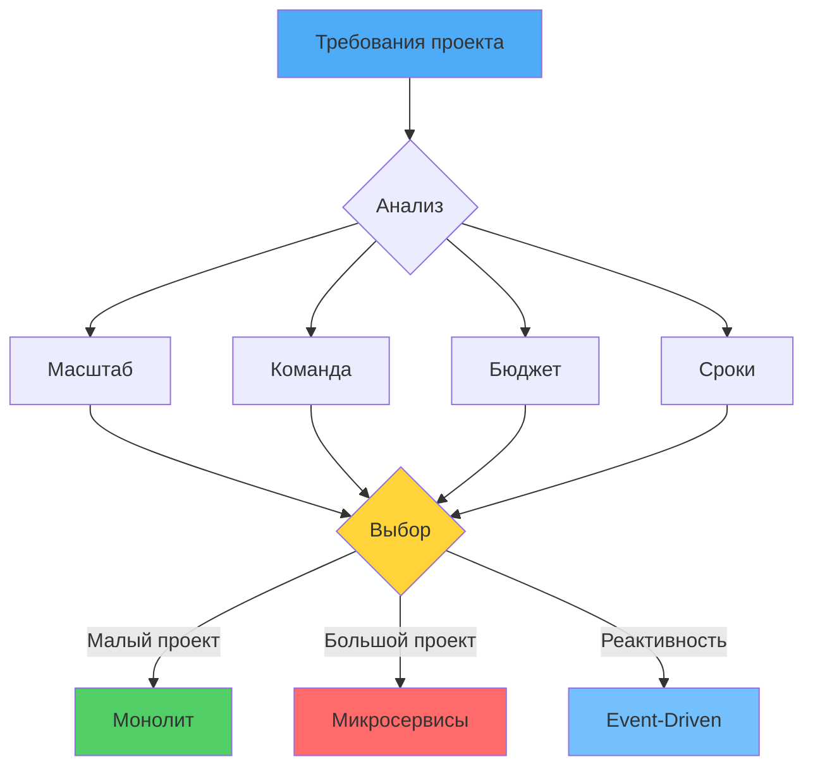

# 🎯 Урок 5: Выбор архитектуры

## 🎯 Цели урока

После изучения этого урока вы сможете:
- ✅ Анализировать требования проекта для выбора архитектуры
- ✅ Оценивать trade-offs различных архитектурных стилей
- ✅ Принимать обоснованные решения о выборе архитектуры
- ✅ Планировать миграцию между архитектурными стилями
- ✅ Оценивать риски и стоимость архитектурных решений

## 📖 Методология выбора архитектуры

!!! quote "Архитектура - это решения, которые сложно изменить потом"
    **Архитектурные решения** имеют долгосрочные последствия. Неправильный выбор может привести к значительным затратам на рефакторинг или полную переделку системы.

### 💡 Простыми словами

**Аналогия**: Выбор типа дома
- Квартира (Монолит) - быстро, дешево, но сложно расширять
- Частный дом (Микросервисы) - дороже, но можно расширять по частям
- Умный дом (Event-Driven) - современно, но сложнее в настройке

**В программировании:**
- Нет "лучшей" архитектуры - есть подходящая для задачи
- Выбор зависит от требований, команды, бюджета
- Важно понимать компромиссы каждого подхода

### 📊 Визуализация выбора архитектуры



### Шаг 1: Анализ контекста

#### Бизнес-контекст
- **Домен**: Какой бизнес-домен? (E-commerce, Finance, Healthcare, etc.)
- **Сложность**: Насколько сложна бизнес-логика?
- **Регуляции**: Есть ли требования compliance? (GDPR, HIPAA, PCI DSS)
- **Конкуренция**: Какова скорость изменений в домене?

#### Технический контекст
- **Команда**: Размер, опыт, география
- **Технологии**: Ограничения по стеку технологий
- **Инфраструктура**: Облако, on-premise, гибрид
- **Бюджет**: Ограничения по стоимости

#### Операционный контекст
- **Масштаб**: Ожидаемый рост нагрузки
- **Доступность**: Требования SLA
- **Производительность**: Требования к latency
- **Отказоустойчивость**: Критичность downtime

### Шаг 2: Качественные требования (Quality Attributes)

#### Функциональные требования
- Что система должна делать?
- Какие бизнес-процессы поддерживать?
- Какие интеграции нужны?

#### Качественные атрибуты (Quality Attributes)
```
┌─────────────────────────────────────┐
│                                     │
│  📊 Scalability                     │
│  🔄 Availability                    │
│  ⚡ Performance                     │
│  🛡️  Security                       │
│  🔧 Maintainability                 │
│  🎯 Testability                     │
│  📈 Monitoring & Observability      │
│  💰 Cost Efficiency                 │
│  🚀 Time to Market                  │
│  👥 Team Productivity               │
│                                     │
└─────────────────────────────────────┘
```

#### Приоритизация атрибутов
```python
# Метод MoSCoW для приоритизации
class QualityAttributes:
    MUST_HAVE = "must_have"      # Критично для успеха
    SHOULD_HAVE = "should_have"  # Важно, но можно отложить
    COULD_HAVE = "could_have"    # Желательно
    WONT_HAVE = "wont_have"     # Не приоритет

# Пример для E-commerce платформы
QUALITY_ATTRIBUTES = {
    "scalability": QualityAttributes.MUST_HAVE,
    "availability": QualityAttributes.MUST_HAVE,
    "security": QualityAttributes.MUST_HAVE,
    "performance": QualityAttributes.SHOULD_HAVE,
    "maintainability": QualityAttributes.SHOULD_HAVE,
    "monitoring": QualityAttributes.MUST_HAVE,
    "cost_efficiency": QualityAttributes.SHOULD_HAVE,
    "time_to_market": QualityAttributes.COULD_HAVE
}
```

## 🎯 Архитектурные драйверы (Architecture Drivers)

### Основные категории драйверов

#### 1. Технические драйверы
- **Нагрузка**: RPS, одновременные пользователи, объем данных
- **Производительность**: Latency, throughput, response time
- **Масштабируемость**: Рост нагрузки, пиковые нагрузки
- **Отказоустойчивость**: MTTR, MTBF, disaster recovery

#### 2. Бизнес-драйверы
- **Time to Market**: Скорость вывода продукта
- **Cost**: Разработка, поддержка, инфраструктура
- **Risk**: Технологические риски, vendor lock-in
- **Compliance**: Регуляторные требования

#### 3. Командные драйверы
- **Размер команды**: Координация, коммуникация
- **Опыт команды**: Знания технологий, best practices
- **География**: Распределенная команда, timezone
- **Культура**: Agile, DevOps, Continuous Delivery

### Анализ драйверов

```python
class ArchitectureDriver:
    def __init__(self, name: str, importance: int, impact: dict):
        self.name = name
        self.importance = importance  # 1-10
        self.impact = impact  # {"monolithic": 5, "microservices": 8, ...}

# Пример драйверов для крупной E-commerce платформы
DRIVERS = [
    ArchitectureDriver("scalability", 10, {
        "monolithic": 3,      # Слабое масштабирование
        "microservices": 9,   # Отличное масштабирование
        "event_driven": 10    # Превосходное масштабирование
    }),
    ArchitectureDriver("team_size", 8, {
        "monolithic": 6,      # Хорошо для небольших команд
        "microservices": 9,   # Лучше для больших команд
        "event_driven": 7     # Хорошо для распределенных команд
    }),
    ArchitectureDriver("time_to_market", 9, {
        "monolithic": 9,      # Быстрый старт
        "microservices": 5,   # Дольше на старте
        "event_driven": 6     # Среднее время
    }),
    ArchitectureDriver("cost_efficiency", 7, {
        "monolithic": 8,      # Дешевле поддержка
        "microservices": 4,   # Дороже инфраструктура
        "event_driven": 5     # Средняя стоимость
    }),
    ArchitectureDriver("maintainability", 8, {
        "monolithic": 5,      # Сложнее поддерживать
        "microservices": 8,   # Легче поддерживать
        "event_driven": 7     # Хорошо поддерживать
    })
]

def calculate_architecture_score(drivers: List[ArchitectureDriver], architecture: str) -> float:
    """Расчет оценки архитектуры на основе драйверов"""
    total_score = 0
    total_weight = 0

    for driver in drivers:
        score = driver.impact.get(architecture, 5)  # Средняя оценка по умолчанию
        weighted_score = score * driver.importance
        total_score += weighted_score
        total_weight += driver.importance

    return total_score / total_weight if total_weight > 0 else 0

# Расчет оценок
architectures = ["monolithic", "microservices", "event_driven"]
scores = {}

for arch in architectures:
    scores[arch] = calculate_architecture_score(DRIVERS, arch)

print("Architecture Scores:")
for arch, score in scores.items():
    print(f"{arch}: {score:.2f}/10")
```

## 🎨 Матрица выбора архитектуры

### Сценарии использования

```
┌─────────────────────────────────────────────────────────────────┐
│                    АРХИТЕКТУРНЫЕ СЦЕНАРИИ                      │
├─────────────────┬──────────┬────────────┬────────────┬─────────┤
│ Критерий       │ Монолит  │ Микросер-  │ Событийная │ Server- │
│                 │          │ висы       │            │ less    │
├─────────────────┼──────────┼────────────┼────────────┼─────────┤
│ Команда        │ < 10     │ 10-50      │ 20-100+    │ Любая   │
│ Размер         │ чел.     │ чел.       │ чел.       │         │
├─────────────────┼──────────┼────────────┼────────────┼─────────┤
│ Домен          │ Простой  │ Средний    │ Сложный    │ Простой │
│ Сложность      │          │             │            │         │
├─────────────────┼──────────┼────────────┼────────────┼─────────┤
│ Нагрузка       │ Низкая   │ Средняя    │ Высокая    │ Перем.  │
├─────────────────┼──────────┼────────────┼────────────┼─────────┤
│ Бюджет         │ Низкий   │ Высокий    │ Высокий    │ Низкий  │
├─────────────────┼──────────┼────────────┼────────────┼─────────┤
│ Time to Market │ Быстро   │ Средне     │ Долго      │ Быстро  │
├─────────────────┼──────────┼────────────┼────────────┼─────────┤
│ Масштаб.       │ Вертик.  │ Горизонт.  │ Горизонт.  │ Авто    │
│ Тип            │          │            │            │         │
├─────────────────┼──────────┼────────────┼────────────┼─────────┤
│ Сопровождение  │ Легкое   │ Сложное    │ Сложное    │ Среднее │
├─────────────────┼──────────┼────────────┼────────────┼─────────┤
│ Тестирование   │ Легкое   │ Сложное    │ Сложное    │ Среднее │
├─────────────────┼──────────┼────────────┼────────────┼─────────┤
│ Мониторинг     │ Простой  │ Сложный    │ Сложный    │ Средний │
└─────────────────┴──────────┴────────────┴────────────┴─────────┘
```

### Детальный анализ по критериям

#### Для небольших проектов (< 10 разработчиков)
```python
# Рекомендация: Монолит
BENEFITS = {
    "development_speed": "Быстрая разработка и развертывание",
    "simplicity": "Простая архитектура и отладка",
    "cost": "Низкие затраты на инфраструктуру",
    "consistency": "Единая транзакционная модель"
}

DRAWBACKS = {
    "scalability": "Ограниченное масштабирование",
    "technology_lock": "Трудно менять технологии",
    "team_scalability": "Не подходит для больших команд"
}
```

#### Для средних проектов (10-50 разработчиков)
```python
# Рекомендация: Микросервисы или хорошо структурированный монолит
CONSIDERATIONS = {
    "domain_complexity": "Если домен сложный → микросервисы",
    "team_distribution": "Если команда распределена → микросервисы",
    "scaling_requirements": "Если нужен гибкий scaling → микросервисы",
    "time_pressure": "Если нужен быстрый старт → монолит"
}
```

#### Для крупных проектов (> 50 разработчиков)
```python
# Рекомендация: Микросервисы + Событийная архитектура
REQUIREMENTS = {
    "service_autonomy": "Независимая разработка и развертывание",
    "scalability": "Горизонтальное масштабирование",
    "resilience": "Отказоустойчивость и изоляция сбоев",
    "observability": "Комплексный мониторинг и трассировка"
}
```

## 🚀 Стратегии миграции

### От монолита к микросервисам

#### Стратегия 1: Strangler Pattern (Удушение)
```
┌─────────────────────────────────────┐
│           MONOLITH CORE             │
│  ┌─────────┐  ┌─────────┐  ┌─────┐   │
│  │Legacy   │  │Shared   │  │New  │   │
│  │Services │  │Services │  │Micro│   │
│  │         │  │         │  │Srvcs│   │
│  └─────────┘  └─────────┘  └─────┘   │
└─────────────────────────────────────┘
                   │
                   ▼
            ┌─────────────┐
            │   API       │
            │  Gateway    │
            └─────────────┘
```

```python
# Реализация Strangler Pattern
class StranglerFacade:
    def __init__(self, monolith_client, microservices_client):
        self.monolith = monolith_client
        self.microservices = microservices_client
        self.strangled_services = set()  # Уже мигрированные сервисы

    async def handle_request(self, service_name: str, request: dict):
        if service_name in self.strangled_services:
            # Использовать новый микросервис
            return await self.microservices.call(service_name, request)
        else:
            # Использовать монолит
            return await self.monolith.call(service_name, request)

    def mark_service_strangled(self, service_name: str):
        """Отметить сервис как мигрированный"""
        self.strangled_services.add(service_name)
```

#### Стратегия 2: Anti-Corruption Layer
```
┌─────────────────────────────────────┐
│           MONOLITH                  │
│  ┌─────────┐  ┌─────────┐  ┌─────┐   │
│  │Legacy   │  │Legacy   │  │Legacy│   │
│  │Models   │  │Services │  │Data  │   │
│  └─────────┘  └─────────┘  └─────┘   │
└─────────────────────────────────────┘
         │
         ▼
┌─────────────────────────────────────┐
│      ANTI-CORRUPTION LAYER          │
│  ┌─────────┐  ┌─────────┐  ┌─────┐   │
│  │Adapter  │  │Translator│  │Facade│   │
│  │         │  │          │  │     │   │
│  └─────────┘  └─────────┘  └─────┘   │
└─────────────────────────────────────┘
         │
         ▼
┌─────────────────────────────────────┐
│         MICROSERVICES               │
│  ┌─────────┐  ┌─────────┐  ┌─────┐   │
│  │Service  │  │Service  │  │Service│   │
│  │A        │  │B        │  │C     │   │
│  └─────────┘  └─────────┘  └─────┘   │
└─────────────────────────────────────┘
```

```python
# Anti-Corruption Layer
class AntiCorruptionLayer:
    def __init__(self, monolith_client):
        self.monolith = monolith_client
        self.adapters = {}

    def register_adapter(self, domain: str, adapter):
        self.adapters[domain] = adapter

    async def translate_request(self, domain: str, request: dict):
        """Перевод запроса из новой доменной модели в старую"""
        if domain in self.adapters:
            return await self.adapters[domain].translate_request(request)
        return request

    async def translate_response(self, domain: str, response: dict):
        """Перевод ответа из старой модели в новую"""
        if domain in self.adapters:
            return await self.adapters[domain].translate_response(response)
        return response

class LegacyAdapter:
    def __init__(self, translation_rules: dict):
        self.translation_rules = translation_rules

    async def translate_request(self, request: dict) -> dict:
        # Преобразование запроса согласно правилам трансляции
        translated = {}
        for new_field, legacy_field in self.translation_rules.items():
            if new_field in request:
                translated[legacy_field] = request[new_field]
        return translated

    async def translate_response(self, response: dict) -> dict:
        # Обратное преобразование ответа
        translated = {}
        for legacy_field, new_field in self.translation_rules.items():
            if legacy_field in response:
                translated[new_field] = response[legacy_field]
        return translated
```

#### Стратегия 3: Parallel Run (Параллельное выполнение)
```
┌─────────────────────────────────────┐    ┌─────────────────────────────────────┐
│         MONOLITH                     │    │       MICROSERVICES               │
│  ┌─────────┐  ┌─────────┐  ┌─────┐   │    │  ┌─────────┐  ┌─────────┐  ┌─────┐ │
│  │Service  │  │Service  │  │Data │   │    │  │Service  │  │Service  │  │Data │ │
│  │A        │  │B        │  │    │   │    │  │A         │  │B        │  │    │ │
│  └─────────┘  └─────────┘  └─────┘   │    │  └─────────┘  └─────────┘  └─────┘ │
└─────────────────────────────────────┘    └─────────────────────────────────────┘
                │                                       │
                └───────────────┬───────────────────────┘
                                │
                    ┌───────────────────────┐
                    │   COMPARISON          │
                    │   & VALIDATION        │
                    └───────────────────────┘
```

```python
# Parallel Run implementation
class ParallelRunner:
    def __init__(self, monolith_client, microservices_client):
        self.monolith = monolith_client
        self.microservices = microservices_client

    async def execute_parallel(self, service_name: str, request: dict):
        """Выполнение запроса параллельно в обеих системах"""

        # Запуск обоих запросов параллельно
        mono_task = asyncio.create_task(
            self.monolith.call(service_name, request)
        )
        micro_task = asyncio.create_task(
            self.microservices.call(service_name, request)
        )

        # Ожидание результатов
        mono_result, micro_result = await asyncio.gather(
            mono_task, micro_task, return_exceptions=True
        )

        # Сравнение результатов
        comparison = self.compare_results(mono_result, micro_result)

        return {
            "monolith_result": mono_result,
            "microservices_result": micro_result,
            "comparison": comparison
        }

    def compare_results(self, result1, result2) -> dict:
        """Сравнение результатов для валидации"""
        if isinstance(result1, Exception) or isinstance(result2, Exception):
            return {"match": False, "reason": "Exception occurred"}

        # Сравнение по ключевым полям
        # (упрощенная реализация)
        return {"match": result1 == result2, "details": {}}
```

## 📊 Оценка стоимости и рисков

### Модель стоимости архитектуры

```python
class ArchitectureCostModel:
    def __init__(self):
        self.cost_factors = {
            "development": 0.4,    # 40% - разработка
            "infrastructure": 0.3, # 30% - инфраструктура
            "operations": 0.2,     # 20% - эксплуатация
            "maintenance": 0.1     # 10% - сопровождение
        }

    def calculate_total_cost(self, architecture: str, project_size: str) -> dict:
        """Расчет общей стоимости архитектуры"""

        base_costs = {
            "monolithic": {
                "small": {"development": 100, "infrastructure": 50, "operations": 30, "maintenance": 20},
                "medium": {"development": 200, "infrastructure": 100, "operations": 60, "maintenance": 40},
                "large": {"development": 400, "infrastructure": 200, "operations": 120, "maintenance": 80}
            },
            "microservices": {
                "small": {"development": 150, "infrastructure": 100, "operations": 80, "maintenance": 50},
                "medium": {"development": 300, "infrastructure": 200, "operations": 150, "maintenance": 100},
                "large": {"development": 600, "infrastructure": 400, "operations": 300, "maintenance": 200}
            },
            "event_driven": {
                "small": {"development": 180, "infrastructure": 120, "operations": 100, "maintenance": 60},
                "medium": {"development": 350, "infrastructure": 250, "operations": 200, "maintenance": 120},
                "large": {"development": 700, "infrastructure": 500, "operations": 400, "maintenance": 250}
            }
        }

        costs = base_costs[architecture][project_size]

        # Расчет с учетом факторов
        total = 0
        breakdown = {}

        for factor, weight in self.cost_factors.items():
            factor_cost = costs[factor] * weight
            breakdown[factor] = factor_cost
            total += factor_cost

        return {
            "total_cost": total,
            "breakdown": breakdown,
            "monthly_cost": total / 12,  # Предполагая 12 месяцев
            "cost_per_developer": total / self.get_team_size(project_size)
        }

    def get_team_size(self, project_size: str) -> int:
        return {"small": 5, "medium": 15, "large": 30}[project_size]

# Использование
cost_model = ArchitectureCostModel()

architectures = ["monolithic", "microservices", "event_driven"]
for arch in architectures:
    cost = cost_model.calculate_total_cost(arch, "medium")
    print(f"\n{arch.upper()} Architecture:")
    print(f"Total Cost: ${cost['total_cost']:,.0f}")
    print(f"Monthly Cost: ${cost['monthly_cost']:,.0f}")
    print(f"Cost per Developer: ${cost['cost_per_developer']:,.0f}")
```

### Анализ рисков

```python
class RiskAssessment:
    def __init__(self):
        self.risk_categories = {
            "technical": 0.4,
            "operational": 0.3,
            "business": 0.2,
            "compliance": 0.1
        }

    def assess_architecture_risks(self, architecture: str, context: dict) -> dict:
        """Оценка рисков архитектуры"""

        # Базовые риски для каждой архитектуры
        base_risks = {
            "monolithic": {
                "technical": ["Scalability limits", "Technology lock-in"],
                "operational": ["Single point of failure", "Deployment complexity"],
                "business": ["Slow feature delivery", "Team scaling issues"],
                "compliance": ["Data isolation challenges"]
            },
            "microservices": {
                "technical": ["Distributed system complexity", "Service discovery"],
                "operational": ["Network latency", "Monitoring complexity"],
                "business": ["Higher initial costs", "Team coordination"],
                "compliance": ["Data consistency", "Cross-service security"]
            },
            "event_driven": {
                "technical": ["Eventual consistency", "Debugging complexity"],
                "operational": ["Message broker reliability", "Processing delays"],
                "business": ["Higher complexity", "Learning curve"],
                "compliance": ["Event auditing", "Data lineage"]
            }
        }

        risks = base_risks[architecture]
        risk_score = self.calculate_risk_score(risks, context)

        return {
            "risks": risks,
            "overall_score": risk_score,
            "mitigation_strategies": self.get_mitigation_strategies(architecture)
        }

    def calculate_risk_score(self, risks: dict, context: dict) -> float:
        """Расчет общего уровня риска"""
        total_score = 0
        total_weight = 0

        for category, weight in self.risk_categories.items():
            category_risks = len(risks[category])
            # Увеличиваем вес риска на основе контекста
            context_multiplier = context.get(f"{category}_sensitivity", 1.0)
            score = category_risks * context_multiplier
            total_score += score * weight
            total_weight += weight

        return total_score / total_weight if total_weight > 0 else 0

    def get_mitigation_strategies(self, architecture: str) -> dict:
        """Стратегии снижения рисков"""
        strategies = {
            "monolithic": {
                "scalability": "Implement caching, optimize queries, consider vertical scaling",
                "technology_lock": "Use clean architecture, avoid framework lock-in",
                "deployment": "Implement CI/CD, blue-green deployments"
            },
            "microservices": {
                "complexity": "Start with domain-driven design, use service mesh",
                "network": "Implement circuit breakers, retries, timeouts",
                "monitoring": "Use distributed tracing, centralized logging"
            },
            "event_driven": {
                "consistency": "Implement saga pattern, event sourcing",
                "debugging": "Use correlation IDs, event logging",
                "reliability": "Implement dead letter queues, retry policies"
            }
        }

        return strategies[architecture]

# Оценка рисков
risk_assessor = RiskAssessment()

context = {
    "technical_sensitivity": 0.8,    # Высокая чувствительность к техническим рискам
    "operational_sensitivity": 0.9,  # Критичные операционные требования
    "business_sensitivity": 0.7,     # Важные бизнес-риски
    "compliance_sensitivity": 0.6    # Средние требования compliance
}

for arch in ["monolithic", "microservices", "event_driven"]:
    assessment = risk_assessor.assess_architecture_risks(arch, context)
    print(f"\n{arch.upper()} Risk Assessment:")
    print(f"Overall Risk Score: {assessment['overall_score']:.2f}/10")
    print(f"Number of Risks: {sum(len(risks) for risks in assessment['risks'].values())}")
```

## 🎯 Фреймворк принятия решений

### Шаг 1: Определение требований

```python
class RequirementsAnalysis:
    def __init__(self):
        self.functional_reqs = []
        self.quality_attrs = {}
        self.constraints = {}

    def add_functional_requirement(self, req: str, priority: str):
        self.functional_reqs.append({"requirement": req, "priority": priority})

    def set_quality_attribute(self, attr: str, value: int, priority: str):
        self.quality_attrs[attr] = {"value": value, "priority": priority}

    def add_constraint(self, constraint: str, impact: str):
        self.constraints[constraint] = impact

    def analyze_architecture_fit(self, architecture: str) -> dict:
        """Анализ соответствия архитектуры требованиям"""
        # Логика анализа (упрощенная)
        return {
            "functional_fit": 0.8,
            "quality_fit": 0.7,
            "constraint_fit": 0.9,
            "overall_fit": 0.8
        }
```

### Шаг 2: Оценка альтернатив

```python
class ArchitectureEvaluation:
    def __init__(self, requirements: RequirementsAnalysis):
        self.requirements = requirements
        self.alternatives = {}

    def evaluate_alternative(self, architecture: str, criteria: dict):
        """Оценка архитектуры по критериям"""
        self.alternatives[architecture] = criteria

    def rank_alternatives(self) -> List[tuple]:
        """Ранжирование альтернатив"""
        ranked = []
        for arch, criteria in self.alternatives.items():
            score = self.calculate_score(criteria)
            ranked.append((arch, score))

        return sorted(ranked, key=lambda x: x[1], reverse=True)

    def calculate_score(self, criteria: dict) -> float:
        """Расчет общего балла"""
        # Упрощенная логика расчета
        weights = {
            "scalability": 0.3,
            "maintainability": 0.2,
            "cost": 0.2,
            "time_to_market": 0.15,
            "risk": 0.15
        }

        score = 0
        for criterion, weight in weights.items():
            score += criteria.get(criterion, 5) * weight

        return score
```

### Шаг 3: Принятие решения

```python
class DecisionFramework:
    def __init__(self):
        self.evaluation = None
        self.recommendation = None
        self.rationale = []

    def make_decision(self, evaluation: ArchitectureEvaluation) -> dict:
        """Принятие решения на основе оценки"""
        ranked = evaluation.rank_alternatives()

        best_architecture = ranked[0][0]
        best_score = ranked[0][1]

        # Формирование обоснования
        rationale = []
        for arch, score in ranked:
            criteria = evaluation.alternatives[arch]
            rationale.append({
                "architecture": arch,
                "score": score,
                "strengths": [k for k, v in criteria.items() if v >= 7],
                "weaknesses": [k for k, v in criteria.items() if v < 5]
            })

        return {
            "recommended_architecture": best_architecture,
            "confidence_score": best_score / 10,  # Нормализация
            "alternatives": ranked,
            "rationale": rationale,
            "decision_factors": self.identify_decision_factors(evaluation)
        }

    def identify_decision_factors(self, evaluation: ArchitectureEvaluation) -> List[str]:
        """Идентификация ключевых факторов решения"""
        factors = []

        # Анализ требований
        high_priority_reqs = [
            req for req in evaluation.requirements.functional_reqs
            if req["priority"] == "high"
        ]

        if high_priority_reqs:
            factors.append(f"High-priority requirements: {len(high_priority_reqs)}")

        # Анализ ограничений
        if evaluation.requirements.constraints:
            factors.append(f"Architecture constraints: {list(evaluation.requirements.constraints.keys())}")

        return factors
```

## 🎮 Практические упражнения

### Упражнение 1: Анализ требований и выбор архитектуры

**Задание:** Проанализировать требования проекта и выбрать оптимальную архитектуру.

### Упражнение 2: Планирование миграции

**Задание:** Разработать план миграции с одной архитектуры на другую.

## 🎯 Ключевые выводы

1. **Архитектура должна соответствовать контексту** проекта
2. **Каждая архитектура имеет trade-offs** - нет идеального решения
3. **Начинайте с простого** и эволюционируйте по необходимости
4. **Команда важнее технологии** - учитывайте опыт и размер команды
5. **Мониторьте и адаптируйтесь** - архитектура должна эволюционировать
6. **Документируйте решения** - объясняйте почему выбрана конкретная архитектура

## 🚀 Следующие шаги

!!! success "Что вы узнали"
    - ✅ Методологию выбора архитектуры на основе требований
    - ✅ Как анализировать архитектурные драйверы и trade-offs
    - ✅ Критерии выбора между Монолитом, Микросервисами и Event-Driven
    - ✅ Как планировать миграцию между архитектурными стилями

!!! tip "Практика"
    Проанализируйте реальный проект (свой или open-source) и создайте архитектурный документ с обоснованием выбора архитектуры.

!!! success "Поздравляем с завершением Модуля 3! 🎉"
    Вы успешно освоили различные архитектурные подходы! Теперь у вас есть полное понимание:
    
    - ✅ **Монолитной архитектуры** - когда и как ее использовать
    - ✅ **Микросервисной архитектуры** - принципы декомпозиции и коммуникации
    - ✅ **Событийной архитектуры** - Event Sourcing, CQRS, реактивность
    - ✅ **Выбора архитектуры** - критерии, trade-offs, миграция

**Следующий шаг:** Переходите к **[Модулю 4: Domain-Driven Design](../module-04-ddd/)** - изучению моделирования сложных бизнес-доменов и создания ПО, ориентированного на домен!

---

!!! tip "Практический совет"
    Лучшая архитектура - та, которая соответствует вашим текущим потребностям и позволяет эволюционировать. Не пытайтесь предсказать будущее - адаптируйтесь к изменениям.

!!! info "Дополнительные ресурсы"
    - [ThoughtWorks Technology Radar](https://www.thoughtworks.com/radar) - тренды в архитектуре
    - [AWS Architecture Center](https://aws.amazon.com/architecture/) - примеры архитектур
    - [Microsoft Architecture Patterns](https://docs.microsoft.com/en-us/azure/architecture/patterns/)

## 🧪 Проверьте свои знания: Выбор архитектуры

<div class="quiz-container" id="architecture-selection-quiz">
<script type="application/json">
{
  "title": "Выбор архитектуры",
  "description": "Проверьте понимание критериев выбора архитектурного стиля",
  "icon": "🎯",
  "questions": [
    {
      "question": "Что является наиболее важным фактором при выборе архитектуры?",
      "type": "single",
      "points": 1,
      "options": [
        {"text": "Трендовые технологии", "correct": false},
        {"text": "Бизнес-требования и контекст", "correct": true},
        {"text": "Предпочтения разработчиков", "correct": false},
        {"text": "Рекомендации консультантов", "correct": false}
      ],
      "explanation": "Архитектура должна соответствовать конкретным требованиям и контексту проекта"
    },
    {
      "question": "Какая архитектура лучше подходит для MVP?",
      "type": "single",
      "points": 1,
      "options": [
        {"text": "Монолитная", "correct": true},
        {"text": "Микросервисная", "correct": false},
        {"text": "Событийная", "correct": false},
        {"text": "Serverless", "correct": false}
      ],
      "explanation": "Монолит позволяет быстро разработать и протестировать MVP"
    },
    {
      "question": "Что такое Strangler Pattern?",
      "type": "single",
      "points": 1,
      "options": [
        {"text": "Паттерн для создания микросервисов", "correct": false},
        {"text": "Стратегия постепенной миграции с монолита", "correct": true},
        {"text": "Метод тестирования архитектуры", "correct": false},
        {"text": "Паттерн для масштабирования", "correct": false}
      ],
      "explanation": "Strangler Pattern позволяет постепенно заменять монолит микросервисами"
    },
    {
      "question": "Когда микросервисы становятся лучшим выбором?",
      "type": "multiple",
      "points": 2,
      "options": [
        {"text": "Команда больше 20 разработчиков", "correct": true},
        {"text": "Нужна независимая разработка команд", "correct": true},
        {"text": "Есть бюджет на инфраструктуру", "correct": true},
        {"text": "Нужен быстрый запуск MVP", "correct": false},
        {"text": "Команда состоит из новичков", "correct": false}
      ],
      "explanation": "Микросервисы подходят для больших команд и сложных систем"
    },
    {
      "question": "Что важно учитывать при миграции архитектуры?",
      "type": "multiple",
      "points": 2,
      "options": [
        {"text": "Бизнес-риски", "correct": true},
        {"text": "Стоимость миграции", "correct": true},
        {"text": "Опыт команды", "correct": true},
        {"text": "Трендовые технологии", "correct": false},
        {"text": "Рекомендации коллег", "correct": false}
      ],
      "explanation": "Миграция архитектуры требует тщательного анализа рисков и затрат"
    },
    {
      "question": "Какая стратегия миграции наименее рискованная?",
      "type": "single",
      "points": 1,
      "options": [
        {"text": "Big Bang migration", "correct": false},
        {"text": "Strangler Pattern", "correct": true},
        {"text": "Parallel Run", "correct": false},
        {"text": "Immediate replacement", "correct": false}
      ],
      "explanation": "Strangler Pattern позволяет миграцию с минимальными рисками"
    },
    {
      "question": "Что такое Anti-Corruption Layer?",
      "type": "single",
      "points": 1,
      "options": [
        {"text": "Слой для защиты от вредоносного кода", "correct": false},
        {"text": "Изоляция от legacy систем", "correct": true},
        {"text": "Слой для антивирусной защиты", "correct": false},
        {"text": "Метод оптимизации производительности", "correct": false}
      ],
      "explanation": "Anti-Corruption Layer защищает новую систему от legacy кода"
    },
    {
      "question": "Когда serverless архитектура - лучший выбор?",
      "type": "multiple",
      "points": 2,
      "options": [
        {"text": "Непрогнозируемая нагрузка", "correct": true},
        {"text": "Ограниченный бюджет на инфраструктуру", "correct": true},
        {"text": "Простая бизнес-логика", "correct": true},
        {"text": "Требуется низкая latency", "correct": false},
        {"text": "Нужен полный контроль инфраструктуры", "correct": false}
      ],
      "explanation": "Serverless подходит для переменной нагрузки и простых задач"
    },
    {
      "question": "Что важно для успешной миграции архитектуры?",
      "type": "multiple",
      "points": 2,
      "options": [
        {"text": "Тестирование на каждом шаге", "correct": true},
        {"text": "Мониторинг метрик", "correct": true},
        {"text": "Возможность отката", "correct": true},
        {"text": "Работа в выходные", "correct": false},
        {"text": "Игнорирование обратной связи", "correct": false}
      ],
      "explanation": "Миграция требует тщательного планирования и контроля"
    },
    {
      "question": "Как оценить стоимость архитектуры?",
      "type": "single",
      "points": 1,
      "options": [
        {"text": "Только стоимость разработки", "correct": false},
        {"text": "Включая инфраструктуру, эксплуатацию, сопровождение", "correct": true},
        {"text": "Только стоимость серверов", "correct": false},
        {"text": "Стоимость лицензий ПО", "correct": false}
      ],
      "explanation": "Стоимость архитектуры включает все аспекты жизненного цикла"
    }
  ]
}
</script>
</div>

## 💻 Практическое задание: Анализ и выбор архитектуры

{{ create_exercise_form(
    "architecture_selection_case_study",
    "Анализ требований и выбор архитектуры для реального проекта",
    "Проведите полный анализ требований проекта, оцените альтернативы и выберите оптимальную архитектуру с обоснованием решения.",
    """# Задание: Архитектурный анализ и выбор

## Контекст проекта: Финтех-платформа для P2P кредитования

### Описание бизнеса
Платформа соединяет заемщиков и инвесторов для P2P (peer-to-peer) кредитования. Инвесторы могут инвестировать в кредиты заемщиков и получать процентный доход.

### Текущая ситуация
- MVP запущен как монолитное приложение
- 50,000+ пользователей
- 10,000+ активных кредитов
- Рост на 200% ежегодно
- Команда: 35 разработчиков (backend + frontend + mobile + ML)

### Бизнес-цели на ближайшие 2 года
1. **Масштабирование**: Поддержка 500,000+ пользователей
2. **Новые продукты**: Кредитные карты, страхование, инвестиционные продукты
3. **Международная экспансия**: Выход на новые рынки
4. **Регуляторные требования**: Compliance с финтех регуляциями
5. **Инновации**: AI/ML для скоринга, рекомендаций

### Технические требования

#### Функциональные требования
- **Онбординг пользователей**: KYC, скоринг, верификация
- **Мэтчинг**: Автоматическое сопоставление инвесторов и заемщиков
- **Управление кредитами**: Выдача, погашение, реструктуризация
- **Инвестиционная платформа**: Портфели, аналитика, диверсификация
- **Платежная система**: Интеграция с банками, процессинг платежей
- **Риск-менеджмент**: Мониторинг, fraud detection, коллекшн
- **Аналитика**: Отчетность, BI, ML модели
- **API**: Открытое API для партнеров

#### Качественные требования (Quality Attributes)
- **Производительность**: 99-й перцентиль < 500ms
- **Доступность**: 99.9% SLA
- **Безопасность**: PCI DSS, GDPR compliance
- **Масштабируемость**: 10x рост нагрузки
- **Надежность**: Zero data loss, ACID compliance
- **Аудит**: Полная traceability всех операций

#### Технические ограничения
- **Команда**: 35 разработчиков, распределена по 6 командам
- **Технологии**: Python (основной), Go (высоконагруженные сервисы)
- **Инфраструктура**: AWS, Kubernetes
- **Бюджет**: $2M/год на инфраструктуру
- **Регуляции**: Финтех лицензии, аудит compliance

### Задачи для выполнения

#### 1. Анализ текущей архитектуры
```python
# Оцените текущий монолит
CURRENT_MONOLITH_ASSESSMENT = {
    "strengths": [
        # Перечислите преимущества текущего монолита
    ],
    "weaknesses": [
        # Перечислите проблемы текущего монолита
    ],
    "scalability_limitations": [
        # Где монолит не справляется
    ],
    "team_collaboration_issues": [
        # Проблемы с командной разработкой
    ]
}
```

#### 2. Определение архитектурных драйверов
```python
# Основные драйверы выбора архитектуры
ARCHITECTURE_DRIVERS = [
    {
        "driver": "scalability",
        "importance": 10,  # 1-10 шкала
        "current_architecture_limit": "Vertical scaling exhausted",
        "business_impact": "Platform growth bottleneck"
    },
    {
        "driver": "team_autonomy",
        "importance": 9,
        "current_architecture_limit": "Code conflicts, long builds",
        "business_impact": "Slow feature delivery"
    },
    {
        "driver": "innovation_speed",
        "importance": 8,
        "current_architecture_limit": "Technology lock-in",
        "business_impact": "Cannot adopt new technologies quickly"
    },
    {
        "driver": "regulatory_compliance",
        "importance": 10,
        "current_architecture_limit": "Shared database concerns",
        "business_impact": "Compliance violations risk"
    },
    {
        "driver": "cost_efficiency",
        "importance": 7,
        "current_architecture_limit": "Inefficient resource usage",
        "business_impact": "Higher infrastructure costs"
    }
]
```

#### 3. Оценка альтернативных архитектур

##### Вариант 1: Эволюция монолита
```python
MONOLITH_EVOLUTION = {
    "approach": "Modular Monolith + Microservices",
    "description": "Структурировать монолит + выделить критичные сервисы",
    "benefits": [
        "Меньше изменений в существующем коде",
        "Пошаговая миграция",
        "Снижение рисков"
    ],
    "challenges": [
        "Частичное решение проблем масштабирования",
        "Сложность координации модулей"
    ],
    "timeline": "6-9 месяцев",
    "cost": "$500K - $800K",
    "risk_level": "Medium"
}
```

##### Вариант 2: Микросервисная архитектура
```python
MICROSERVICES_ARCHITECTURE = {
    "approach": "Domain-Driven Microservices",
    "description": "Полная декомпозиция на микросервисы по доменам",
    "benefits": [
        "Полная независимость команд",
        "Гибкое масштабирование",
        "Технологическая свобода"
    ],
    "challenges": [
        "Сложность распределенных транзакций",
        "Высокие требования к инфраструктуре",
        "Сложность отладки и мониторинга"
    ],
    "timeline": "12-18 месяцев",
    "cost": "$1.5M - $2.5M",
    "risk_level": "High"
}
```

##### Вариант 3: Гибридная архитектура
```python
HYBRID_ARCHITECTURE = {
    "approach": "Core Monolith + Microservices + Event-Driven",
    "description": "Монолит для core + микросервисы для новых функций",
    "benefits": [
        "Баланс между стабильностью и инновациями",
        "Пошаговая миграция",
        "Снижение рисков"
    ],
    "challenges": [
        "Сложность интеграции разных архитектур",
        "Необходимость поддерживать legacy"
    ],
    "timeline": "9-12 месяцев",
    "cost": "$800K - $1.2M",
    "risk_level": "Medium-High"
}
```

#### 4. Рекомендация архитектуры

##### Выбранная архитектура:
```
[Ваше решение - какой вариант выбрать и почему]
```

##### Обоснование:
```
1. [Основной драйвер 1] - почему выбранная архитектура лучше
2. [Основной драйвер 2] - преимущества по сравнению с альтернативами
3. [Бизнес-ценность] - как это повлияет на бизнес-метрики
4. [Риски] - как минимизировать риски выбранного подхода
```

##### План реализации:
```
Фаза 1 (0-3 месяца): [Что делать]
Фаза 2 (3-6 месяцев): [Что делать]
Фаза 3 (6-12 месяцев): [Что делать]
```

##### Метрики успеха:
```
- [Технические метрики]: throughput, latency, availability
- [Бизнес-метрики]: user growth, feature delivery speed
- [Качественные метрики]: team satisfaction, code quality
```

### Дополнительные вопросы для анализа

1. **Domain Analysis**: Как бы вы разделили систему на bounded contexts?

2. **Team Organization**: Как организовать команды для выбранной архитектуры?

3. **Technology Choices**: Какие технологии выбрать для каждого компонента?

4. **Data Strategy**: Как обеспечить консистентность данных?

5. **Security**: Как реализовать security в выбранной архитектуре?

6. **Monitoring**: Какие метрики мониторить для оценки успеха?

7. **Cost Analysis**: Детальный расчет стоимости выбранной архитектуры?

8. **Risk Mitigation**: План минимизации рисков?

## Ожидаемый результат

Создайте детальный архитектурный документ (5-10 страниц) включающий:

1. **Текущая ситуация** - анализ существующей системы
2. **Архитектурные драйверы** - ключевые факторы выбора
3. **Альтернативы** - сравнение вариантов с плюсами/минусами
4. **Рекомендация** - выбранная архитектура с обоснованием
5. **План реализации** - пошаговый план миграции
6. **Риски и mitigation** - потенциальные проблемы и решения
7. **Метрики успеха** - как измерять успешность

## Критерии оценки

- **Анализ требований**: Глубина понимания бизнес-контекста
- **Оценка альтернатив**: Объективность сравнения вариантов
- **Обоснование выбора**: Логика и связь с драйверами
- **Практичность плана**: Реализуемость и учет ограничений
- **Управление рисками**: Проработка сценариев и mitigation

---

*Помните: Архитектурное решение - это баланс между идеалом и практическими ограничениями. Лучшая архитектура - та, которую можно успешно реализовать в ваших условиях.*""",
    [
        "Провести анализ текущей ситуации и требований",
        "Определить архитектурные драйверы и их приоритеты",
        "Оценить альтернативные архитектуры",
        "Выбрать оптимальную архитектуру с обоснованием",
        "Разработать план реализации и миграции",
        "Оценить риски и предложить mitigation стратегии"
    ]
) }}


