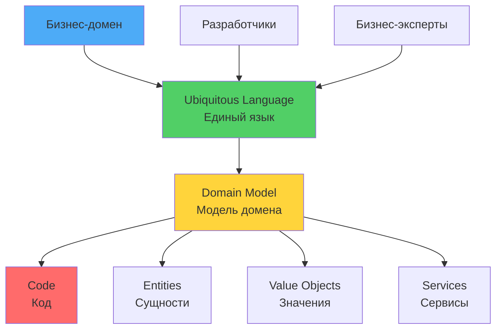
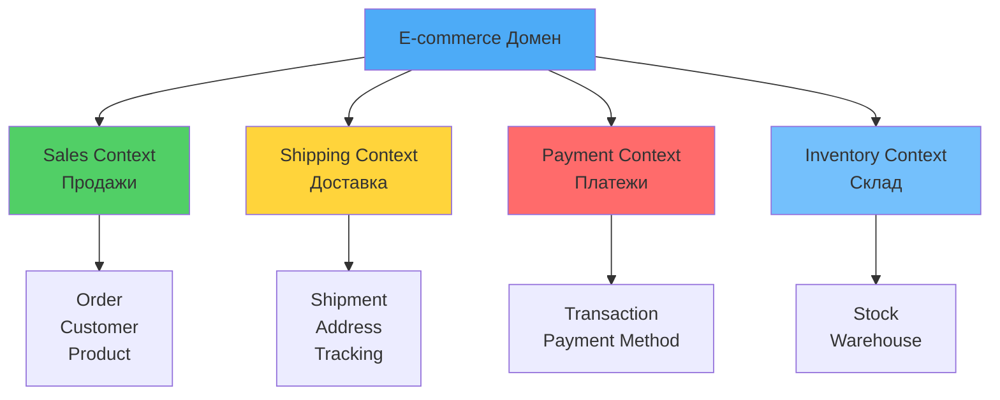

# 🎯 Урок 1: Основы Domain-Driven Design

## 🎯 Цели урока

После изучения этого урока вы сможете:
- ✅ Понимать философию и принципы Domain-Driven Design
- ✅ Различать модель предметной области и техническую модель
- ✅ Применять Ubiquitous Language в коммуникации
- ✅ Анализировать бизнес-домены и выделять ключевые концепции
- ✅ Создавать эффективную модель предметной области

## 📖 Что такое Domain-Driven Design?

!!! quote "Определение DDD"
    **Domain-Driven Design (DDD)** - это подход к разработке программного обеспечения, при котором программная система строится вокруг модели предметной области (domain model), которая является центральной и наиболее важной частью системы.

### 💡 Простыми словами

**Аналогия**: Строительство дома по плану архитектора
- **Традиционный подход** = строитель решает, как строить (техническая модель)
- **DDD подход** = архитектор создает план, отражающий потребности жильцов (доменная модель)
- **Код** = план дома, который понятен и архитектору, и жильцам

**В программировании:**
- Код должен отражать бизнес-реальность
- Разработчики и бизнес говорят на одном языке
- Бизнес-правила живут в коде, а не в документации
- Система эволюционирует вместе с пониманием бизнеса

### 📊 Визуализация DDD подхода



### Философия DDD

DDD - это не просто набор паттернов или технологий. Это **образ мышления**, при котором:

1. **Домен в центре внимания** - бизнес-домен определяет архитектуру системы
2. **Код как отражение реальности** - программный код должен быть выразительным и понятным для бизнес-пользователей
3. **Сотрудничество** - разработчики и бизнес-эксперты работают вместе
4. **Итеративный процесс** - модель домена эволюционирует вместе с пониманием бизнеса

### Проблемы традиционного подхода

**❌ Контрпример: Традиционный подход**

Этот пример демонстрирует **антипаттерн**, который нарушает принципы DDD. Он показывает, как технические детали (работа с БД) доминируют над доменной логикой, бизнес-правила разбросаны по коду и не инкапсулированы, а намерения методов неясны с точки зрения бизнеса. DDD-подход, показанный ниже, решает эти проблемы.

```python
# ❌ Традиционный подход: техническая модель доминирует
# ПРОБЛЕМА: Технические детали (БД операции) доминируют над доменной логикой
class CustomerService:
    def __init__(self, db_connection):
        self.db = db_connection  # Техническая зависимость в центре внимания

    def create_customer(self, data: dict):
        # ПРОБЛЕМА: Бизнес-правила разбросаны и не инкапсулированы в сущности
        # ПРОБЛЕМА: Намерение "create_customer" неясно с бизнес-перспективы
        if not data.get('email'):  # Валидация смешана с технической логикой
            raise ValueError("Email is required")

        # ПРОБЛЕМА: Технические операции с БД доминируют над доменной логикой
        customer_id = self.db.insert('customers', data)  # Прямая работа с БД
        return customer_id

    def get_customer(self, customer_id: int):
        # ПРОБЛЕМА: Технические операции с БД доминируют над доменной логикой
        return self.db.select('customers', customer_id)  # Прямая работа с БД

    def update_customer(self, customer_id: int, data: dict):
        # ПРОБЛЕМА: Технические операции с БД доминируют над доменной логикой
        self.db.update('customers', customer_id, data)  # Прямая работа с БД

# Проблемы:
# - Код не отражает бизнес-логику
# - Бизнес-правила размазаны по техническим методам
# - Трудно понять, что делает система
# - Изменения в бизнесе требуют изменений в коде повсюду
```

### Решение DDD-подхода

```python
# ✅ DDD подход: домен в центре
from abc import ABC, abstractmethod
from typing import Optional, List
from dataclasses import dataclass
from datetime import datetime
import uuid

# Доменные сущности (Entities)
@dataclass
class Customer:
    id: str
    email: str
    name: str
    status: str = "active"
    created_at: datetime = None

    def __post_init__(self):
        if self.created_at is None:
            self.created_at = datetime.utcnow()

    def change_email(self, new_email: str) -> None:
        """Бизнес-правило: смена email"""
        if not new_email or '@' not in new_email:
            raise ValueError("Invalid email format")

        # Дополнительные бизнес-правила
        if self.status == "suspended":
            raise ValueError("Cannot change email for suspended customer")

        self.email = new_email

    def suspend(self) -> None:
        """Бизнес-правило: приостановка аккаунта"""
        if self.status == "suspended":
            raise ValueError("Customer is already suspended")

        self.status = "suspended"

    def reactivate(self) -> None:
        """Бизнес-правило: реактивация аккаунта"""
        if self.status != "suspended":
            raise ValueError("Customer is not suspended")

        self.status = "active"

# Доменные сервисы (Domain Services)
class CustomerDomainService:
    @staticmethod
    def can_change_email(customer: Customer, new_email: str) -> bool:
        """Комплексная бизнес-логика"""
        # Проверка уникальности email
        # Проверка черных списков
        # Проверка бизнес-правил
        return True

# Репозитории (Repositories)
class CustomerRepository(ABC):
    @abstractmethod
    def save(self, customer: Customer) -> None:
        pass

    @abstractmethod
    def find_by_id(self, customer_id: str) -> Optional[Customer]:
        pass

    @abstractmethod
    def find_by_email(self, email: str) -> Optional[Customer]:
        pass

# Application Services (Application Layer)
class CustomerApplicationService:
    def __init__(self, customer_repo: CustomerRepository):
        self.customer_repo = customer_repo

    def register_customer(self, email: str, name: str) -> str:
        """Use Case: Регистрация нового клиента"""
        # Валидация
        if not email or not name:
            raise ValueError("Email and name are required")

        # Проверка существования
        existing = self.customer_repo.find_by_email(email)
        if existing:
            raise ValueError("Customer with this email already exists")

        # Создание клиента
        customer_id = str(uuid.uuid4())
        customer = Customer(
            id=customer_id,
            email=email,
            name=name
        )

        # Сохранение
        self.customer_repo.save(customer)

        return customer_id

    def change_customer_email(self, customer_id: str, new_email: str) -> None:
        """Use Case: Смена email клиента"""
        # Получение клиента
        customer = self.customer_repo.find_by_id(customer_id)
        if not customer:
            raise ValueError("Customer not found")

        # Проверка бизнес-правил
        if not CustomerDomainService.can_change_email(customer, new_email):
            raise ValueError("Cannot change email")

        # Изменение
        customer.change_email(new_email)

        # Сохранение
        self.customer_repo.save(customer)
```

## 🎨 Ключевые концепции DDD

### 1. **Domain Model (Модель предметной области)**

Модель домена - это абстрактное представление реального бизнеса в программном коде.

```python
# Модель домена отражает бизнес-реальность
class EcommerceDomain:
    """
    Интернет-магазин как модель домена

    Ключевые концепции:
    - Товары (Products)
    - Клиенты (Customers)
    - Заказы (Orders)
    - Корзина (Shopping Cart)
    - Доставка (Shipping)
    - Платежи (Payments)
    """

    def place_order(self, customer_id: str, items: List[dict]) -> Order:
        """Бизнес-процесс: оформление заказа"""
        # Получить клиента
        customer = self.customer_repository.find_by_id(customer_id)

        # Проверить доступность товаров
        for item in items:
            product = self.product_repository.find_by_id(item['product_id'])
            if product.stock < item['quantity']:
                raise InsufficientStockError(product.name)

        # Рассчитать стоимость
        total = sum(
            self.calculate_item_price(item['product_id'], item['quantity'])
            for item in items
        )

        # Создать заказ
        order = Order(customer_id, items, total)

        # Проверить кредитный лимит клиента
        if customer.credit_limit < total:
            raise CreditLimitExceededError()

        # Сохранить заказ
        self.order_repository.save(order)

        return order
```

### 2. **Ubiquitous Language (Единый язык)**

#### 💡 Простыми словами

**Аналогия**: Переводчик в международной команде
- Разработчики говорят на "техническом" языке
- Бизнес говорит на "бизнес" языке
- Ubiquitous Language = общий словарь, понятный всем
- Код использует те же термины, что и бизнес

**В программировании:**
- Один термин = одно значение в рамках контекста
- Классы и методы называются так же, как говорят бизнес-эксперты
- Документация и код используют одинаковые термины

Единый язык - это общий словарь терминов, понятный всем участникам проекта.

```python
# ❌ Плохо: технический жаргон
class OrderProcessor:
    def processOrderData(self, orderDTO):
        # Обработка данных заказа
        pass

# ✅ Хорошо: Ubiquitous Language
class OrderProcessor:
    def place_customer_order(self, customer_order_request):
        """Оформить заказ клиента"""
        # Оформление заказа клиента
        pass

# Термины единого языка:
# - "Оформить заказ" вместо "process order"
# - "Клиент" вместо "customer entity"
# - "Заказ" вместо "order DTO"
# - "Товар" вместо "product record"
```

### 3. **Bounded Context (Ограниченный контекст)**

#### 💡 Простыми словами

**Аналогия**: Разные отделы в компании
- Отдел продаж понимает "клиент" как покупателя
- Отдел доставки понимает "клиент" как адрес доставки
- Отдел поддержки понимает "клиент" как пользователя с проблемами
- Каждый отдел = свой Bounded Context

**В программировании:**
- Один термин может иметь разное значение в разных контекстах
- Каждый контекст имеет свою модель домена
- Границы контекстов определяют, где заканчивается одна модель и начинается другая

#### 📊 Визуализация Bounded Contexts



Bounded Context - это граница, в рамках которой определенная модель домена имеет смысл.

```python
# Разные bounded contexts для одного домена

# Контекст "Продажи" (Sales Context)
class SalesOrder:
    """Заказ в контексте продаж"""
    def __init__(self, customer_id: str, items: List[OrderItem]):
        self.customer_id = customer_id
        self.items = items
        self.status = "pending"  # pending, confirmed, shipped, delivered

    def confirm_order(self):
        """Подтвердить заказ"""
        if self.status != "pending":
            raise InvalidOrderStateError()
        self.status = "confirmed"

# Контекст "Склад" (Warehouse Context)
class WarehouseOrder:
    """Заказ в контексте склада"""
    def __init__(self, order_id: str, items: List[WarehouseItem]):
        self.order_id = order_id
        self.items = items
        self.picking_status = "not_started"  # not_started, in_progress, completed

    def start_picking(self):
        """Начать сборку заказа"""
        if self.picking_status != "not_started":
            raise InvalidPickingStateError()
        self.picking_status = "in_progress"

# Контекст "Доставка" (Shipping Context)
class ShippingOrder:
    """Заказ в контексте доставки"""
    def __init__(self, order_id: str, shipping_address: Address):
        self.order_id = order_id
        self.shipping_address = shipping_address
        self.shipping_status = "not_shipped"  # not_shipped, shipped, delivered

    def ship_order(self, tracking_number: str):
        """Отправить заказ"""
        if self.shipping_status != "not_shipped":
            raise InvalidShippingStateError()
        self.shipping_status = "shipped"
        self.tracking_number = tracking_number
```

### 4. **Domain Experts (Бизнес-эксперты)**

Domain experts - это люди, которые знают бизнес лучше всех: менеджеры, аналитики, опытные сотрудники.

```python
# Вовлечение domain experts в процесс разработки

class DomainModelingWorkshop:
    """
    Мастер-класс по моделированию домена

    Участники:
    - Domain Experts (бизнес)
    - Developers (техника)
    - Product Owner (продукт)

    Цель: совместное создание модели домена
    """

    def conduct_event_storming(self, business_process: str):
        """Event Storming - техника моделирования домена"""
        # Шаг 1: Собрать всех участников
        # Шаг 2: Описать бизнес-процесс
        # Шаг 3: Выделить доменные события
        # Шаг 4: Определить команды и агрегаты
        # Шаг 5: Создать ubiquitous language
        pass

    def create_impact_mapping(self):
        """Impact Mapping - определение целей и метрик"""
        # Кто? (Actors)
        # Хочет? (Goals)
        # Чтобы? (Impacts)
        # Как? (Deliverables)
        pass

    def define_acceptance_criteria(self):
        """Определение критериев приемки с точки зрения бизнеса"""
        # Given-When-Then сценарии
        # Примеры использования
        # Business rules
        pass
```

### 5. **Knowledge Crunching (Извлечение знаний)**

Процесс извлечения знаний из умов domain experts и преобразования их в модель домена.

```python
class KnowledgeCruncher:
    """
    Специалист по извлечению знаний

    Задачи:
    - Организация встреч с domain experts
    - Фиксация бизнес-правил
    - Выявление неявных знаний
    - Создание общей картины домена
    """

    def conduct_domain_interviews(self):
        """Интервью с экспертами домена"""
        questions = [
            "Какие основные бизнес-процессы вы выполняете?",
            "Что является самым важным в вашей работе?",
            "Какие правила вы всегда соблюдаете?",
            "Что никогда нельзя делать в вашем бизнесе?",
            "Как вы принимаете решения в сложных ситуациях?",
        ]
        pass

    def create_business_process_maps(self):
        """Создание карт бизнес-процессов"""
        # As-Is процессы (текущие)
        # To-Be процессы (желаемые)
        # Проблемные точки
        # Возможности оптимизации
        pass

    def identify_business_rules(self):
        """Выявление бизнес-правил"""
        rules = {
            "invariant_rules": [],  # Всегда истинные правила
            "conditional_rules": [], # Условные правила
            "calculation_rules": [], # Правила расчетов
            "workflow_rules": []    # Правила последовательности
        }
        return rules

    def extract_terminology(self):
        """Извлечение терминологии домена"""
        glossary = {
            "terms": [],           # Специфические термины
            "synonyms": [],        # Синонимы и варианты
            "context_meanings": [] # Контекстные значения
        }
        return glossary
```

## 🎯 Преимущества DDD

### Для бизнеса
- **Быстрая адаптация** к изменениям в бизнесе
- **Снижение риска** недопонимания требований
- **Улучшение коммуникации** между бизнесом и IT
- **Повышение качества** программного обеспечения

### Для разработчиков
- **Выразительный код** - код как документация
- **Легче поддержка** - изменения локализованы
- **Лучшее тестирование** - бизнес-логика изолирована
- **Профессиональный рост** - глубокое понимание домена

### Для продукта
- **Быстрее доставка** новой функциональности
- **Меньше багов** - правильная модель домена
- **Легче масштабирование** - модульная архитектура
- **Лучший UX** - система соответствует ожиданиям пользователей

## 🎮 Практические упражнения

Для практической работы по анализу домена и созданию Ubiquitous Language выполните **Практическое задание: Анализ домена и создание модели** (см. раздел ниже, начиная с строки 675). Это задание содержит подробные инструкции по анализу бизнес-домена, выделению ключевых концепций, определению bounded contexts, созданию Ubiquitous Language и моделированию предметной области.

## 🎯 Ключевые выводы

1. **DDD - это образ мышления**, а не набор технологий
2. **Домен в центре** - бизнес определяет архитектуру
3. **Ubiquitous Language** - общий язык всех участников
4. **Bounded Context** - границы применимости модели
5. **Сотрудничество** - разработчики + бизнес работают вместе
6. **Итеративный процесс** - модель эволюционирует

## 🚀 Следующие шаги

Теперь вы готовы изучить **[Стратегическое проектирование](02-strategic-design.md)** - высокоуровневое моделирование домена и определение bounded contexts!

---

!!! tip "Практический совет"
    Начните с малого: попробуйте применить DDD в одной части вашего приложения. Не пытайтесь сразу переделать всю систему - это приведет к хаосу.

!!! info "DDD Mindset"
    DDD требует изменения мышления. Вместо "Как сохранить данные?" спрашивайте "Что означает этот бизнес-процесс?" и "Какие правила здесь действуют?"

!!! warning "Когда не использовать DDD"
    DDD не нужен для простых CRUD-приложений, прототипов или систем с простой бизнес-логикой. Оценивайте сложность домена перед применением DDD.

## 🧪 Проверьте свои знания: Основы DDD

<div class="quiz-container" id="ddd-fundamentals-quiz">
<script type="application/json">
{
  "title": "Основы Domain-Driven Design",
  "description": "Проверьте понимание базовых концепций DDD",
  "icon": "🎯",
  "questions": [
    {
      "question": "Что является центральным элементом DDD?",
      "type": "single",
      "points": 1,
      "options": [
        {"text": "База данных", "correct": false},
        {"text": "Модель предметной области", "correct": true},
        {"text": "Пользовательский интерфейс", "correct": false},
        {"text": "Технологический стек", "correct": false}
      ],
      "explanation": "Модель предметной области (domain model) является центральной частью DDD"
    },
    {
      "question": "Что такое Ubiquitous Language?",
      "type": "single",
      "points": 1,
      "options": [
        {"text": "Универсальный язык программирования", "correct": false},
        {"text": "Единый язык общения между бизнесом и разработчиками", "correct": true},
        {"text": "Язык для написания документации", "correct": false},
        {"text": "Техническая терминология", "correct": false}
      ],
      "explanation": "Ubiquitous Language - общий словарь, понятный всем участникам проекта"
    },
    {
      "question": "Что такое Bounded Context?",
      "type": "single",
      "points": 1,
      "options": [
        {"text": "Граница применения модели домена", "correct": true},
        {"text": "Ограничение на количество пользователей", "correct": false},
        {"text": "Контекст выполнения программы", "correct": false},
        {"text": "Граница базы данных", "correct": false}
      ],
      "explanation": "Bounded Context - это граница, в рамках которой модель домена имеет смысл"
    },
    {
      "question": "Преимущества DDD:",
      "type": "multiple",
      "points": 2,
      "options": [
        {"text": "Лучшая коммуникация с бизнесом", "correct": true},
        {"text": "Быстрая адаптация к изменениям", "correct": true},
        {"text": "Снижение технического долга", "correct": true},
        {"text": "Автоматическая генерация кода", "correct": false},
        {"text": "Упрощение развертывания", "correct": false}
      ],
      "explanation": "DDD дает преимущества в коммуникации, адаптивности и качестве кода"
    },
    {
      "question": "Кто такой Domain Expert?",
      "type": "single",
      "points": 1,
      "options": [
        {"text": "Ведущий разработчик", "correct": false},
        {"text": "Бизнес-эксперт, знающий домен лучше всех", "correct": true},
        {"text": "Архитектор системы", "correct": false},
        {"text": "Тестировщик", "correct": false}
      ],
      "explanation": "Domain Expert - это специалист бизнеса, который знает все нюансы домена"
    },
    {
      "question": "Что такое Knowledge Crunching?",
      "type": "single",
      "points": 1,
      "options": [
        {"text": "Оптимизация производительности", "correct": false},
        {"text": "Извлечение знаний из умов экспертов домена", "correct": true},
        {"text": "Сжатие данных", "correct": false},
        {"text": "Анализ кода", "correct": false}
      ],
      "explanation": "Knowledge Crunching - процесс извлечения неявных знаний из экспертов домена"
    },
    {
      "question": "Когда DDD наиболее эффективен?",
      "type": "multiple",
      "points": 2,
      "options": [
        {"text": "Для простых CRUD приложений", "correct": false},
        {"text": "Для сложных бизнес-доменов", "correct": true},
        {"text": "Для прототипов", "correct": false},
        {"text": "Для систем с богатой бизнес-логикой", "correct": true},
        {"text": "Для MVP", "correct": false}
      ],
      "explanation": "DDD наиболее эффективен для сложных доменов с богатой бизнес-логикой"
    },
    {
      "question": "Что такое Domain Model?",
      "type": "single",
      "points": 1,
      "options": [
        {"text": "Модель базы данных", "correct": false},
        {"text": "Абстрактное представление бизнес-реальности в коде", "correct": true},
        {"text": "Модель пользователя", "correct": false},
        {"text": "Архитектурная модель", "correct": false}
      ],
      "explanation": "Domain Model - абстрактное представление реального бизнеса в программном коде"
    },
    {
      "question": "Что является результатом Event Storming?",
      "type": "multiple",
      "points": 2,
      "options": [
        {"text": "Диаграмма классов", "correct": false},
        {"text": "Понимание бизнес-процессов", "correct": true},
        {"text": "Техническая спецификация", "correct": false},
        {"text": "Карта доменных событий", "correct": true},
        {"text": "Ubiquitous Language", "correct": true}
      ],
      "explanation": "Event Storming помогает понять бизнес-процессы и создать общий язык"
    },
    {
      "question": "Что важно в DDD-подходе?",
      "type": "multiple",
      "points": 2,
      "options": [
        {"text": "Использование конкретных технологий", "correct": false},
        {"text": "Сотрудничество между бизнесом и IT", "correct": true},
        {"text": "Итеративный процесс моделирования", "correct": true},
        {"text": "Изоляция разработчиков от бизнеса", "correct": false},
        {"text": "Фиксированная модель с первого раза", "correct": false}
      ],
      "explanation": "DDD подчеркивает сотрудничество и итеративное развитие модели"
    }
  ]
}
</script>
</div>

## 💻 Практическое задание: Анализ домена и создание модели

{{ create_exercise_form(
    "domain_analysis_modeling",
    "Анализ бизнес-домена и создание начальной модели",
    "Проведите анализ бизнес-домена, выделите ключевые концепции, определите ubiquitous language и создайте начальную модель предметной области.",
    """# Задание: Анализ домена интернет-магазина

## Контекст проекта

Вы работаете над системой для крупного интернет-магазина электроники. Компания имеет:
- 1M+ активных клиентов
- 50K+ товаров в каталоге
- 100K+ заказов в месяц
- Сложную логику скидок и промо-акций
- Интеграцию с внешними системами доставки
- Многоуровневую систему лояльности

## Задачи для выполнения

### 1. Анализ домена

Определите основные поддомены интернет-магазина:

```
🏪 E-commerce Domain
├── 📦 Product Management
│   ├── Product Catalog
│   ├── Product Search & Filtering
│   ├── Product Reviews & Ratings
│   └── Product Recommendations
├── 👥 Customer Management
│   ├── Customer Registration & Profiles
│   ├── Customer Authentication
│   ├── Customer Preferences
│   └── Loyalty Program
├── 🛒 Shopping & Orders
│   ├── Shopping Cart
│   ├── Order Creation & Management
│   ├── Order Status Tracking
│   └── Order History
├── 💰 Pricing & Promotions
│   ├── Dynamic Pricing
│   ├── Discount System
│   ├── Promo Codes
│   └── Seasonal Campaigns
├── 📦 Inventory & Warehouse
│   ├── Stock Management
│   ├── Stock Reservations
│   ├── Low Stock Alerts
│   └── Multi-warehouse Support
├── 🚚 Shipping & Delivery
│   ├── Shipping Methods
│   ├── Delivery Tracking
│   ├── Address Management
│   └── Returns & Exchanges
└── 💳 Payment Processing
    ├── Payment Methods
    ├── Payment Processing
    ├── Refunds
    └── Fraud Detection
```

### 2. Определение Bounded Contexts

Разделите домен на bounded contexts:

#### Контекст "Продажи" (Sales Context)
**Ответственность:** Управление процессом продаж
**Основные концепции:**
- Customer (Покупатель)
- Product (Товар)
- Order (Заказ)
- ShoppingCart (Корзина)
- Price (Цена)
- Discount (Скидка)

#### Контекст "Каталог" (Catalog Context)
**Ответственность:** Управление товарным каталогом
**Основные концепции:**
- Product (Товар)
- Category (Категория)
- Brand (Бренд)
- ProductVariant (Вариант товара)
- ProductImage (Изображение товара)
- ProductSpecification (Характеристики)

#### Контекст "Склад" (Inventory Context)
**Ответственность:** Управление запасами
**Основные концепции:**
- StockItem (Позиция на складе)
- Warehouse (Склад)
- StockLevel (Уровень запасов)
- StockReservation (Резервирование)
- StockMovement (Движение товаров)

#### Контекст "Доставка" (Shipping Context)
**Ответственность:** Управление доставкой
**Основные концепции:**
- ShippingOrder (Заказ на доставку)
- ShippingMethod (Способ доставки)
- ShippingAddress (Адрес доставки)
- TrackingNumber (Номер отслеживания)
- DeliveryStatus (Статус доставки)

### 3. Создание Ubiquitous Language

Определите ключевые термины и их значения:

#### Термины домена:
- **Товар (Product)**: Элемент каталога, который можно купить
- **Заказ (Order)**: Запрос клиента на покупку товаров
- **Покупатель (Customer)**: Зарегистрированный пользователь системы
- **Корзина (Shopping Cart)**: Временное хранилище выбранных товаров
- **Цена (Price)**: Стоимость товара на момент продажи
- **Скидка (Discount)**: Снижение цены по промо-акциям
- **Доставка (Shipping)**: Процесс доставки товаров покупателю

#### Контекстные термины:
- **В Sales Context**: "Заказ" означает подтвержденный запрос на покупку
- **В Shipping Context**: "Заказ" означает задачу на доставку товаров
- **В Inventory Context**: "Заказ" означает запрос на резервирование товаров

### 4. Моделирование домена

#### Создайте доменную модель для Sales Context:

```python
# domain/models.py
from abc import ABC, abstractmethod
from typing import List, Optional
from dataclasses import dataclass
from datetime import datetime
from decimal import Decimal
import uuid

# Value Objects
@dataclass(frozen=True)
class Money:
    amount: Decimal
    currency: str = "RUB"

    def __post_init__(self):
        if self.amount < 0:
            raise ValueError("Amount cannot be negative")

    def add(self, other: 'Money') -> 'Money':
        if self.currency != other.currency:
            raise ValueError("Cannot add different currencies")
        return Money(self.amount + other.amount, self.currency)

@dataclass(frozen=True)
class ProductId:
    value: str

@dataclass(frozen=True)
class CustomerId:
    value: str

@dataclass(frozen=True)
class OrderId:
    value: str

# Entities
@dataclass
class Customer:
    id: CustomerId
    email: str
    name: str
    loyalty_points: int = 0
    created_at: datetime = None

    def __post_init__(self):
        if self.created_at is None:
            self.created_at = datetime.utcnow()

    def add_loyalty_points(self, points: int) -> None:
        if points < 0:
            raise ValueError("Cannot add negative points")
        self.loyalty_points += points

    def use_loyalty_points(self, points: int) -> None:
        if points > self.loyalty_points:
            raise ValueError("Insufficient loyalty points")
        self.loyalty_points -= points

@dataclass
class Product:
    id: ProductId
    name: str
    description: str
    price: Money
    category: str
    is_available: bool = True

    def change_price(self, new_price: Money) -> None:
        if new_price.amount < 0:
            raise ValueError("Price cannot be negative")
        self.price = new_price

    def discontinue(self) -> None:
        self.is_available = False

@dataclass
class OrderItem:
    product_id: ProductId
    product_name: str
    quantity: int
    unit_price: Money
    total_price: Money = None

    def __post_init__(self):
        if self.quantity <= 0:
            raise ValueError("Quantity must be positive")
        if self.total_price is None:
            self.total_price = Money(
                self.unit_price.amount * self.quantity,
                self.unit_price.currency
            )

@dataclass
class Order:
    id: OrderId
    customer_id: CustomerId
    items: List[OrderItem]
    status: str = "pending"  # pending, confirmed, paid, shipped, delivered, cancelled
    total_amount: Money = None
    created_at: datetime = None

    def __post_init__(self):
        if self.created_at is None:
            self.created_at = datetime.utcnow()

        if self.total_amount is None:
            self.total_amount = self._calculate_total()

    def _calculate_total(self) -> Money:
        if not self.items:
            return Money(Decimal('0.00'))

        total = sum((item.total_price.amount for item in self.items), Decimal('0.00'))
        currency = self.items[0].unit_price.currency
        return Money(total, currency)

    def add_item(self, item: OrderItem) -> None:
        if self.status != "pending":
            raise ValueError("Cannot modify order that is not pending")

        # Проверить, не добавляем ли уже существующий товар
        existing_item = next(
            (i for i in self.items if i.product_id == item.product_id),
            None
        )

        if existing_item:
            # Обновить количество существующего товара
            existing_item.quantity += item.quantity
            existing_item.total_price = Money(
                existing_item.unit_price.amount * existing_item.quantity,
                existing_item.unit_price.currency
            )
        else:
            self.items.append(item)

        # Пересчитать общую сумму
        self.total_amount = self._calculate_total()

    def confirm(self) -> None:
        if self.status != "pending":
            raise ValueError("Only pending orders can be confirmed")
        if not self.items:
            raise ValueError("Cannot confirm empty order")

        self.status = "confirmed"

    def cancel(self) -> None:
        if self.status in ["shipped", "delivered"]:
            raise ValueError("Cannot cancel shipped or delivered order")

        self.status = "cancelled"

# Domain Services
class OrderPricingService:
    """Сервис для расчета цен и скидок"""

    def calculate_discount(self, order: Order, customer: Customer) -> Money:
        """Расчет скидки для заказа"""
        discount = Money(Decimal('0.00'), order.total_amount.currency)

        # Скидка за лояльность
        if customer.loyalty_points > 100:
            loyalty_discount = order.total_amount.amount * Decimal('0.05')  # 5%
            discount = Money(discount.amount + loyalty_discount, discount.currency)

        # Скидка за объем
        if order.total_amount.amount > 10000:
            volume_discount = order.total_amount.amount * Decimal('0.03')  # 3%
            discount = Money(discount.amount + volume_discount, discount.currency)

        return discount

    def apply_promo_code(self, order: Order, promo_code: str) -> Money:
        """Применение промо-кода"""
        # Логика проверки и применения промо-кода
        # (упрощенная реализация)
        if promo_code == "WELCOME10":
            discount = order.total_amount.amount * Decimal('0.10')  # 10%
            return Money(discount, order.total_amount.currency)

        return Money(Decimal('0.00'), order.total_amount.currency)

# Repositories (интерфейсы)
class CustomerRepository(ABC):
    @abstractmethod
    async def save(self, customer: Customer) -> None:
        pass

    @abstractmethod
    async def find_by_id(self, customer_id: CustomerId) -> Optional[Customer]:
        pass

    @abstractmethod
    async def find_by_email(self, email: str) -> Optional[Customer]:
        pass

class ProductRepository(ABC):
    @abstractmethod
    async def save(self, product: Product) -> None:
        pass

    @abstractmethod
    async def find_by_id(self, product_id: ProductId) -> Optional[Product]:
        pass

    @abstractmethod
    async def find_available(self) -> List[Product]:
        pass

class OrderRepository(ABC):
    @abstractmethod
    async def save(self, order: Order) -> None:
        pass

    @abstractmethod
    async def find_by_id(self, order_id: OrderId) -> Optional[Order]:
        pass

    @abstractmethod
    async def find_by_customer(self, customer_id: CustomerId) -> List[Order]:
        pass

# Application Services
class OrderApplicationService:
    def __init__(
        self,
        order_repo: OrderRepository,
        customer_repo: CustomerRepository,
        product_repo: ProductRepository,
        pricing_service: OrderPricingService
    ):
        self.order_repo = order_repo
        self.customer_repo = customer_repo
        self.product_repo = product_repo
        self.pricing_service = pricing_service

    async def create_order(self, customer_id: CustomerId, items_data: List[dict]) -> OrderId:
        \"\"\"Создание нового заказа\"\"\"

        # Получить клиента
        customer = await self.customer_repo.find_by_id(customer_id)
        if not customer:
            raise ValueError("Customer not found")

        # Создать элементы заказа
        items = []
        for item_data in items_data:
            product = await self.product_repo.find_by_id(
                ProductId(item_data['product_id'])
            )
            if not product:
                raise ValueError(f"Product {item_data['product_id']} not found")

            if not product.is_available:
                raise ValueError(f"Product {product.name} is not available")

            order_item = OrderItem(
                product_id=product.id,
                product_name=product.name,
                quantity=item_data['quantity'],
                unit_price=product.price
            )
            items.append(order_item)

        # Создать заказ
        order_id = OrderId(str(uuid.uuid4()))
        order = Order(
            id=order_id,
            customer_id=customer_id,
            items=items
        )

        # Сохранить заказ
        await self.order_repo.save(order)

        return order_id

    async def add_item_to_order(
        self,
        order_id: OrderId,
        product_id: ProductId,
        quantity: int
    ) -> None:
        \"\"\"Добавление товара к заказу\"\"\"

        # Получить заказ
        order = await self.order_repo.find_by_id(order_id)
        if not order:
            raise ValueError("Order not found")

        # Получить товар
        product = await self.product_repo.find_by_id(product_id)
        if not product:
            raise ValueError("Product not found")

        # Создать элемент заказа
        order_item = OrderItem(
            product_id=product.id,
            product_name=product.name,
            quantity=quantity,
            unit_price=product.price
        )

        # Добавить к заказу
        order.add_item(order_item)

        # Сохранить изменения
        await self.order_repo.save(order)

    async def confirm_order(self, order_id: OrderId) -> None:
        \"\"\"Подтверждение заказа\"\"\"

        order = await self.order_repo.find_by_id(order_id)
        if not order:
            raise ValueError("Order not found")

        # Подтвердить заказ
        order.confirm()

        # Сохранить изменения
        await self.order_repo.save(order)

        # Можно добавить: отправка уведомления, резервирование товаров и т.д.

    async def get_order_details(self, order_id: OrderId) -> Optional[Order]:
        \"\"\"Получение деталей заказа\"\"\"

        return await self.order_repo.find_by_id(order_id)

    async def get_customer_orders(self, customer_id: CustomerId) -> List[Order]:
        \"\"\"Получение заказов клиента\"\"\"

        return await self.order_repo.find_by_customer(customer_id)
```

### 5. Анализ бизнес-правил

Определите ключевые бизнес-правила домена:

#### Инварианты (всегда истинные правила):
- Заказ не может быть пустым
- Цена товара не может быть отрицательной
- Количество товаров в заказе должно быть положительным
- Клиент не может иметь отрицательные баллы лояльности

#### Условные правила:
- Только активные товары можно добавлять в заказ
- Заказ можно подтверждать только в статусе "pending"
- Скидки применяются только к подтвержденным заказам
- Возврат товаров возможен в течение 30 дней

#### Расчетные правила:
- Общая стоимость заказа = сумма цен всех товаров
- Скидка лояльности = 5% при >100 баллах
- Скидка за объем = 3% при сумме >10,000 руб
- Стоимость доставки рассчитывается отдельно

### 6. Определение границ сервисов

Предложите, как разделить систему на микросервисы:

#### Sales Service
- Order management
- Shopping cart
- Pricing calculations
- Order confirmation

#### Product Service
- Product catalog
- Product search
- Product management
- Product availability

#### Customer Service
- Customer registration
- Customer profiles
- Loyalty program
- Customer preferences

#### Inventory Service
- Stock management
- Stock reservations
- Low stock alerts

#### Shipping Service
- Shipping methods
- Delivery tracking
- Address management

## Ожидаемый результат

Создайте полный анализ домена интернет-магазина:

1. **Карта поддоменов** - основные области бизнеса
2. **Bounded Contexts** - границы ответственности
3. **Ubiquitous Language** - словарь терминов
4. **Доменная модель** - entities, value objects, services
5. **Бизнес-правила** - инварианты и условия
6. **Архитектурные границы** - предложения по сервисам

## Критерии оценки

- **Глубина анализа**: Понимание бизнес-процессов
- **Правильность моделирования**: Соответствие DDD принципам
- **Практичность**: Возможность реализации в коде
- **Масштабируемость**: Учет будущих изменений
- **Бизнес-ценность**: Решение реальных бизнес-задач

## Дополнительные вопросы для размышления

1. Как бы вы обработали интеграцию с внешними платежными системами?
2. Как реализовать рекомендации товаров?
3. Как обеспечить консистентность данных между сервисами?
4. Как организовать процесс возвратов и обменов?
5. Как реализовать многоязычную поддержку?

---

*Помните: Модель домена - это живое отражение вашего понимания бизнеса. Она должна эволюционировать вместе с бизнесом и углублением знаний о домене.*""",
    [
        "Провести анализ бизнес-домена интернет-магазина",
        "Определить bounded contexts и их границы",
        "Создать ubiquitous language для общения с бизнесом",
        "Спроектировать доменную модель (entities, value objects, services)",
        "Определить бизнес-правила и инварианты",
        "Предложить архитектурные границы для микросервисов"
    ]
) }}


