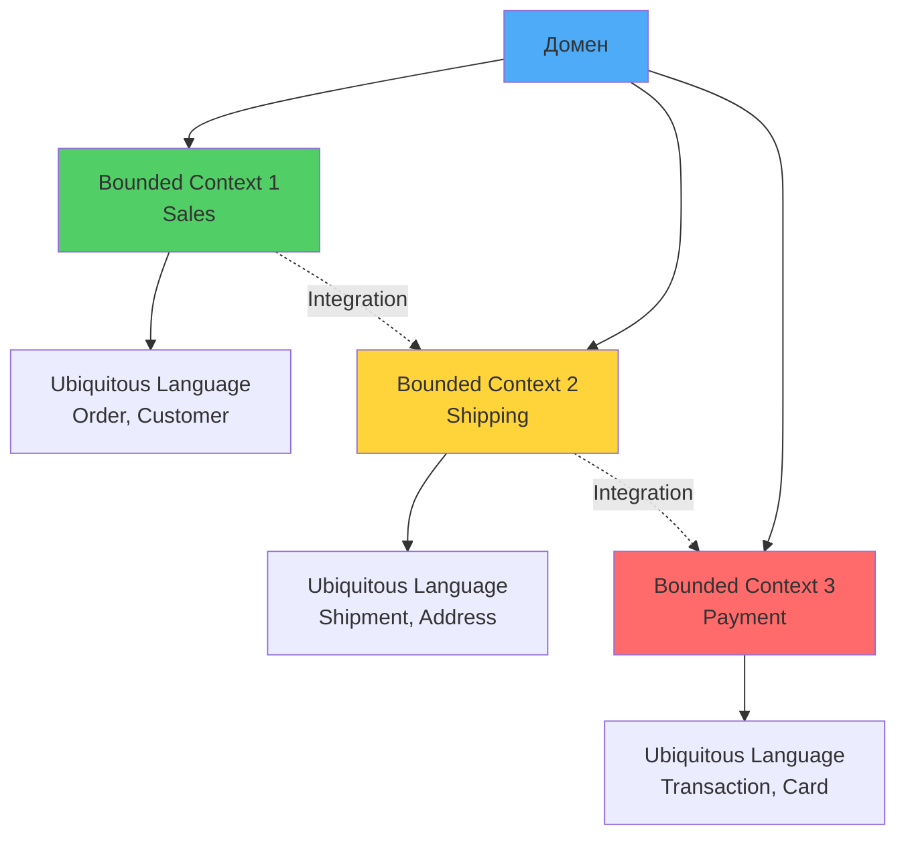

# 🎯 Урок 2: Стратегическое проектирование (Strategic Design)

## 🎯 Цели урока

После изучения этого урока вы сможете:
- ✅ Определять границы bounded contexts
- ✅ Создавать карты взаимодействия между контекстами
- ✅ Применять паттерны интеграции

## 📖 Основные концепции

### 💡 Простыми словами

**Аналогия**: Разные языки в разных странах
- В России "стол" = мебель для еды
- В Англии "table" = то же самое, но другое слово
- Bounded Context = "страна", где действует свой "язык" (модель)
- Граница контекста = "граница страны"

**В программировании:**
- Каждый контекст имеет свою модель домена
- Один термин может означать разное в разных контекстах
- Границы определяют, где заканчивается одна модель

### 📊 Визуализация Strategic Design



### Bounded Context

Bounded Context - граница, в рамках которой модель домена имеет смысл.

```python
from typing import List

class BoundedContext:
    def __init__(self, name: str, domain: str):
        self.name = name
        self.domain = domain
        self.ubiquitous_language = set()
        self.business_rules = []

    def define_ubiquitous_language(self, terms: List[str]):
        self.ubiquitous_language.update(terms)
```

### Context Mapping

Типы отношений между bounded contexts:

1. **Partnership** - общая цель
2. **Customer-Supplier** - зависимость
3. **Shared Kernel** - общий код
4. **Anti-Corruption Layer** - защита от внешних систем

## 🎮 Практическое задание

{{ create_exercise_form(
    "strategic_design_exercise",
    "Определение bounded contexts для интернет-магазина",
    "Определить 3-5 bounded contexts с их ubiquitous language и создать context map.",
    """# Задание: Стратегический анализ интернет-магазина

## Задачи:

1. **Определить bounded contexts** для интернет-магазина
2. **Создать ubiquitous language** для каждого context
3. **Определить отношения** между contexts
4. **Создать context map**

## Ожидаемый результат:

- Список bounded contexts с их ответственностью
- Ubiquitous language для каждого context
- Карта взаимодействий между contexts
- Обоснование выбранных границ""",
    [
        "Определить bounded contexts",
        "Создать ubiquitous language",
        "Определить отношения между contexts",
        "Создать context map"
    ]
) }}

## 🚀 Следующие шаги

!!! success "Что вы узнали"
    - ✅ Что такое Bounded Context и зачем он нужен
    - ✅ Как создавать Ubiquitous Language для каждого контекста
    - ✅ Типы отношений между контекстами (Partnership, Customer-Supplier, Shared Kernel)
    - ✅ Как определять границы контекстов

!!! tip "Практика"
    Попробуйте определить Bounded Contexts для вашего проекта. Разделите систему на контексты по бизнес-областям.

Теперь вы готовы изучить **[Тактическое проектирование](03-tactical-design.md)** - паттерны реализации доменной модели в коде!

---

## 🧪 Квиз

<div class="quiz-container" id="strategic-design-quiz">
<script type="application/json">
  {
  "title": "Strategic Design",
  "description": "Проверьте понимание стратегических паттернов DDD",
  "questions": [
    {
      "question": "Что такое Bounded Context?",
      "type": "single",
      "points": 1,
      "options": [
        {"text": "Граница применения модели домена", "correct": true},
        {"text": "База данных приложения", "correct": false},
        {"text": "Команда разработчиков", "correct": false},
        {"text": "Микросервис в системе", "correct": false}
      ],
      "explanation": "Bounded Context - граница, в рамках которой модель домена имеет смысл"
    },
    {
      "question": "Что такое Ubiquitous Language?",
      "type": "single",
      "points": 1,
      "options": [
        {"text": "Общий язык команды и домена", "correct": true},
        {"text": "Язык программирования", "correct": false},
        {"text": "Английский язык", "correct": false},
        {"text": "Техническая документация", "correct": false}
      ],
      "explanation": "Ubiquitous Language - единый язык, понятный всем участникам проекта"
    },
    {
      "question": "Какие элементы включает Strategic Design?",
      "type": "multiple",
      "points": 2,
      "options": [
        {"text": "Bounded Context", "correct": true},
        {"text": "Context Mapping", "correct": true},
        {"text": "Ubiquitous Language", "correct": true},
        {"text": "Entity и Value Object", "correct": false},
        {"text": "Repository Pattern", "correct": false}
      ],
      "explanation": "Strategic Design фокусируется на высокоуровневом моделировании домена"
    },
    {
      "question": "Что означает Domain Vision Statement?",
      "type": "single",
      "points": 1,
      "options": [
        {"text": "Краткое описание основной ценности домена", "correct": true},
        {"text": "Техническая архитектура системы", "correct": false},
        {"text": "План разработки проекта", "correct": false},
        {"text": "Список требований заказчика", "correct": false}
      ],
      "explanation": "Domain Vision Statement определяет ключевую ценность и направление домена"
    },
    {
      "question": "Что такое Core Domain?",
      "type": "single",
      "points": 1,
      "options": [
        {"text": "Основная часть домена, дающая конкурентное преимущество", "correct": true},
        {"text": "Центральная база данных", "correct": false},
        {"text": "Главный микросервис", "correct": false},
        {"text": "Основной класс в коде", "correct": false}
      ],
      "explanation": "Core Domain - это та часть домена, которая критична для бизнеса"
    },
    {
      "question": "В чем отличие Supporting Subdomain от Generic Subdomain?",
      "type": "single",
      "points": 2,
      "options": [
        {"text": "Supporting поддерживает Core Domain, Generic - общеизвестные решения", "correct": true},
        {"text": "Supporting сложнее в реализации", "correct": false},
        {"text": "Generic требует больше ресурсов", "correct": false},
        {"text": "Никакой разницы нет", "correct": false}
      ],
      "explanation": "Supporting Subdomain специфичен для бизнеса, Generic Subdomain - типовые решения"
    },
    {
      "question": "Когда следует создавать отдельный Bounded Context?",
      "type": "multiple",
      "points": 2,
      "options": [
        {"text": "Разные команды работают над областями", "correct": true},
        {"text": "Различная терминология в областях", "correct": true},
        {"text": "Разные циклы релизов", "correct": true},
        {"text": "Разные технологии", "correct": false},
        {"text": "Разные базы данных", "correct": false}
      ],
      "explanation": "Bounded Context определяется прежде всего бизнес-границами, а не техническими"
    },
    {
      "question": "Что такое Knowledge Crunching?",
      "type": "single",
      "points": 1,
      "options": [
        {"text": "Процесс извлечения знаний о домене", "correct": true},
        {"text": "Анализ производительности системы", "correct": false},
        {"text": "Оптимизация алгоритмов", "correct": false},
        {"text": "Процесс тестирования", "correct": false}
      ],
      "explanation": "Knowledge Crunching - совместная работа экспертов домена и разработчиков"
    }
  ]
  }
</script>
</div>


