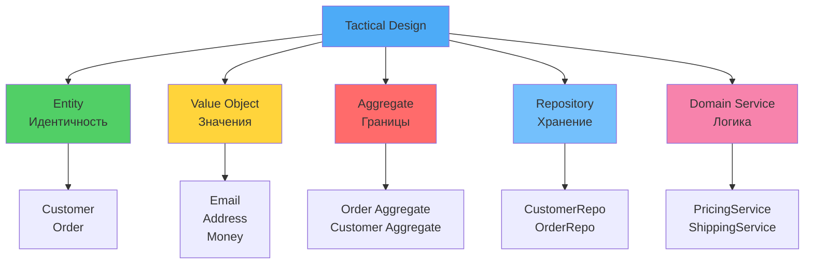
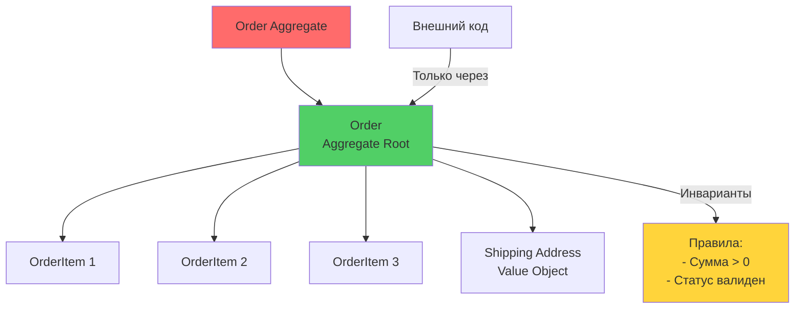

# 🔧 Урок 3: Тактическое проектирование (Tactical Design)

## 🎯 Цели урока

После изучения этого урока вы сможете:
- ✅ Создавать Entities с правильным поведением
- ✅ Проектировать Value Objects для неизменяемых данных
- ✅ Определять границы Aggregates
- ✅ Реализовывать Domain Services для комплексной логики
- ✅ Применять Repository паттерн для доступа к данным

## 📖 Тактические паттерны DDD

!!! quote "Tactical Design отвечает на вопрос КАК реализовать модель домена"
    **Tactical Design** - это конкретные паттерны и принципы реализации доменной модели в коде.

### 💡 Простыми словами

**Аналогия**: Строительные блоки дома
- **Entity** = человек (имеет паспорт/ID, может меняться)
- **Value Object** = адрес (определяется значениями, не меняется)
- **Aggregate** = семья (группа связанных людей с правилами)
- **Repository** = адресная книга (хранение и поиск)
- **Domain Service** = нотариус (сложные операции, не принадлежат одному объекту)

**В программировании:**
- Tactical Design = как организовать код домена
- Паттерны помогают выразить бизнес-логику в коде
- Каждый паттерн решает свою задачу

### 📊 Визуализация Tactical Patterns



### Основные паттерны:

```
🔧 Tactical Design Patterns
├── 📍 Entities              # Сущности с идентичностью
├── 💎 Value Objects         # Неизменяемые значения
├── 🎯 Aggregates            # Границы консистентности
├── ⚙️  Domain Services       # Комплексная бизнес-логика
├── 📚 Repositories          # Доступ к данным
└── 📢 Domain Events         # События домена
```

## 📍 Entities (Сущности)

### 💡 Простыми словами

**Аналогия**: Человек с паспортом
- У человека есть паспорт (ID) - он остается тем же человеком
- Человек может измениться (имя, адрес, возраст), но ID тот же
- Два человека с одинаковым именем - разные люди (разные ID)

**В программировании:**
- Entity = объект с уникальным ID
- Может изменяться, но остается тем же объектом
- Сравнивается по ID, а не по значениям

### Что такое Entity?

Entity - объект с идентичностью, который может изменяться со временем.

```python
from abc import ABC
from typing import Any
from dataclasses import dataclass

class Entity(ABC):
    """Базовый класс для всех сущностей"""

    def __init__(self, id: Any):
        self._id = id

    @property
    def id(self) -> Any:
        return self._id

    def __eq__(self, other: object) -> bool:
        if not isinstance(other, Entity):
            return False
        return self._id == other._id

    def __hash__(self) -> int:
        return hash(self._id)
```

### Пример: Customer Entity

```python
from typing import Optional
from datetime import datetime

class Customer(Entity):
    """Сущность клиента интернет-магазина"""

    def __init__(
        self,
        id: str,
        email: str,
        name: str,
        loyalty_points: int = 0,
        created_at: Optional[datetime] = None
    ):
        super().__init__(id)
        self._email = email
        self._name = name
        self._loyalty_points = loyalty_points
        self._created_at = created_at or datetime.utcnow()

    @property
    def email(self) -> str:
        return self._email

    @property
    def name(self) -> str:
        return self._name

    @property
    def loyalty_points(self) -> int:
        return self._loyalty_points

    @property
    def created_at(self) -> datetime:
        return self._created_at

    def change_email(self, new_email: str) -> None:
        """Изменить email клиента"""
        if not new_email or '@' not in new_email:
            raise ValueError("Invalid email format")

        if self._email == new_email:
            raise ValueError("New email is the same as current")

        self._email = new_email

    def add_loyalty_points(self, points: int) -> None:
        """Добавить баллы лояльности"""
        if points < 0:
            raise ValueError("Cannot add negative points")

        self._loyalty_points += points

    def use_loyalty_points(self, points: int) -> None:
        """Использовать баллы лояльности"""
        if points > self._loyalty_points:
            raise ValueError("Insufficient loyalty points")

        self._loyalty_points -= points

# Использование
customer = Customer(
    id="cust-123",
    email="john@example.com",
    name="John Doe"
)

customer.add_loyalty_points(100)
customer.change_email("john.doe@example.com")
```

## 💎 Value Objects (Объекты значений)

### 💡 Простыми словами

**Аналогия**: Адрес на конверте
- Адрес определяется значениями (улица, город, индекс)
- Два одинаковых адреса = один и тот же адрес (нет ID)
- Адрес не меняется - если меняется, это новый адрес
- Адрес можно скопировать - это будет тот же адрес

**В программировании:**
- Value Object = объект без ID, определяется значениями
- Неизменяемый (immutable) - создается новый вместо изменения
- Сравнивается по значениям, а не по ссылке

### Что такое Value Object?

Value Object - неизменяемый объект, определяемый своими значениями, без идентичности.

```python
from typing import List
from dataclasses import dataclass, field

@dataclass(frozen=True)
class ValueObject:
    """Базовый класс для всех value objects"""
    pass
```

### Примеры Value Objects

```python
@dataclass(frozen=True)
class Money(ValueObject):
    """Деньги как value object"""
    amount: float
    currency: str = "RUB"

    def __post_init__(self):
        if self.amount < 0:
            raise ValueError("Amount cannot be negative")

    def add(self, other: 'Money') -> 'Money':
        if self.currency != other.currency:
            raise ValueError("Cannot add different currencies")
        return Money(self.amount + other.amount, self.currency)

    def multiply(self, factor: float) -> 'Money':
        if factor < 0:
            raise ValueError("Factor cannot be negative")
        return Money(self.amount * factor, self.currency)

    def subtract(self, other: 'Money') -> 'Money':
        if self.currency != other.currency:
            raise ValueError("Cannot subtract different currencies")
        return Money(self.amount - other.amount, self.currency)

@dataclass(frozen=True)
class Address(ValueObject):
    """Адрес как value object"""
    street: str
    city: str
    postal_code: str
    country: str

    def __post_init__(self):
        if not self.street or not self.city:
            raise ValueError("Street and city are required")

    def full_address(self) -> str:
        return f"{self.street}, {self.city}, {self.postal_code}, {self.country}"

@dataclass(frozen=True)
class ProductId(ValueObject):
    """ID продукта как value object"""
    value: str

    def __post_init__(self):
        if not self.value:
            raise ValueError("Product ID cannot be empty")

    def __str__(self) -> str:
        return self.value

# Использование
price = Money(1000.0, "RUB")
discounted_price = price.multiply(0.9)  # 900.0 RUB

address = Address(
    street="ул. Ленина, 1",
    city="Москва",
    postal_code="101000",
    country="Россия"
)

product_id = ProductId("prod-123")
```

## 🎯 Aggregates (Агрегаты)

### 💡 Простыми словами

**Аналогия**: Семья с правилами
- Семья (Aggregate) = группа связанных людей (объектов)
- Глава семьи (Aggregate Root) = единственная точка входа
- Правила семьи (инварианты) = бизнес-правила, которые всегда должны выполняться
- Внешние не могут напрямую общаться с членами семьи - только через главу

**В программировании:**
- Aggregate = группа связанных Entity и Value Objects
- Aggregate Root = единственная Entity, через которую происходит доступ
- Инварианты = бизнес-правила, которые всегда выполняются
- Границы = что внутри агрегата, что снаружи

### 📊 Визуализация Aggregate



### Что такое Aggregate?

Aggregate - кластер связанных объектов, который рассматривается как единое целое для изменений данных.

```python
from abc import ABC, abstractmethod
from typing import List, Any

class AggregateRoot(Entity):
    """Базовый класс для корней агрегатов"""

    def __init__(self, id: Any):
        super().__init__(id)
        self._domain_events: List['DomainEvent'] = []

    def add_domain_event(self, event: 'DomainEvent') -> None:
        self._domain_events.append(event)

    def clear_domain_events(self) -> List['DomainEvent']:
        events = self._domain_events[:]
        self._domain_events.clear()
        return events

    @property
    def domain_events(self) -> List['DomainEvent']:
        return self._domain_events[:]
```

### Пример: Order Aggregate

```python
from typing import List, Optional
from datetime import datetime
from domain_events import OrderCreated, OrderConfirmed, OrderCancelled

@dataclass
class OrderItem:
    """Элемент заказа (не entity, а часть агрегата)"""
    product_id: ProductId
    product_name: str
    quantity: int
    unit_price: Money
    total_price: Optional[Money] = None

    def __post_init__(self):
        if self.quantity <= 0:
            raise ValueError("Quantity must be positive")
        if self.total_price is None:
            self.total_price = self.unit_price.multiply(self.quantity)

@dataclass
class Order(AggregateRoot):
    """Заказ как агрегат"""

    def __init__(
        self,
        id: str,
        customer_id: str,
        items: List[OrderItem],
        shipping_address: Optional[Address] = None
    ):
        super().__init__(id)

        self._customer_id = customer_id
        self._items = items[:]
        self._status = "pending"
        self._shipping_address = shipping_address
        self._total_amount = self._calculate_total()
        self._created_at = datetime.utcnow()

        # Бизнес-правило: заказ не может быть пустым
        if not self._items:
            raise ValueError("Order cannot be empty")

        # Domain Event
        self.add_domain_event(OrderCreated(
            order_id=id,
            customer_id=customer_id,
            total_amount=self._total_amount,
            created_at=self._created_at
        ))

    @property
    def customer_id(self) -> str:
        return self._customer_id

    @property
    def items(self) -> List[OrderItem]:
        return self._items[:]

    @property
    def status(self) -> str:
        return self._status

    @property
    def total_amount(self) -> Money:
        return self._total_amount

    @property
    def shipping_address(self) -> Optional[Address]:
        return self._shipping_address

    def _calculate_total(self) -> Money:
        if not self._items:
            return Money(0.0, "RUB")

        total = sum(item.total_price.amount for item in self._items)
        currency = self._items[0].unit_price.currency
        return Money(total, currency)

    def add_item(self, item: OrderItem) -> None:
        """Добавить товар к заказу"""
        if self._status != "pending":
            raise ValueError("Cannot modify order that is not pending")

        # Проверить, не добавляем ли уже существующий товар
        existing_item = next(
            (i for i in self._items if i.product_id == item.product_id),
            None
        )

        if existing_item:
            # Обновить количество
            existing_item.quantity += item.quantity
            existing_item.total_price = existing_item.unit_price.multiply(existing_item.quantity)
        else:
            self._items.append(item)

        self._total_amount = self._calculate_total()

    def remove_item(self, product_id: ProductId) -> None:
        """Удалить товар из заказа"""
        if self._status != "pending":
            raise ValueError("Cannot modify order that is not pending")

        self._items = [item for item in self._items if item.product_id != product_id]

        if not self._items:
            raise ValueError("Order cannot be empty after removing item")

        self._total_amount = self._calculate_total()

    def confirm(self) -> None:
        """Подтвердить заказ"""
        if self._status != "pending":
            raise ValueError("Only pending orders can be confirmed")
        if not self._shipping_address:
            raise ValueError("Shipping address is required")

        self._status = "confirmed"

        # Domain Event
        self.add_domain_event(OrderConfirmed(
            order_id=self.id,
            confirmed_at=datetime.utcnow()
        ))

    def cancel(self) -> None:
        """Отменить заказ"""
        if self._status in ["shipped", "delivered"]:
            raise ValueError("Cannot cancel shipped or delivered order")

        self._status = "cancelled"

        # Domain Event
        self.add_domain_event(OrderCancelled(
            order_id=self.id,
            cancelled_at=datetime.utcnow()
        ))

# Использование
order = Order(
    id="order-123",
    customer_id="cust-456",
    items=[
        OrderItem(
            product_id=ProductId("prod-1"),
            product_name="Laptop",
            quantity=1,
            unit_price=Money(50000.0, "RUB")
        )
    ],
    shipping_address=Address(
        street="ул. Ленина, 1",
        city="Москва",
        postal_code="101000",
        country="Россия"
    )
)

# Добавление товара
new_item = OrderItem(
    product_id=ProductId("prod-2"),
    product_name="Mouse",
    quantity=1,
    unit_price=Money(1000.0, "RUB")
)
order.add_item(new_item)

# Подтверждение заказа
order.confirm()

# Получение domain events
events = order.clear_domain_events()
for event in events:
    print(f"Event: {type(event).__name__}")
```

## ⚙️ Domain Services (Сервисы домена)

### Когда использовать Domain Service?

Domain Service используется для:
- Логики, которая не принадлежит конкретной Entity
- Операций, затрагивающих несколько Entities
- Комплексных вычислений
- Взаимодействия с внешними системами

```python
from abc import ABC, abstractmethod

class DomainService(ABC):
    """Базовый класс для domain services"""
    pass

class PricingService(DomainService):
    """Сервис расчета цен и скидок"""

    def calculate_discount(self, order: Order, customer: Customer) -> Money:
        """Расчет скидки для заказа"""
        discount = Money(0.0, order.total_amount.currency)

        # Скидка за лояльность
        if customer.loyalty_points > 100:
            loyalty_discount = order.total_amount.amount * 0.05  # 5%
            discount = Money(discount.amount + loyalty_discount, discount.currency)

        # Скидка за объем
        if order.total_amount.amount > 10000:
            volume_discount = order.total_amount.amount * 0.03  # 3%
            discount = Money(discount.amount + volume_discount, discount.currency)

        return discount

    def apply_promo_code(self, order: Order, promo_code: str) -> Money:
        """Применение промо-кода"""
        # Логика проверки промо-кода
        if promo_code == "WELCOME10":
            discount = order.total_amount.amount * 0.10  # 10%
            return Money(discount, order.total_amount.currency)

        return Money(0.0, order.total_amount.currency)

class InventoryService(DomainService):
    """Сервис управления запасами"""

    def __init__(self, inventory_repository):
        self.inventory_repository = inventory_repository

    async def reserve_items(self, items: List[OrderItem]) -> bool:
        """Резервирование товаров"""
        for item in items:
            available = await self.inventory_repository.get_available_quantity(item.product_id)

            if available < item.quantity:
                return False

            # Резервирование
            await self.inventory_repository.reserve_item(item.product_id, item.quantity)

        return True

    async def release_reservation(self, items: List[OrderItem]) -> None:
        """Освобождение резерва"""
        for item in items:
            await self.inventory_repository.release_reservation(item.product_id, item.quantity)
```

## 📚 Repositories (Репозитории)

### Что такое Repository?

Repository - абстракция для доступа к данным, которая скрывает детали хранения.

```python
from abc import ABC, abstractmethod
from typing import List, Optional

class Repository(ABC):
    """Базовый класс репозитория"""

    @abstractmethod
    async def save(self, entity) -> None:
        raise NotImplementedError

    @abstractmethod
    async def find_by_id(self, id) -> Optional[Any]:
        raise NotImplementedError

    @abstractmethod
    async def find_all(self) -> List[Any]:
        raise NotImplementedError

class CustomerRepository(Repository):
    """Репозиторий клиентов"""

    async def save(self, customer: Customer) -> None:
        # Сохранение в базу данных
        pass

    async def find_by_id(self, id: str) -> Optional[Customer]:
        # Поиск по ID
        pass

    async def find_by_email(self, email: str) -> Optional[Customer]:
        # Поиск по email
        pass

    async def find_all(self) -> List[Customer]:
        # Получение всех клиентов
        pass

class OrderRepository(Repository):
    """Репозиторий заказов"""

    async def save(self, order: Order) -> None:
        # Сохранение заказа и всех domain events
        pass

    async def find_by_id(self, id: str) -> Optional[Order]:
        # Поиск заказа с загрузкой всех элементов
        pass

    async def find_by_customer(self, customer_id: str) -> List[Order]:
        # Поиск заказов клиента
        pass

    async def find_pending_orders(self) -> List[Order]:
        # Поиск неподтвержденных заказов
        pass
```

## 🎮 Практическое задание

{{ create_exercise_form(
    "tactical_design_exercise",
    "Проектирование доменной модели для интернет-магазина",
    "Создать доменную модель с Entities, Value Objects, Aggregates, Domain Services и Repositories.",
    """# Задание: Тактическое проектирование домена

## Контекст

Создайте доменную модель для системы управления заказами интернет-магазина.

## Требования:

1. **Customer Entity** - сущность клиента
2. **Money Value Object** - деньги как неизменяемое значение
3. **Address Value Object** - адрес доставки
4. **Order Aggregate** - агрегат заказа
5. **PricingService** - сервис расчета цен
6. **Repositories** - абстракции для доступа к данным

## Ожидаемый результат:

- Полная доменная модель на Python
- Entities с бизнес-логикой
- Value Objects для неизменяемых данных
- Aggregate с правильными границами
- Domain Services для комплексной логики
- Repository интерфейсы""",
    [
        "Создать Customer Entity с бизнес-логикой",
        "Реализовать Money и Address Value Objects",
        "Спроектировать Order Aggregate",
        "Создать PricingService для расчетов",
        "Определить Repository интерфейсы"
    ]
) }}

## 🧪 Квиз

<div class="quiz-container" id="tactical-design-quiz">
<script type="application/json">
  "title": "Tactical Design",
  "description": "Проверьте понимание тактических паттернов DDD",
  "questions": [
    {
      "question": "Что такое Entity?",
      "type": "single",
      "points": 1,
      "options": [
        {"text": "Неизменяемый объект", "correct": false},
        {"text": "Объект с идентичностью", "correct": true},
        {"text": "Граница консистентности", "correct": false}
      ],
      "explanation": "Entity - объект с идентичностью, который изменяется со временем"
    },
    {
      "question": "Что такое Value Object?",
      "type": "single",
      "points": 1,
      "options": [
        {"text": "Неизменяемый объект без идентичности", "correct": true},
        {"text": "Сущность с уникальным ID", "correct": false},
        {"text": "Сервис бизнес-логики", "correct": false}
      ],
      "explanation": "Value Object определяется своими значениями, не имеет идентичности"
    },
    {
      "question": "Что такое Aggregate?",
      "type": "single",
      "points": 1,
      "options": [
        {"text": "Кластер связанных объектов", "correct": true},
        {"text": "Отдельная сущность", "correct": false},
        {"text": "Сервис домена", "correct": false}
      ],
      "explanation": "Aggregate - кластер объектов, рассматриваемый как единое целое"
    },
    {
      "question": "Когда использовать Domain Service?",
      "type": "multiple",
      "points": 2,
      "options": [
        {"text": "Логика не принадлежащая конкретной Entity", "correct": true},
        {"text": "Операции затрагивающие несколько Entities", "correct": true},
        {"text": "Простые CRUD операции", "correct": false},
        {"text": "Хранение данных", "correct": false}
      ],
      "explanation": "Domain Service используется для комплексной логики между несколькими объектами"
    },
    {
      "question": "Что такое Repository в DDD?",
      "type": "single",
      "points": 1,
      "options": [
        {"text": "Инкапсулирует логику доступа к данным", "correct": true},
        {"text": "Содержит бизнес-логику домена", "correct": false},
        {"text": "Управляет жизненным циклом Entity", "correct": false},
        {"text": "Определяет границы контекста", "correct": false}
      ],
      "explanation": "Repository предоставляет интерфейс для работы с коллекцией объектов домена"
    },
    {
      "question": "Какие принципы должен соблюдать Aggregate?",
      "type": "multiple",
      "points": 2,
      "options": [
        {"text": "Иметь единую точку входа (Aggregate Root)", "correct": true},
        {"text": "Обеспечивать консистентность данных", "correct": true},
        {"text": "Быть независимым от других Aggregates", "correct": true},
        {"text": "Содержать все Entity системы", "correct": false},
        {"text": "Быть максимально большим", "correct": false}
      ],
      "explanation": "Aggregate обеспечивает границы консистентности и инвариантов"
    },
    {
      "question": "Что такое Aggregate Root?",
      "type": "single",
      "points": 1,
      "options": [
        {"text": "Entity, через которую происходит доступ к Aggregate", "correct": true},
        {"text": "Базовый класс для всех Entity", "correct": false},
        {"text": "Главная база данных", "correct": false},
        {"text": "Корневой элемент архитектуры", "correct": false}
      ],
      "explanation": "Aggregate Root - единственная точка входа для внешнего доступа к Aggregate"
    },
    {
      "question": "В чем разница между Entity и Value Object?",
      "type": "single",
      "points": 2,
      "options": [
        {"text": "Entity имеет идентичность, Value Object определяется значениями", "correct": true},
        {"text": "Entity изменяемый, Value Object неизменяемый", "correct": false},
        {"text": "Entity содержит поведение, Value Object только данные", "correct": false},
        {"text": "Entity сохраняется в БД, Value Object нет", "correct": false}
      ],
      "explanation": "Ключевое отличие - наличие или отсутствие идентичности"
    },
    {
      "question": "Какие характеристики имеет Value Object?",
      "type": "multiple",
      "points": 2,
      "options": [
        {"text": "Immutable (неизменяемый)", "correct": true},
        {"text": "Определяется своими значениями", "correct": true},
        {"text": "Может содержать бизнес-логику", "correct": true},
        {"text": "Имеет уникальный идентификатор", "correct": false},
        {"text": "Всегда простые типы данных", "correct": false}
      ],
      "explanation": "Value Object определяется значениями и должен быть неизменяемым"
    },
    {
      "question": "Что такое Factory в DDD?",
      "type": "single",
      "points": 1,
      "options": [
        {"text": "Инкапсулирует сложную логику создания объектов", "correct": true},
        {"text": "Управляет жизненным циклом объектов", "correct": false},
        {"text": "Предоставляет доступ к данным", "correct": false},
        {"text": "Обрабатывает доменные события", "correct": false}
      ],
      "explanation": "Factory скрывает сложность создания доменных объектов"
    }
  ]
</script>
</div>

## 🚀 Следующие шаги

!!! success "Что вы узнали"
    - ✅ Entities - сущности с идентичностью (как человек с паспортом)
    - ✅ Value Objects - неизменяемые значения (как адрес)
    - ✅ Aggregates - границы консистентности (как семья)
    - ✅ Domain Services - комплексная бизнес-логика
    - ✅ Repositories - доступ к данным

!!! tip "Практика"
    Создайте простую доменную модель (например, для библиотеки) используя все тактические паттерны. Это поможет закрепить знания.

Теперь вы готовы изучить **[Domain Events](04-domain-events.md)** - события предметной области для асинхронной коммуникации!

---

