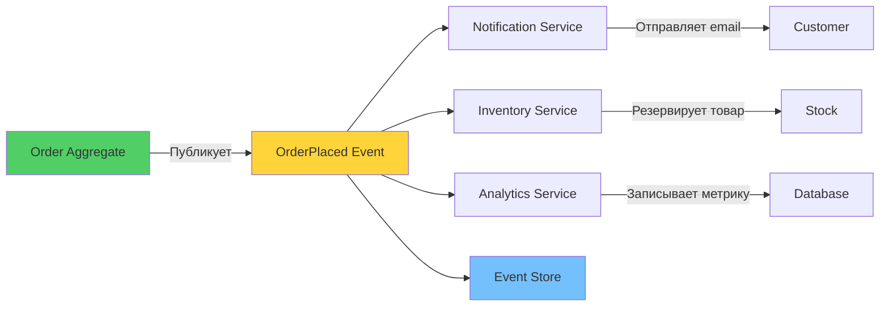

# 📢 Урок 4: Domain Events (События домена)

## 🎯 Цели урока

После изучения этого урока вы сможете:
- ✅ Создавать и использовать Domain Events
- ✅ Реализовывать Event-driven архитектуру
- ✅ Применять паттерн Event Sourcing
- ✅ Организовывать асинхронную коммуникацию между bounded contexts

## 📖 Что такое Domain Events?

!!! quote "Domain Event - это факт, произошедший в домене"
    **Domain Event** - неизменяемый объект, представляющий значимое событие в предметной области.

### 💡 Простыми словами

**Аналогия**: Новости в газете
- Событие = факт, который уже произошел (OrderPlaced = заказ размещен)
- Новость (Event) нельзя изменить - она уже произошла
- Новость содержит всю информацию для понимания
- Разные люди читают новость и реагируют по-разному

**В программировании:**
- Domain Event = факт из бизнес-домена
- События публикуются агрегатами при изменении состояния
- Другие части системы подписываются на события и реагируют

### 📊 Визуализация Domain Events



### Характеристики Domain Events:

1. **Неизменяемость** - события нельзя изменить после создания
2. **Именование в прошедшем времени** - `OrderPlaced`, `PaymentProcessed`
3. **Содержат все необходимые данные** - для обработки без дополнительных запросов
4. **Публикуются агрегатами** - при изменении состояния

## 📢 Создание Domain Events

### Базовая структура

```python
from abc import ABC
from dataclasses import dataclass
from datetime import datetime
from typing import Any

@dataclass(frozen=True)
class DomainEvent(ABC):
    """Базовый класс для всех domain events"""
    aggregate_id: str
    event_id: str
    occurred_at: datetime
    event_version: int = 1

    def __post_init__(self):
        # Валидация
        if not self.aggregate_id:
            raise ValueError("Aggregate ID is required")
        if not self.event_id:
            raise ValueError("Event ID is required")

class OrderEvent(DomainEvent):
    """Базовый класс для событий заказа"""
    pass

class CustomerEvent(DomainEvent):
    """Базовый класс для событий клиента"""
    pass
```

### Конкретные Domain Events

```python
@dataclass(frozen=True)
class OrderCreated(OrderEvent):
    """Заказ создан"""
    customer_id: str
    items: List[dict]  # Детали товаров
    total_amount: float
    currency: str

@dataclass(frozen=True)
class OrderItemAdded(OrderEvent):
    """Товар добавлен к заказу"""
    product_id: str
    product_name: str
    quantity: int
    unit_price: float

@dataclass(frozen=True)
class OrderConfirmed(OrderEvent):
    """Заказ подтвержден"""
    confirmed_at: datetime

@dataclass(frozen=True)
class OrderPaid(OrderEvent):
    """Заказ оплачен"""
    payment_id: str
    payment_method: str
    paid_amount: float

@dataclass(frozen=True)
class OrderShipped(OrderEvent):
    """Заказ отправлен"""
    tracking_number: str
    carrier: str
    shipped_at: datetime

@dataclass(frozen=True)
class OrderDelivered(OrderEvent):
    """Заказ доставлен"""
    delivered_at: datetime

@dataclass(frozen=True)
class OrderCancelled(OrderEvent):
    """Заказ отменен"""
    reason: str
    cancelled_at: datetime

# Customer Events
@dataclass(frozen=True)
class CustomerRegistered(CustomerEvent):
    """Клиент зарегистрирован"""
    email: str
    name: str
    registration_method: str

@dataclass(frozen=True)
class CustomerEmailChanged(CustomerEvent):
    """Email клиента изменен"""
    old_email: str
    new_email: str

@dataclass(frozen=True)
class CustomerDeactivated(CustomerEvent):
    """Клиент деактивирован"""
    reason: str
```

## 🎯 Публикация Domain Events

### От агрегатов

```python
from typing import List

class AggregateRoot:
    """Базовый класс для корней агрегатов"""

    def __init__(self):
        self._domain_events: List[DomainEvent] = []

    def add_domain_event(self, event: DomainEvent) -> None:
        """Добавить событие для публикации"""
        self._domain_events.append(event)

    def clear_domain_events(self) -> List[DomainEvent]:
        """Получить и очистить очередь событий"""
        events = self._domain_events[:]
        self._domain_events.clear()
        return events

    @property
    def domain_events(self) -> List[DomainEvent]:
        """Получить события без очистки"""
        return self._domain_events[:]
```

### Пример: Order с Domain Events

```python
import uuid
from datetime import datetime

class Order(AggregateRoot):
    """Заказ с domain events"""

    def __init__(self, order_id: str, customer_id: str, items: List[dict]):
        super().__init__()
        self.id = order_id
        self.customer_id = customer_id
        self.items = items
        self.status = "pending"
        self.total_amount = sum(item['price'] * item['quantity'] for item in items)

        # Публикация события создания
        self.add_domain_event(OrderCreated(
            aggregate_id=order_id,
            event_id=str(uuid.uuid4()),
            occurred_at=datetime.utcnow(),
            customer_id=customer_id,
            items=items,
            total_amount=self.total_amount,
            currency="RUB"
        ))

    def confirm(self) -> None:
        """Подтвердить заказ"""
        if self.status != "pending":
            raise ValueError("Only pending orders can be confirmed")

        self.status = "confirmed"

        # Публикация события подтверждения
        self.add_domain_event(OrderConfirmed(
            aggregate_id=self.id,
            event_id=str(uuid.uuid4()),
            occurred_at=datetime.utcnow(),
            confirmed_at=datetime.utcnow()
        ))

    def pay(self, payment_id: str, payment_method: str) -> None:
        """Оплатить заказ"""
        if self.status != "confirmed":
            raise ValueError("Only confirmed orders can be paid")

        self.status = "paid"

        # Публикация события оплаты
        self.add_domain_event(OrderPaid(
            aggregate_id=self.id,
            event_id=str(uuid.uuid4()),
            occurred_at=datetime.utcnow(),
            payment_id=payment_id,
            payment_method=payment_method,
            paid_amount=self.total_amount
        ))

    def ship(self, tracking_number: str, carrier: str) -> None:
        """Отправить заказ"""
        if self.status != "paid":
            raise ValueError("Only paid orders can be shipped")

        self.status = "shipped"
        self.tracking_number = tracking_number
        self.carrier = carrier

        # Публикация события отправки
        self.add_domain_event(OrderShipped(
            aggregate_id=self.id,
            event_id=str(uuid.uuid4()),
            occurred_at=datetime.utcnow(),
            tracking_number=tracking_number,
            carrier=carrier,
            shipped_at=datetime.utcnow()
        ))

# Использование
order = Order("order-123", "customer-456", [
    {"product_id": "prod-1", "price": 1000, "quantity": 2}
])

# Выполнение операций
order.confirm()
order.pay("payment-789", "credit_card")
order.ship("TN123456", "DHL")

# Получение событий для обработки
events = order.clear_domain_events()
for event in events:
    print(f"Event: {type(event).__name__} for order {event.aggregate_id}")
```

## 📡 Обработка Domain Events

### Синхронная обработка

```python
class DomainEventHandler:
    """Обработчик domain events"""

    def handle(self, event: DomainEvent) -> None:
        """Обработать событие"""
        method_name = f"handle_{event.__class__.__name__.lower()}"
        method = getattr(self, method_name, None)

        if method:
            method(event)
        else:
            print(f"No handler for {event.__class__.__name__}")

class OrderEventHandler(DomainEventHandler):
    """Обработчик событий заказа"""

    def __init__(self, inventory_service, notification_service):
        self.inventory_service = inventory_service
        self.notification_service = notification_service

    def handle_order_created(self, event: OrderCreated) -> None:
        """Обработка создания заказа"""
        print(f"Order {event.aggregate_id} created for customer {event.customer_id}")

        # Резервирование товаров
        for item in event.items:
            self.inventory_service.reserve_item(
                item['product_id'],
                item['quantity']
            )

    def handle_order_paid(self, event: OrderPaid) -> None:
        """Обработка оплаты заказа"""
        print(f"Order {event.aggregate_id} paid with {event.payment_method}")

        # Отправка уведомления
        self.notification_service.send_payment_confirmation(
            event.aggregate_id,
            event.paid_amount
        )

    def handle_order_shipped(self, event: OrderShipped) -> None:
        """Обработка отправки заказа"""
        print(f"Order {event.aggregate_id} shipped via {event.carrier}")

        # Отправка уведомления о доставке
        self.notification_service.send_shipping_notification(
            event.aggregate_id,
            event.tracking_number
        )
```

### Асинхронная обработка

```python
import asyncio
from typing import Callable, Dict
import json

class EventBus:
    """Шина событий для асинхронной обработки"""

    def __init__(self):
        self.handlers: Dict[str, List[Callable]] = {}

    def subscribe(self, event_type: str, handler: Callable) -> None:
        """Подписаться на событие"""
        if event_type not in self.handlers:
            self.handlers[event_type] = []
        self.handlers[event_type].append(handler)

    async def publish(self, event: DomainEvent) -> None:
        """Опубликовать событие"""
        event_type = event.__class__.__name__

        if event_type in self.handlers:
            tasks = []
            for handler in self.handlers[event_type]:
                task = asyncio.create_task(self._safe_handle(handler, event))
                tasks.append(task)

            # Ожидание завершения всех обработчиков
            await asyncio.gather(*tasks, return_exceptions=True)

    async def _safe_handle(self, handler: Callable, event: DomainEvent) -> None:
        """Безопасный вызов обработчика"""
        try:
            if asyncio.iscoroutinefunction(handler):
                await handler(event)
            else:
                await asyncio.get_event_loop().run_in_executor(None, handler, event)
        except Exception as e:
            print(f"Error handling event {event.__class__.__name__}: {e}")

# Настройка event bus
event_bus = EventBus()

# Регистрация обработчиков
order_handler = OrderEventHandler(inventory_svc, notification_svc)
event_bus.subscribe("OrderCreated", order_handler.handle_order_created)
event_bus.subscribe("OrderPaid", order_handler.handle_order_paid)
event_bus.subscribe("OrderShipped", order_handler.handle_order_shipped)

# Использование
async def process_order_events(order: Order) -> None:
    """Обработка событий заказа"""
    events = order.clear_domain_events()

    for event in events:
        await event_bus.publish(event)
```

## 💾 Event Store

### Хранение событий

```python
from abc import ABC, abstractmethod
import json
from datetime import datetime

class EventStore(ABC):
    """Хранилище событий"""

    @abstractmethod
    async def save_event(self, event: DomainEvent) -> None:
        """Сохранить событие"""
        pass

    @abstractmethod
    async def get_events_for_aggregate(self, aggregate_id: str) -> List[DomainEvent]:
        """Получить события для агрегата"""
        pass

    @abstractmethod
    async def get_all_events(self, from_timestamp: datetime = None) -> List[DomainEvent]:
        """Получить все события"""
        pass

class InMemoryEventStore(EventStore):
    """In-memory хранилище для тестирования"""

    def __init__(self):
        self.events: List[DomainEvent] = []

    async def save_event(self, event: DomainEvent) -> None:
        self.events.append(event)

    async def get_events_for_aggregate(self, aggregate_id: str) -> List[DomainEvent]:
        return [e for e in self.events if e.aggregate_id == aggregate_id]

    async def get_all_events(self, from_timestamp: datetime = None) -> List[DomainEvent]:
        if from_timestamp:
            return [e for e in self.events if e.occurred_at >= from_timestamp]
        return self.events[:]

class PostgreSQLEventStore(EventStore):
    """PostgreSQL хранилище событий"""

    def __init__(self, connection_string: str):
        self.connection_string = connection_string

    async def save_event(self, event: DomainEvent) -> None:
        # Сохранение в PostgreSQL
        event_data = {
            "event_id": event.event_id,
            "aggregate_id": event.aggregate_id,
            "event_type": event.__class__.__name__,
            "event_data": event.__dict__,
            "occurred_at": event.occurred_at.isoformat(),
            "event_version": event.event_version
        }

        # SQL insert
        pass

    async def get_events_for_aggregate(self, aggregate_id: str) -> List[DomainEvent]:
        # SQL select
        pass

    async def get_all_events(self, from_timestamp: datetime = None) -> List[DomainEvent]:
        # SQL select
        pass
```

## 🔄 Event Sourcing

### Что такое Event Sourcing?

Event Sourcing - паттерн хранения состояния как последовательности событий.

```python
class EventSourcedAggregate:
    """Агрегат с event sourcing"""

    def __init__(self, aggregate_id: str, event_store: EventStore):
        self.aggregate_id = aggregate_id
        self.event_store = event_store
        self.version = 0
        self.uncommitted_events: List[DomainEvent] = []

    @classmethod
    async def load_from_events(cls, aggregate_id: str, event_store: EventStore):
        """Загрузить агрегат из событий"""
        instance = cls(aggregate_id, event_store)
        events = await event_store.get_events_for_aggregate(aggregate_id)

        for event in events:
            instance.apply_event(event, is_new=False)

        return instance

    def apply_event(self, event: DomainEvent, is_new: bool = True) -> None:
        """Применить событие к состоянию"""
        # Логика применения события к состоянию агрегата
        pass

    async def save(self) -> None:
        """Сохранить новые события"""
        for event in self.uncommitted_events:
            await self.event_store.save_event(event)
        self.uncommitted_events.clear()

# Пример: Order с Event Sourcing
class EventSourcedOrder(EventSourcedAggregate):
    """Заказ с event sourcing"""

    def __init__(self, aggregate_id: str, event_store: EventStore):
        super().__init__(aggregate_id, event_store)
        self.customer_id = ""
        self.items = []
        self.status = "pending"
        self.total_amount = 0.0

    def apply_event(self, event: DomainEvent, is_new: bool = True) -> None:
        """Применить событие"""
        if isinstance(event, OrderCreated):
            self.customer_id = event.customer_id
            self.items = event.items
            self.total_amount = event.total_amount
        elif isinstance(event, OrderConfirmed):
            self.status = "confirmed"
        elif isinstance(event, OrderPaid):
            self.status = "paid"
        elif isinstance(event, OrderCancelled):
            self.status = "cancelled"

        self.version = event.event_version

        if is_new:
            self.uncommitted_events.append(event)

    def confirm(self) -> None:
        """Подтвердить заказ"""
        if self.status != "pending":
            raise ValueError("Only pending orders can be confirmed")

        event = OrderConfirmed(
            aggregate_id=self.aggregate_id,
            event_id=str(uuid.uuid4()),
            occurred_at=datetime.utcnow()
        )
        self.apply_event(event)

# Использование
# Создание нового заказа
order = EventSourcedOrder("order-123", event_store)

create_event = OrderCreated(
    aggregate_id="order-123",
    event_id=str(uuid.uuid4()),
    occurred_at=datetime.utcnow(),
    customer_id="customer-456",
    items=[{"product_id": "prod-1", "price": 1000, "quantity": 2}],
    total_amount=2000.0,
    currency="RUB"
)
order.apply_event(create_event)
await order.save()

# Загрузка из событий
loaded_order = await EventSourcedOrder.load_from_events("order-123", event_store)
```

## 🎮 Практическое задание

{{ create_exercise_form(
    "domain_events_exercise",
    "Реализация Domain Events и Event Sourcing",
    "Создать систему domain events с event sourcing для управления заказами.",
    """# Задание: Domain Events и Event Sourcing

## Требования:

1. **Domain Events** - создать события для заказа
2. **Event Store** - абстракция для хранения событий
3. **Event Sourcing** - агрегат с загрузкой из событий
4. **Event Handlers** - обработчики событий
5. **Event Bus** - шина для асинхронной обработки

## Ожидаемый результат:

- Полная система domain events
- Event Store интерфейс и реализация
- Event Sourcing агрегат
- Обработчики событий
- Event Bus для публикации""",
    [
        "Создать domain events для Order",
        "Реализовать Event Store",
        "Создать Event Sourcing агрегат",
        "Написать event handlers",
        "Реализовать Event Bus"
    ]
) }}

## 🧪 Квиз

<div class="quiz-container" id="domain-events-quiz">
<script type="application/json">
  "title": "Domain Events",
  "description": "Проверьте понимание domain events и event sourcing",
  "questions": [
    {
      "question": "Что такое Domain Event?",
      "type": "single",
      "points": 1,
      "options": [
        {"text": "Изменение в базе данных", "correct": false},
        {"text": "Факт, произошедший в домене", "correct": true},
        {"text": "HTTP запрос", "correct": false}
      ],
      "explanation": "Domain Event представляет значимое событие в предметной области"
    },
    {
      "question": "Что такое Event Sourcing?",
      "type": "single",
      "points": 1,
      "options": [
        {"text": "Хранение состояния в событиях", "correct": true},
        {"text": "Генерация событий", "correct": false},
        {"text": "Обработка событий", "correct": false},
        {"text": "Паттерн Observer", "correct": false}
      ],
      "explanation": "Event Sourcing сохраняет состояние как последовательность событий"
    },
    {
      "question": "Какие преимущества дает использование Domain Events?",
      "type": "multiple",
      "points": 2,
      "options": [
        {"text": "Слабая связанность между компонентами", "correct": true},
        {"text": "Аудит и отслеживание изменений", "correct": true},
        {"text": "Возможность событийной архитектуры", "correct": true},
        {"text": "Повышение производительности", "correct": false},
        {"text": "Упрощение кода", "correct": false}
      ],
      "explanation": "Domain Events обеспечивают loose coupling и богатую событийную модель"
    },
    {
      "question": "Что такое Event Store?",
      "type": "single",
      "points": 1,
      "options": [
        {"text": "Хранилище событий для Event Sourcing", "correct": true},
        {"text": "Обработчик событий", "correct": false},
        {"text": "Генератор событий", "correct": false},
        {"text": "База данных для состояний", "correct": false}
      ],
      "explanation": "Event Store специализированная база данных для хранения событий"
    },
    {
      "question": "Когда следует использовать Domain Events?",
      "type": "multiple",
      "points": 2,
      "options": [
        {"text": "При изменении состояния Aggregate", "correct": true},
        {"text": "Для интеграции между Bounded Contexts", "correct": true},
        {"text": "Для уведомлений о бизнес-событиях", "correct": true},
        {"text": "Для всех операций с данными", "correct": false},
        {"text": "Для технических событий системы", "correct": false}
      ],
      "explanation": "Domain Events используются для значимых бизнес-событий"
    },
    {
      "question": "Что такое Event Handler?",
      "type": "single",
      "points": 1,
      "options": [
        {"text": "Компонент, обрабатывающий доменные события", "correct": true},
        {"text": "Генератор событий", "correct": false},
        {"text": "Хранилище событий", "correct": false},
        {"text": "Aggregate Root", "correct": false}
      ],
      "explanation": "Event Handler реагирует на опубликованные доменные события"
    },
    {
      "question": "В чем отличие синхронной и асинхронной обработки событий?",
      "type": "single",
      "points": 2,
      "options": [
        {"text": "Синхронная - в той же транзакции, асинхронная - отдельно", "correct": true},
        {"text": "Синхронная быстрее асинхронной", "correct": false},
        {"text": "Асинхронная надежнее синхронной", "correct": false},
        {"text": "Нет никакой разницы", "correct": false}
      ],
      "explanation": "Синхронная обработка происходит в рамках текущей транзакции"
    },
    {
      "question": "Что такое Event Replay в Event Sourcing?",
      "type": "single",
      "points": 1,
      "options": [
        {"text": "Воспроизведение событий для восстановления состояния", "correct": true},
        {"text": "Повторная отправка событий", "correct": false},
        {"text": "Отмена событий", "correct": false},
        {"text": "Копирование событий", "correct": false}
      ],
      "explanation": "Event Replay позволяет восстановить состояние из событий"
    },
    {
      "question": "Какие недостатки может иметь Event Sourcing?",
      "type": "multiple",
      "points": 2,
      "options": [
        {"text": "Сложность реализации запросов", "correct": true},
        {"text": "Необходимость версионирования событий", "correct": true},
        {"text": "Рост размера хранилища событий", "correct": true},
        {"text": "Потеря производительности", "correct": false},
        {"text": "Невозможность аудита", "correct": false}
      ],
      "explanation": "Event Sourcing имеет свои компромиссы и сложности"
    }
  ]
</script>
</div>

## 🚀 Следующие шаги

!!! success "Что вы узнали"
    - ✅ Что такое Domain Events и зачем они нужны
    - ✅ Как создавать и публиковать доменные события
    - ✅ Event Sourcing - хранение истории через события
    - ✅ Асинхронная коммуникация между bounded contexts

!!! tip "Практика"
    Реализуйте простую систему с Domain Events (например, банковский счет). Публикуйте события при изменении состояния и обрабатывайте их.

Теперь вы готовы изучить **[Context Mapping](05-context-mapping.md)** - картирование взаимодействий между bounded contexts!

---

