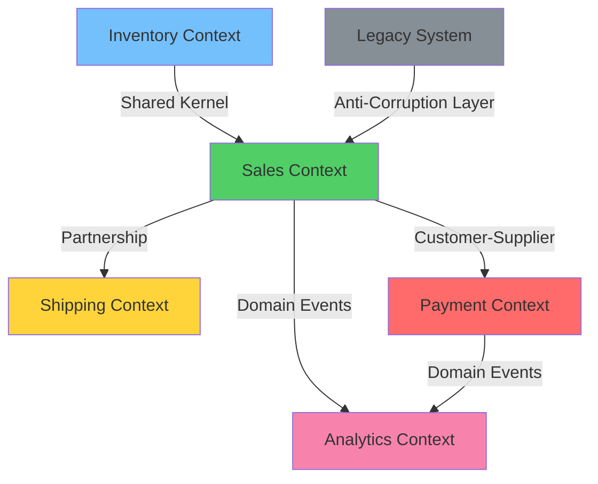

# 🗺️ Урок 5: Context Mapping (Картирование контекстов)

## 🎯 Цели урока

После изучения этого урока вы сможете:
- ✅ Создавать карты взаимодействий между bounded contexts
- ✅ Выбирать подходящие паттерны интеграции
- ✅ Управлять зависимостями между командами
- ✅ Организовывать эффективную коммуникацию между контекстами

## 📖 Что такое Context Mapping?

!!! quote "Context Map - это карта взаимодействий между bounded contexts"
    **Context Mapping** - техника описания и управления отношениями между различными bounded contexts в системе.

### 💡 Простыми словами

**Аналогия**: Карта отношений между странами
- Страны (Bounded Contexts) взаимодействуют друг с другом
- Есть разные типы отношений: союзники, торговые партнеры, зависимые
- Карта показывает, кто от кого зависит и как они общаются
- Помогает планировать изменения и координировать работу

**В программировании:**
- Context Map = карта взаимодействий между контекстами
- Показывает зависимости и типы интеграции
- Помогает командам координировать работу

### 📊 Визуализация Context Mapping



### Зачем нужен Context Mapping?

1. **Видимость зависимостей** - понимание, кто от кого зависит
2. **Управление изменениями** - координация изменений между контекстами
3. **Командная координация** - организация работы команд
4. **Архитектурная целостность** - поддержание границ контекстов

## 🎨 Паттерны отношений между контекстами

### 1. Partnership (Партнерство)

```python
class Partnership:
    """
    Partnership - оба контекста имеют общую цель
    Совместная ответственность за успех
    """

    def __init__(self, context_a: BoundedContext, context_b: BoundedContext):
        self.context_a = context_a
        self.context_b = context_b
        self.shared_goals = []
        self.coordination_mechanism = "joint_development"

    def define_shared_goals(self, goals: List[str]):
        """Определить общие цели"""
        self.shared_goals = goals

    def set_coordination_mechanism(self, mechanism: str):
        """Установить механизм координации"""
        # Возможные механизмы:
        # - shared_kernel: общий код
        # - joint_development: совместная разработка
        # - coordination_team: координационная команда
        self.coordination_mechanism = mechanism

# Пример: Sales и Shipping contexts
sales_shipping = Partnership(sales_context, shipping_context)
sales_shipping.define_shared_goals([
    "Обеспечить своевременную доставку заказов",
    "Поддерживать точную информацию о статусе доставки",
    "Минимизировать возвраты и проблемы с доставкой"
])
sales_shipping.set_coordination_mechanism("coordination_team")
```

### 2. Shared Kernel (Общее ядро)

```python
class SharedKernel:
    """
    Shared Kernel - общий код, используемый несколькими контекстами
    Требует высокой дисциплины синхронизации
    """

    def __init__(self, name: str, contexts: List[BoundedContext]):
        self.name = name
        self.contexts = contexts
        self.shared_code = set()
        self.owners = []
        self.integration_tests = []

    def add_shared_code(self, code_element: str):
        """Добавить элемент общего кода"""
        self.shared_code.add(code_element)

    def add_owner(self, owner: str):
        """Добавить ответственного"""
        self.owners.append(owner)

    def add_integration_test(self, test_case: str):
        """Добавить интеграционный тест"""
        self.integration_tests.append(test_case)

# Пример: Общие модели данных
shared_kernel = SharedKernel("Common Domain Models", [
    sales_context, inventory_context, shipping_context
])

shared_kernel.add_shared_code("ProductId")
shared_kernel.add_shared_code("Money")
shared_kernel.add_shared_code("Address")

shared_kernel.add_owner("Domain Architect")
shared_kernel.add_owner("Tech Lead")

shared_kernel.add_integration_test("ProductId_uniqueness_test")
shared_kernel.add_integration_test("Money_currency_conversion_test")
```

### 3. Customer-Supplier (Заказчик-Поставщик)

```python
class CustomerSupplierRelationship:
    """
    Customer-Supplier - один контекст зависит от другого
    Supplier определяет SLA и уровень обслуживания
    """

    def __init__(self, customer: BoundedContext, supplier: BoundedContext):
        self.customer = customer
        self.supplier = supplier
        self.sla = {}
        self.contract = {}
        self.fallback_strategy = "degraded_mode"

    def define_sla(self, response_time: str, availability: str, throughput: str):
        """Определить SLA"""
        self.sla = {
            "response_time": response_time,
            "availability": availability,
            "throughput": throughput
        }

    def define_contract(self, api_spec: dict):
        """Определить контракт взаимодействия"""
        self.contract = api_spec

    def set_fallback_strategy(self, strategy: str):
        """Установить стратегию fallback"""
        # Возможные стратегии:
        # - degraded_mode: деградированный режим
        # - cached_data: использование кэша
        # - alternative_service: альтернативный сервис
        self.fallback_strategy = strategy

# Пример: Sales зависит от Payment
payment_contract = CustomerSupplierRelationship(sales_context, payment_context)

payment_contract.define_sla(
    response_time="100ms",
    availability="99.9%",
    throughput="1000 req/s"
)

payment_contract.define_contract({
    "endpoint": "/api/payments/process",
    "method": "POST",
    "request_schema": {
        "order_id": {"type": "string", "required": True},
        "amount": {"type": "decimal", "required": True},
        "currency": {"type": "string", "required": True}
    },
    "response_schema": {
        "payment_id": {"type": "string"},
        "status": {"type": "string"},
        "processed_at": {"type": "datetime"}
    }
})

payment_contract.set_fallback_strategy("degraded_mode")
```

### 4. Conformist (Последователь)

```python
class ConformistRelationship:
    """
    Conformist - downstream контекст полностью адаптируется
    к модели upstream контекста, даже если она неидеальна
    """

    def __init__(self, upstream: BoundedContext, downstream: BoundedContext):
        self.upstream = upstream
        self.downstream = downstream
        self.adaptation_strategy = "translation_layer"
        self.translation_rules = {}

    def set_adaptation_strategy(self, strategy: str):
        """Установить стратегию адаптации"""
        # Возможные стратегии:
        # - translation_layer: слой трансляции
        # - wrapper_classes: обертки
        # - data_transformation: преобразование данных
        self.adaptation_strategy = strategy

    def add_translation_rule(self, upstream_concept: str, downstream_concept: str, rule: str):
        """Добавить правило трансляции"""
        self.translation_rules[upstream_concept] = {
            "downstream": downstream_concept,
            "rule": rule
        }

# Пример: Legacy ERP integration
legacy_erp = BoundedContext("Legacy ERP", "existing_system")
new_inventory = BoundedContext("New Inventory", "new_system")

conformist = ConformistRelationship(legacy_erp, new_inventory)
conformist.set_adaptation_strategy("translation_layer")

# Правила трансляции концепций
conformist.add_translation_rule(
    "ERP_Product",  # Upstream concept
    "Product",      # Downstream concept
    "lambda erp: Product(id=erp.id, name=erp.product_name, price=Money(erp.price, 'RUB'))"
)
```

### 5. Anti-Corruption Layer (Слой защиты от коррупции)

```python
class AntiCorruptionLayer:
    """
    Anti-Corruption Layer - защита от нежелательных зависимостей
    Преобразует внешнюю модель во внутреннюю
    """

    def __init__(self, external_context: BoundedContext, internal_context: BoundedContext):
        self.external_context = external_context
        self.internal_context = internal_context
        self.translators = {}
        self.adapters = {}
        self.validators = []

    def add_translator(self, external_concept: str, internal_concept: str, translator_func):
        """Добавить транслятор концепций"""
        self.translators[external_concept] = {
            "internal": internal_concept,
            "translator": translator_func
        }

    def add_adapter(self, external_interface: str, adapter_class):
        """Добавить адаптер интерфейса"""
        self.adapters[external_interface] = adapter_class

    def add_validator(self, validation_rule: str):
        """Добавить правило валидации"""
        self.validators.append(validation_rule)

# Пример: Защита от Legacy CRM
legacy_crm = BoundedContext("Legacy CRM", "old_system")
customer_context = BoundedContext("Customer", "new_system")

acl = AntiCorruptionLayer(legacy_crm, customer_context)

# Транслятор концепций
acl.add_translator(
    "LegacyCustomer",
    "Customer",
    lambda legacy: Customer(
        id=f"cust-{legacy.id}",
        email=legacy.email_address,
        name=f"{legacy.first_name} {legacy.last_name}",
        status="active" if legacy.is_active else "inactive"
    )
)

# Адаптер интерфейса
acl.add_adapter("CRM_API", "CRMAdapter")

# Правила валидации
acl.add_validator("Email format validation")
acl.add_validator("Required fields presence")
```

### 6. Open Host Service (Открытый хост-сервис)

```python
class OpenHostService:
    """
    Open Host Service - published language для внешнего использования
    Другие системы могут легко интегрироваться
    """

    def __init__(self, context: BoundedContext):
        self.context = context
        self.published_interfaces = {}
        self.translators = {}
        self.documentation = {}
        self.examples = []

    def publish_interface(self, name: str, interface_spec: dict):
        """Опубликовать интерфейс для внешнего использования"""
        self.published_interfaces[name] = interface_spec

    def add_translator(self, external_format: str, translator_func):
        """Добавить транслятор для внешнего формата"""
        self.translators[external_format] = translator_func

    def add_documentation(self, interface_name: str, docs: str):
        """Добавить документацию"""
        self.documentation[interface_name] = docs

    def add_example(self, example: dict):
        """Добавить пример использования"""
        self.examples.append(example)

# Пример: Payment Service API
payment_host = OpenHostService(payment_context)

# Публикация REST API
payment_host.publish_interface("Payment API v2", {
    "base_url": "https://api.payments.com/v2",
    "authentication": "OAuth2",
    "rate_limiting": "1000 req/min",
    "endpoints": {
        "process_payment": {
            "method": "POST",
            "path": "/payments",
            "description": "Process a payment for an order"
        },
        "get_payment_status": {
            "method": "GET",
            "path": "/payments/{payment_id}/status",
            "description": "Get payment status"
        }
    }
})

# Трансляторы для разных форматов
payment_host.add_translator("XML", xml_to_payment_request)
payment_host.add_translator("SOAP", soap_to_payment_request)

# Документация
payment_host.add_documentation("Payment API v2", "Complete API documentation...")

# Примеры
# Note: This example uses placeholders for sensitive payment data. Never use real credit card information.
payment_host.add_example({
    "description": "Process credit card payment",
    "request": {
        "order_id": "order-123",
        "amount": 1000.00,
        "currency": "RUB",
        "payment_method": "credit_card",
        "card_details": {
            "number": "****-****-****-****",
            "expiry": "**/**",
            "cvv": "***"
        }
    }
})
```

### 7. Separate Ways (Раздельные пути)

```python
class SeparateWays:
    """
    Separate Ways - контексты развиваются независимо без интеграции
    Автономия важнее интеграции
    """

    def __init__(self, context_a: BoundedContext, context_b: BoundedContext):
        self.context_a = context_a
        self.context_b = context_b
        self.reason = ""
        self.independence_benefits = []
        self.integration_costs = []

    def set_reason(self, reason: str):
        """Установить причину разделения"""
        self.reason = reason

    def add_independence_benefit(self, benefit: str):
        """Добавить преимущество независимости"""
        self.independence_benefits.append(benefit)

    def add_integration_cost(self, cost: str):
        """Добавить стоимость интеграции"""
        self.integration_costs.append(cost)

    def should_integrate(self) -> bool:
        """Оценить необходимость интеграции"""
        # Интеграция оправдана только если выгоды превышают затраты
        return len(self.independence_benefits) < len(self.integration_costs)

# Пример: Analytics и Reporting contexts
analytics_context = BoundedContext("Analytics", "data_analysis")
reporting_context = BoundedContext("Reporting", "business_reports")

separate_ways = SeparateWays(analytics_context, reporting_context)

separate_ways.set_reason(
    "Разные команды, разные цели, минимальная потребность в синхронизации"
)

separate_ways.add_independence_benefit("Полная автономия команд")
separate_ways.add_independence_benefit("Быстрая разработка без координации")
separate_ways.add_independence_benefit("Разные технологии и подходы")
separate_ways.add_independence_benefit("Нет риска распространения изменений")

separate_ways.add_integration_cost("Координация между командами")
separate_ways.add_integration_cost("Синхронизация моделей данных")
separate_ways.add_integration_cost("Общие контракты и SLA")

# Решение: развиваться раздельно
if not separate_ways.should_integrate():
    print("Contexts will evolve separately")
```

#### Когда использовать Separate Ways?

**Используйте Separate Ways, когда:**

1. **Автономия важнее интеграции** - команды могут работать независимо
2. **Минимальная потребность в синхронизации** - контексты редко взаимодействуют
3. **Высокая стоимость интеграции** - координация сложнее, чем независимая разработка
4. **Разные цели и приоритеты** - контексты решают разные бизнес-задачи
5. **Разные технологии** - интеграция технически сложна или неоправдана

**Примеры ситуаций:**

- Analytics и Reporting системы с разными циклами разработки
- Внутренние инструменты команд, не требующие синхронизации
- Экспериментальные проекты, которые могут не интегрироваться
- Контексты с разными доменными моделями и минимальным пересечением

#### Последствия Separate Ways

**Преимущества:**

- ✅ **Полная автономия** - команды работают независимо
- ✅ **Быстрая разработка** - нет необходимости в координации
- ✅ **Гибкость технологий** - можно использовать разные стеки
- ✅ **Изоляция рисков** - изменения в одном контексте не влияют на другой

**Недостатки:**

- ❌ **Дублирование** - возможное дублирование функциональности
- ❌ **Потеря синергии** - упущенные возможности интеграции
- ❌ **Сложность консистентности** - данные могут расходиться
- ❌ **Потенциальная реинтеграция** - может потребоваться интеграция в будущем

#### Связь с другими паттернами

Separate Ways часто является альтернативой другим паттернам:

- **Вместо Partnership** - когда совместная разработка не оправдана
- **Вместо Shared Kernel** - когда общий код создает больше проблем, чем решает
- **Вместо Customer-Supplier** - когда зависимость нежелательна или не нужна

Если в будущем потребуется интеграция, можно перейти к другим паттернам, таким как [Open Host Service](#6-open-host-service-открытый-хост-сервис) или [Customer-Supplier](#3-customer-supplier-заказчик-поставщик).

## 🗺️ Создание и использование Context Map

### Структура Context Map

```python
from typing import Dict, List, Set
from enum import Enum

class RelationshipType(Enum):
    PARTNERSHIP = "partnership"
    SHARED_KERNEL = "shared_kernel"
    CUSTOMER_SUPPLIER = "customer_supplier"
    CONFORMIST = "conformist"
    ANTI_CORRUPTION_LAYER = "anti_corruption_layer"
    OPEN_HOST_SERVICE = "open_host_service"
    SEPARATE_WAYS = "separate_ways"

class ContextMap:
    """Карта взаимодействий между bounded contexts"""

    def __init__(self):
        self.contexts: Dict[str, BoundedContext] = {}
        self.relationships: List[dict] = []
        self.teams: Dict[str, List[str]] = {}
        self.contracts: Dict[str, dict] = {}

    def add_context(self, context: BoundedContext):
        """Добавить bounded context"""
        self.contexts[context.name] = context

    def add_relationship(
        self,
        relationship_type: RelationshipType,
        from_context: str,
        to_context: str,
        details: dict = None
    ):
        """Добавить отношение между контекстами"""
        relationship = {
            "type": relationship_type.value,
            "from": from_context,
            "to": to_context,
            "details": details or {},
            "created_at": datetime.utcnow().isoformat()
        }
        self.relationships.append(relationship)

    def add_team(self, context_name: str, team_members: List[str]):
        """Добавить команду для контекста"""
        self.teams[context_name] = team_members

    def add_contract(self, relationship_id: str, contract: dict):
        """Добавить контракт для отношения"""
        self.contracts[relationship_id] = contract

    def get_upstream_contexts(self, context_name: str) -> List[str]:
        """Получить upstream контексты"""
        return [
            rel["from"] for rel in self.relationships
            if rel["to"] == context_name
        ]

    def get_downstream_contexts(self, context_name: str) -> List[str]:
        """Получить downstream контексты"""
        return [
            rel["to"] for rel in self.relationships
            if rel["from"] == context_name
        ]

    def validate_map(self) -> List[str]:
        """Валидировать корректность карты"""
        issues = []

        # Проверка существования контекстов
        for rel in self.relationships:
            if rel["from"] not in self.contexts:
                issues.append(f"Unknown context: {rel['from']}")
            if rel["to"] not in self.contexts:
                issues.append(f"Unknown context: {rel['to']}")

        # Проверка циклических зависимостей
        if self._has_circular_dependencies():
            issues.append("Circular dependencies detected")

        return issues

    def _has_circular_dependencies(self) -> bool:
        """Проверить наличие циклических зависимостей"""
        # Упрощенная проверка (в реальности нужен topological sort)
        context_names = set(self.contexts.keys())
        visited = set()  # Nodes fully processed (all neighbors explored)
        rec_stack = set()  # Current recursion path (for cycle detection)

        def dfs(context: str) -> bool:
            # Cycle detected: node is in current recursion path
            if context in rec_stack:
                return True
            # Node already fully processed, skip
            if context in visited:
                return False

            # Add to recursion stack (current path)
            rec_stack.add(context)

            # Explore all neighbors
            for downstream in self.get_downstream_contexts(context):
                if dfs(downstream):
                    return True

            # Remove from recursion stack (backtrack)
            rec_stack.remove(context)
            # Mark as fully processed only after exploring all neighbors
            visited.add(context)
            return False

        for context in context_names:
            if context not in visited:
                if dfs(context):
                    return True

        return False

    def visualize_map(self) -> str:
        """Визуализировать карту (текстовое представление)"""
        lines = ["Context Map Visualization"]
        lines.append("=" * 50)

        # Контексты
        lines.append("\nContexts:")
        for name, context in self.contexts.items():
            team_size = len(self.teams.get(name, []))
            lines.append(f"  {name} (Team: {team_size} members)")

        # Отношения
        lines.append("\nRelationships:")
        for rel in self.relationships:
            lines.append(f"  {rel['from']} --({rel['type']})--> {rel['to']}")
            if rel["details"]:
                lines.append(f"    Details: {rel['details']}")

        return "\n".join(lines)

# Пример создания полной context map
context_map = ContextMap()

# Добавление контекстов
context_map.add_context(sales_context)
context_map.add_context(inventory_context)
context_map.add_context(payment_context)
context_map.add_context(shipping_context)
context_map.add_context(customer_context)

# Добавление команд
context_map.add_team("Sales", ["Alice", "Bob", "Charlie"])
context_map.add_team("Inventory", ["David", "Eve"])
context_map.add_team("Payment", ["Frank", "Grace"])
context_map.add_team("Shipping", ["Henry", "Ivy"])
context_map.add_team("Customer", ["Jack", "Kate"])

# Добавление отношений
context_map.add_relationship(
    RelationshipType.CUSTOMER_SUPPLIER,
    "Sales", "Inventory",
    {"SLA": "50ms", "throughput": "1000 req/s"}
)

context_map.add_relationship(
    RelationshipType.CUSTOMER_SUPPLIER,
    "Sales", "Payment",
    {"SLA": "100ms", "availability": "99.9%"}
)

context_map.add_relationship(
    RelationshipType.CUSTOMER_SUPPLIER,
    "Sales", "Shipping",
    {"SLA": "200ms", "async": True}
)

context_map.add_relationship(
    RelationshipType.SHARED_KERNEL,
    "Sales", "Customer",
    {"shared_models": ["CustomerId", "Address"]}
)

# Валидация и визуализация
issues = context_map.validate_map()
if issues:
    print("Validation issues:", issues)
else:
    print("Context map is valid!")

print(context_map.visualize_map())
```

## 📊 Анализ и оптимизация Context Map

### Метрики качества Context Map

```python
class ContextMapAnalyzer:
    """Анализатор качества context map"""

    def __init__(self, context_map: ContextMap):
        self.context_map = context_map

    def calculate_coupling(self) -> float:
        """Расчет степени связности"""
        total_relationships = len(self.context_map.relationships)
        total_contexts = len(self.context_map.contexts)

        if total_contexts <= 1:
            return 0.0

        max_possible = total_contexts * (total_contexts - 1)
        return total_relationships / max_possible

    def calculate_team_distribution(self) -> Dict[str, int]:
        """Анализ распределения команд"""
        return {
            context_name: len(team)
            for context_name, team in self.context_map.teams.items()
        }

    def identify_bottlenecks(self) -> List[str]:
        """Идентификация узких мест"""
        bottlenecks = []

        for context_name in self.context_map.contexts:
            upstream_count = len(self.context_map.get_upstream_contexts(context_name))
            downstream_count = len(self.context_map.get_downstream_contexts(context_name))

            # Контекст с множеством зависимостей
            if upstream_count + downstream_count > 5:
                bottlenecks.append(f"{context_name}: too many dependencies ({upstream_count + downstream_count})")

            # Контекст без команды
            if context_name not in self.context_map.teams or len(self.context_map.teams[context_name]) == 0:
                bottlenecks.append(f"{context_name}: no team assigned")

        return bottlenecks

    def suggest_improvements(self) -> List[str]:
        """Предложения по улучшению"""
        suggestions = []

        coupling = self.calculate_coupling()
        if coupling > 0.7:
            suggestions.append("High coupling detected. Consider introducing anti-corruption layers.")

        team_dist = self.calculate_team_distribution()
        avg_team_size = sum(team_dist.values()) / len(team_dist)

        for context, size in team_dist.items():
            if size > avg_team_size * 2:
                suggestions.append(f"Context {context} has disproportionately large team.")

        return suggestions

# Анализ context map
analyzer = ContextMapAnalyzer(context_map)

print(f"Coupling coefficient: {analyzer.calculate_coupling():.2f}")
print(f"Team distribution: {analyzer.calculate_team_distribution()}")
print(f"Bottlenecks: {analyzer.identify_bottlenecks()}")
print(f"Suggestions: {analyzer.suggest_improvements()}")
```

## 🎯 Управление изменениями

### Процесс внесения изменений

```python
class ChangeManagement:
    """Управление изменениями в context map"""

    def __init__(self, context_map: ContextMap):
        self.context_map = context_map
        self.change_log = []

    def propose_change(self, change_type: str, description: str, impact_analysis: dict) -> str:
        """Предложить изменение"""
        change_id = f"change-{len(self.change_log) + 1}"

        change = {
            "id": change_id,
            "type": change_type,
            "description": description,
            "impact_analysis": impact_analysis,
            "status": "proposed",
            "proposed_at": datetime.utcnow().isoformat()
        }

        self.change_log.append(change)
        return change_id

    def approve_change(self, change_id: str, approver: str) -> bool:
        """Утвердить изменение"""
        for change in self.change_log:
            if change["id"] == change_id:
                change["status"] = "approved"
                change["approved_by"] = approver
                change["approved_at"] = datetime.utcnow().isoformat()
                return True
        return False

    def implement_change(self, change_id: str, implementation_details: dict) -> bool:
        """Реализовать изменение"""
        for change in self.change_log:
            if change["id"] == change_id and change["status"] == "approved":
                change["status"] = "implemented"
                change["implementation_details"] = implementation_details
                change["implemented_at"] = datetime.utcnow().isoformat()
                return True
        return False

    def get_change_history(self) -> List[dict]:
        """Получить историю изменений"""
        return self.change_log[:]

# Использование
change_manager = ChangeManagement(context_map)

# Предложение изменения
change_id = change_manager.propose_change(
    "add_relationship",
    "Add Customer-Supplier relationship between Sales and Analytics",
    {
        "affected_contexts": ["Sales", "Analytics"],
        "risk_level": "medium",
        "estimated_effort": "2 weeks"
    }
)

# Утверждение и реализация
change_manager.approve_change(change_id, "Domain Architect")
change_manager.implement_change(change_id, {
    "implementation_date": "2024-02-01",
    "team": "Integration Team",
    "technologies": ["REST API", "Event Streaming"]
})
```

## 🎮 Практическое задание

{{ create_exercise_form(
    "context_mapping_exercise",
    "Создание Context Map для интернет-магазина",
    "Создать полную context map с отношениями, командами и контрактами для системы интернет-магазина.",
    """# Задание: Context Mapping для E-commerce

## Контекст

Вы - архитектор крупной e-commerce платформы. Необходимо создать context map для координации между командами.

## Задачи:

1. **Определить bounded contexts** - Sales, Inventory, Payment, Shipping, Customer
2. **Назначить команды** - распределить разработчиков по контекстам
3. **Определить отношения** - выбрать подходящие паттерны интеграции
4. **Создать контракты** - определить API и SLA
5. **Проанализировать качество** - оценить coupling и bottlenecks

## Ожидаемый результат:

- Полная context map с визуализацией
- Описание команд и их ответственности
- Детальные контракты интеграции
- Анализ рисков и предложений по улучшению""",
    [
        "Определить bounded contexts и команды",
        "Выбрать паттерны отношений",
        "Создать контракты интеграции",
        "Проанализировать качество context map",
        "Предложить улучшения"
    ]
) }}

## 🧪 Квиз

<div class="quiz-container" id="context-mapping-quiz">
<script type="application/json">
{
  "title": "Context Mapping",
  "description": "Проверьте понимание паттернов context mapping",
  "questions": [
    {
      "question": "Что такое Context Mapping?",
      "type": "single",
      "points": 1,
      "options": [
        {"text": "Карта географического расположения", "correct": false},
        {"text": "Карта взаимодействий между bounded contexts", "correct": true}
      ],
      "explanation": "Context Mapping описывает отношения между bounded contexts"
    },
    {
      "question": "Customer-Supplier отношение означает:",
      "type": "single",
      "points": 1,
      "options": [
        {"text": "Один контекст зависит от другого", "correct": true},
        {"text": "Контексты равноправны", "correct": false},
        {"text": "Контексты изолированы", "correct": false},
        {"text": "Контексты дублируют функциональность", "correct": false}
      ],
      "explanation": "Customer-Supplier - отношение зависимости upstream/downstream"
    },
    {
      "question": "Что такое Shared Kernel?",
      "type": "single",
      "points": 1,
      "options": [
        {"text": "Общий код между двумя bounded contexts", "correct": true},
        {"text": "Центральная база данных", "correct": false},
        {"text": "Главный микросервис", "correct": false},
        {"text": "Единая команда разработки", "correct": false}
      ],
      "explanation": "Shared Kernel - общая часть модели между контекстами"
    },
    {
      "question": "Когда использовать Anti-Corruption Layer?",
      "type": "multiple",
      "points": 2,
      "options": [
        {"text": "При интеграции с legacy системой", "correct": true},
        {"text": "Когда нельзя изменить внешнюю систему", "correct": true},
        {"text": "Для защиты от плохой модели", "correct": true},
        {"text": "При работе с современными API", "correct": false},
        {"text": "Только для микросервисов", "correct": false}
      ],
      "explanation": "ACL защищает наш контекст от внешних неконтролируемых моделей"
    },
    {
      "question": "Что означает Conformist pattern?",
      "type": "single",
      "points": 1,
      "options": [
        {"text": "Принятие модели upstream без изменений", "correct": true},
        {"text": "Создание собственной модели", "correct": false},
        {"text": "Отказ от интеграции", "correct": false},
        {"text": "Дублирование функциональности", "correct": false}
      ],
      "explanation": "Conformist - полное принятие модели вышестоящего контекста"
    },
    {
      "question": "В чем опасность Shared Kernel?",
      "type": "multiple",
      "points": 2,
      "options": [
        {"text": "Тесная связанность между контекстами", "correct": true},
        {"text": "Сложность координации изменений", "correct": true},
        {"text": "Нарушение автономности команд", "correct": true},
        {"text": "Снижение производительности", "correct": false},
        {"text": "Увеличение размера кода", "correct": false}
      ],
      "explanation": "Shared Kernel требует координации и создает зависимости"
    },
    {
      "question": "Что такое Published Language?",
      "type": "single",
      "points": 1,
      "options": [
        {"text": "Стандартизированный формат для интеграции", "correct": true},
        {"text": "Документация API", "correct": false},
        {"text": "Язык программирования", "correct": false},
        {"text": "Протокол связи", "correct": false}
      ],
      "explanation": "Published Language - общий формат для обмена информацией"
    },
    {
      "question": "Когда использовать Separate Ways pattern?",
      "type": "single",
      "points": 2,
      "options": [
        {"text": "Когда интеграция не дает достаточной ценности", "correct": true},
        {"text": "При отсутствии ресурсов", "correct": false},
        {"text": "При техниченских сложностях", "correct": false},
        {"text": "Всегда при возможности", "correct": false}
      ],
      "explanation": "Separate Ways выбирается когда автономность важнее интеграции"
    },
    {
      "question": "Какие факторы влияют на выбор паттерна интеграции?",
      "type": "multiple",
      "points": 2,
      "options": [
        {"text": "Организационная структура команд", "correct": true},
        {"text": "Важность данных для бизнеса", "correct": true},
        {"text": "Возможность влиять на upstream", "correct": true},
        {"text": "Используемые технологии", "correct": false},
        {"text": "Размер команды", "correct": false}
      ],
      "explanation": "Context Mapping учитывает организационные и бизнес факторы"
    },
    {
      "question": "Что такое Open Host Service?",
      "type": "single",
      "points": 1,
      "options": [
        {"text": "Сервис с открытым протоколом для интеграции", "correct": true},
        {"text": "Бесплатный веб-сервис", "correct": false},
        {"text": "Открытый исходный код", "correct": false},
        {"text": "Публичный API", "correct": false}
      ],
      "explanation": "Open Host Service предоставляет стандартный протокол для интеграции"
    }
  ]
}
</script>
</div>

## 🚀 Следующие шаги

!!! success "Что вы узнали"
    - ✅ Что такое Context Mapping и зачем он нужен
    - ✅ Паттерны отношений между контекстами (Partnership, Customer-Supplier, Shared Kernel, Conformist, ACL, Open Host Service, Separate Ways)
    - ✅ Как создавать и поддерживать Context Map
    - ✅ Как управлять зависимостями между командами

!!! tip "Практика"
    Создайте Context Map для вашего проекта. Определите bounded contexts и их отношения. Это поможет понять архитектуру системы.

!!! success "Поздравляем с завершением Модуля 4! 🎉"
    Вы успешно освоили Domain-Driven Design! Теперь у вас есть полное понимание:
    
    - ✅ **Основы DDD** - философия и принципы предметно-ориентированного проектирования
    - ✅ **Strategic Design** - bounded contexts и context mapping
    - ✅ **Tactical Design** - entities, value objects, aggregates, services
    - ✅ **Domain Events** - асинхронная коммуникация и event sourcing
    - ✅ **Ubiquitous Language** - общий язык бизнеса и разработки

**Следующий шаг:** **[Модуль 5: Практический Проект](../module-05-project/)** - интеграция всех изученных концепций в реальном проекте!

---

