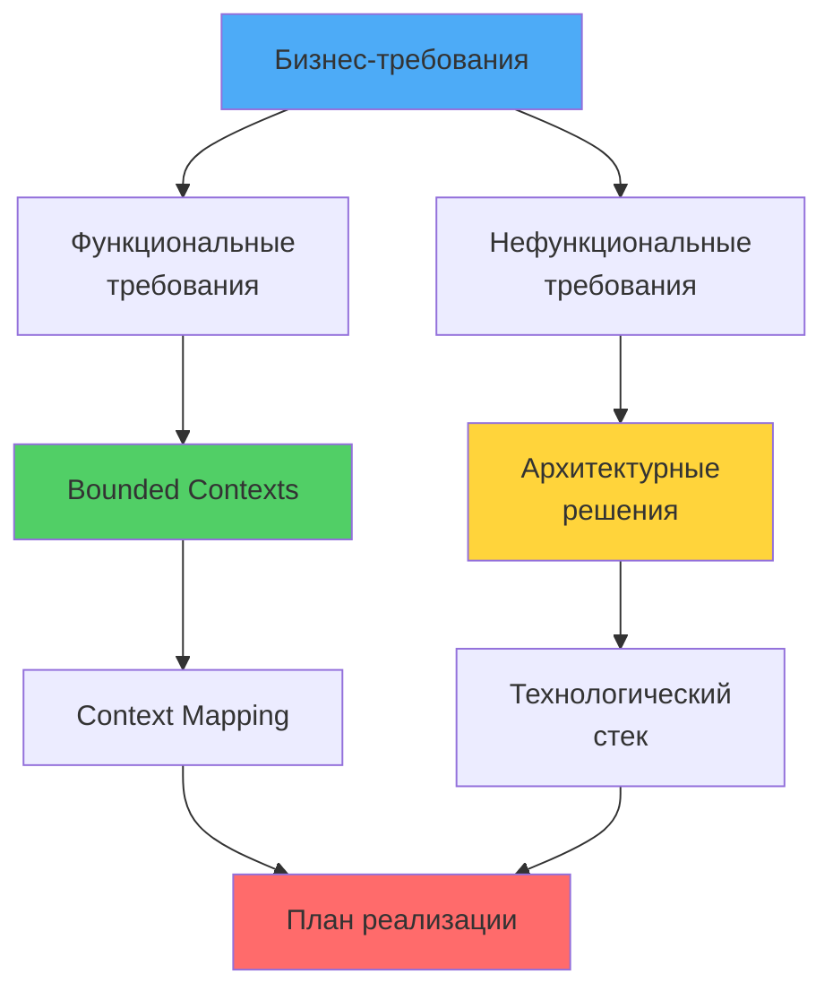
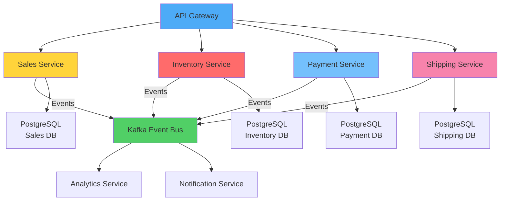
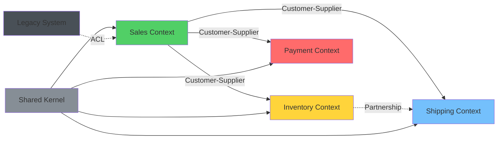

# 🎯 Урок 1: Планирование проекта

## 🎯 Цели урока

После изучения этого урока вы сможете:
- ✅ Анализировать бизнес-требования и определять функциональные требования
- ✅ Проектировать архитектуру системы с использованием изученных паттернов
- ✅ Определять bounded contexts и context mapping
- ✅ Планировать технологический стек и инфраструктуру
- ✅ Создавать план реализации проекта

## 📋 Анализ требований

### 💡 Простыми словами

**Аналогия**: Строительство торгового центра
- **Планирование** = архитектурный план здания (какие магазины, где, как связаны)
- **Требования** = что нужно клиентам (парковка, рестораны, магазины)
- **Архитектура** = как все части связаны (эскалаторы, лифты, коридоры)
- **Bounded Contexts** = разные отделы (продуктовый, одежда, техника - каждый со своими правилами)

**В программировании:**
- Планирование проекта = понимание, что строим и зачем
- Требования = что должна делать система
- Архитектура = как части системы взаимодействуют
- Bounded Contexts = разные области бизнеса с разными правилами

### 📊 Визуализация процесса планирования



### 🎯 Бизнес-контекст

**E-commerce Platform** - современная платформа электронной коммерции для среднего бизнеса.

#### Бизнес-цели:
- **Увеличение продаж** на 30% за первый год
- **Снижение операционных расходов** на 20%
- **Повышение удовлетворенности клиентов** до 95%
- **Масштабируемость** до 1M+ пользователей
- **Время выхода на рынок** - 6 месяцев

#### Целевая аудитория:
- **Покупатели**: 25-45 лет, средний чек 5000-15000 руб
- **Продавцы**: малый и средний бизнес
- **Администраторы**: управление каталогом и заказами

### 📊 Функциональные требования

#### Ядровые возможности:
1. **Управление каталогом товаров**
   - Добавление/редактирование товаров
   - Категории и фильтры
   - Поиск и рекомендации
   - Управление ценами и скидками

2. **Процесс покупки**
   - Корзина и оформление заказа
   - Резервирование товаров
   - Оплата и подтверждение
   - История заказов

3. **Управление запасами**
   - Отслеживание остатков
   - Автоматическое пополнение
   - Уведомления о дефиците
   - Интеграция с поставщиками

4. **Система платежей**
   - Множественные способы оплаты
   - Безопасная обработка
   - Возвраты и отмены
   - Финансовая отчетность

5. **Доставка и логистика**
   - Расчет стоимости доставки
   - Отслеживание посылок
   - Интеграция с транспортными компаниями
   - Управление адресами

6. **Управление клиентами**
   - Профили пользователей
   - История покупок
   - Программа лояльности
   - Служба поддержки

### 📈 Нефункциональные требования

#### Производительность:
- **Response time**: < 100ms для API, < 2s для страниц
- **Throughput**: 1000+ req/s
- **Availability**: 99.9% uptime
- **Concurrent users**: 10,000+

#### Безопасность:
- **Authentication**: JWT, OAuth2
- **Authorization**: Role-based access control
- **Data encryption**: TLS 1.3, data at rest encryption
- **PCI DSS compliance** для платежей

#### Масштабируемость:
- **Horizontal scaling** для всех сервисов
- **Database sharding** при необходимости
- **CDN integration** для статических ресурсов
- **Auto-scaling** в облаке

#### Надежность:
- **Circuit breaker** паттерн
- **Retry mechanisms** с exponential backoff
- **Distributed transactions** через Saga pattern
- **Data consistency** через Event Sourcing

## 🏗️ Архитектурное проектирование

### 💡 Простыми словами

**Аналогия**: Город с разными районами
- **Микросервисы** = разные районы города (каждый со своей инфраструктурой)
- **Event-Driven** = почтовая система (события = письма, которые доставляются)
- **Bounded Contexts** = районы с разными правилами (жилой, деловой, промышленный)
- **API Gateway** = центральная площадь, откуда можно попасть в любой район

**В программировании:**
- Каждый сервис = отдельный район со своей БД и логикой
- События = способ общения между районами
- API Gateway = единая точка входа для клиентов

### 📊 Визуализация архитектуры



### 🎨 Общий архитектурный стиль

**Микросервисная архитектура** с элементами **Event-Driven Architecture**.

#### Обоснование выбора:
- **Модульность** - независимая разработка команд
- **Масштабируемость** - независимое масштабирование сервисов
- **Технологическая гибкость** - разные технологии для разных доменов
- **Fault tolerance** - отказ одного сервиса не ломает всю систему
- **Team autonomy** - команды работают независимо

### 🎯 Bounded Contexts

#### 1. Sales Context (Основной)
**Ответственность**: Управление процессом продаж и заказами
**Ubiquitous Language**:
- Заказ, Корзина, Товар, Цена, Скидка, Оформление
- Подтверждение, Оплата, Отправка, Доставка

**Business Rules**:
- Заказ не может быть пустым
- Цена не может быть отрицательной
- Скидки применяются только к подтвержденным заказам
- Заказ можно отменить в течение 24 часов

#### 2. Inventory Context (Поддерживающий)
**Ответственность**: Управление запасами товаров
**Ubiquitous Language**:
- Товар, Запас, Склад, Партия, Резервирование
- Поставка, Пополнение, Дефицит, Уведомление

**Business Rules**:
- Запас не может быть отрицательным
- Резервирование блокирует товар на 30 минут
- Автоматическое пополнение при достижении минимума

#### 3. Payment Context (Общий)
**Ответственность**: Обработка платежей
**Ubiquitous Language**:
- Платеж, Транзакция, Комиссия, Возврат
- Авторизация, Захват, Отмена, Возврат

**Business Rules**:
- Платеж можно отменить в течение 24 часов
- Возврат возможен в течение 30 дней
- Все платежные данные шифруются

#### 4. Shipping Context (Поддерживающий)
**Ответственность**: Управление доставкой
**Ubiquitous Language**:
- Доставка, Адрес, Транспорт, Трекинг
- Курьер, Посылка, Маршрут, Статус

**Business Rules**:
- Доставка требует подтвержденного адреса
- Трекинг обновляется автоматически
- Задержки логируются и уведомляются

#### 5. Customer Context (Основной)
**Ответственность**: Управление клиентами
**Ubiquitous Language**:
- Клиент, Профиль, Лояльность, Предпочтения
- Регистрация, Аутентификация, История, Поддержка

**Business Rules**:
- Email должен быть уникальным
- Возраст >= 18 лет для покупок
- Бонусы лояльности не могут быть отрицательными

### 🗺️ Context Mapping

#### 💡 Простыми словами

**Аналогия**: Взаимодействие между отделами компании
- **Customer-Supplier** = отдел продаж зависит от склада (склад поставляет товар)
- **Partnership** = отдел продаж и доставка работают вместе (общая цель - довольный клиент)
- **Shared Kernel** = общий справочник (все отделы используют одни и те же коды товаров)

**В программировании:**
- Context Map показывает, кто от кого зависит
- Помогает планировать интеграции и координировать команды

#### 📊 Визуализация Context Map



#### Customer-Supplier отношения:
```
Sales Context ← Customer-Supplier → Inventory Context
├── SLA: 50ms response time
├── Availability: 99.9%
├── Throughput: 1000 req/s
└── Contract: REST API + Events

Sales Context ← Customer-Supplier → Payment Context
├── SLA: 100ms response time
├── Availability: 99.9%
├── Security: PCI DSS compliance
└── Contract: Payment Gateway API

Sales Context ← Customer-Supplier → Shipping Context
├── SLA: 200ms response time
├── Async communication allowed
└── Contract: REST API + Events
```

#### Partnership отношения:
```
Inventory Context ← Partnership → Shipping Context
├── Shared goal: Accurate delivery tracking
├── Coordination: Weekly sync meetings
└── Communication: Shared events
```

#### Shared Kernel:
```
All Contexts ← Shared Kernel → Common Models
├── Shared concepts: ProductId, CustomerId, Money, Address
├── Owners: Domain Architecture Team
├── Update process: Pull requests + automated tests
└── Versioning: Semantic versioning
```

### 🏛️ Архитектурные решения

#### 1. Domain Layer Architecture
```
📁 Domain Layer
├── 📄 Entities/
│   ├── Customer.py
│   ├── Order.py
│   └── Product.py
├── 📄 Value Objects/
│   ├── Money.py
│   ├── Address.py
│   └── ProductId.py
├── 📄 Aggregates/
│   ├── OrderAggregate.py
│   └── CustomerAggregate.py
├── 📄 Domain Services/
│   ├── PricingService.py
│   └── InventoryService.py
└── 📄 Domain Events/
    ├── OrderCreated.py
    ├── OrderPaid.py
    └── OrderShipped.py
```

#### 2. Application Layer
```
📁 Application Layer
├── 📄 Use Cases/
│   ├── PlaceOrderUseCase.py
│   ├── ProcessPaymentUseCase.py
│   └── ShipOrderUseCase.py
├── 📄 Commands/
│   ├── CreateOrderCommand.py
│   ├── PayOrderCommand.py
│   └── ShipOrderCommand.py
├── 📄 Queries/
│   ├── GetOrderQuery.py
│   ├── GetCustomerOrdersQuery.py
│   └── GetProductDetailsQuery.py
└── 📄 Event Handlers/
    ├── OrderCreatedHandler.py
    └── PaymentProcessedHandler.py
```

#### 3. Infrastructure Layer
```
📁 Infrastructure Layer
├── 📄 Repositories/
│   ├── SqlOrderRepository.py
│   ├── RedisCacheRepository.py
│   └── KafkaEventPublisher.py
├── 📄 External APIs/
│   ├── PaymentGatewayAdapter.py
│   ├── ShippingProviderAdapter.py
│   └── EmailServiceAdapter.py
├── 📄 Configuration/
│   ├── DatabaseConfig.py
│   └── MessageBrokerConfig.py
└── 📄 Cross-cutting/
    ├── LoggingAspect.py
    └── SecurityAspect.py
```

## 🛠️ Технологический стек

### 🔧 Основные технологии

#### Backend:
- **Python 3.12+** - основной язык
- **FastAPI** - REST API фреймворк
- **SQLAlchemy 2.0** - ORM для PostgreSQL
- **Pydantic V2** - валидация и сериализация
- **Alembic** - миграции базы данных

#### Базы данных:
- **PostgreSQL 15+** - основная БД
- **Redis 7+** - кэширование и сессии
- **MongoDB** - для аналитики (опционально)

#### Message Broker:
- **Apache Kafka** - event streaming
- **Redis Pub/Sub** - простые уведомления

#### Infrastructure:
- **Docker** - контейнеризация
- **Docker Compose** - локальная разработка
- **Kubernetes** - оркестрация (продакшен)

### 📦 Дополнительные инструменты

#### Development:
- **Poetry** - управление зависимостями
- **pytest** - тестирование
- **ruff** - линтинг и форматирование
- **mypy** - статическая типизация
- **pre-commit** - качество кода

#### Monitoring & Observability:
- **Prometheus** - метрики
- **Grafana** - dashboards
- **ELK Stack** - логирование
- **Jaeger** - distributed tracing

#### CI/CD:
- **GitHub Actions** - автоматизация
- **Docker Hub** - registry
- **Terraform** - инфраструктура как код

## 📅 План реализации

### 🏃‍♂️ Sprint 1: Infrastructure & Domain Modeling (2 недели)
- Настройка инфраструктуры (Docker, PostgreSQL, Kafka)
- Domain modeling для Sales context
- Базовые entities, value objects, aggregates
- Репозитории и domain services

### 🏃‍♂️ Sprint 2: Sales Service Core (3 недели)
- Order aggregate с domain events
- Shopping cart и checkout process
- Customer management
- Basic API endpoints
- Unit и integration tests

### 🏃‍♂️ Sprint 3: Inventory & Payment Integration (3 недели)
- Inventory service с event-driven updates
- Payment processing integration
- Saga pattern для distributed transactions
- API gateway setup
- Cross-service testing

### 🏃‍♂️ Sprint 4: Shipping & Customer Services (3 недели)
- Shipping service с tracking
- Customer service с loyalty program
- Event-driven communication
- User interface (basic)
- E2E testing

### 🏃‍♂️ Sprint 5: Production Readiness (2 недели)
- Performance optimization
- Monitoring и logging setup
- Security hardening
- Documentation
- Load testing

### 🏃‍♂️ Sprint 6: Deployment & Go-Live (1 неделя)
- Production deployment
- Final testing
- User acceptance testing
- Go-live preparation

## 📋 Критерии успеха

### ✅ Функциональные критерии:
- [ ] Создание и оплата заказа
- [ ] Управление каталогом товаров
- [ ] Отслеживание запасов
- [ ] Интеграция с платежными системами
- [ ] Система доставки и трекинга
- [ ] Управление профилями клиентов

### ✅ Технические критерии:
- [ ] Response time < 100ms (95-й перцентиль)
- [ ] 99.9% uptime
- [ ] 100% unit test coverage для domain logic
- [ ] < 5 мин время развертывания
- [ ] < 1 мин rollback time
- [ ] Zero data loss в случае сбоев

### ✅ Качественные критерии:
- [ ] SOLID принципы соблюдены во всем коде
- [ ] Domain events для всех значимых изменений
- [ ] Context boundaries четко определены
- [ ] Ubiquitous language используется командой
- [ ] Архитектурная документация актуальна

## 🚀 Следующие шаги

!!! success "Что вы узнали"
    - ✅ Как анализировать бизнес-требования и определять функциональные требования
    - ✅ Как проектировать микросервисную архитектуру с Event-Driven подходами
    - ✅ Как определять Bounded Contexts и создавать Context Map
    - ✅ Как планировать технологический стек и инфраструктуру

!!! tip "Практика"
    Попробуйте создать план для вашего собственного проекта. Определите bounded contexts, нарисуйте context map и выберите технологический стек.

Теперь вы готовы перейти к **[Подготовке инфраструктуры](02-infrastructure-setup.md)** - настройке Docker, баз данных и message broker!

---

## 🎮 Практическое задание

{{ create_exercise_form(
    "project_planning_exercise",
    "Архитектурное планирование E-commerce платформы",
    "Проанализируйте требования, спроектируйте архитектуру и создайте план реализации.",
    """# Задание: Архитектурное планирование

## Шаг 1: Анализ требований

Проанализируйте предоставленные бизнес-требования:

1. **Определите ключевые бизнес-процессы**
2. **Выделите функциональные требования**
3. **Определите нефункциональные требования**
4. **Оцените риски и ограничения**

## Шаг 2: Domain Analysis

Проведите анализ домена:

1. **Выделите bounded contexts** из описания
2. **Определите ubiquitous language** для каждого context
3. **Опишите business rules** для каждого домена
4. **Определите ключевые domain events**

## Шаг 3: Архитектурное проектирование

Спроектируйте архитектуру:

1. **Выберите архитектурный стиль** и обоснуйте выбор
2. **Определите границы сервисов** по bounded contexts
3. **Создайте context map** с отношениями между сервисами
4. **Выберите паттерны интеграции** (Customer-Supplier, Shared Kernel, etc.)

## Шаг 4: Технологический стек

Выберите технологии:

1. **Основные технологии** (язык, фреймворк, БД)
2. **Инфраструктура** (контейнеризация, оркестрация)
3. **Инструменты разработки** (IDE, testing, CI/CD)
4. **Monitoring & observability** инструменты

## Шаг 5: План реализации

Создайте план:

1. **Разделите на спринты** (2-6 недель каждый)
2. **Определите deliverables** для каждого спринта
3. **Оцените ресурсы** (время, команда)
4. **Определите риски** и mitigation стратегии

## Ожидаемый результат

Создайте детальный документ планирования:

1. **Business Requirements Analysis** - анализ требований
2. **Domain Model** - модель домена с bounded contexts
3. **Architecture Design** - архитектурные решения
4. **Technology Stack** - выбранные технологии
5. **Implementation Plan** - план реализации
6. **Risk Assessment** - анализ рисков

## Критерии оценки

- **Анализ требований**: Полнота и правильность анализа
- **Domain modeling**: Правильность выделения bounded contexts
- **Архитектурные решения**: Обоснованность и реалистичность
- **Технологический стек**: Соответствие требованиям и экспертизе
- **План реализации**: Реалистичность сроков и оценок
- **Управление рисками**: Проработка сценариев и mitigation

---

*Помните: Хорошее планирование - залог успешной реализации проекта!*""",
    [
        "Проанализировать бизнес-требования",
        "Провести domain analysis",
        "Спроектировать архитектуру системы",
        "Выбрать технологический стек",
        "Создать план реализации проекта",
        "Оценить риски и mitigation стратегии"
    ]
) }}

## 🧪 Квиз

<div class="quiz-container" id="project-planning-quiz">
<script type="application/json">
  "title": "Планирование проекта",
  "description": "Проверьте понимание принципов планирования архитектуры",
  "questions": [
    {
      "question": "Что такое bounded context?",
      "type": "single",
      "points": 1,
      "options": [
        {"text": "Граница применения модели домена", "correct": true},
        {"text": "База данных приложения", "correct": false},
        {"text": "Команда разработчиков", "correct": false}
      ],
      "explanation": "Bounded context - граница, в рамках которой модель домена имеет смысл"
    },
    {
      "question": "Customer-Supplier отношение означает:",
      "type": "single",
      "points": 1,
      "options": [
        {"text": "Один сервис зависит от другого", "correct": true},
        {"text": "Сервисы равноправны", "correct": false},
        {"text": "Общий код между сервисами", "correct": false}
      ],
      "explanation": "Customer-Supplier - отношение зависимости upstream/downstream"
    },
    {
      "question": "Что включает технологический стек?",
      "type": "multiple",
      "points": 2,
      "options": [
        {"text": "Язык программирования", "correct": true},
        {"text": "База данных", "correct": true},
        {"text": "Инструменты разработки", "correct": true},
        {"text": "Бизнес-логика", "correct": false},
        {"text": "Пользовательские требования", "correct": false}
      ],
      "explanation": "Технологический стек включает технологии, инструменты и инфраструктуру"
    }
  ]
</script>
</div>


