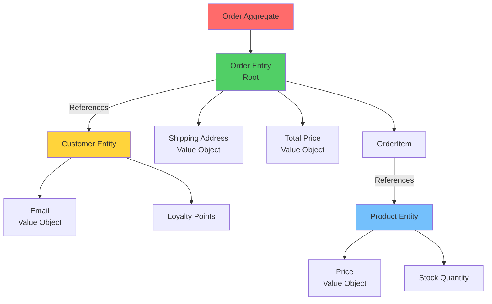

# 🎨 Урок 3: Domain Modeling

## 🎯 Цели урока

После изучения этого урока вы сможете:
- ✅ Создавать Entities с правильной бизнес-логикой
- ✅ Проектировать Value Objects для неизменяемых данных
- ✅ Определять границы Aggregates
- ✅ Реализовывать Domain Services для комплексной логики
- ✅ Применять Domain Events для асинхронной коммуникации

## 📋 Анализ домена E-commerce

### 💡 Простыми словами

**Аналогия**: Организация работы интернет-магазина
- **Domain Modeling** = создание модели того, как работает магазин
- **Entities** = основные объекты (заказ, клиент, товар)
- **Value Objects** = характеристики (адрес, цена, количество)
- **Aggregates** = связанные объекты с правилами (заказ + товары в заказе)
- **Domain Events** = важные события (заказ создан, оплачен, отправлен)

**В программировании:**
- Domain Model = код, который отражает бизнес-реальность
- Каждый объект имеет свою ответственность
- Бизнес-правила живут в доменной модели

### 📊 Визуализация Domain Model



### 🎯 Ключевые бизнес-процессы

1. **Заказ товаров** - от корзины до доставки
2. **Управление запасами** - резервирование и пополнение
3. **Обработка платежей** - безопасные транзакции
4. **Доставка заказов** - логистика и трекинг
5. **Управление клиентами** - профили и лояльность

### 📊 Bounded Contexts

#### Sales Context
**Ответственность**: Управление процессом продаж
**Ubiquitous Language**:
- Заказ, Корзина, Товар, Цена, Скидка, Оформление
- Подтверждение, Оплата, Отправка, Доставка

#### Inventory Context
**Ответственность**: Управление запасами
**Ubiquitous Language**:
- Товар, Запас, Склад, Партия, Резервирование
- Пополнение, Отпуск, Дефицит, Уведомление

#### Payment Context
**Ответственность**: Обработка платежей
**Ubiquitous Language**:
- Платеж, Транзакция, Комиссия, Возврат
- Авторизация, Захват, Отмена, Возврат

## 🎨 Domain Model для Sales Context

### 💎 Value Objects

```python
# 📄 services/sales-service/src/domain/value_objects.py
from dataclasses import dataclass
from typing import List
from decimal import Decimal, ROUND_HALF_UP

@dataclass(frozen=True)
class Money:
    """Деньги как value object"""
    amount: Decimal
    currency: str = "RUB"

    def __post_init__(self):
        if self.amount < 0:
            raise ValueError("Amount cannot be negative")
        if self.currency not in ["RUB", "USD", "EUR"]:
            raise ValueError("Unsupported currency")

    def add(self, other: 'Money') -> 'Money':
        if self.currency != other.currency:
            raise ValueError("Cannot add different currencies")
        return Money(self.amount + other.amount, self.currency)

    def multiply(self, factor: Decimal) -> 'Money':
        return Money((self.amount * factor).quantize(Decimal('0.01'), rounding=ROUND_HALF_UP), self.currency)

    def subtract(self, other: 'Money') -> 'Money':
        if self.currency != other.currency:
            raise ValueError("Cannot subtract different currencies")
        return Money(self.amount - other.amount, self.currency)

@dataclass(frozen=True)
class Address:
    """Адрес доставки как value object"""
    street: str
    city: str
    postal_code: str
    country: str

    def __post_init__(self):
        if not self.street or not self.city:
            raise ValueError("Street and city are required")
        if len(self.postal_code) < 3:
            raise ValueError("Invalid postal code")

    def full_address(self) -> str:
        return f"{self.street}, {self.city}, {self.postal_code}, {self.country}"

@dataclass(frozen=True)
class ProductId:
    """ID продукта как value object"""
    value: str

    def __post_init__(self):
        if not self.value:
            raise ValueError("Product ID cannot be empty")

@dataclass(frozen=True)
class CustomerId:
    """ID клиента как value object"""
    value: str

    def __post_init__(self):
        if not self.value:
            raise ValueError("Customer ID cannot be empty")

@dataclass(frozen=True)
class OrderId:
    """ID заказа как value object"""
    value: str

    def __post_init__(self):
        if not self.value:
            raise ValueError("Order ID cannot be empty")
```

### 📍 Entities

```python
# 📄 services/sales-service/src/domain/entities.py
from abc import ABC
from dataclasses import dataclass, field
from typing import List, Optional
from datetime import datetime
from domain.value_objects import Money, ProductId, CustomerId, Address

class Entity(ABC):
    """Базовый класс для всех entities"""

    def __init__(self, id: str):
        self._id = id
        self._created_at = datetime.utcnow()
        self._updated_at = datetime.utcnow()

    @property
    def id(self) -> str:
        return self._id

    @property
    def created_at(self) -> datetime:
        return self._created_at

    @property
    def updated_at(self) -> datetime:
        return self._updated_at

    def __eq__(self, other: object) -> bool:
        if not isinstance(other, Entity):
            return False
        return self._id == other._id

    def __hash__(self) -> int:
        return hash(self._id)

@dataclass
class Customer(Entity):
    """Сущность клиента"""
    email: str
    name: str
    loyalty_points: int = 0
    is_active: bool = True

    def __post_init__(self):
        if not self.email or '@' not in self.email:
            raise ValueError("Invalid email format")
        if self.loyalty_points < 0:
            raise ValueError("Loyalty points cannot be negative")

    def add_loyalty_points(self, points: int) -> None:
        """Добавить баллы лояльности"""
        if points < 0:
            raise ValueError("Cannot add negative points")
        self.loyalty_points += points
        self._updated_at = datetime.utcnow()

    def use_loyalty_points(self, points: int) -> None:
        """Использовать баллы лояльности"""
        if points > self.loyalty_points:
            raise ValueError("Insufficient loyalty points")
        self.loyalty_points -= points
        self._updated_at = datetime.utcnow()

    def deactivate(self) -> None:
        """Деактивировать клиента"""
        self.is_active = False
        self._updated_at = datetime.utcnow()

@dataclass
class Product(Entity):
    """Сущность товара"""
    name: str
    description: str
    price: Money
    category: str
    is_available: bool = True
    stock_quantity: int = 0

    def __post_init__(self):
        if not self.name:
            raise ValueError("Product name is required")
        if self.price.amount <= 0:
            raise ValueError("Price must be positive")
        if self.stock_quantity < 0:
            raise ValueError("Stock quantity cannot be negative")

    def update_price(self, new_price: Money) -> None:
        """Обновить цену товара"""
        if new_price.amount <= 0:
            raise ValueError("Price must be positive")
        self.price = new_price
        self._updated_at = datetime.utcnow()

    def add_stock(self, quantity: int) -> None:
        """Добавить товар на склад"""
        if quantity <= 0:
            raise ValueError("Quantity must be positive")
        self.stock_quantity += quantity
        self._updated_at = datetime.utcnow()

    def remove_stock(self, quantity: int) -> None:
        """Убрать товар со склада"""
        if quantity <= 0:
            raise ValueError("Quantity must be positive")
        if quantity > self.stock_quantity:
            raise ValueError("Insufficient stock")
        self.stock_quantity -= quantity
        self._updated_at = datetime.utcnow()

    def discontinue(self) -> None:
        """Снять товар с продажи"""
        self.is_available = False
        self._updated_at = datetime.utcnow()
```

### 🎯 Aggregates

```python
# 📄 services/sales-service/src/domain/aggregates.py
from dataclasses import dataclass, field
from typing import List, Optional
from datetime import datetime
from decimal import Decimal
from domain.entities import Entity
from domain.value_objects import Money, ProductId, CustomerId, Address, OrderId

@dataclass
class OrderItem:
    """Элемент заказа (часть агрегата)"""
    product_id: ProductId
    product_name: str
    quantity: int
    unit_price: Money
    total_price: Optional[Money] = None

    def __post_init__(self):
        if self.quantity <= 0:
            raise ValueError("Quantity must be positive")
        if self.total_price is None:
            self.total_price = self.unit_price.multiply(self.quantity)

@dataclass
class Order(Entity):
    """Агрегат заказа"""
    customer_id: CustomerId
    items: List[OrderItem] = field(default_factory=list)
    shipping_address: Optional[Address] = None
    status: str = "pending"
    total_amount: Money = None

    def __post_init__(self):
        if not self.items:
            raise ValueError("Order cannot be empty")
        if self.total_amount is None:
            self.total_amount = self._calculate_total()

    def _calculate_total(self) -> Money:
        """Рассчитать общую сумму заказа"""
        if not self.items:
            return Money(Decimal('0.00'), 'RUB')

        total = sum(item.total_price.amount for item in self.items)
        currency = self.items[0].unit_price.currency
        return Money(total, currency)

    def add_item(self, item: OrderItem) -> None:
        """Добавить товар к заказу"""
        if self.status != "pending":
            raise ValueError("Cannot modify order that is not pending")

        # Проверить, не добавляем ли уже существующий товар
        existing_item = next(
            (i for i in self.items if i.product_id == item.product_id),
            None
        )

        if existing_item:
            # Обновить количество
            existing_item.quantity += item.quantity
            existing_item.total_price = existing_item.unit_price.multiply(existing_item.quantity)
        else:
            self.items.append(item)

        self.total_amount = self._calculate_total()
        self._updated_at = datetime.utcnow()

    def remove_item(self, product_id: ProductId) -> None:
        """Удалить товар из заказа"""
        if self.status != "pending":
            raise ValueError("Cannot modify order that is not pending")

        self.items = [item for item in self.items if item.product_id != product_id]

        if not self.items:
            raise ValueError("Order cannot be empty after removing item")

        self.total_amount = self._calculate_total()
        self._updated_at = datetime.utcnow()

    def set_shipping_address(self, address: Address) -> None:
        """Установить адрес доставки"""
        if self.status != "pending":
            raise ValueError("Cannot change shipping address for non-pending order")
        self.shipping_address = address
        self._updated_at = datetime.utcnow()

    def confirm(self) -> None:
        """Подтвердить заказ"""
        if self.status != "pending":
            raise ValueError("Only pending orders can be confirmed")
        if not self.shipping_address:
            raise ValueError("Shipping address is required")
        if not self.items:
            raise ValueError("Order cannot be empty")

        self.status = "confirmed"
        self._updated_at = datetime.utcnow()

    def cancel(self) -> None:
        """Отменить заказ"""
        if self.status in ["shipped", "delivered"]:
            raise ValueError("Cannot cancel shipped or delivered order")

        self.status = "cancelled"
        self._updated_at = datetime.utcnow()
```

### ⚙️ Domain Services

```python
# 📄 services/sales-service/src/domain/services.py
from abc import ABC, abstractmethod
from typing import List
from decimal import Decimal
from domain.aggregates import Order
from domain.entities import Customer
from domain.value_objects import Money, Address

class DomainService(ABC):
    """Базовый класс для domain services"""
    pass

class PricingService(DomainService):
    """Сервис расчета цен и скидок"""

    def calculate_discount(self, order: Order, customer: Customer) -> Money:
        """Расчет скидки для заказа"""
        discount = Money(Decimal('0.00'), order.total_amount.currency)

        # Скидка за лояльность (5% при >100 баллах)
        if customer.loyalty_points > 100:
            loyalty_discount = order.total_amount.amount * Decimal('0.05')
            discount = Money(discount.amount + loyalty_discount, discount.currency)

        # Скидка за объем (3% при сумме >10,000 руб)
        if order.total_amount.amount > 10000:
            volume_discount = order.total_amount.amount * Decimal('0.03')
            discount = Money(discount.amount + volume_discount, discount.currency)

        return discount

    def calculate_tax(self, order: Order) -> Money:
        """Расчет налогов"""
        # Упрощенный расчет НДС 20%
        tax_amount = order.total_amount.amount * Decimal('0.20')
        return Money(tax_amount, order.total_amount.currency)

    def calculate_shipping_cost(self, order: Order, address: Address) -> Money:
        """Расчет стоимости доставки"""
        # Упрощенная логика: фиксированная стоимость + вес
        base_cost = Decimal('300.00')
        weight_cost = sum(item.quantity for item in order.items) * Decimal('50.00')
        total_cost = base_cost + weight_cost

        return Money(total_cost, order.total_amount.currency)

class OrderValidationService(DomainService):
    """Сервис валидации заказов"""

    def validate_order(self, order: Order) -> List[str]:
        """Валидация заказа"""
        errors = []

        # Проверка обязательных полей
        if not order.customer_id:
            errors.append("Customer ID is required")

        if not order.items:
            errors.append("Order cannot be empty")

        if not order.shipping_address:
            errors.append("Shipping address is required")

        # Проверка бизнес-правил
        total_quantity = sum(item.quantity for item in order.items)
        if total_quantity > 50:
            errors.append("Maximum 50 items per order")

        if order.total_amount.amount > 500000:
            errors.append("Maximum order amount is 500,000 RUB")

        return errors

    def can_cancel_order(self, order: Order) -> bool:
        """Проверка возможности отмены заказа"""
        if order.status in ["shipped", "delivered"]:
            return False
        return True

class LoyaltyService(DomainService):
    """Сервис управления программой лояльности"""

    def calculate_earned_points(self, order: Order) -> int:
        """Расчет заработанных баллов лояльности"""
        # 1 балл за каждые 100 руб
        points = int(order.total_amount.amount / 100)
        return min(points, 1000)  # Максимум 1000 баллов за заказ

    def can_use_loyalty_points(self, customer: Customer, order: Order) -> bool:
        """Проверка возможности использования баллов"""
        if customer.loyalty_points < 50:
            return False

        # Максимум 50% стоимости заказа
        max_points = int(order.total_amount.amount / 2 / 10)  # 10 руб = 1 балл
        return customer.loyalty_points <= max_points
```

### 📢 Domain Events

```python
# 📄 services/sales-service/src/domain/events.py
from dataclasses import dataclass
from datetime import datetime
from typing import List
from domain.value_objects import Money, OrderId, CustomerId, Address

@dataclass(frozen=True)
class DomainEvent:
    """Базовый класс для domain events"""
    event_id: str
    aggregate_id: str
    occurred_at: datetime
    event_version: int = 1

# Order Events
@dataclass(frozen=True)
class OrderCreated(DomainEvent):
    """Заказ создан"""
    customer_id: CustomerId
    items: List[dict]
    total_amount: Money
    currency: str

@dataclass(frozen=True)
class OrderItemAdded(DomainEvent):
    """Товар добавлен к заказу"""
    product_id: str
    product_name: str
    quantity: int
    unit_price: Money

@dataclass(frozen=True)
class OrderConfirmed(DomainEvent):
    """Заказ подтвержден"""
    confirmed_at: datetime

@dataclass(frozen=True)
class OrderPaid(DomainEvent):
    """Заказ оплачен"""
    payment_id: str
    payment_method: str
    paid_amount: Money

@dataclass(frozen=True)
class OrderShipped(DomainEvent):
    """Заказ отправлен"""
    tracking_number: str
    carrier: str
    shipped_at: datetime

@dataclass(frozen=True)
class OrderDelivered(DomainEvent):
    """Заказ доставлен"""
    delivered_at: datetime

@dataclass(frozen=True)
class OrderCancelled(DomainEvent):
    """Заказ отменен"""
    reason: str
    cancelled_at: datetime

# Customer Events
@dataclass(frozen=True)
class CustomerRegistered(DomainEvent):
    """Клиент зарегистрирован"""
    email: str
    name: str

@dataclass(frozen=True)
class CustomerEmailChanged(DomainEvent):
    """Email клиента изменен"""
    old_email: str
    new_email: str

@dataclass(frozen=True)
class LoyaltyPointsEarned(DomainEvent):
    """Баллы лояльности заработаны"""
    points: int
    reason: str

@dataclass(frozen=True)
class LoyaltyPointsUsed(DomainEvent):
    """Баллы лояльности использованы"""
    points: int
    order_id: OrderId
```

### 📚 Repositories

```python
# 📄 services/sales-service/src/domain/repositories.py
from abc import ABC, abstractmethod
from typing import List, Optional
from domain.entities import Customer, Product
from domain.aggregates import Order
from domain.value_objects import CustomerId, ProductId, OrderId

class Repository(ABC):
    """Базовый класс репозитория"""

    @abstractmethod
    async def save(self, entity) -> None:
        pass

    @abstractmethod
    async def find_by_id(self, id) -> Optional[object]:
        pass

    @abstractmethod
    async def find_all(self) -> List[object]:
        pass

class CustomerRepository(Repository):
    """Репозиторий клиентов"""

    @abstractmethod
    async def save(self, customer: Customer) -> None:
        pass

    @abstractmethod
    async def find_by_id(self, customer_id: CustomerId) -> Optional[Customer]:
        pass

    @abstractmethod
    async def find_by_email(self, email: str) -> Optional[Customer]:
        pass

    @abstractmethod
    async def find_active_customers(self) -> List[Customer]:
        pass

class ProductRepository(Repository):
    """Репозиторий товаров"""

    @abstractmethod
    async def save(self, product: Product) -> None:
        pass

    @abstractmethod
    async def find_by_id(self, product_id: ProductId) -> Optional[Product]:
        pass

    @abstractmethod
    async def find_by_category(self, category: str) -> List[Product]:
        pass

    @abstractmethod
    async def find_available_products(self) -> List[Product]:
        pass

    @abstractmethod
    async def update_stock(self, product_id: ProductId, quantity: int) -> None:
        pass

class OrderRepository(Repository):
    """Репозиторий заказов"""

    @abstractmethod
    async def save(self, order: Order) -> None:
        pass

    @abstractmethod
    async def find_by_id(self, order_id: OrderId) -> Optional[Order]:
        pass

    @abstractmethod
    async def find_by_customer(self, customer_id: CustomerId) -> List[Order]:
        pass

    @abstractmethod
    async def find_pending_orders(self) -> List[Order]:
        pass

    @abstractmethod
    async def find_orders_by_status(self, status: str) -> List[Order]:
        pass
```

## 🎮 Практическое задание

{{ create_exercise_form(
    "domain_modeling_exercise",
    "Создание доменной модели для Sales Context",
    "Спроектируйте полную доменную модель с entities, value objects, aggregates, domain services и repositories.",
    """# Задание: Domain Modeling для E-commerce

## Контекст

Создайте доменную модель для Sales Context интернет-магазина.

## Требования:

### 1. Value Objects (3-5 объектов)
- **Money** - деньги с валютой
- **Address** - адрес доставки
- **ProductId, CustomerId, OrderId** - идентификаторы
- Любые другие необходимые VO

### 2. Entities (2-3 сущности)
- **Customer** - клиент с бизнес-логикой
- **Product** - товар с управлением запасами
- Любые другие необходимые entities

### 3. Aggregates (1-2 агрегата)
- **Order** - основной агрегат заказа
- Возможно, Customer Aggregate
- Правильные границы консистентности

### 4. Domain Services (2-3 сервиса)
- **PricingService** - расчет цен и скидок
- **OrderValidationService** - валидация заказов
- **LoyaltyService** - управление лояльностью

### 5. Domain Events (5-7 событий)
- События жизненного цикла заказа
- События изменения клиента
- События лояльности

### 6. Repositories (3-4 интерфейса)
- CustomerRepository
- ProductRepository
- OrderRepository

## Ожидаемый результат

Полная доменная модель на Python:

1. **value_objects.py** - все value objects
2. **entities.py** - все entities с бизнес-логикой
3. **aggregates.py** - aggregates с domain events
4. **services.py** - domain services
5. **events.py** - domain events
6. **repositories.py** - repository интерфейсы

## Критерии оценки

- **Value Objects**: Правильная неизменяемость, валидация, бизнес-логика
- **Entities**: Корректная идентичность, бизнес-правила, методы
- **Aggregates**: Правильные границы, domain events, консистентность
- **Domain Services**: Комплексная логика, не принадлежащая entities
- **Domain Events**: Правильное именование, все необходимые данные
- **Repositories**: Чистые интерфейсы, правильные методы

---

*Доменная модель - это сердце вашего приложения. Качественная модель обеспечит чистую архитектуру и легкую поддержку!*""",
    [
        "Создать Value Objects с валидацией",
        "Реализовать Entities с бизнес-логикой",
        "Спроектировать Aggregates с domain events",
        "Создать Domain Services для комплексной логики",
        "Определить Domain Events для коммуникации",
        "Создать Repository интерфейсы"
    ]
) }}

## 🧪 Квиз

<div class="quiz-container" id="domain-modeling-quiz">
<script type="application/json">
  "title": "Domain Modeling",
  "description": "Проверьте понимание DDD тактических паттернов",
  "questions": [
    {
      "question": "Что такое Value Object?",
      "type": "single",
      "points": 1,
      "options": [
        {"text": "Неизменяемый объект без идентичности", "correct": true},
        {"text": "Сущность с уникальным ID", "correct": false},
        {"text": "Сервис бизнес-логики", "correct": false}
      ],
      "explanation": "Value Object определяется своими значениями, не имеет идентичности"
    },
    {
      "question": "Что такое Aggregate?",
      "type": "single",
      "points": 1,
      "options": [
        {"text": "Кластер связанных объектов", "correct": true},
        {"text": "Отдельная сущность", "correct": false},
        {"text": "Сервис домена", "correct": false}
      ],
      "explanation": "Aggregate - кластер объектов, рассматриваемый как единое целое"
    },
    {
      "question": "Когда использовать Domain Service?",
      "type": "multiple",
      "points": 2,
      "options": [
        {"text": "Логика затрагивающая несколько entities", "correct": true},
        {"text": "Комплексные вычисления", "correct": true},
        {"text": "Простые CRUD операции", "correct": false},
        {"text": "Хранение данных", "correct": false}
      ],
      "explanation": "Domain Service используется для логики между несколькими объектами"
    },
    {
      "question": "Что такое Domain Event?",
      "type": "single",
      "points": 1,
      "options": [
        {"text": "Изменение в базе данных", "correct": false},
        {"text": "Факт произошедший в домене", "correct": true},
        {"text": "HTTP запрос", "correct": false}
      ],
      "explanation": "Domain Event представляет значимое событие в предметной области"
    }
  ]
</script>
</div>

## 🚀 Следующие шаги

!!! success "Что вы узнали"
    - ✅ Как создавать Entities с правильной бизнес-логикой
    - ✅ Как проектировать Value Objects для неизменяемых данных
    - ✅ Как определять границы Aggregates
    - ✅ Как реализовывать Domain Services для комплексной логики
    - ✅ Как применять Domain Events для асинхронной коммуникации

!!! tip "Практика"
    Создайте доменную модель для простого домена (например, библиотека или кинотеатр). Используйте все тактические паттерны DDD.

!!! success "Поздравляем с завершением планирования проекта! 🎉"
    Вы успешно спланировали E-commerce платформу! Теперь у вас есть:
    
    - ✅ **Архитектурный план** - микросервисная архитектура с Event-Driven подходами
    - ✅ **Инфраструктура** - Docker, PostgreSQL, Kafka настроены
    - ✅ **Доменная модель** - Entities, Value Objects, Aggregates, Domain Events
    
    **Следующий шаг:** Приступайте к реализации сервисов! Начните с Sales Service как ядра системы.

---


