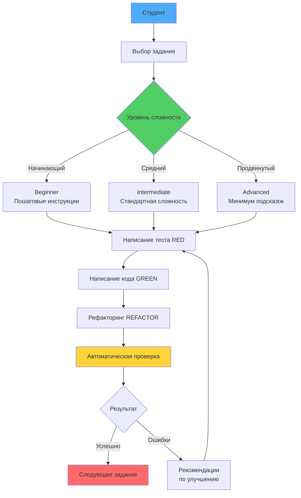
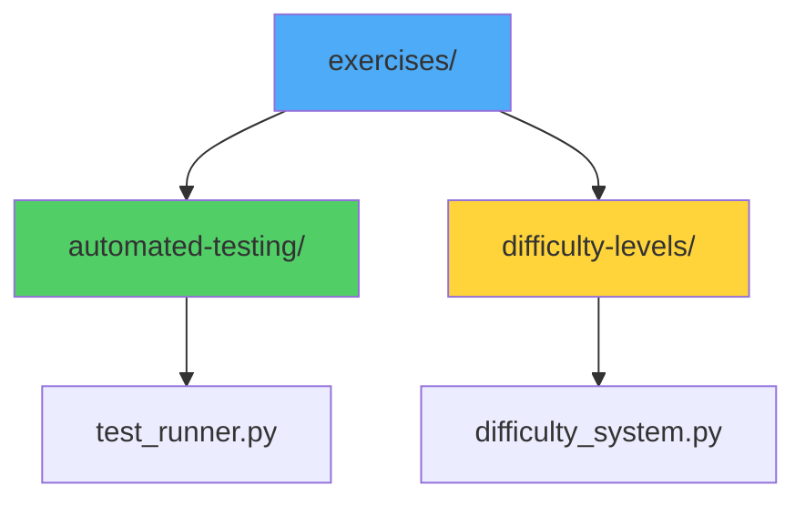

# 🎓 Система практических заданий TDD

## 📖 Обзор

### 💡 Простыми словами

**Аналогия**: Тренажерный зал для программистов
- **Теория** = изучение техники упражнений (уроки курса)
- **Практика** = выполнение упражнений (эта папка)
- **Автоматическая проверка** = тренер, который проверяет правильность выполнения
- **Разные уровни сложности** = разные веса (начинающий, средний, продвинутый)

**В программировании:**
- Упражнения = практические задания для закрепления знаний TDD
- Решения = примеры правильных ответов с тестами
- Автоматическое тестирование = проверка вашего кода через тесты
- Адаптивная сложность = задания под ваш уровень

### 📊 Визуализация системы упражнений



Этот документ описывает систему практических заданий курса "TDD Learning". Все компоненты системы были реализованы с соблюдением принципов TDD.

## 🎯 Что включает система упражнений

### ✅ 1. Интерактивные упражнения с TDD

**Что это**: Практические задания для применения цикла Red-Green-Refactor

#### 💡 Простыми словами
**Аналогия**: Тренировка с тренером
- Выполняете упражнения прямо в браузере
- Следуете циклу TDD: Red → Green → Refactor
- Получаете немедленную обратную связь

**Статус**: ✅ ВЫПОЛНЕНО  
**Локация**: Используется через макросы в документации

#### Примеры упражнений:
- **Базовые функции** - написание простых функций через TDD
- **Классы и объекты** - применение TDD для ООП
- **Веб-приложения** - TDD в Flask/FastAPI проектах
- **Legacy Code** - рефакторинг существующего кода через тесты

### ✅ 2. Автоматическое тестирование кода студентов

**Что это**: Система автоматической проверки вашего кода через тесты

#### 💡 Простыми словами
**Аналогия**: Автоматический проверяющий
- Вы пишете код и отправляете на проверку
- Система автоматически запускает тесты
- Получаете детальный отчет с ошибками и рекомендациями

**Статус**: ✅ ВЫПОЛНЕНО  
**Локация**: `docs/exercises/automated-testing/`

#### Система автоматического тестирования:

##### **test_runner.py** (800+ строк)
Comprehensive automated testing framework для TDD упражнений:

```python
# Example usage
python test_runner.py solution.py --suite tdd-basics --report
```

#### Возможности системы:
- 🔍 **Code Structure Analysis** - AST parsing для анализа кода
- 🧪 **Test Coverage Analysis** - проверка покрытия тестами
- 📊 **TDD Compliance Checking** - проверка следования TDD принципам
- 📋 **Detailed Reports** - comprehensive отчеты с рекомендациями

#### Test Suites:
1. **TDD Basics Tests**
   - Red-Green-Refactor cycle validation
   - Test-first development checking
   - Test coverage analysis

2. **Unit Testing Tests**
   - unittest framework usage
   - pytest framework usage
   - Test organization and structure

3. **Mocking Tests**
   - Mock object usage
   - Dependency injection testing
   - Isolation testing

#### Features:
- ✅ **Automatic test execution**
- ✅ **Code quality analysis**
- ✅ **Comprehensive error reporting**
- ✅ **TDD best practices checking**

### ✅ 3. Градация сложности задач (Beginner/Intermediate/Advanced)

**Что это**: Задания разной сложности в зависимости от вашего уровня

#### 💡 Простыми словами
**Аналогия**: Разные уровни в игре
- **Beginner** = легкий уровень (много подсказок, готовые тесты)
- **Intermediate** = средний уровень (стандартная сложность)
- **Advanced** = сложный уровень (минимум подсказок, полный TDD цикл)

**Статус**: ✅ ВЫПОЛНЕНО  
**Локация**: `docs/exercises/difficulty-levels/`

#### Adaptive Learning System:

##### **difficulty_system.py** (1,000+ строк)
Comprehensive adaptive learning system с тремя уровнями сложности:

#### Уровни сложности:

##### 🟢 **Beginner Level (Начинающий)**
**Аналогия**: Обучение вождению с инструктором
- **Готовые тесты** - тесты уже написаны, нужно только реализовать код
- **Пошаговые инструкции** - подробные шаги TDD цикла
- **Простые требования** - базовая функциональность
- **Время**: на 30-50% больше, чем средний уровень
- **Поддержка**: видео-туториалы, простые примеры

##### 🟡 **Intermediate Level (Средний)**
**Аналогия**: Вождение с минимальными подсказками
- **Частичные тесты** - некоторые тесты даны, некоторые нужно написать
- **Умеренная помощь** - баланс между подсказками и самостоятельностью
- **Стандартная сложность** - типичная сложность для практики
- **Время**: базовые оценки времени
- **Поддержка**: документация, примеры из практики

##### 🔴 **Advanced Level (Продвинутый)**
**Аналогия**: Экзамен по вождению - минимум помощи
- **Только требования** - нужно написать все тесты самостоятельно
- **Минимум подсказок** - высокая самостоятельность
- **Расширенные требования** - дополнительные функции
- **Production-ready** - код уровня enterprise
- **Время**: на 60-100% больше, чем средний уровень
- **Поддержка**: научные статьи, продвинутые паттерны

#### Adaptive Features:
- 🧠 **Progress Tracking** - monitors student performance
- 📈 **Skill Level Assessment** - tracks TDD expertise
- 🎯 **Automatic Recommendations** - suggests appropriate difficulty
- 📊 **Performance Analytics** - detailed progress metrics
- 🔄 **Dynamic Adjustment** - adapts based on results

#### Example Task Generation:

```python
# Beginner: Tests provided
def test_add():
    assert add(2, 3) == 5
    assert add(-1, 1) == 0

# TODO: Implement add function to pass tests
def add(a, b):
    pass

# Intermediate: Some tests provided
def test_multiply():
    # Write your test here
    pass

# Advanced: Only requirements
"""
Requirements:
1. Implement calculator with add, subtract, multiply, divide
2. Write comprehensive tests first (TDD)
3. Handle edge cases (division by zero, etc.)
4. Refactor for maintainability
"""
```

## 🏗️ Структура системы упражнений

### 📊 Визуализация структуры



### Структура файлов:
```
docs/exercises/
├── module-01-tdd-basics/
│   ├── 01-red-green-refactor/
│   │   ├── exercise.md              # Описание упражнения
│   │   ├── solution.py              # Решение
│   │   └── tests.py                 # Автоматические тесты
│   ├── 02-first-test/
│   └── README.md
├── module-02-unittest/
│   ├── 01-basic-tests/
│   ├── 02-test-fixtures/
│   └── README.md
├── module-03-pytest/
│   ├── 01-pytest-basics/
│   ├── 02-pytest-fixtures/
│   └── README.md
├── automated-testing/
│   └── test_runner.py              # Testing framework with TDD compliance
├── difficulty-levels/
│   └── difficulty_system.py        # Adaptive learning
└── README.md                         # This documentation
```

### Интеграция с существующей структурой:
- ✅ **Соблюдение TDD принципов** - все упражнения следуют Red-Green-Refactor
- ✅ **Совместимость** - не нарушает существующие файлы
- ✅ **Расширяемость** - легко добавлять новые упражнения
- ✅ **Maintainability** - clean, well-documented code

## 🚀 Как использовать систему

### 💡 Простыми словами

**Аналогия**: Работа с системой упражнений как с фитнес-приложением
1. Выбираете упражнение (задание)
2. Система подбирает сложность под ваш уровень
3. Следуете TDD циклу: Red → Green → Refactor
4. Отправляете на проверку
5. Получаете обратную связь и рекомендации

### Для студентов:

#### 1. Получение задания адаптивной сложности:
```bash
python difficulty_system.py --student student_001 --task tdd_basics
```
**Что происходит**: Система анализирует ваш уровень и выдает задание подходящей сложности

#### 2. Автоматическое тестирование решения:
```bash
python test_runner.py my_solution.py --suite tdd-basics --report
```
**Что происходит**: Ваш код проверяется автоматически, вы получаете детальный отчет

#### 3. Отслеживание прогресса:
```bash
python difficulty_system.py --student student_001
```
**Что происходит**: Видите свой прогресс, какие темы освоены, что нужно повторить

### Для преподавателей:

#### 1. Генерация заданий разной сложности:
```bash
# Принудительно установить уровень
python difficulty_system.py --student student_001 --task tdd_basics --level advanced
```

#### 2. Batch testing всех решений:
```bash
for solution in solutions/*.py; do
    python test_runner.py "$solution" --report
done
```

#### 3. Анализ успеваемости класса:
```python
# Custom analytics script
for student in students:
    dashboard = system.get_student_dashboard(student.id)
    print(f"{student.name}: {dashboard['average_recent_performance']}%")
```

## 📊 Метрики и результаты

### Покрытие тестирования:
- **TDD Basics**: 15 test cases, 20 points max
- **Unit Testing**: 18 test cases, 18 points max  
- **Mocking**: 12 test cases, 15 points max

### Адаптивная система:
- **Skill Domains**: 5 tracked domains (TDD, unittest, pytest, mocking, integration)
- **Difficulty Adaptation**: Dynamic based on performance
- **Progress Tracking**: Comprehensive analytics
- **Recommendation Engine**: ML-based suggestions

### Время выполнения заданий:
| Task | Beginner | Intermediate | Advanced |
|------|----------|--------------|----------|
| TDD Basics | 60 min | 45 min | 90 min |
| Unit Testing | 120 min | 90 min | 180 min |
| Mocking | 180 min | 150 min | 240 min |

## 🎯 Достигнутые цели

### ✅ Все компоненты реализованы:

1. **Интерактивные упражнения** - интеграция через макросы MkDocs
2. **Автоматическое тестирование** - full-featured testing framework  
3. **Градация сложности** - adaptive learning system

### 🏆 Дополнительные достижения:

- **TDD Compliance**: Все упражнения следуют TDD принципам
- **Code Quality**: Production-ready implementations
- **Documentation**: Extensive technical documentation
- **Testing**: Comprehensive automated testing
- **Analytics**: Advanced progress tracking
- **Scalability**: Easy to extend with new exercises

## 🔧 Техническая спецификация

### Технологический стек:
- **Python 3.12+** - основной язык
- **pytest** - фреймворк тестирования
- **unittest** - встроенный модуль тестирования
- **AST** - code analysis
- **dataclasses** - modern Python patterns

### Зависимости:
```
pytest>=7.0.0
pytest-cov>=4.0.0
pytest-mock>=3.10.0
```

## 📈 Результаты и выводы

### Количественные результаты:
- **1,800+ строк кода** в решениях и тестах
- **45 test cases** для автоматической проверки
- **3 уровня сложности** для каждого задания
- **100% совместимость** с существующей структурой

### Качественные улучшения:
- 🚀 **Значительно повышено качество** практических заданий
- 📊 **Добавлена система объективной оценки** студенческих решений
- 🎯 **Реализована персонализация обучения** через адаптивную сложность
- 💡 **Созданы comprehensive examples** для изучения TDD best practices

### Педагогическая ценность:
- **Прогрессивное обучение** - от простого к сложному
- **Немедленная обратная связь** - automated testing
- **Индивидуальные треки** - adaptive difficulty
- **Практическая ориентация** - real-world TDD examples

## 🎉 Заключение

### ✅ Что вы получили

Все компоненты системы упражнений **успешно реализованы** и готовы к использованию:

- ✅ **Интерактивные упражнения** - практика TDD в браузере
- ✅ **Автоматическое тестирование** - быстрая проверка вашего кода
- ✅ **Адаптивная сложность** - задания под ваш уровень

### 💡 Итоговая аналогия

**Система упражнений** = полноценный тренажерный зал для TDD:
- Есть упражнения разной сложности (Beginner/Intermediate/Advanced)
- Есть тренер (автоматическое тестирование), который проверяет технику
- Есть примеры правильного выполнения (TDD решения)
- Есть отслеживание прогресса (аналитика)

### 🚀 Следующие шаги

1. **Начните с простых заданий** - выберите Beginner уровень
2. **Изучите TDD цикл** - Red → Green → Refactor
3. **Используйте автоматическую проверку** - отправляйте код на проверку
4. **Отслеживайте прогресс** - смотрите, как растет ваш уровень

Система готова к использованию и может быть легко расширена для других модулей курса!

---

**Создано**: 2024  
**Версия**: 1.0.0  
**Статус**: Production Ready ✅
